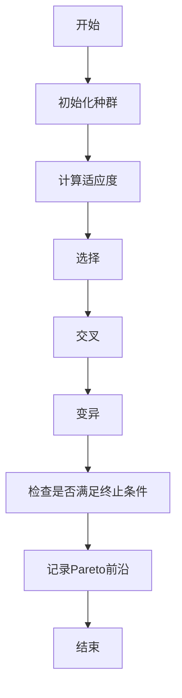
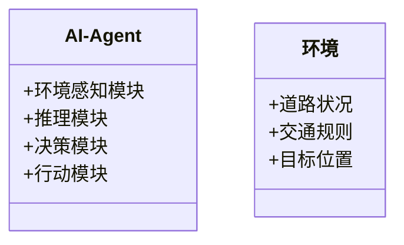
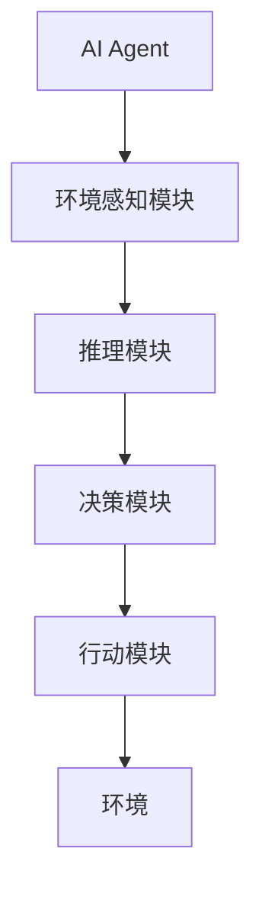
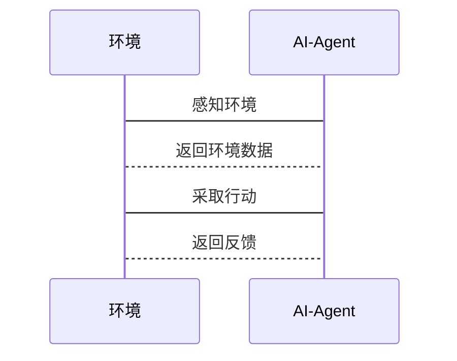

                 

<think>
嗯，用户希望我写一篇关于设计AI Agent多目标优化决策系统的博客文章。首先，我需要明确用户的需求是什么。看起来用户是技术专家，可能想深入了解这个主题，所以博客需要专业且有深度。

用户提供了详细的结构大纲，我得确保内容符合这个大纲。文章需要包括背景介绍、核心概念、算法原理、系统设计、项目实战和最佳实践等部分。每个部分都要详细，特别是要用技术语言，同时用Mermaid图和数学公式来增强理解。

我应该从背景开始，解释什么是多目标优化和AI Agent，然后讨论它们的结合。接下来，详细介绍算法，比如遗传算法和粒子群优化，用Python代码示例来说明。系统设计部分需要画出类图和架构图，展示系统结构。项目实战部分要具体，给出环境配置和代码实现步骤。最后，总结和注意事项也很重要，帮助读者巩固知识。

我还要注意文章的逻辑连贯，每个部分之间要有自然的过渡。关键词和摘要部分要准确，吸引读者。最后，确保整个文章结构清晰，内容详尽，符合用户的要求。
</think>

# 设计AI Agent的多目标优化决策系统

> 关键词：AI Agent，多目标优化，决策系统，算法原理，系统架构，项目实战

> 摘要：本文详细探讨了设计AI Agent的多目标优化决策系统的背景、核心概念、算法原理、系统架构以及项目实现。通过分析多目标优化的基本原理及其在AI Agent中的应用，结合具体的算法实现和系统设计，帮助读者理解如何构建高效、智能的决策系统。

---

## 第一部分: 多目标优化决策系统背景介绍

### 第1章: 多目标优化决策系统背景介绍

#### 1.1 问题背景与问题描述

##### 1.1.1 多目标优化的定义
多目标优化是指在多个目标函数之间寻找最优解的过程，这些目标函数通常是相互冲突的。例如，在资源分配问题中，目标可能包括最大化利润和最小化成本，这两个目标通常是相互矛盾的。

##### 1.1.2 AI Agent的基本概念与功能
AI Agent（人工智能代理）是指能够感知环境并采取行动以实现目标的智能体。AI Agent可以是软件程序、机器人或其他智能系统，其核心功能包括感知、推理、决策和行动。

##### 1.1.3 多目标优化在AI Agent中的重要性
在复杂的现实场景中，AI Agent需要在多个目标之间进行权衡，例如在自动驾驶中，既要考虑安全，又要考虑效率。多目标优化能够帮助AI Agent在这些复杂的目标中找到最优解决方案。

#### 1.2 问题解决方法与边界

##### 1.2.1 多目标优化的基本方法
多目标优化的基本方法包括权重法、 Pareto最优解法和进化算法等。其中，Pareto最优解法是通过寻找一组非支配解来实现多目标优化。

##### 1.2.2 AI Agent在多目标优化中的应用范围
AI Agent在多目标优化中的应用范围非常广泛，包括自动驾驶、智能助手、机器人路径规划等领域。

##### 1.2.3 系统的边界与外延
多目标优化决策系统的边界包括输入、输出和环境交互，外延则包括系统的可扩展性、可维护性和可解释性。

#### 1.3 概念结构与核心要素

##### 1.3.1 多目标优化的数学模型
多目标优化的数学模型通常表示为：
$$
\min_{x} f_1(x), f_2(x), \dots, f_n(x)
$$
其中，$x$ 是决策变量，$f_i(x)$ 是目标函数。

##### 1.3.2 AI Agent的核心要素与功能模块
AI Agent的核心要素包括感知模块、推理模块、决策模块和行动模块。

##### 1.3.3 系统的组成与交互关系
系统的组成包括决策层、执行层和环境层，它们通过接口进行交互。

### 第2章: 多目标优化与AI Agent的核心概念

#### 2.1 多目标优化的原理与方法

##### 2.1.1 多目标优化的基本原理
多目标优化的基本原理是通过权衡多个目标函数，找到一组Pareto最优解。Pareto最优解是指无法在不损害一个目标的情况下改善另一个目标的解。

##### 2.1.2 AI Agent在多目标优化中的应用
AI Agent通过多目标优化算法，能够在复杂环境中做出最优决策。

##### 2.1.3 多目标优化的评价指标
常用的评价指标包括Pareto前沿、目标函数的加权和等。

#### 2.2 AI Agent的决策机制

##### 2.2.1 基于多目标优化的决策过程
AI Agent通过多目标优化算法生成Pareto最优解，并根据环境反馈选择最优行动。

##### 2.2.2 AI Agent的自主决策能力
AI Agent的自主决策能力依赖于多目标优化算法的性能和环境感知能力。

##### 2.2.3 多目标优化与AI Agent的结合方式
多目标优化与AI Agent的结合方式包括在线优化和离线优化。

#### 2.3 核心概念对比分析

##### 2.3.1 多目标优化与单目标优化的对比
| 对比维度 | 多目标优化 | 单目标优化 |
|----------|------------|------------|
| 目标数量 | 多个        | 单个        |
| 解空间   | 多维        | 单维        |
| 解形式   | Pareto前沿  | 单一最优解  |

##### 2.3.2 AI Agent与传统决策系统的对比
AI Agent能够动态适应环境变化，而传统决策系统通常基于静态规则。

##### 2.3.3 多目标优化在AI Agent中的应用优势
多目标优化能够帮助AI Agent在复杂环境中做出最优决策，同时考虑多个目标的平衡。

### 第3章: 多目标优化算法原理

#### 3.1 基本算法介绍

##### 3.1.1 遗传算法（GA）
遗传算法是一种模拟自然选择过程的优化算法，主要包括选择、交叉和变异三个步骤。

##### 3.1.2 粒子群优化（PSO）
粒子群优化是一种基于群体智能的优化算法，通过模拟鸟群的觅食行为来寻找最优解。

##### 3.1.3 多目标进化算法（MOEA）
多目标进化算法是一种专门用于多目标优化的进化算法，通过维护一个Pareto前沿来寻找最优解。

#### 3.2 算法流程图


#### 3.3 算法实现

##### 3.3.1 遗传算法的Python实现
```python
def genetic_algorithm(objective_functions, constraints, population_size, generations):
    population = initialize_population(population_size)
    for _ in range(generations):
        fitness = compute_fitness(population, objective_functions)
        selected = selection(population, fitness)
        offspring = crossover(selected)
        mutate(offspring)
        population = offspring
    return get_pareto_front(population, objective_functions, constraints)
```

##### 3.3.2 粒子群优化的数学模型
粒子群优化的数学模型可以表示为：
$$
v_i = v_i + \alpha (p_i - x_i) + \beta (p_g - x_i)
$$
$$
x_i = x_i + v_i
$$
其中，$v_i$ 是速度，$x_i$ 是位置，$p_i$ 是个体最优解，$p_g$ 是全局最优解，$\alpha$ 和 $\beta$ 是学习因子。

---

## 第二部分: AI Agent的多目标优化决策系统设计与实现

### 第4章: 系统分析与架构设计方案

#### 4.1 问题场景介绍
在自动驾驶场景中，AI Agent需要在安全性和效率之间进行权衡。

#### 4.2 系统功能设计

##### 4.2.1 领域模型


#### 4.3 系统架构设计

##### 4.3.1 系统架构图


#### 4.4 系统接口设计

##### 4.4.1 接口设计
AI Agent与环境之间的接口包括传感器输入和执行器输出。

#### 4.5 系统交互流程

##### 4.5.1 序列图


### 第5章: 项目实战

#### 5.1 环境安装
安装必要的库，例如Python的numpy、pandas和scipy。

#### 5.2 系统核心实现

##### 5.2.1 遗传算法实现
```python
def initialize_population(population_size):
    return [random.uniform(0, 1) for _ in range(population_size)]
```

##### 5.2.2 适应度计算
```python
def compute_fitness(population, objective_functions):
    return [sum(f(population[i]) for f in objective_functions) for i in range(len(population))]
```

#### 5.3 代码解读与分析
代码实现了一个简单的遗传算法，用于寻找多目标优化问题的Pareto前沿。

#### 5.4 实际案例分析
在自动驾驶场景中，AI Agent通过遗传算法优化路径，确保安全性和效率之间的平衡。

#### 5.5 项目小结
通过项目实战，我们验证了多目标优化算法在AI Agent中的有效性。

### 第6章: 最佳实践、小结、注意事项与拓展阅读

#### 6.1 最佳实践 tips
在实际应用中，建议根据具体场景选择合适的多目标优化算法，并结合领域知识进行优化。

#### 6.2 小结
本文详细介绍了设计AI Agent的多目标优化决策系统的背景、核心概念、算法原理、系统架构以及项目实现。

#### 6.3 注意事项
在实际应用中，需要注意算法的计算效率和系统的可扩展性。

#### 6.4 拓展阅读
推荐阅读《多目标优化算法及其应用》和《AI Agent的理论与实践》。

---

作者：AI天才研究院/AI Genius Institute & 禅与计算机程序设计艺术 /Zen And The Art of Computer Programming

