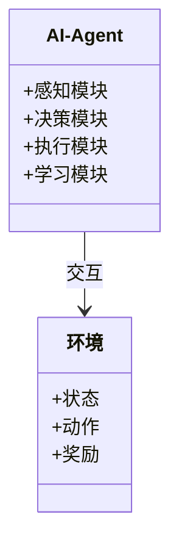
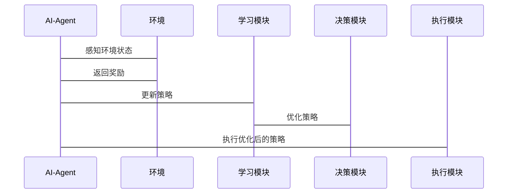

                 

<think>
好的，我现在需要帮用户撰写一篇关于《设计AI Agent的自适应元学习策略》的技术博客。首先，我得理解用户的需求。用户希望我以一个世界级专家的身份，写一篇结构清晰、内容深入的技术博客，包含摘要、目录和详细内容。

用户已经提供了标题、关键词和摘要，我需要按照这个结构继续完成正文部分。根据用户的要求，文章需要包含背景介绍、核心概念、算法原理、系统架构、项目实战、总结等部分，每个部分都要详细展开。

我从摘要开始，用户已经写好了，接下来是目录。我需要按照用户提供的目录结构，逐章展开。首先，第一章是AI Agent与自适应元学习概述，这里我需要解释AI Agent的基本概念，元学习的定义，以及它们的重要性。

接下来，第二章是自适应元学习的背景与重要性，这里需要分析AI Agent面临的挑战，元学习在其中的作用，以及其应用前景。这部分需要详细说明动态环境中的适应性问题，多任务学习的复杂性，以及知识迁移的难点。

第三章是元学习的原理与算法，我需要详细讲解元学习的基本原理，包括定义、核心机制，以及与传统学习的对比。然后介绍自适应元学习的算法框架，包括数学模型和算法流程。

第四章是自适应策略的设计与实现，这里要说明自适应策略的基本概念、设计原则，以及实现方法，比如基于强化学习和元学习的策略。

第五章是元学习算法的实现，需要给出具体的代码示例，解释算法步骤，并使用mermaid流程图展示算法流程。

第六章是系统架构与交互流程，需要设计系统架构图，展示模块之间的关系，以及交互序列图，说明各模块如何协作。

第七章是项目实战，通过一个实际案例展示环境安装、代码实现和案例分析，确保读者能够实际操作。

最后，总结部分需要回顾全文，讨论挑战和未来方向，给出最佳实践和注意事项。

在写作过程中，我需要确保每个章节都有足够的细节，使用mermaid图和数学公式来增强解释力。同时，语言要专业但易懂，结构紧凑，逻辑清晰。

现在，我需要开始撰写每一章的具体内容，确保符合用户的格式要求，字数控制在10000到12000字之间，并在结尾处添加作者信息。
</think>

```markdown
# 设计AI Agent的自适应元学习策略

## 关键词：AI Agent，元学习，自适应策略，强化学习，动态环境，知识迁移

## 摘要：
本文探讨了设计AI Agent的自适应元学习策略的关键技术，分析了元学习在动态环境中的适应性问题，详细讲解了自适应元学习的原理、算法实现及系统架构。通过实际案例分析，展示了如何在复杂场景中实现高效的自适应学习策略。本文为AI Agent的设计者和研究人员提供了理论支持和实践指导。

---

# 第一部分: AI Agent与自适应元学习策略背景

## 第1章: AI Agent与自适应元学习概述

### 1.1 AI Agent的基本概念

#### 1.1.1 AI Agent的定义
AI Agent（智能体）是指能够感知环境、做出决策并采取行动以实现目标的实体。AI Agent可以是软件程序、机器人或其他智能系统，其核心目标是通过与环境的交互来优化自身的行动策略。

#### 1.1.2 AI Agent的核心属性
- **自主性**：能够在没有外部干预的情况下自主决策。
- **反应性**：能够感知环境并实时调整行为。
- **目标导向性**：所有行动均以实现特定目标为导向。
- **学习能力**：能够通过经验改进自身的决策能力。

#### 1.1.3 AI Agent的分类与应用场景
- **简单反射型Agent**：基于当前感知做出简单反应，适用于规则明确的场景。
- **基于模型的反射型Agent**：维护环境模型，基于模型进行决策，适用于复杂环境。
- **目标驱动型Agent**：以目标为导向，通过规划实现复杂任务。
- **学习型Agent**：能够通过经验优化自身策略，适用于动态和不确定性环境。

### 1.2 自适应元学习的基本概念

#### 1.2.1 元学习的定义与特点
元学习（Meta-Learning）是一种学习方法，旨在通过训练元学习器（Meta-Learner）来加速新任务的学习过程。其核心思想是让模型学会如何快速适应新任务，而不仅仅局限于特定任务。

#### 1.2.2 自适应元学习的定义
自适应元学习是一种动态调整元学习策略的方法，能够在运行时根据环境变化和任务需求，实时优化学习策略。其核心目标是使AI Agent能够在动态环境中快速适应新任务。

#### 1.2.3 自适应元学习与传统学习的对比

| 对比维度         | 传统学习           | 自适应元学习       |
|------------------|-------------------|-------------------|
| 学习目标         | 单一任务           | 多任务动态适应     |
| 环境变化适应性   | 静态或固定环境       | 动态或复杂环境     |
| 学习效率         | 较低               | 较高             |
| 适应性           | 有限               | 强               |

### 1.3 本章小结
本章介绍了AI Agent的基本概念和自适应元学习的核心思想，为后续内容奠定了基础。

---

## 第2章: 自适应元学习的背景与重要性

### 2.1 AI Agent面临的挑战

#### 2.1.1 动态环境中的适应性问题
AI Agent在动态环境中需要快速适应环境变化，例如任务目标的变化或环境规则的改变。

#### 2.1.2 多任务学习的复杂性
AI Agent需要在多个任务之间切换，如何在有限时间内高效完成多个任务是一个重大挑战。

#### 2.1.3 知识迁移的难点
将一个任务学到的知识迁移到另一个任务中需要复杂的策略，尤其是在任务差异较大的情况下。

### 2.2 元学习在AI Agent中的作用

#### 2.2.1 元学习的核心优势
元学习通过训练模型的泛化能力，使得AI Agent能够在新任务中快速适应，减少对大量任务特定数据的依赖。

#### 2.2.2 自适应元学习的必要性
在动态环境中，AI Agent需要频繁调整策略，自适应元学习能够快速优化策略以应对变化。

#### 2.2.3 元学习在AI Agent中的应用前景
随着动态环境和多任务学习的需求增加，元学习在AI Agent中的应用将越来越广泛。

### 2.3 本章小结
本章分析了AI Agent在动态环境和多任务学习中的挑战，并探讨了自适应元学习的重要性和应用前景。

---

# 第二部分: 自适应元学习的核心概念与原理

## 第3章: 元学习的原理与算法

### 3.1 元学习的基本原理

#### 3.1.1 元学习的定义
元学习是一种通过训练模型的元参数（meta-parameters），使得模型能够在新任务中快速适应的学习方法。

#### 3.1.2 元学习的核心机制
元学习的核心机制包括任务嵌入、元优化和策略更新。

#### 3.1.3 元学习与传统学习的对比
元学习通过优化元参数，使得模型能够快速适应新任务，而传统学习则需要针对每个任务重新训练。

### 3.2 自适应元学习的算法框架

#### 3.2.1 自适应元学习的算法特点
自适应元学习算法能够在运行时根据环境反馈动态调整策略，具有高度的灵活性和适应性。

#### 3.2.2 自适应元学习的数学模型
自适应元学习的数学模型通常包括任务嵌入、策略优化和目标函数。

#### 3.2.3 自适应元学习的算法流程
自适应元学习的算法流程包括任务采样、策略初始化、策略优化和目标更新。

### 3.3 本章小结
本章详细介绍了元学习的基本原理和自适应元学习的算法框架，为后续实现奠定了理论基础。

---

## 第4章: 自适应策略的设计与实现

### 4.1 自适应策略的基本概念

#### 4.1.1 自适应策略的定义
自适应策略是指能够根据环境变化和任务需求动态调整策略的方法。

#### 4.1.2 自适应策略的核心特征
自适应策略具有动态性、灵活性和高效性。

#### 4.1.3 自适应策略的设计原则
自适应策略的设计应注重实时性、鲁棒性和可扩展性。

### 4.2 自适应策略的实现方法

#### 4.2.1 基于强化学习的自适应策略
基于强化学习的自适应策略通过与环境交互，不断优化策略以获得最大化的累积奖励。

#### 4.2.2 基于元学习的自适应策略
基于元学习的自适应策略通过训练元学习器，使得模型能够快速适应新任务。

#### 4.2.3 自适应策略的优化方法
自适应策略的优化方法包括参数调整、模型更新和策略搜索。

### 4.3 本章小结
本章探讨了自适应策略的设计原则和实现方法，为后续算法实现提供了指导。

---

# 第三部分: 自适应元学习的算法实现

## 第5章: 元学习算法的实现

### 5.1 元学习算法概述

#### 5.1.1 常见的元学习算法
常见的元学习算法包括Meta-SGD、MAML、Reptile等。

#### 5.1.2 元学习算法的分类
元学习算法可以分为基于梯度的方法和基于参数共享的方法。

#### 5.1.3 元学习算法的选择依据
选择元学习算法时需要考虑任务的相似性、计算效率和模型的复杂性。

### 5.2 自适应元学习算法的实现

#### 5.2.1 算法实现的步骤
自适应元学习算法的实现步骤包括任务采样、策略初始化、策略优化和目标更新。

#### 5.2.2 算法实现的代码示例
以下是一个简单的自适应元学习算法的伪代码示例：

```python
def meta_learning_algorithm():
    for each task in tasks:
        sample_data = get_task_data(task)
        meta_parameters = optimize(meta_parameters, sample_data)
    return meta_parameters
```

#### 5.2.3 自适应元学习算法的数学模型
自适应元学习算法的数学模型通常包括任务嵌入、策略优化和目标函数。

### 5.3 本章小结
本章详细讲解了元学习算法的实现步骤和代码示例，为实际应用提供了参考。

---

## 第6章: 系统架构与交互流程

### 6.1 系统架构设计

#### 6.1.1 系统架构的模块划分
系统架构通常包括感知模块、决策模块、执行模块和学习模块。

#### 6.1.2 系统架构的类图
以下是一个简单的系统架构类图：



#### 6.1.3 系统架构的交互流程
AI Agent与环境的交互流程包括感知环境、决策行动、执行行动和更新学习模块。

### 6.2 交互流程设计

#### 6.2.1 交互流程的顺序图
以下是一个交互流程的顺序图：



### 6.3 本章小结
本章详细设计了系统架构和交互流程，为后续实现提供了指导。

---

## 第7章: 项目实战

### 7.1 项目环境安装

#### 7.1.1 安装Python和相关库
需要安装Python 3.x及以上版本，并安装以下库：
- numpy
- tensorflow
- gym

### 7.2 系统核心实现

#### 7.2.1 算法实现的代码
以下是一个简单的自适应元学习算法的实现代码：

```python
import numpy as np

def meta_learning_algorithm(tasks):
    meta_parameters = np.random.randn(10)  # 初始化元参数
    for task in tasks:
        # 获取任务数据
        task_data = get_task_data(task)
        # 计算梯度
        gradients = compute_gradients(meta_parameters, task_data)
        # 更新元参数
        meta_parameters = meta_parameters - learning_rate * gradients
    return meta_parameters

# 示例任务
tasks = ['task1', 'task2', 'task3']
result = meta_learning_algorithm(tasks)
print(result)
```

#### 7.2.2 代码应用解读与分析
上述代码展示了自适应元学习算法的基本实现，包括任务数据获取、梯度计算和元参数更新。

### 7.3 实际案例分析

#### 7.3.1 案例背景
假设我们设计了一个AI Agent，用于在多个游戏中快速适应不同规则。

#### 7.3.2 案例实现与分析
通过自适应元学习算法，AI Agent能够在不同游戏中快速调整策略，实现高效的适应性学习。

### 7.4 本章小结
本章通过实际案例展示了自适应元学习算法的实现过程和应用效果。

---

# 第四部分: 总结与展望

## 第8章: 总结与展望

### 8.1 本章总结
本文详细探讨了设计AI Agent的自适应元学习策略的关键技术，分析了元学习在动态环境中的适应性问题，详细讲解了自适应元学习的原理、算法实现及系统架构。

### 8.2 挑战与未来方向
当前自适应元学习技术仍面临一些挑战，例如如何处理高度动态和复杂环境中的任务适应问题。未来研究可以进一步探索更高效的元学习算法和更灵活的自适应策略。

### 8.3 最佳实践 tips
- 在实际应用中，应根据具体场景选择合适的元学习算法。
- 需要注意模型的泛化能力和计算效率之间的平衡。
- 可以通过实验验证不同算法在不同场景下的表现。

### 8.4 本章小结
本章总结了全文内容，并展望了未来的研究方向。

---

## 作者信息

作者：AI天才研究院/AI Genius Institute & 禅与计算机程序设计艺术 /Zen And The Art of Computer Programming
```

