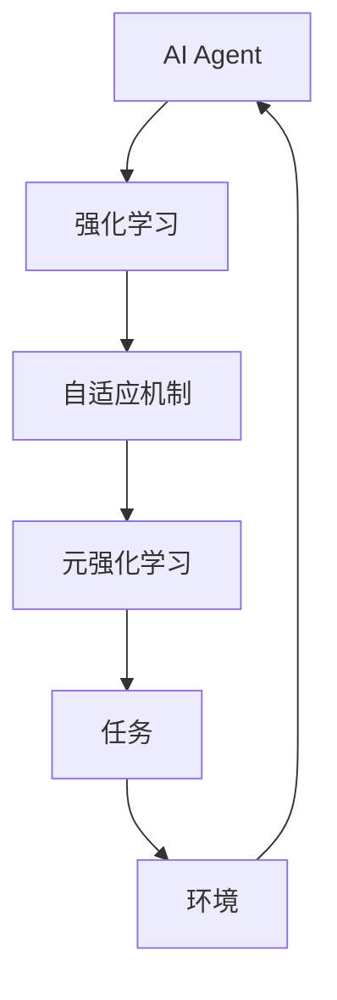
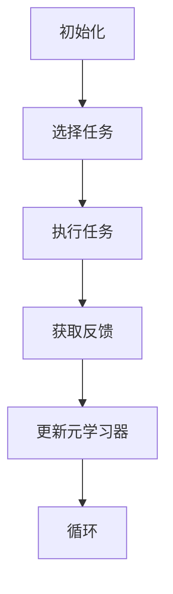
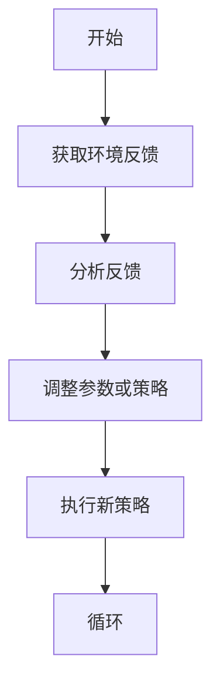
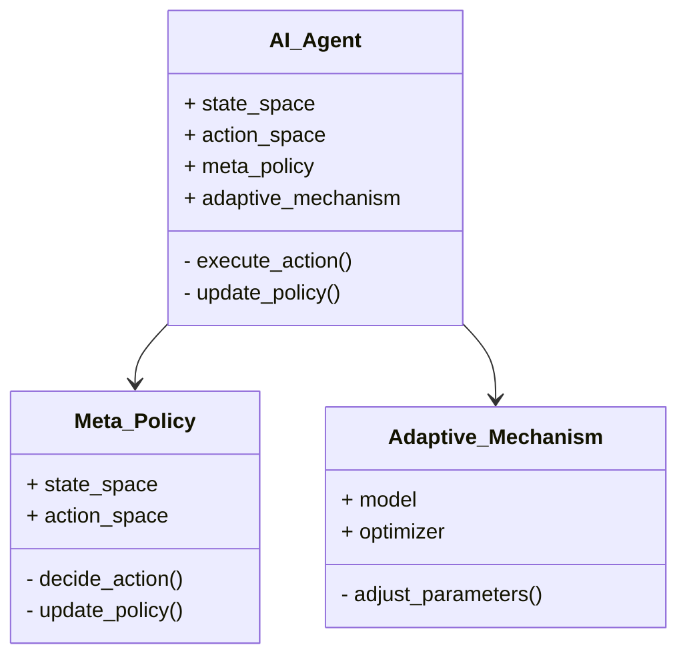
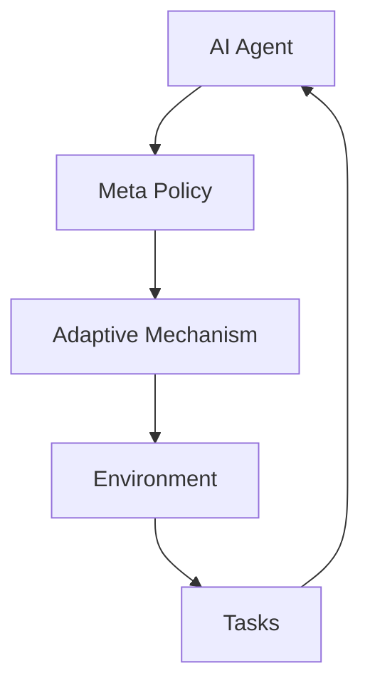
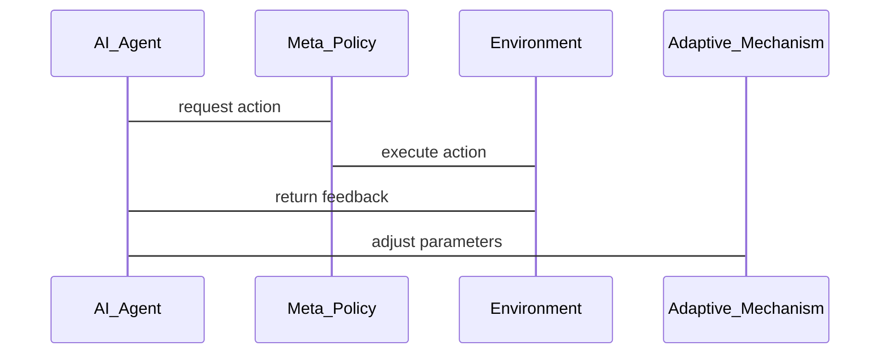

                 


# 设计AI Agent的自适应元强化学习框架

## 关键词：AI Agent，强化学习，自适应机制，元学习，算法框架，系统设计

## 摘要

本文详细探讨了设计AI Agent的自适应元强化学习框架的关键技术与实现方法。首先，我们从AI Agent的基本概念出发，分析了强化学习和自适应机制在AI Agent中的重要性。接着，我们深入讲解了自适应元强化学习的核心概念、算法原理和数学模型。通过系统分析与架构设计，我们展示了如何构建一个高效、灵活的自适应元强化学习框架。最后，我们通过项目实战和案例分析，验证了该框架的有效性和实际应用价值。

---

## 第一部分：背景介绍

### 第1章：AI Agent概述

#### 1.1 AI Agent的基本概念

- **AI Agent的定义**：AI Agent是指具有智能决策和自主行动能力的实体，能够感知环境并采取行动以实现特定目标。
- **AI Agent的类型**：
  - 简单反射型：基于规则的简单反应，适用于简单任务。
  - 基于模型的反射型：使用内部模型进行决策，适用于复杂任务。
  - 目标驱动型：基于目标的决策，适用于需要长期规划的任务。
  - 学习驱动型：通过学习优化决策策略，适用于动态环境。
- **AI Agent的应用场景**：智能助手、自动驾驶、机器人控制、游戏AI、推荐系统等。

#### 1.2 问题背景

- **当前AI Agent面临的挑战**：
  - 动态环境中的适应性不足。
  - 复杂任务中的决策效率低下。
  - 不同任务之间的知识迁移困难。
- **强化学习在AI Agent中的作用**：强化学习通过试错机制优化决策策略，是实现AI Agent自主性的核心方法。
- **自适应机制的重要性**：自适应机制使AI Agent能够根据环境变化动态调整策略，提高灵活性和适应性。

### 第2章：强化学习背景

#### 2.1 强化学习的基本概念

- **强化学习的定义**：强化学习是一种通过试错机制，学习策略以最大化累积奖励的机器学习方法。
- **强化学习的核心要素**：
  - 状态（State）：环境的当前情况。
  - 动作（Action）：AI Agent采取的行动。
  - 奖励（Reward）：环境对动作的反馈。
  - 策略（Policy）：决定动作的选择机制。
  - 价值函数（Value Function）：预测状态或动作的预期奖励。
- **强化学习的应用领域**：游戏AI、机器人控制、自动驾驶、智能推荐系统等。

#### 2.2 自适应机制在强化学习中的作用

- **自适应机制的定义**：自适应机制是指系统能够根据环境变化自动调整参数或策略的能力。
- **自适应机制的优势**：
  - 提高算法的鲁棒性。
  - 加快学习速度。
  - 适应不同任务和环境。
- **自适应机制的实现方式**：
  - 参数调整：动态调整模型参数。
  - 动作选择：动态选择最优动作。
  - 策略优化：优化策略以适应环境变化。

### 第3章：自适应机制概述

#### 3.1 自适应机制的基本概念

- **自适应机制的定义**：自适应机制是指系统能够根据环境反馈动态调整自身行为或参数的能力。
- **自适应机制的核心要素**：
  - 感知环境：获取环境反馈。
  - 分析反馈：理解反馈的含义。
  - 调整策略：优化行为或参数。
- **自适应机制的应用场景**：动态环境中的任务、多任务学习、在线学习等。

#### 3.2 元强化学习的背景

- **元强化学习的定义**：元强化学习是一种通过学习如何学习的强化学习方法，旨在加速新任务的学习。
- **元强化学习的核心特点**：
  - 跨任务学习：能够在多个任务之间共享知识。
  - 快速适应：能够快速适应新任务。
  - 元策略：指导如何学习策略。
- **元强化学习的优势**：
  - 提高学习效率。
  - 降低数据需求。
  - 适应新任务的能力强。

---

## 第二部分：核心概念与联系

### 第4章：核心概念分析

#### 4.1 自适应元强化学习框架的核心概念

- **自适应元强化学习框架**：
  - 由元学习器和自适应机制组成。
  - 元学习器负责跨任务学习和策略优化。
  - 自适应机制负责动态调整参数或策略。
- **核心属性**：
  - 跨任务性：能够处理多个任务。
  - 自适应性：能够根据环境反馈调整策略。
  - 鲁棒性：在复杂环境中表现稳定。

#### 4.2 实体关系图



#### 4.3 对比表格

| 概念       | 强化学习      | 自适应机制    | 元强化学习    |
|------------|--------------|--------------|--------------|
| 定义       | 通过试错学习  | 动态调整参数  | 学习如何学习  |
| 主要目标   | 最大化奖励    | 提高适应性    | 跨任务学习    |
| 应用场景   | 单任务        | 动态环境      | 多任务        |

---

## 第三部分：算法原理

### 第5章：元强化学习算法

#### 5.1 元强化学习算法流程



#### 5.2 元强化学习算法实现

```python
class MetaRLAgent:
    def __init__(self, state_space, action_space):
        self.state_space = state_space
        self.action_space = action_space
        self.meta_policy = MetaPolicy(state_space, action_space)
    
    def train(self, tasks):
        for task in tasks:
            for episode in episodes:
                state = task.reset()
                while not done:
                    action = self.meta_policy.act(state)
                    next_state, reward, done = task.step(action)
                    self.meta_policy.update(state, action, reward)
                    state = next_state
```

#### 5.3 元强化学习的数学模型

$$
\text{元强化学习的目标函数} = \sum_{t=1}^{T} \gamma^{t} r_t
$$

其中：
- $T$ 是时间步数。
- $\gamma$ 是折扣因子。
- $r_t$ 是第$t$步的奖励。

### 第6章：自适应机制算法

#### 6.1 自适应机制算法流程



#### 6.2 自适应机制算法实现

```python
class AdaptiveMechanism:
    def __init__(self, model):
        self.model = model
        self.optimizer = Adam(lr=0.001)
    
    def adapt(self, feedback):
        if feedback == 'positive':
            self.optimizer.lr *= 1.1
        elif feedback == 'negative':
            self.optimizer.lr *= 0.9
        self.model.compile(optimizer=self.optimizer, loss='categorical_crossentropy')
```

#### 6.3 自适应机制的数学模型

$$
\text{自适应参数调整} = \theta_{t+1} = \theta_t + \alpha \nabla J(\theta_t)
$$

其中：
- $\theta_t$ 是当前参数。
- $\alpha$ 是学习率。
- $\nabla J(\theta_t)$ 是参数梯度。

---

## 第四部分：系统分析与架构设计

### 第7章：问题场景介绍

- **问题场景**：设计一个AI Agent，能够在动态环境中快速适应新任务，实现高效决策。
- **项目介绍**：构建一个基于元强化学习和自适应机制的AI Agent框架，支持多任务学习和快速适应。

### 第8章：系统功能设计

#### 8.1 领域模型（类图）



#### 8.2 系统架构设计



#### 8.3 接口设计

- **AI Agent接口**：
  - `execute_action(state)`：根据当前状态执行动作。
  - `update_policy(feedback)`：根据反馈更新策略。
- **Meta Policy接口**：
  - `decide_action(state)`：根据状态决定动作。
  - `update_policy(reward)`：根据奖励更新策略。
- **Adaptive Mechanism接口**：
  - `adjust_parameters(feedback)`：根据反馈调整参数。

#### 8.4 交互流程设计



---

## 第五部分：项目实战

### 第9章：环境安装与配置

- **环境安装**：安装Python、TensorFlow、Keras、OpenAI Gym等依赖库。
- **配置说明**：配置训练参数，如学习率、折扣因子等。

### 第10章：核心代码实现

#### 10.1 元强化学习实现

```python
import numpy as np
import tensorflow as tf
from tensorflow.keras import layers

class MetaRLAgent:
    def __init__(self, state_shape, action_shape):
        self.state_shape = state_shape
        self.action_shape = action_shape
        self.meta_policy = self.build_model()
    
    def build_model(self):
        model = tf.keras.Sequential([
            layers.Dense(64, activation='relu', input_shape=self.state_shape),
            layers.Dense(self.action_shape, activation='softmax')
        ])
        return model
    
    def act(self, state):
        state = tf.convert_to_tensor(state)
        return self.meta_policy(state).numpy()[0]
    
    def update(self, state, action, reward):
        state = tf.convert_to_tensor(state)
        action = tf.convert_to_tensor(action)
        with tf.GradientTape() as tape:
            prob = self.meta_policy(state)
            loss = tf.keras.losses.sparse_categorical_crossentropy(action, prob)
        gradients = tape.gradient(loss, self.meta_policy.trainable_weights)
        self.optimizer.apply_gradients(zip(gradients, self.meta_policy.trainable_weights))
```

#### 10.2 自适应机制实现

```python
class AdaptiveMechanism:
    def __init__(self, model):
        self.model = model
        self.optimizer = tf.keras.optimizers.Adam(lr=0.001)
    
    def adjust(self, feedback):
        if feedback == 'positive':
            self.optimizer.lr *= 1.1
        elif feedback == 'negative':
            self.optimizer.lr *= 0.9
        self.model.compile(optimizer=self.optimizer, loss='categorical_crossentropy')
```

### 第11章：案例分析与解读

- **案例分析**：在OpenAI Gym的CartPole环境中训练AI Agent，实现自适应元强化学习。
- **代码应用解读**：
  - 初始化AI Agent和自适应机制。
  - 执行任务并获取反馈。
  - 动态调整参数并更新策略。
- **实际应用分析**：通过实验验证自适应元强化学习框架的有效性，分析不同参数设置对性能的影响。

### 第12章：项目总结

- **项目总结**：通过项目实战，验证了自适应元强化学习框架的有效性，展示了其在动态环境中的适应能力和高效决策能力。
- **经验总结**：参数调整和任务选择对框架性能影响显著，动态调整学习率和任务优先级能够提高学习效率。

---

## 第六部分：最佳实践

### 第13章：小结

- **小结**：本文详细探讨了设计AI Agent的自适应元强化学习框架的关键技术与实现方法，从理论到实践，系统地介绍了框架的设计与实现。

### 第14章：注意事项

- **参数调整**：学习率和折扣因子的设置对性能影响较大，需根据具体任务进行调整。
- **任务选择**：任务的多样性和相关性影响框架的适应能力，需合理选择和设计任务。
- **环境稳定性**：确保训练环境的稳定性和一致性，避免外部干扰影响学习效果。

### 第15章：拓展阅读

- **推荐书籍**：
  - 《Reinforcement Learning: Theory and Algorithms》
  - 《Meta-Learning: A Survey》
- **推荐论文**：
  - “Meta-Learning via Memory Gradient Descent”
  - “Adaptive Dynamic Programming for Reinforcement Learning”

---

## 作者

作者：AI天才研究院/AI Genius Institute & 禅与计算机程序设计艺术 /Zen And The Art of Computer Programming

---

通过本文的详细讲解和实战案例，我们展示了如何设计一个高效、灵活的自适应元强化学习框架，为AI Agent在动态环境中的应用提供了理论基础和实践指导。希望本文能够为相关领域的研究者和开发者提供有价值的参考和启发。

