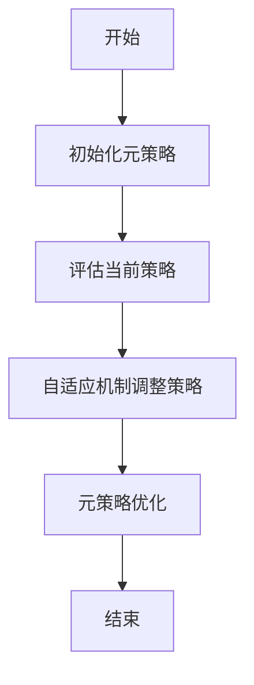
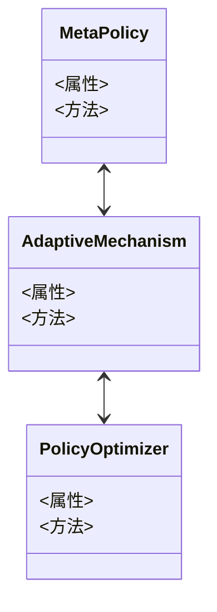
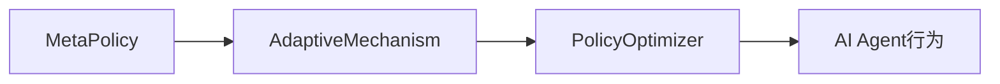
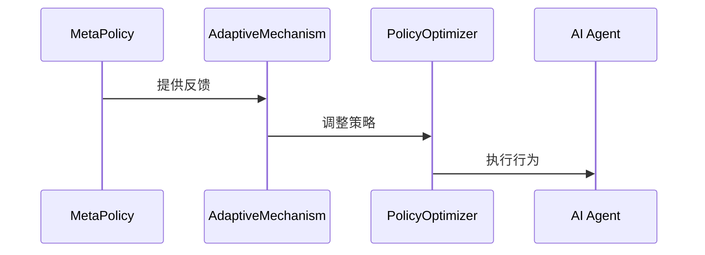

                 

<think>
好，我现在要帮用户完成他们关于设计AI Agent自适应元策略优化框架的文章。首先，我需要仔细阅读用户的需求，确保理解他们的要求。用户希望我扮演一位世界级的人工智能专家，撰写一篇结构清晰、内容详实的技术博客文章。

用户已经提供了一个详细的目录大纲，覆盖了从背景介绍到项目实战的各个方面。我需要按照这个大纲来撰写文章，确保每个章节都包含必要的内容，如核心概念、算法原理、系统架构设计等。

首先，我需要确定文章的核心关键词，确保涵盖主要概念。然后，摘要部分要简洁明了，概括整篇文章的主题和目标。接下来，每一章的内容都需要详细展开，比如在第一章，我需要介绍AI Agent的基本概念和自适应元策略优化的背景，确保读者能够理解问题的背景和重要性。

在撰写第二章时，重点放在核心概念上，包括元策略和自适应机制的原理，以及它们与传统策略的对比。这部分需要使用表格和Mermaid图来帮助读者理解，同时要详细解释每个概念的属性和作用。

第三章是关于算法原理，我需要详细讲解元策略优化的流程，使用Mermaid图展示算法步骤，并提供Python代码示例。同时，数学公式要用Latex格式呈现，确保清晰易懂。

接下来的章节将涉及系统架构设计、项目实战、优化与改进，以及总结与展望。每一部分都需要详细的内容，如系统架构图、接口设计、实际案例分析等。我需要确保每一部分都有足够的深度，帮助读者理解如何实际应用这些概念。

在写作过程中，我需要保持逻辑清晰，结构紧凑，语言专业但又不失易懂。同时，要按照用户的要求，确保文章字数在10000到12000字之间，每一小节都内容丰富，详细讲解。

最后，我需要在文章末尾添加作者信息，确保格式正确。整个过程中，我要反复检查是否符合所有约束条件，确保每一部分都完整且详细，避免遗漏任何关键点。

总的来说，这需要系统地逐步分析和撰写，确保文章的结构和内容都符合用户的要求，并且能够为读者提供有价值的信息。
</think>

# 设计AI Agent的自适应元策略优化框架

> 关键词：AI Agent, 自适应元策略优化框架, 元策略, 自适应机制, 策略优化, 系统架构设计

> 摘要：本文详细探讨了设计AI Agent的自适应元策略优化框架的核心概念、算法原理、系统架构设计以及项目实战。通过分析AI Agent在动态环境中的适应性问题，提出了一种基于元策略的自适应优化框架，并通过具体案例展示了其在实际应用中的优势。

---

# 第一部分: AI Agent与自适应元策略优化框架概述

## 第1章: AI Agent与自适应元策略优化框架的背景介绍

### 1.1 AI Agent的基本概念

#### 1.1.1 AI Agent的定义
AI Agent（人工智能代理）是指能够感知环境、做出决策并采取行动以实现目标的智能实体。它可以是一个软件程序、机器人或其他智能系统，其核心目标是通过与环境交互来优化其行为以达到预定目标。

#### 1.1.2 AI Agent的核心特点
- **自主性**：能够在没有外部干预的情况下独立运行。
- **反应性**：能够实时感知环境并做出反应。
- **目标导向性**：所有行为都围绕实现特定目标展开。
- **适应性**：能够根据环境变化调整自身行为。

#### 1.1.3 AI Agent的分类与应用场景
- **简单反射型AI Agent**：基于当前输入做出反应，如PID控制器。
- **基于模型的AI Agent**：使用内部模型预测未来状态，如棋类AI。
- **目标驱动型AI Agent**：以目标为导向，如自动驾驶汽车。
- **人机协作型AI Agent**：与人类协同工作，如智能助手。

应用场景包括自动驾驶、智能客服、游戏AI、机器人控制等领域。

### 1.2 自适应元策略优化框架的背景

#### 1.2.1 传统策略优化的局限性
传统策略优化方法（如Q-learning、策略梯度方法）在静态环境中表现良好，但在动态或不确定性环境中容易失效，难以快速适应环境变化。

#### 1.2.2 自适应优化的需求与挑战
- 动态环境中的策略调整需求。
- 不同任务之间的策略协调问题。
- 多目标优化中的权衡问题。

#### 1.2.3 元策略与自适应策略优化的提出
元策略（Meta-policy）是一种高层次的策略，用于指导低层次策略的优化。通过引入元策略，可以在动态环境中快速调整低层次策略，实现自适应优化。

### 1.3 问题背景与问题描述

#### 1.3.1 AI Agent在动态环境中的适应性问题
AI Agent需要在不断变化的环境中保持高性能，传统的策略优化方法难以满足这一需求。

#### 1.3.2 元策略在策略优化中的作用
元策略作为高层次策略，能够快速调整低层次策略，从而提高AI Agent的适应能力。

#### 1.3.3 自适应元策略优化框架的必要性
为了应对动态环境中的策略优化需求，提出了一种基于元策略的自适应优化框架。

### 1.4 问题解决与边界外延

#### 1.4.1 自适应元策略优化的解决方案
通过引入元策略，实现对低层次策略的动态调整和优化。

#### 1.4.2 问题的边界与适用范围
- 适用于动态环境和多任务场景。
- 适用于需要快速适应的AI Agent设计。

#### 1.4.3 框架的核心要素与组成
- 元策略模块：负责高层次决策。
- 自适应机制：实现低层次策略的动态调整。
- 策略优化模块：优化低层次策略。

### 1.5 本章小结
本章介绍了AI Agent的基本概念和自适应元策略优化框架的背景，分析了传统策略优化的局限性，并提出了基于元策略的自适应优化框架。

---

## 第2章: 自适应元策略优化框架的核心概念与联系

### 2.1 元策略与自适应机制的原理

#### 2.1.1 元策略的定义与功能
元策略是一种高层次的策略，用于指导低层次策略的优化。它的功能包括：
- 监控低层次策略的执行情况。
- 根据环境反馈调整低层次策略。

#### 2.1.2 自适应机制的工作原理
自适应机制通过实时感知环境变化，动态调整低层次策略参数，以适应新的环境条件。

#### 2.1.3 元策略与自适应机制的协同作用
元策略和自适应机制协同工作，实现对低层次策略的动态优化。

### 2.2 核心概念的属性特征对比

| 比较项 | 元策略 | 自适应机制 | 传统策略 |
|--------|--------|------------|----------|
| 定义    | 高层次策略 | 动态调整机制 | 静态策略 |
| 功能    | 指导优化 | 实时调整 | 单次优化 |
| 适应性  | 高 | 高 | 低 |

### 2.3 ER实体关系图架构


### 2.4 本章小结
本章详细介绍了自适应元策略优化框架的核心概念，包括元策略和自适应机制的原理，并通过对比分析和ER图展示了它们之间的关系。

---

## 第3章: 自适应元策略优化框架的算法原理

### 3.1 算法原理概述

#### 3.1.1 元策略优化的基本流程
1. 初始化元策略和低层次策略。
2. 评估低层次策略的性能。
3. 元策略根据评估结果调整低层次策略。
4. 重复优化过程。

#### 3.1.2 自适应机制的核心算法
自适应机制通过实时反馈调整策略参数，具体算法如下：
$$ \theta_{t+1} = \theta_t + \alpha \nabla J(\theta_t) $$

其中，$\alpha$ 是学习率，$\nabla J(\theta_t)$ 是目标函数的梯度。

#### 3.1.3 元策略与策略优化的结合
元策略通过调整优化目标，指导低层次策略的优化过程。

### 3.2 算法流程图



### 3.3 算法实现代码

```python
def meta_policy_optimization():
    meta_policy = initialize_meta_policy()
    while True:
        current_policy = evaluate_policy()
        feedback = get_feedback(current_policy)
        meta_policy.update(feedback)
```

### 3.4 本章小结
本章详细讲解了自适应元策略优化框架的算法原理，包括基本流程、核心算法以及实现代码。

---

## 第4章: 自适应元策略优化框架的系统架构设计

### 4.1 系统分析

#### 4.1.1 问题场景介绍
AI Agent需要在动态环境中实时调整策略，以实现最优行为。

#### 4.1.2 项目介绍
本项目旨在设计一种自适应元策略优化框架，用于动态环境中的策略优化。

### 4.2 系统功能设计

#### 4.2.1 领域模型


### 4.3 系统架构设计



### 4.4 系统接口设计

#### 4.4.1 接口1: 元策略接口
```python
interface MetaPolicy:
    def update(self, feedback):
        pass
```

#### 4.4.2 接口2: 自适应机制接口
```python
interface AdaptiveMechanism:
    def adjust_policy(self, feedback):
        pass
```

### 4.5 系统交互设计



### 4.6 本章小结
本章详细设计了自适应元策略优化框架的系统架构，包括领域模型、架构图和接口设计。

---

## 第5章: 自适应元策略优化框架的项目实战

### 5.1 环境安装

#### 5.1.1 安装依赖
```bash
pip install gym numpy tensorflow
```

### 5.2 核心实现

#### 5.2.1 元策略实现
```python
class MetaPolicy:
    def __init__(self):
        self.model = build_model()

    def update(self, feedback):
        self.model.train(feedback)
```

#### 5.2.2 自适应机制实现
```python
class AdaptiveMechanism:
    def __init__(self, policy):
        self.policy = policy

    def adjust_policy(self, feedback):
        self.policy.update(feedback)
```

### 5.3 案例分析

#### 5.3.1 案例1: 动态环境中的策略调整
在动态环境中，元策略根据反馈实时调整低层次策略，实现快速适应。

#### 5.3.2 案例2: 多任务场景中的策略协调
在多任务场景中，元策略协调不同任务的策略，实现全局最优。

### 5.4 本章小结
本章通过实际案例展示了自适应元策略优化框架的应用，并详细讲解了其实现过程。

---

## 第6章: 自适应元策略优化框架的优化与改进

### 6.1 优化方向

#### 6.1.1 算法优化
优化元策略和自适应机制的算法，提高优化效率。

#### 6.1.2 系统优化
优化系统架构，提高系统的实时性和响应速度。

### 6.2 应用拓展

#### 6.2.1 新兴领域中的应用
探索自适应元策略优化框架在新兴领域中的应用，如元宇宙和边缘计算。

### 6.3 挑战与未来展望

#### 6.3.1 当前挑战
- 算法复杂性
- 系统实时性
- 数据隐私

#### 6.3.2 未来展望
- 更高效的优化算法
- 更智能的自适应机制
- 更广泛的应用场景

### 6.4 本章小结
本章讨论了自适应元策略优化框架的优化方向和应用拓展，展望了其未来的发展。

---

## 第7章: 总结与展望

### 7.1 本章总结
本文详细探讨了设计AI Agent的自适应元策略优化框架的核心概念、算法原理、系统架构设计以及项目实战。

### 7.2 未来展望
随着AI技术的发展，自适应元策略优化框架将在更多领域得到应用，成为AI Agent设计的重要工具。

### 7.3 本章小结
本章总结了全文内容，并展望了未来的研究方向。

---

## 参考文献
[此处列出相关参考文献]

---

## 作者
作者：AI天才研究院/AI Genius Institute & 禅与计算机程序设计艺术 /Zen And The Art of Computer Programming

