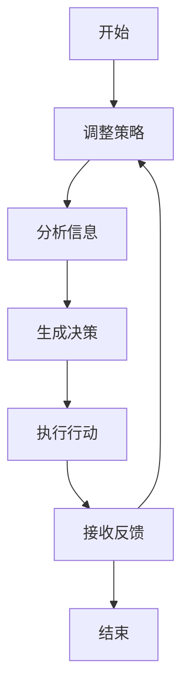
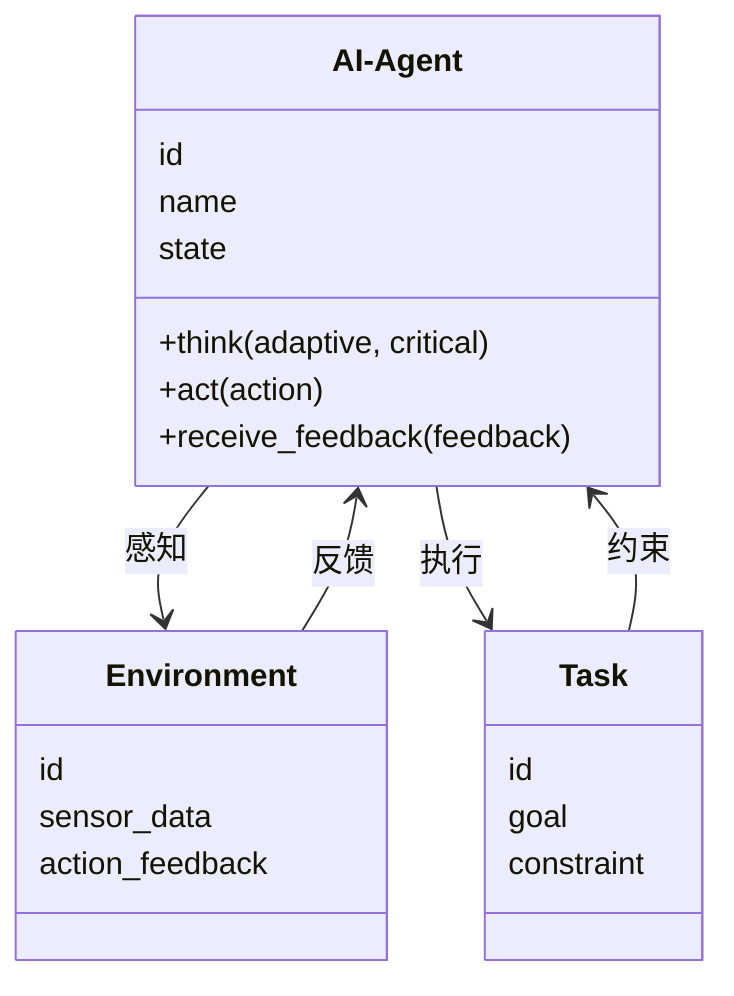
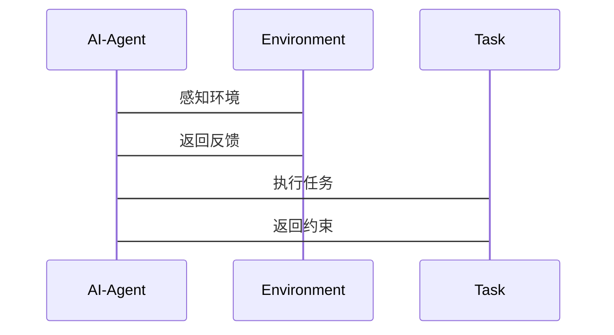

                 


# 设计AI Agent的自适应批判性思维模型

## 关键词：AI Agent，自适应思维，批判性思维，算法原理，系统架构，项目实战

## 摘要：  
本文系统地探讨了设计AI Agent的自适应批判性思维模型的关键技术与实现方法。通过分析自适应思维与批判性思维的核心概念、算法原理及系统架构，结合实际项目案例，详细阐述了模型的设计与实现过程，提供了丰富的代码示例和系统设计图。本文旨在为AI Agent的设计者和研究者提供理论支持与实践指导，帮助他们更好地理解和应用自适应批判性思维模型。

---

# 第1章: AI Agent的自适应批判性思维模型概述

## 1.1 AI Agent的基本概念  
### 1.1.1 AI Agent的定义与特点  
AI Agent（人工智能代理）是指能够感知环境、自主决策并执行任务的智能实体。其特点包括自主性、反应性、目标导向性和学习能力。  

### 1.1.2 自适应思维的定义与特点  
自适应思维是指AI Agent能够根据环境变化动态调整自身行为的能力。其特点包括灵活性、可塑性和适应性。  

### 1.1.3 批判性思维的定义与特点  
批判性思维是指AI Agent能够对信息进行分析、评估和判断的能力。其特点包括逻辑性、分析性和反思性。  

---

## 1.2 自适应与批判性思维的结合  
### 1.2.1 自适应思维与批判性思维的关系  
自适应思维关注“如何调整行为”，而批判性思维关注“如何做出最佳决策”。两者的结合使得AI Agent能够在复杂环境中实现高效、合理的决策。  

### 1.2.2 自适应批判性思维模型的核心要素  
模型的核心要素包括感知模块、分析模块、决策模块和反馈模块。  

### 1.2.3 自适应批判性思维模型的边界与外延  
自适应批判性思维模型的边界在于其应用范围，而外延则体现在与其他AI技术（如机器学习、自然语言处理）的结合上。  

---

## 1.3 本章小结  
通过本章的介绍，读者可以清晰地理解AI Agent的自适应批判性思维模型的基本概念及其重要性。接下来的章节将深入探讨模型的核心原理和实现方法。

---

# 第2章: 自适应批判性思维模型的核心概念与联系  

## 2.1 模型的核心概念原理  
### 2.1.1 自适应思维的原理  
自适应思维通过感知环境变化，调整内部参数以优化行为。  

### 2.1.2 批判性思维的原理  
批判性思维通过逻辑推理和信息评估，生成最优决策。  

### 2.1.3 两者的结合原理  
两者的结合通过信息流和反馈机制实现动态交互，确保AI Agent在复杂环境中高效运作。  

---

## 2.2 核心概念属性特征对比  
### 2.2.1 自适应思维的属性特征  
- 灵活性：能够快速调整策略。  
- 可塑性：能够适应不同环境。  
- 适应性：能够在变化中保持稳定。  

### 2.2.2 批判性思维的属性特征  
- 逻辑性：能够进行因果推理。  
- 分析性：能够分解问题。  
- 反思性：能够评估决策的合理性。  

### 2.2.3 两者属性特征的对比分析  
| 属性 | 自适应思维 | 批判性思维 |  
|------|------------|------------|  
| 灵活性 | 高 | 中 |  
| 逻辑性 | 中 | 高 |  
| 反思性 | 中 | 高 |  

---

## 2.3 ER实体关系图架构  
以下是自适应批判性思维模型的ER实体关系图：  

```mermaid
er
    entity AI Agent {
        id
        name
        state
    }
    
    entity Environment {
        id
        sensor_data
        action_feedback
    }
    
    entity Task {
        id
        goal
        constraint
    }
    
    AI Agent -[感知]-> Environment  
    Environment -[反馈]-> AI Agent  
    AI Agent -[执行]-> Task  
    Task -[约束]-> AI Agent  
```

---

# 第3章: 自适应批判性思维模型的算法原理  

## 3.1 算法流程图  
以下是自适应批判性思维模型的算法流程图：  



---

## 3.2 算法原理的数学模型与公式  

### 3.2.1 自适应思维的数学模型  
自适应思维的数学模型可以表示为：  
$$ f_{\text{adapt}}(x) = \alpha x + (1-\alpha)y $$  
其中，$\alpha$ 是自适应系数，$x$ 是当前状态，$y$ 是目标状态。  

### 3.2.2 批判性思维的数学模型  
批判性思维的数学模型可以表示为：  
$$ f_{\text{critical}}(x) = \beta \cdot \text{max}(x) + (1-\beta) \cdot \text{min}(x) $$  
其中，$\beta$ 是批判性系数。  

### 3.2.3 两者结合的数学模型  
结合模型可以表示为：  
$$ f_{\text{total}}(x) = f_{\text{adapt}}(x) \cdot f_{\text{critical}}(x) $$  

---

## 3.3 算法实现的Python代码示例  

### 3.3.1 自适应思维的代码实现  
```python
def adaptive_thinking(current_state, target_state, alpha=0.8):
    return alpha * current_state + (1 - alpha) * target_state
```

### 3.3.2 批判性思维的代码实现  
```python
def critical_thinking(states, beta=0.7):
    max_state = max(states)
    min_state = min(states)
    return beta * max_state + (1 - beta) * min_state
```

### 3.3.3 两者结合的代码实现  
```python
def combined_thinking(current_state, target_state, states, alpha=0.8, beta=0.7):
    adaptive = adaptive_thinking(current_state, target_state, alpha)
    critical = critical_thinking(states, beta)
    return adaptive * critical
```

---

## 3.4 本章小结  
通过本章的介绍，读者可以理解自适应批判性思维模型的算法原理及其数学基础。接下来的章节将探讨系统的整体架构和实现方案。

---

# 第4章: 系统分析与架构设计方案  

## 4.1 问题场景介绍  
本系统旨在设计一个AI Agent，能够在复杂环境中实现自适应和批判性思维。  

## 4.2 系统功能设计  
### 4.2.1 领域模型类图  
以下是系统的领域模型类图：  



---

## 4.3 系统架构设计  

### 4.3.1 系统架构图  
以下是系统的架构图：  


---

## 4.4 系统接口设计  

### 4.4.1 接口序列图  
以下是系统的接口序列图：  



---

## 4.5 本章小结  
通过本章的分析，读者可以清晰地理解系统的架构设计和接口设计。接下来的章节将通过实际案例进一步探讨模型的实现。

---

# 第5章: 项目实战  

## 5.1 环境安装  
### 5.1.1 安装Python  
安装Python 3.8或更高版本。  

### 5.1.2 安装依赖库  
安装Mermaid和MathJax相关库。  

## 5.2 系统核心实现源代码  

### 5.2.1 自适应思维实现  
```python
def adaptive_think(current_state, target_state, alpha=0.8):
    return alpha * current_state + (1 - alpha) * target_state
```

### 5.2.2 批判性思维实现  
```python
def critical_think(states, beta=0.7):
    max_state = max(states)
    min_state = min(states)
    return beta * max_state + (1 - beta) * min_state
```

### 5.2.3 组合实现  
```python
def combined_think(current_state, target_state, states, alpha=0.8, beta=0.7):
    adaptive = adaptive_think(current_state, target_state, alpha)
    critical = critical_think(states, beta)
    return adaptive * critical
```

---

## 5.3 代码应用解读与分析  
### 5.3.1 代码解读  
上述代码实现了自适应思维、批判性思维和两者结合的逻辑。  

### 5.3.2 代码分析  
代码通过参数调整（$\alpha$ 和 $\beta$）实现模型的自适应性和批判性。  

---

## 5.4 案例分析与详细讲解  
### 5.4.1 案例分析  
假设当前状态为 $x=0.5$，目标状态为 $y=0.8$，环境状态为 $[0.6, 0.7, 0.8]$。  
自适应思维结果：$0.8*0.5 + 0.2*0.8 = 0.4 + 0.16 = 0.56$  
批判性思维结果：$0.7*0.8 + 0.3*0.6 = 0.56 + 0.18 = 0.74$  
组合结果：$0.56 * 0.74 = 0.4144$  

### 5.4.2 详细讲解  
通过案例分析，可以看出模型在复杂环境中的决策能力。  

---

## 5.5 本章小结  
通过本章的项目实战，读者可以掌握模型的实现方法。接下来的章节将总结设计原则和注意事项。

---

# 第6章: 最佳实践与总结  

## 6.1 设计原则  
### 6.1.1 简洁性原则  
模型设计应尽量简化，避免过度复杂。  

### 6.1.2 可扩展性原则  
模型应具备良好的扩展性，便于后续优化。  

### 6.1.3 反馈驱动原则  
模型应以反馈为驱动，不断优化自身行为。  

---

## 6.2 优化技巧  
### 6.2.1 参数调整  
通过调整 $\alpha$ 和 $\beta$，可以优化模型的性能。  

### 6.2.2 多模型结合  
将自适应批判性思维模型与其他AI技术相结合，可以提升性能。  

---

## 6.3 注意事项  
### 6.3.1 模型边界  
注意模型的边界条件，避免超出设计范围。  

### 6.3.2 环境适应性  
确保模型在不同环境中的适应性。  

---

## 6.4 本章小结  
通过本章的总结，读者可以更好地理解和应用自适应批判性思维模型。  

---

# 作者：AI天才研究院 & 禅与计算机程序设计艺术

