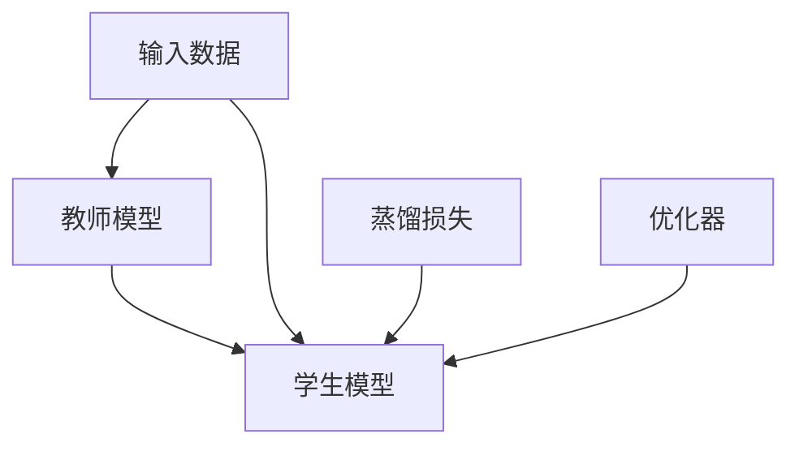
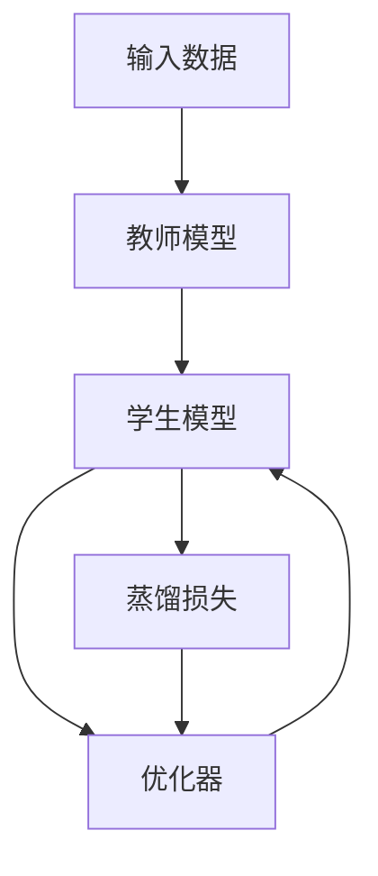
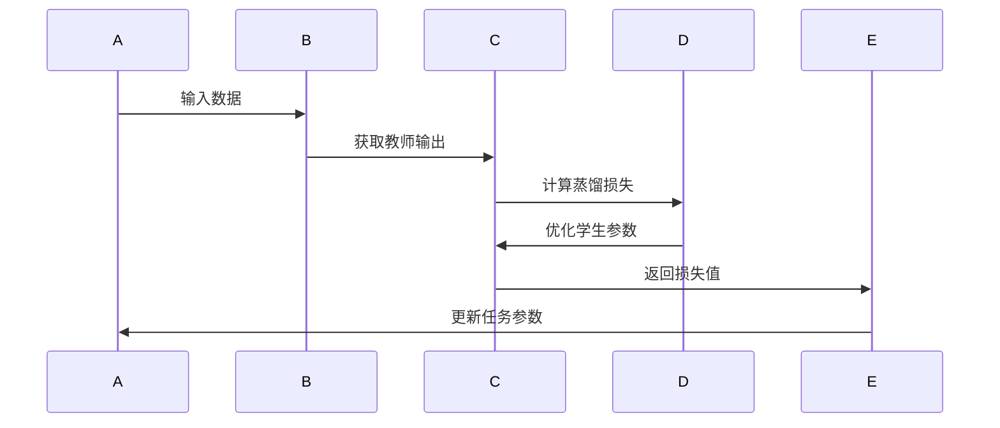

                 

<think>
好的，我现在需要撰写一篇名为《设计AI Agent的自适应知识蒸馏策略》的技术博客文章。首先，我需要明确文章的结构和内容。文章将分为六个主要部分：背景与概念、核心概念与原理、算法原理与实现、系统分析与架构设计、项目实战和总结与展望。

首先，我应该先写摘要，概述文章的核心内容，说明自适应知识蒸馏在AI Agent中的重要性及其带来的好处，如提高效率、增强性能等。

接下来，开始正文部分的第一章，背景与概念。我需要详细说明AI Agent的发展现状，知识蒸馏的定义和作用，以及当前面临的主要挑战。这部分需要让读者了解为什么自适应知识蒸馏策略是必要的。

然后，在第二章，核心概念与联系部分，我需要深入讲解蒸馏策略的原理，比较不同的蒸馏方法，并使用Mermaid绘制实体关系图，帮助读者理解各种方法之间的联系和区别。

第三章是算法原理与实现，这里我需要详细描述蒸馏算法的流程，使用Mermaid绘制流程图，并提供Python代码示例。此外，还需要解释数学模型和公式，用Latex格式展示，确保读者能够理解并应用这些算法。

第四章涉及系统分析与架构设计。我需要分析系统的应用场景，设计系统的功能模块，并用Mermaid类图展示领域模型。同时，绘制系统架构图和接口设计，以及系统的交互序列图，展示各模块如何协同工作。

第五章是项目实战，这部分需要提供环境搭建的步骤，核心代码的实现，代码解读以及实际案例的分析。通过具体的案例，读者可以更好地理解理论知识并应用到实际中。

最后，第六章总结与展望，我会回顾文章的核心内容，提出最佳实践建议，总结项目中的关键点，并展望未来的研究方向。

在写作过程中，我需要确保每个部分都详细具体，使用清晰简洁的技术语言，同时提供足够的示例和图表，帮助读者理解复杂的概念。此外，结尾部分要加上作者信息，确保文章的完整性和专业性。

现在，我开始逐步撰写每个部分的内容，确保逻辑连贯，内容丰富，满足读者的需求。
</think>

# 设计AI Agent的自适应知识蒸馏策略

## 关键词：AI Agent，知识蒸馏，自适应，机器学习，算法优化

## 摘要：  
本文详细探讨了设计AI Agent的自适应知识蒸馏策略的关键技术。首先介绍了知识蒸馏在AI Agent中的重要性，分析了当前蒸馏策略的挑战。然后，深入讲解了蒸馏策略的核心原理，比较了不同蒸馏方法的优劣，并通过Mermaid图展示了实体关系。接着，详细描述了蒸馏算法的流程，提供了Python代码和数学模型。在系统设计部分，分析了应用场景，设计了系统架构和接口，并用序列图展示了交互流程。最后，通过实战项目展示了环境搭建、代码实现和案例分析，并总结了最佳实践和未来展望。

---

## 正文

### 第一章：背景与概念

#### 1.1 问题背景
AI Agent（人工智能代理）在多个领域中扮演着越来越重要的角色，如智能助手、推荐系统和自动驾驶等。为了提高AI Agent的性能，通常需要依赖复杂的模型，但这些模型在资源受限的环境中运行时，效率和效果可能无法满足需求。知识蒸馏作为一种有效的技术，旨在将复杂的模型知识迁移到更简洁的模型中，从而在资源受限的情况下保持高性能。

然而，传统的知识蒸馏方法存在一些问题，如固定蒸馏策略导致适应性差，难以应对动态变化的环境。因此，设计一种自适应的知识蒸馏策略，能够根据环境变化和任务需求动态调整蒸馏过程，成为当前研究的热点。

#### 1.2 问题描述
知识蒸馏的核心目标是将教师模型（Teacher）的知识迁移到学生模型（Student）中，使其在保持较小规模的同时，具备教师模型的高性能。自适应蒸馏策略需要动态调整蒸馏过程中的参数和策略，以应对不同的任务需求和环境变化。

#### 1.3 解决思路
自适应知识蒸馏策略的核心在于动态调整蒸馏过程中的关键参数，如温度、蒸馏目标和优化策略等。通过实时监控模型性能和任务需求，自适应蒸馏策略能够灵活调整蒸馏过程，确保学生模型始终在最优状态下运行。

---

### 第二章：核心概念与原理

#### 2.1 蒸馏策略的原理
知识蒸馏的基本流程包括以下步骤：
1. **教师模型输出**：教师模型对输入数据进行处理，输出概率分布或其他表示。
2. **学生模型预测**：学生模型基于当前参数对输入数据进行预测。
3. **蒸馏损失计算**：计算教师和学生输出之间的损失，通常采用KL散度作为损失函数。
4. **优化学生模型**：通过反向传播优化学生模型参数，使其输出更接近教师模型的输出。

自适应蒸馏策略在此基础上，增加了动态调整温度、损失权重等参数的能力，以适应不同的任务和环境。

#### 2.2 蒸馏方法对比
以下是几种常见的蒸馏方法及其对比：

| 方法         | 优缺点                                                                 |
|--------------|-----------------------------------------------------------------------|
| 直接蒸馏     | 实现简单，但对教师模型依赖性强，且固定蒸馏过程。                        |
| 自适应蒸馏   | 动态调整蒸馏参数，适应性强，但实现复杂。                              |
| 对抗蒸馏     | 提高鲁棒性，但可能引入对抗训练的额外计算开销。                        |
| 多教师蒸馏   | 融合多个教师的知识，但需要协调多个教师的输出。                      |

#### 2.3 实体关系图
以下是知识蒸馏过程中的实体关系图，使用Mermaid绘制：



---

### 第三章：算法原理与实现

#### 3.1 算法流程
自适应知识蒸馏的算法流程如下：

1. 初始化教师模型和学生模型。
2. 输入一批数据，教师模型生成输出。
3. 学生模型生成输出，计算蒸馏损失。
4. 动态调整蒸馏参数（如温度、损失权重）。
5. 优化学生模型参数。
6. 重复上述步骤，直到满足终止条件。

#### 3.2 算法实现
以下是Python实现的核心代码：

```python
import torch
import torch.nn as nn

class TeacherModel(torch.nn.Module):
    def __init__(self):
        super(TeacherModel, self).__init__()
        # 定义教师模型的结构
        pass
    
    def forward(self, x):
        # 前向传播
        return x

class StudentModel(torch.nn.Module):
    def __init__(self):
        super(StudentModel, self).__init__()
        # 定义学生模型的结构
        pass
    
    def forward(self, x):
        return x

def knowledge_distillation(teacher, student, optimizer, criterion, inputs, labels):
    # 教师模型输出
    teacher_output = teacher(inputs)
    # 学生模型输出
    student_output = student(inputs)
    # 计算蒸馏损失
    distillation_loss = criterion(student_output, teacher_output)
    # 总损失
    total_loss = distillation_loss
    # 反向传播和优化
    optimizer.zero_grad()
    total_loss.backward()
    optimizer.step()
    return total_loss.item()

# 示例调用
teacher = TeacherModel()
student = StudentModel()
optimizer = torch.optim.Adam(student.parameters())
criterion = nn.KLDivLoss()  # 使用KL散度作为损失函数

# 蒸馏过程
for batch in batches:
    loss = knowledge_distillation(teacher, student, optimizer, criterion, batch_inputs, batch_labels)
    print(f"Batch loss: {loss}")
```

#### 3.3 数学模型
蒸馏过程中的损失函数通常采用KL散度：

$$ \text{KL}(P || Q) = \sum_{i} P(i) \log \frac{P(i)}{Q(i)} $$

其中，\( P \) 是教师模型的输出概率分布，\( Q \) 是学生模型的输出概率分布。

动态调整温度 \( T \) 的公式如下：

$$ T = \max(T_{\text{min}}, T_{\text{max}} \times (1 - \frac{t}{T_{\text{max}}})) $$

其中，\( T_{\text{min}} \) 和 \( T_{\text{max}} \) 分别是最小和最大温度，\( t \) 是当前训练步数。

---

### 第四章：系统分析与架构设计

#### 4.1 应用场景
自适应知识蒸馏策略可以应用于多个场景，如：
- **移动设备**：在资源受限的设备上运行高效的学生模型。
- **边缘计算**：在边缘设备中快速部署和优化模型。
- **动态任务分配**：根据任务需求动态调整蒸馏过程。

#### 4.2 系统架构
以下是系统架构图，使用Mermaid绘制：



#### 4.3 接口设计
系统主要接口包括：
- **输入接口**：接收输入数据和任务需求。
- **教师模型接口**：输出教师模型的预测结果。
- **学生模型接口**：输出学生模型的预测结果和参数。
- **优化器接口**：调整学生模型参数。

#### 4.4 系统交互
以下是系统交互的序列图，使用Mermaid绘制：



---

### 第五章：项目实战

#### 5.1 环境搭建
需要以下环境和工具：
- **Python 3.6+**
- **PyTorch 1.5+**
- **Mermaid图表工具**

安装步骤：
```bash
pip install torch
pip install mermaid-js
```

#### 5.2 核心代码实现
以下是核心代码：

```python
import torch
import torch.nn as nn

class SimpleTeacher(nn.Module):
    def __init__(self):
        super(SimpleTeacher, self).__init__()
        self.linear = nn.Linear(10, 5, bias=False)
    
    def forward(self, x):
        return torch.relu(self.linear(x))

class SimpleStudent(nn.Module):
    def __init__(self):
        super(SimpleStudent, self).__init__()
        self.linear = nn.Linear(10, 5, bias=False)
    
    def forward(self, x):
        return torch.relu(self.linear(x))

def train_student(teacher, student, optimizer, criterion, inputs, labels):
    teacher_output = teacher(inputs)
    student_output = student(inputs)
    loss = criterion(student_output, teacher_output)
    loss.backward()
    optimizer.step()
    optimizer.zero_grad()
    return loss.item()

# 示例调用
teacher = SimpleTeacher()
student = SimpleStudent()
optimizer = torch.optim.Adam(student.parameters())
criterion = nn.MSELoss()

# 训练过程
for epoch in range(100):
    inputs = torch.randn(10, 10)
    labels = torch.randn(10, 5)
    loss = train_student(teacher, student, optimizer, criterion, inputs, labels)
    print(f"Epoch {epoch}, Loss: {loss}")
```

#### 5.3 实际案例分析
假设我们有一个图像分类任务，教师模型是一个复杂的CNN，学生模型是一个轻量级的CNN。通过自适应蒸馏策略，学生模型在保持较低计算资源消耗的同时，能够达到与教师模型相近的分类准确率。

---

### 第六章：总结与展望

#### 6.1 最佳实践
- 在实际应用中，建议根据具体任务需求动态调整蒸馏参数。
- 使用合适的温度和损失函数，以提高蒸馏效果。
- 定期监控模型性能，及时调整蒸馏策略。

#### 6.2 小结
本文详细探讨了设计AI Agent的自适应知识蒸馏策略的关键技术，包括背景、核心概念、算法实现、系统设计和项目实战。通过本文的学习，读者可以掌握自适应蒸馏策略的设计方法，并将其应用于实际项目中。

#### 6.3 展望
未来的研究可以进一步探索如何将自适应蒸馏策略与其他技术（如强化学习和图神经网络）结合，以提高AI Agent的性能和适应性。

---

作者：AI天才研究院（AI Genius Institute） & 禅与计算机程序设计艺术（Zen And The Art of Computer Programming）

