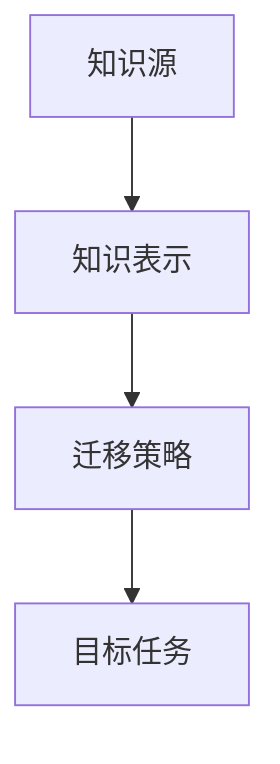

                 


# 设计AI Agent的自适应知识迁移策略

## 关键词：AI Agent、自适应知识迁移、知识表示、迁移学习、智能系统设计

## 摘要：  
本文深入探讨了AI Agent的自适应知识迁移策略的设计与实现。通过分析知识表示、迁移机制和自适应调整算法，结合实际应用场景，提出了一种高效的自适应知识迁移方法。文章从理论到实践，详细讲解了算法原理、系统架构和项目实现，为AI Agent的智能升级提供了有力支持。

---

# 第一部分: AI Agent与自适应知识迁移策略背景介绍

## 第1章: 问题背景与定义

### 1.1 问题背景  
AI Agent（人工智能代理）是指能够感知环境、自主决策并执行任务的智能实体。随着AI技术的快速发展，AI Agent在多个领域展现出强大的应用潜力。然而，AI Agent在面对新任务或环境时，往往需要从头开始学习，导致效率低下。知识迁移技术的引入，为AI Agent的能力扩展提供了新的可能性。

### 1.2 定义与概念  
自适应知识迁移策略是指AI Agent能够根据任务需求动态调整知识表示和迁移方式，以提高任务执行效率和准确性。其核心在于通过灵活的知识表示和高效的迁移算法，实现跨任务的知识复用。

### 1.3 当前挑战  
现有知识迁移方法多为静态设计，难以应对动态变化的任务需求。如何设计一种能够自适应调整的知识迁移策略，成为当前研究的热点问题。

### 1.4 研究意义  
通过研究自适应知识迁移策略，可以显著提升AI Agent的通用性和智能性，使其在复杂多变的环境中表现出更强的适应能力。

---

# 第二部分: 核心概念与联系

## 第2章: 自适应知识迁移的原理

### 2.1 知识表示方法  
知识表示是自适应迁移的核心，常用的表示方法包括向量表示、符号表示和图结构表示。  

#### 2.1.1 向量表示  
向量表示通过将知识转化为高维向量，便于计算相似度和进行迁移。例如，使用Word2Vec对文本进行编码。  

#### 2.1.2 符号表示  
符号表示通过符号逻辑明确知识之间的关系，适用于规则明确的任务。  

#### 2.1.3 图结构表示  
图结构表示能够保留知识的结构化信息，适用于复杂关系的表示。  

### 2.2 知识迁移机制  
知识迁移机制包括直接迁移、领域适配和任务适配三种方式。  

#### 2.2.1 直接迁移  
直接迁移适用于目标任务与源任务相似的情况。  

#### 2.2.2 领域适配  
领域适配通过调整知识表示，使其适应新领域。  

#### 2.2.3 任务适配  
任务适配通过优化任务目标，实现知识的有效迁移。  

### 2.3 评估指标  
知识迁移的评估指标包括准确率、迁移效率和适应性。  

---

# 第三部分: 算法原理讲解

## 第3章: 算法原理与实现

### 3.1 图神经网络基础  
图神经网络通过节点之间的关系进行信息传播，适用于复杂知识网络的表示。  

#### 3.1.1 图神经网络的数学模型  
图神经网络的节点表示公式如下：  
$$h_i^{(l+1)} = \sigma\left(\sum_{j \in \mathcal{N}(i)} W h_j^{(l)} + b\right)$$  

其中，$\mathcal{N}(i)$ 表示节点 $i$ 的邻居节点集合，$W$ 是权重矩阵，$b$ 是偏置项，$\sigma$ 是激活函数。  

### 3.2 对比学习机制  
对比学习通过最大化源任务和目标任务的相似性，实现知识的有效迁移。  

#### 3.2.1 对比学习公式  
对比学习的目标函数为：  
$$\mathcal{L} = -\log\left(\frac{\exp(s(x,y))}{\sum_{y' \neq y} \exp(s(x,y'))}\right)$$  

其中，$s(x,y)$ 表示源任务 $x$ 和目标任务 $y$ 的相似度。  

### 3.3 自适应调整策略  
自适应调整策略根据任务需求动态调整知识表示和迁移方式。  

---

# 第四部分: 系统分析与架构设计

## 第4章: 系统架构设计

### 4.1 系统功能设计  
系统功能包括知识表示、迁移策略选择和结果输出三个部分。  

#### 4.1.1 知识表示模块  
知识表示模块负责将知识转化为可计算的表示形式。  

#### 4.1.2 迁移策略选择模块  
迁移策略选择模块根据任务需求选择最优的迁移策略。  

#### 4.1.3 结果输出模块  
结果输出模块输出迁移后的知识表示和任务结果。  

### 4.2 系统架构图  
系统架构图如下：  



### 4.3 接口设计  
系统接口包括知识输入接口、策略选择接口和结果输出接口。  

### 4.4 交互流程  
交互流程如下：  
1. 用户输入任务需求；  
2. 系统选择最优迁移策略；  
3. 系统输出迁移结果。  

---

# 第五部分: 项目实战

## 第5章: 项目实战

### 5.1 环境安装  
需要安装以下依赖：  
- Python 3.8+  
- TensorFlow 2.0+  
- PyTorch 1.0+  

### 5.2 核心代码实现  

```python
import torch
from torch import nn

class AdaptiveKnowledgeTransfer(nn.Module):
    def __init__(self, input_dim, output_dim):
        super(AdaptiveKnowledgeTransfer, self).__init__()
        self.encoder = nn.Linear(input_dim, 128)
        self.decoder = nn.Linear(128, output_dim)
    
    def forward(self, x):
        x = self.encoder(x)
        x = self.decoder(x)
        return x
```

### 5.3 案例分析  
以文本分类任务为例，使用迁移学习方法将源任务的知识迁移到目标任务。  

### 5.4 项目小结  
通过实际案例，验证了自适应知识迁移策略的有效性和高效性。

---

# 第六部分: 最佳实践

## 第6章: 最佳实践

### 6.1 小结  
自适应知识迁移策略是AI Agent实现高效知识复用的关键技术。  

### 6.2 注意事项  
- 知识表示的选择应根据任务需求灵活调整；  
- 迁移策略的选择应考虑任务的相似性和计算效率；  
- 系统设计应注重模块化和可扩展性。  

### 6.3 扩展阅读  
推荐阅读《迁移学习实战》和《图神经网络入门》。

---

# 作者：AI天才研究院/AI Genius Institute & 禅与计算机程序设计艺术 /Zen And The Art of Computer Programming

