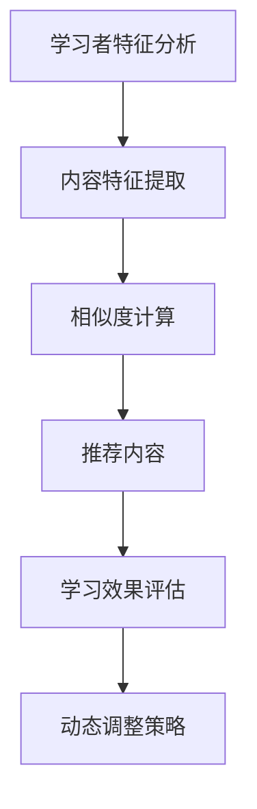

                 


# 设计AI Agent的自适应课程学习策略

> 关键词：AI Agent, 自适应学习, 个性化教育, 教学策略, 知识图谱, 动态调整

> 摘要：本文详细探讨了设计AI Agent自适应课程学习策略的核心原理、实现方法和实际应用。通过对AI Agent的知识表示、推理机制、学习者特征分析、个性化学习路径设计等多方面的深入分析，结合具体的算法实现和系统架构设计，提出了一个完整的自适应课程学习策略框架。本文还通过实际案例分析，展示了如何将理论应用于实践，并总结了设计过程中需要注意的关键点和最佳实践。

---

# 第一部分: AI Agent与自适应学习策略的背景与核心概念

## 第1章: AI Agent的基本概念与应用场景

### 1.1 AI Agent的定义与核心特征

- **1.1.1 AI Agent的基本定义**  
  AI Agent（人工智能代理）是指能够感知环境、自主决策并执行任务的智能实体。它具备以下核心特征：  
  - **自主性**：能够在没有外部干预的情况下自主运行。  
  - **反应性**：能够实时感知环境并做出反应。  
  - **目标导向**：通过设定目标来驱动行为。  
  - **学习能力**：能够通过经验改进自身的行为和决策能力。

- **1.1.2 AI Agent的核心特征**  
  AI Agent的核心特征包括：  
  - **知识表示**：通过知识图谱、规则库等形式表示领域知识。  
  - **推理能力**：基于知识和逻辑推理，推导出新的结论或决策。  
  - **学习机制**：通过机器学习算法，从数据中提取模式并改进自身性能。  
  - **交互能力**：能够与用户或系统进行自然交互，理解需求并提供服务。

- **1.1.3 AI Agent的应用场景**  
  AI Agent广泛应用于多个领域，包括：  
  - **教育领域**：作为智能辅导系统，为学习者提供个性化的学习建议和指导。  
  - **医疗领域**：辅助医生进行诊断和治疗方案推荐。  
  - **金融领域**：用于风险评估、投资决策支持等。  
  - **交通领域**：自动驾驶汽车的核心技术之一。

### 1.2 自适应学习策略的背景与意义

- **1.2.1 自适应学习策略的定义**  
  自适应学习策略是一种根据学习者的特点、需求和学习进度，动态调整教学内容、教学方法和学习路径的教育模式。它旨在最大化学习者的学习效果和学习体验。

- **1.2.2 自适应学习策略的核心目标**  
  自适应学习策略的核心目标包括：  
  - **个性化教学**：根据学习者的个性特点、学习风格和能力水平，提供个性化的学习方案。  
  - **动态调整**：实时跟踪学习者的学习进度和反馈，动态调整教学策略。  
  - **提高效率**：通过优化学习路径，减少学习者的学习时间，提高学习效率。

- **1.2.3 自适应学习策略在教育中的应用价值**  
  自适应学习策略在教育中的应用价值体现在：  
  - **提升学习效果**：通过个性化教学，满足不同学习者的需求，提高学习效果。  
  - **优化教学资源**：根据学习者的需求动态分配教学资源，避免资源浪费。  
  - **增强学习体验**：通过实时反馈和个性化的学习路径，提升学习者的参与感和满意度。

### 1.3 AI Agent与自适应学习的结合

- **1.3.1 AI Agent在自适应学习中的角色**  
  AI Agent在自适应学习中扮演着重要角色，主要体现在：  
  - **知识表示与推理**：通过知识图谱和逻辑推理，帮助学习者理解和掌握知识。  
  - **个性化推荐**：根据学习者的特点和需求，推荐合适的学习资源和学习路径。  
  - **实时反馈与调整**：通过实时跟踪学习者的学习行为和反馈，动态调整教学策略。

- **1.3.2 AI Agent如何实现个性化学习路径**  
  AI Agent通过以下方式实现个性化学习路径：  
  - **学习者特征分析**：通过数据分析技术，识别学习者的个性特点、学习风格和能力水平。  
  - **知识图谱构建**：构建领域知识图谱，明确知识点之间的关系和依赖关系。  
  - **动态调整策略**：根据学习者的反馈和学习进度，动态调整教学内容和教学顺序。

- **1.3.3 AI Agent在自适应学习中的优势**  
  AI Agent在自适应学习中的优势包括：  
  - **智能化**：能够自主感知环境并做出决策，无需人工干预。  
  - **个性化**：能够根据学习者的需求和特点，提供个性化的学习方案。  
  - **高效性**：通过动态调整和优化，提高学习效率，减少学习者的时间成本。

## 第2章: AI Agent自适应学习策略的核心概念与联系

### 2.1 核心概念原理

- **2.1.1 AI Agent的知识表示与推理机制**  
  AI Agent的知识表示通常采用知识图谱的形式，通过节点和边来表示知识点及其关系。推理机制基于逻辑推理和机器学习算法，用于推导出新的结论或决策。

- **2.1.2 自适应学习策略的动态调整机制**  
  自适应学习策略的动态调整机制主要包括以下步骤：  
  - **学习者特征分析**：通过数据分析技术，识别学习者的个性特点、学习风格和能力水平。  
  - **学习效果评估**：通过测试和反馈，评估学习者的学习效果和知识掌握程度。  
  - **教学策略调整**：根据评估结果，动态调整教学内容、教学方法和学习路径。

- **2.1.3 两者的协同工作原理**  
  AI Agent与自适应学习策略的协同工作原理如下：  
  1. AI Agent通过知识图谱和逻辑推理，帮助学习者理解和掌握知识。  
  2. 自适应学习策略根据学习者的特点和需求，推荐合适的学习资源和学习路径。  
  3. 通过实时反馈和动态调整，优化学习效果和学习体验。

### 2.2 核心概念属性特征对比表格

| 概念       | 属性特征                                                                  
|------------|------------------------------------------------------------------------  
| AI Agent   | - 知识表示：知识图谱、规则库；  
              - 推理机制：逻辑推理、机器学习；  
              - 交互能力：自然语言处理、语音识别。  
| 自适应学习策略 | - 学习者特征分析：个性特点、学习风格；  
                  - 学习效果评估：测试、反馈；  
                  - 教学策略调整：动态调整内容、路径。  

### 2.3 AI Agent与自适应学习策略的实体关系图

```mermaid
erDiagram
    class AI Agent {
        id
        知识库
        推理引擎
        交互界面
    }
    class 自适应学习策略 {
        id
        学习者特征
        学习效果评估
        教学内容
    }
    AI Agent --| 自适应学习策略 : 实现
    自适应学习策略 --| AI Agent : 依赖
```

## 第3章: AI Agent自适应学习策略的算法原理与数学模型

### 3.1 推荐算法的实现原理

- **3.1.1 推荐算法的核心思想**  
  推荐算法的核心思想是通过分析学习者的行为和偏好，推荐适合的学习内容和资源。常用的推荐算法包括协同过滤、基于内容的推荐和混合推荐。

- **3.1.2 基于协同过滤的推荐算法**  
  基于协同过滤的推荐算法通过分析学习者的历史行为和偏好，找到与之相似的学习者，推荐相似的学习内容。具体实现步骤如下：  
  1. 数据收集：收集学习者的行为数据，包括学习内容的选择、学习时间、学习效果等。  
  2. 相似度计算：通过计算学习者之间的相似度，找到与目标学习者相似的学习者。  
  3. 推荐内容：根据相似学习者的偏好，推荐适合目标学习者的内容。

- **3.1.3 基于内容的推荐算法**  
  基于内容的推荐算法通过分析学习内容的特点和属性，推荐与学习者兴趣相符的内容。具体实现步骤如下：  
  1. 内容特征提取：提取学习内容的关键词、主题等特征。  
  2. 学习者偏好分析：分析学习者的历史行为和偏好。  
  3. 内容匹配：根据学习者的偏好，推荐与之匹配的内容。

- **3.1.4 混合推荐算法**  
  混合推荐算法结合了协同过滤和基于内容的推荐算法的优点，通过综合考虑学习者的行为和内容的特征，推荐更适合的学习内容。具体实现步骤如下：  
  1. 数据收集：收集学习者的行为数据和内容特征数据。  
  2. 相似度计算：计算学习者之间的相似度和内容之间的相似度。  
  3. 综合推荐：根据相似度和内容特征，综合推荐适合学习者的内容。

### 3.2 推荐算法的数学模型

- **3.2.1 协同过滤算法的数学模型**  
  协同过滤算法通过计算学习者之间的相似度，推荐适合的目标学习者。相似度计算公式如下：  
  $$ sim(i,j) = \frac{\sum_{k} (r_{ik} - \bar{r_i})(r_{jk} - \bar{r_j})}{\sqrt{\sum_{k} (r_{ik} - \bar{r_i})^2} \times \sqrt{\sum_{k} (r_{jk} - \bar{r_j})^2}}} $$  
  其中，$r_{ik}$ 表示学习者 i 对内容 k 的评分，$\bar{r_i}$ 表示学习者 i 的平均评分。

- **3.2.2 基于内容的推荐算法的数学模型**  
  基于内容的推荐算法通过分析内容的特征向量，计算目标学习者与内容之间的相似度。相似度计算公式如下：  
  $$ sim(i,j) = \frac{\sum_{k} w_{jk} \times (f_{ik} - \bar{f_i}) \times (f_{jk} - \bar{f_j})}{\sqrt{\sum_{k} w_{jk} \times (f_{ik} - \bar{f_i})^2} \times \sqrt{\sum_{k} w_{jk} \times (f_{jk} - \bar{f_j})^2}}} $$  
  其中，$w_{jk}$ 表示内容 k 的权重，$f_{ik}$ 表示目标学习者 i 对内容 k 的评分，$\bar{f_i}$ 表示目标学习者 i 的平均评分。

- **3.2.3 混合推荐算法的数学模型**  
  混合推荐算法通过综合考虑学习者的行为和内容的特征，推荐适合的学习内容。具体实现如下：  
  1. 数据预处理：对学习者的行为数据和内容特征数据进行预处理，提取特征向量。  
  2. 相似度计算：分别计算学习者之间的相似度和内容之间的相似度。  
  3. 综合推荐：根据相似度和内容特征，综合推荐适合学习者的内容。

### 3.3 算法实现的系统流程图



## 第4章: AI Agent自适应学习策略的系统分析与架构设计

### 4.1 系统工作流程介绍

- **4.1.1 系统输入**  
  系统输入包括学习者的个人信息、学习目标、学习历史和反馈等。  
  $$ input = \{id, target, history, feedback\} $$

- **4.1.2 系统处理**  
  系统处理包括学习者特征分析、内容推荐和学习效果评估。  
  $$ process = \{analyze, recommend, assess\} $$

- **4.1.3 系统输出**  
  系统输出包括推荐内容、学习路径和反馈结果。  
  $$ output = \{content, path, result\} $$

### 4.2 系统架构设计

- **4.2.1 系统功能模块**  
  系统功能模块包括学习者模型、内容推荐模块、学习效果评估模块和动态调整模块。  
  ```mermaid
  classDiagram
      class 学习者模型 {
          id
          个人信息
          学习目标
          学习历史
      }
      class 内容推荐模块 {
          内容库
          推荐算法
      }
      class 学习效果评估模块 {
          评估指标
          反馈机制
      }
      class 动态调整模块 {
          调整策略
          内容更新
      }
      学习者模型 --> 内容推荐模块 : 提供输入
      内容推荐模块 --> 学习效果评估模块 : 提供推荐内容
      学习效果评估模块 --> 动态调整模块 : 提供反馈
      动态调整模块 --> 学习者模型 : 更新策略
  ```

- **4.2.2 系统交互设计**  
  系统交互设计包括学习者与系统的交互和系统内部各模块的交互。  
  ```mermaid
  sequenceDiagram
      学习者 ->> 学习者模型 : 提供个人信息和学习目标
      学习者模型 ->> 内容推荐模块 : 获取推荐内容
      内容推荐模块 ->> 学习效果评估模块 : 提供推荐内容
      学习效果评估模块 ->> 动态调整模块 : 提供反馈结果
      动态调整模块 ->> 学习者模型 : 更新学习路径
  ```

### 4.3 系统接口设计

- **4.3.1 API接口定义**  
  API接口定义包括以下内容：  
  - **输入接口**：`/api/input`，用于接收学习者的信息和需求。  
  - **输出接口**：`/api/output`，用于返回推荐内容和学习路径。  
  - **反馈接口**：`/api/feedback`，用于接收学习者的学习反馈。

- **4.3.2 接口实现细节**  
  接口实现细节包括：  
  - **输入接口实现**：`POST /api/input`，接收JSON格式的数据，包括学习者ID、学习目标、学习历史等。  
  - **输出接口实现**：`GET /api/output`，返回JSON格式的数据，包括推荐内容、学习路径等。  
  - **反馈接口实现**：`POST /api/feedback`，接收JSON格式的反馈数据，包括学习效果评估结果等。

## 第5章: AI Agent自适应学习策略的项目实战与案例分析

### 5.1 项目背景介绍

- **项目背景**  
  本项目旨在设计一个基于AI Agent的自适应课程学习策略系统，用于帮助学习者根据自身需求和特点，选择合适的学习内容和学习路径。

### 5.2 项目核心实现

- **5.2.1 环境安装与配置**  
  需要安装以下工具和库：  
  - **Python**：版本3.8及以上  
  - **TensorFlow**：用于机器学习模型的训练和部署  
  - **Keras**：用于深度学习模型的构建和训练  
  - **Flask**：用于Web应用程序的开发  
  - **NLTK**：用于自然语言处理任务  

- **5.2.2 核心代码实现**  
  以下是实现AI Agent自适应学习策略的核心代码：

  ```python
  import numpy as np
  from sklearn.metrics.pairwise import cosine_similarity

  class AIAgent:
      def __init__(self, knowledge_base):
          self.knowledge_base = knowledge_base
          self.learning_curve = []

      def analyze Learner(self, learner_info):
          # 分析学习者特征
          self.learner_features = learner_info
          return self.learner_features

      def generate_recommendations(self, learner_features, knowledge_base):
          # 生成推荐内容
          learner_vector = learner_features
          knowledge_vector = knowledge_base
          similarity = cosine_similarity([learner_vector], knowledge_vector)
          top_n = np.argsort(similarity, axis=0)[::-1][:5]
          return knowledge_base[top_n]

      def assess_learning_effectiveness(self, feedback):
          # 评估学习效果
          self.learning_curve.append(feedback)
          return self.learning_curve

      def adjust_strategy(self):
          # 动态调整策略
          if len(self.learning_curve) > 10:
              self.knowledge_base = self.knowledge_base[:10]
          return self.knowledge_base
  ```

### 5.3 项目功能设计

- **5.3.1 功能模块设计**  
  功能模块包括：  
  - **学习者特征分析模块**：用于分析学习者的特点和需求。  
  - **内容推荐模块**：根据学习者特征，推荐适合的学习内容。  
  - **学习效果评估模块**：评估学习者的学习效果，提供反馈。  
  - **动态调整模块**：根据反馈，动态调整学习策略。

### 5.4 项目小结

- **5.4.1 项目实现的关键点**  
  项目实现的关键点包括：  
  - **知识表示与推理**：通过知识图谱和逻辑推理，帮助学习者理解和掌握知识。  
  - **个性化推荐**：根据学习者的特点和需求，推荐合适的学习内容和学习路径。  
  - **动态调整策略**：根据学习者的学习效果和反馈，动态调整教学策略。

- **5.4.2 项目实现的注意事项**  
  项目实现的注意事项包括：  
  - **数据隐私与安全**：确保学习者的个人信息和数据安全。  
  - **系统稳定性与可靠性**：保证系统的稳定性和可靠性，避免因系统故障影响学习者的学习体验。  
  - **用户体验优化**：优化系统的交互设计，提升学习者的使用体验。

## 第6章: AI Agent自适应学习策略的最佳实践与总结

### 6.1 设计过程中的关键点

- **6.1.1 知识表示与推理**  
  知识表示与推理是AI Agent自适应学习策略设计的核心，需要通过知识图谱和逻辑推理，帮助学习者理解和掌握知识。

- **6.1.2 个性化推荐**  
  个性化推荐是实现自适应学习策略的关键，需要根据学习者的特点和需求，推荐合适的学习内容和学习路径。

- **6.1.3 动态调整策略**  
  动态调整策略是提高学习效率和学习效果的重要手段，需要根据学习者的学习效果和反馈，动态调整教学策略。

### 6.2 设计过程中的注意事项

- **6.2.1 数据隐私与安全**  
  数据隐私与安全是设计AI Agent自适应学习策略时需要重点关注的问题，需要确保学习者的个人信息和数据安全。

- **6.2.2 系统稳定性与可靠性**  
  系统稳定性与可靠性是保证学习者学习体验的重要因素，需要通过合理的系统架构设计和代码实现，确保系统的稳定性和可靠性。

- **6.2.3 用户体验优化**  
  用户体验优化是提高学习者使用满意度的重要手段，需要通过优化系统的交互设计，提升学习者的使用体验。

### 6.3 总结与展望

- **6.3.1 总结**  
  AI Agent自适应学习策略的设计与实现是一个复杂而系统的工程，需要综合考虑知识表示、逻辑推理、个性化推荐、动态调整等多个方面。通过合理的设计和实现，可以有效提高学习者的学习效率和学习效果。

- **6.3.2 展望**  
  未来，随着人工智能技术的不断发展，AI Agent自适应学习策略将更加智能化和个性化，能够更好地满足学习者的需求，为教育领域带来更多的创新和变革。

## 附录: 术语表

- **AI Agent**：人工智能代理，能够感知环境、自主决策并执行任务的智能实体。  
- **自适应学习策略**：根据学习者的特点和需求，动态调整教学内容和教学方法的教育模式。  
- **知识图谱**：通过节点和边表示知识点及其关系的知识表示形式。  
- **推荐算法**：通过分析学习者的行为和偏好，推荐适合的学习内容和资源的算法。  
- **动态调整策略**：根据学习者的学习效果和反馈，动态调整教学策略的方法。

---

作者：AI天才研究院/AI Genius Institute & 禅与计算机程序设计艺术 /Zen And The Art of Computer Programming

