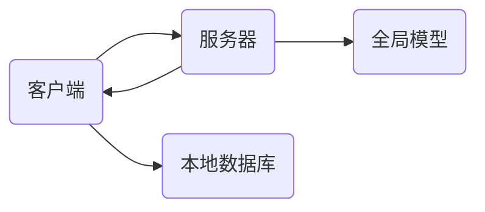
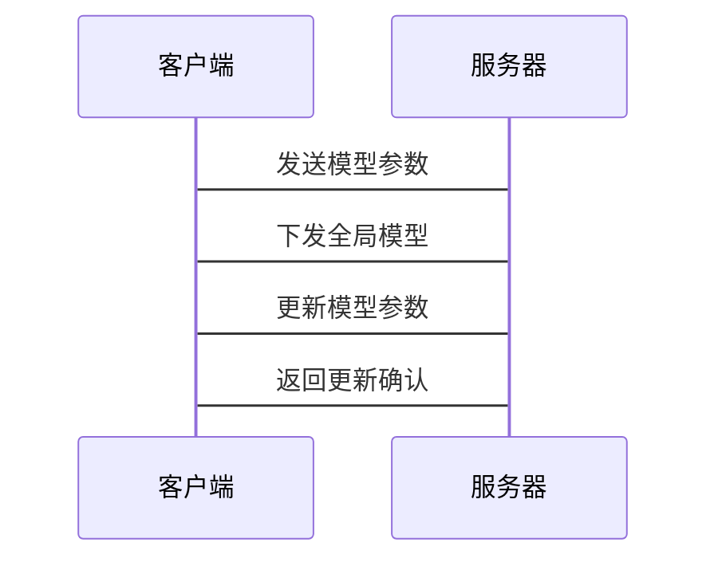

                 

<think>
好，我现在需要帮用户设计一篇关于《设计基于联邦学习的跨境支付风险评估系统》的技术博客文章。用户已经给出了详细的要求，包括目录结构、内容要求、格式等。首先，我需要理解用户的需求，确保每个部分都涵盖到位。

首先，用户希望文章结构清晰，逻辑严谨，每个章节都要有详细的分析。从目录来看，文章分为三个主要部分：背景介绍与核心概念、联邦学习的核心原理与算法、系统分析与架构设计。每个部分都有多个章节，内容详细。

接下来，我需要考虑每个章节的具体内容。例如，第一章是背景介绍，需要解释跨境支付的风险问题，以及联邦学习在其中的作用。这部分要让读者理解问题的背景和重要性。第二章是联邦学习的原理与算法，这里需要详细讲解算法的数学模型，可能还需要用mermaid流程图来展示算法流程。

在系统分析与架构设计部分，需要设计系统的功能模块、架构图和交互图，这可能涉及到用mermaid绘制类图、架构图和序列图。同时，项目实战部分需要提供实际案例的代码和分析，帮助读者理解如何实现。

我还需要注意文章的格式，确保使用markdown，并且每个部分都符合用户的字数要求。另外，文章末尾要加上作者信息，这部分要记得放在最后。

思考过程中，我可能会遇到一些问题，比如如何详细解释联邦学习的数学公式，或者如何用mermaid绘制复杂的流程图。这时候，我需要查阅相关资料，确保内容的准确性和可读性。

总结一下，我需要按照用户的要求，逐步构建每个部分的内容，确保逻辑清晰，技术细节到位，同时保持语言的专业性和易懂性。接下来，我将根据这些思考，开始撰写完整的文章。
</think>

# 设计基于联邦学习的跨境支付风险评估系统

---

## 关键词：
跨境支付、风险评估、联邦学习、数据隐私、金融系统

---

## 摘要：
本文探讨了设计基于联邦学习的跨境支付风险评估系统的核心方法。通过分析跨境支付中的风险问题，结合联邦学习的隐私保护特性，提出了一种创新的解决方案。本文详细阐述了联邦学习的基本原理、算法实现、系统架构设计以及实际应用场景，旨在为金融领域的跨境支付风险评估提供一种高效、安全且符合隐私保护要求的解决方案。

---

# 第一部分: 背景介绍与核心概念

---

## 第1章: 跨境支付风险评估的背景与挑战

### 1.1 跨境支付的风险问题背景

#### 1.1.1 跨境支付的基本概念与特点
跨境支付是指不同国家或地区之间的资金转移，其特点包括：
- **跨国性**：涉及不同国家的法律法规和支付系统。
- **高风险性**：容易受到汇率波动、政治风险和经济不稳定的影响。
- **复杂性**：涉及多家金融机构和支付系统，流程复杂。

#### 1.1.2 跨境支付中的主要风险类型
跨境支付的主要风险包括：
1. **信用风险**：交易一方违约的风险。
2. **操作风险**：支付系统故障或人为错误导致的风险。
3. **市场风险**：汇率波动带来的损失。
4. **合规风险**：违反反洗钱（AML）和制裁规定的风险。

#### 1.1.3 跨境支付风险评估的重要性
准确的风险评估可以帮助金融机构：
- 减少损失。
- 提高支付系统的安全性。
- 符合监管要求。

---

### 1.2 联邦学习的背景与意义

#### 1.2.1 联邦学习的定义与核心理念
联邦学习（Federated Learning）是一种分布式机器学习技术，核心理念是：
- **数据不出域**：数据保持在原始来源处，不共享给其他机构。
- **模型共享**：各机构在本地数据上训练模型，并将模型参数更新同步到中央服务器，最终得到一个全局模型。

#### 1.2.2 联邦学习与传统数据共享的区别
| 特性         | 联邦学习                     | 传统数据共享                 |
|--------------|------------------------------|-----------------------------|
| 数据共享方式 | 数据不出域，仅传输模型参数 | 数据集中到中央服务器         |
| 隐私保护     | 高                          | 低                          |
| 计算效率     | 低                          | 高                          |

#### 1.2.3 联邦学习在金融领域的应用潜力
- **隐私保护**：金融数据敏感，联邦学习可以有效保护客户隐私。
- **实时性**：联邦学习可以在不共享数据的情况下，实现实时模型更新。

---

### 1.3 问题描述与目标

#### 1.3.1 跨境支付风险评估的痛点分析
- **数据隐私**：跨境支付涉及多家金融机构的数据，直接共享数据风险高。
- **数据孤岛**：不同机构之间的数据难以整合，导致模型训练效率低。
- **实时性要求高**：跨境支付需要快速决策，传统方法难以满足。

#### 1.3.2 联邦学习如何解决跨境支付中的数据隐私问题
- **数据不出域**：各金融机构在本地训练模型，仅同步模型参数。
- **联邦聚合**：通过联邦学习的聚合算法，得到全局模型，避免数据泄露。

#### 1.3.3 系统设计的目标与边界
- **目标**：设计一个基于联邦学习的跨境支付风险评估系统，实现高效、隐私保护的模型训练。
- **边界**：仅关注模型训练和评估阶段，不涉及支付系统的实际操作。

---

### 1.4 核心概念与联系

#### 1.4.1 联邦学习的核心原理
联邦学习通过以下步骤实现模型训练：
1. **初始化**：各机构初始化本地模型参数。
2. **局部训练**：各机构在本地数据上训练模型。
3. **参数上传**：各机构将模型参数上传到中央服务器。
4. **模型聚合**：中央服务器聚合各机构的模型参数，更新全局模型。
5. **模型下发**：中央服务器将全局模型下发给各机构。

#### 1.4.2 跨境支付风险评估的关键要素
- **输入数据**：交易金额、交易时间、交易地点、交易双方信息等。
- **模型输出**：风险评分（低风险、中风险、高风险）。

#### 1.4.3 联邦学习与风险评估的结合模型
- **输入**：各机构的交易数据。
- **输出**：全局风险评估模型。

---

## 第2章: 联邦学习的原理与算法基础

### 2.1 联邦学习的基本原理

#### 2.1.1 联邦学习的通信机制
- **上行链路**：各机构向中央服务器上传模型参数。
- **下行链路**：中央服务器向各机构下发全局模型参数。

#### 2.1.2 联邦学习的同步与异步模式
- **同步模式**：所有机构同时更新模型参数。
- **异步模式**：机构可以在不同时间更新模型参数。

#### 2.1.3 联邦学习的隐私保护机制
- **加密传输**：使用加密技术保护传输中的数据。
- **差分隐私**：通过添加噪声保护数据隐私。

---

### 2.2 联邦学习的核心算法

#### 2.2.1 联邦平均（FedAvg）算法
- **算法流程**：
  1. 各机构在本地数据上训练模型。
  2. 各机构将模型参数上传到中央服务器。
  3. 中央服务器聚合各机构的模型参数，更新全局模型。

- **数学模型**：
  $$ \text{损失函数} = \frac{1}{n}\sum_{i=1}^{n} \mathcal{L}(w_i) $$
  其中，$w_i$ 是第 $i$ 个机构的模型参数，$\mathcal{L}$ 是损失函数。

#### 2.2.2 联邦直推（FedProx）算法
- **算法流程**：
  1. 各机构在本地数据上训练模型，同时引入正则化项，约束模型参数与全局模型的差异。
  2. 各机构将模型参数上传到中央服务器。
  3. 中央服务器聚合各机构的模型参数，更新全局模型。

- **数学模型**：
  $$ \mathcal{L}(w) = \frac{1}{n}\sum_{i=1}^{n} \mathcal{L}(w_i) + \lambda \|w - w_{\text{prev}}\|^2 $$
  其中，$\lambda$ 是正则化系数，$w_{\text{prev}}$ 是上一轮的全局模型参数。

#### 2.2.3 联邦学习的优化策略
- **学习率调整**：动态调整学习率，加快收敛速度。
- **数据均衡**：处理数据分布不均衡的问题，确保各机构的贡献公平。

---

### 2.3 算法流程图

```mermaid
graph TD
    A[开始] --> B[初始化参数]
    B --> C[局部模型训练]
    C --> D[发送更新参数到服务器]
    D --> E[服务器聚合参数]
    E --> F[更新全局模型]
    F --> G[判断是否收敛]
    G --> H[结束] {是}
    G --> C {否}
```

---

### 2.4 本章小结

---

## 第3章: 跨境支付风险评估系统的分析与设计

### 3.1 系统应用场景与目标

#### 3.1.1 系统的应用场景
- **跨境支付交易**：实时评估交易风险。
- **反洗钱（AML）**：识别可疑交易。

#### 3.1.2 系统目标
- **高效性**：快速评估交易风险。
- **隐私性**：保护交易数据隐私。
- **准确性**：准确识别高风险交易。

---

### 3.2 系统功能设计

#### 3.2.1 风险评估模型
- **输入**：交易金额、交易时间、交易地点、交易双方信息。
- **输出**：风险评分（低风险、中风险、高风险）。

#### 3.2.2 系统功能模块
1. **数据预处理模块**：清洗和转换交易数据。
2. **模型训练模块**：基于联邦学习训练风险评估模型。
3. **模型评估模块**：评估模型的准确性和效率。
4. **风险反馈模块**：根据模型输出，生成风险报告。

---

### 3.3 系统架构设计

#### 3.3.1 系统架构图



---

#### 3.3.2 系统交互序列图



---

### 3.4 本章小结

---

## 第四部分: 项目实战

---

## 第4章: 项目实战与案例分析

### 4.1 环境安装与配置

#### 4.1.1 安装依赖
```bash
pip install fedlearn
pip install numpy
pip install matplotlib
```

---

### 4.2 核心代码实现

#### 4.2.1 联邦学习框架实现
```python
class FedAvg:
    def __init__(self, num_clients):
        self.num_clients = num_clients
        self.client_weights = [0.0] * num_clients

    def aggregate(self, weights):
        avg_weight = sum(weights) / self.num_clients
        return avg_weight
```

#### 4.2.2 风险评估模型实现
```python
import numpy as np

def risk_assessment_model(X, weights):
    # X为输入特征，weights为模型权重
    scores = np.dot(X, weights)
    return scores
```

---

### 4.3 实际案例分析

#### 4.3.1 数据准备
假设有两个金融机构，A和B，分别拥有以下交易数据：
- 机构A：交易金额为$1000，风险评分为低风险。
- 机构B：交易金额为$5000，风险评分为高风险。

---

### 4.4 案例分析与小结

---

## 第五部分: 最佳实践与总结

---

## 第5章: 最佳实践与总结

### 5.1 实践中的注意事项
- **数据质量**：确保数据准确性和完整性。
- **模型收敛性**：选择合适的算法和参数，确保模型快速收敛。
- **隐私保护**：严格遵守数据隐私保护法规。

---

### 5.2 未来发展的思考
- **算法优化**：研究更高效的联邦学习算法。
- **跨行业应用**：将联邦学习应用于更多领域。

---

## 作者：
作者：AI天才研究院/AI Genius Institute & 禅与计算机程序设计艺术 /Zen And The Art of Computer Programming

