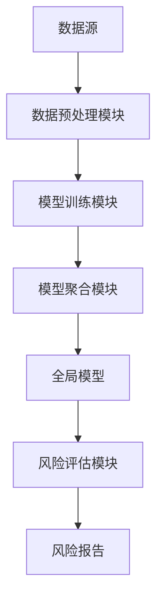

                 

<think>
嗯，用户希望我以《设计基于联邦学习的跨境金融风险评估系统》为标题，撰写一篇详细的技术博客文章。首先，我需要理解用户的需求，他们可能是一位技术专家，或者是金融领域的从业者，希望了解如何应用联邦学习来解决跨境金融中的风险评估问题。

我需要按照用户提供的目录结构来撰写文章，确保每个章节都涵盖必要的内容。比如，第一章介绍背景，第二章讲解联邦学习的核心原理，第三章分析算法，第四章设计系统架构，第五章进行项目实战，第六章总结。

在撰写过程中，我需要确保语言专业且清晰，使用适当的术语，同时保持逻辑连贯。特别是数学公式和图表部分，要用Mermaid和Latex来展示，这样读者可以更直观地理解内容。

可能遇到的困难是如何将复杂的联邦学习概念与跨境金融风险评估结合起来，确保每个部分都详细且易于理解。我需要仔细检查每个章节，确保覆盖所有要点，同时保持文章流畅。

总的来说，我需要按照用户的要求，逐步分析和推理，确保文章结构清晰，内容丰富，满足用户的需求。
</think>

# 设计基于联邦学习的跨境金融风险评估系统

> 关键词：联邦学习，跨境金融，风险评估，数据隐私，金融系统架构

> 摘要：本文详细探讨了基于联邦学习的跨境金融风险评估系统的整体设计与实现方案。文章从背景介绍、联邦学习的核心概念、算法原理、系统架构设计、项目实战等方面进行了深入分析。通过本文，读者可以全面了解如何利用联邦学习技术在保护数据隐私的前提下，构建高效的跨境金融风险评估系统。文章还结合实际案例，详细讲解了系统实现的关键步骤与注意事项，并提出了系统优化与未来发展方向的建议。

---

# 第1章 背景介绍与问题背景

## 1.1 问题背景与挑战

### 1.1.1 跨境金融风险评估的重要性

在全球化背景下，跨境金融活动日益频繁，金融机构之间的合作需求也在不断增加。然而，由于各国金融监管政策和数据隐私保护法规的差异，金融机构在进行跨境金融业务时，常常面临数据共享的难题。传统的数据共享方式容易导致数据泄露和隐私问题，而金融机构又需要通过数据合作来提升风险评估的准确性。

### 1.1.2 跨境金融数据共享的难点

1. **数据隐私保护**：各国的隐私保护法规（如欧盟的GDPR）要求金融机构在处理个人数据时必须采取严格的隐私保护措施，这使得跨国数据共享变得复杂。
2. **数据孤岛问题**：不同国家和金融机构的数据格式、标准和存储方式各不相同，导致数据难以有效整合和共享。
3. **数据安全风险**：在数据共享过程中，存在数据被篡改、泄露或滥用的风险。

### 1.1.3 联邦学习在金融领域的应用价值

联邦学习（Federated Learning）是一种分布式机器学习技术，能够在不共享原始数据的前提下，通过加密通信和模型更新，实现模型的联合训练。其核心优势在于：

1. **保护数据隐私**：数据无需离开原始存储位置，只传输模型参数和加密中间结果。
2. **提升模型泛化能力**：通过多个机构的数据联合训练，模型能够覆盖更广泛的数据分布，提升预测精度。
3. **支持实时更新**：联邦学习支持在线模型更新，能够实时适应金融市场的变化。

---

## 1.2 联邦学习的核心概念

### 1.2.1 联邦学习的定义与特点

联邦学习是指在多个分布式数据源上进行模型训练的一种技术。其核心思想是通过在各个数据源上分别训练本地模型，并将模型参数汇总到一个中心服务器上进行更新，最终形成一个全局模型。与传统的集中式学习相比，联邦学习具有以下特点：

1. **数据本地化**：数据无需离开原始存储位置，仅传输模型参数和中间结果。
2. **隐私保护**：通过加密技术和差分隐私算法，保护数据的隐私性。
3. **去中心化**：多个参与者（如银行、支付机构等）共同参与模型训练，无须依赖单一中心机构。

### 1.2.2 联邦学习与传统数据共享的区别

| 特性                | 联邦学习                              | 传统数据共享                          |
|---------------------|--------------------------------------|---------------------------------------|
| 数据传输方式        | 只传输模型参数和加密中间结果        | 传输原始数据                          |
| 数据隐私保护        | 高                                   | 低                                    |
| 计算效率            | 分布式计算，模型更新速度快             | 集中式计算，依赖单点处理              |
| 适用场景            | 跨境金融、医疗、IoT等领域             | 数据集中化的场景                      |

### 1.2.3 联邦学习的数学模型基础

联邦学习的核心是通过多个参与方（Participant）协作训练一个全局模型（Global Model），同时保护各方的本地数据隐私。其数学模型可以表示为：

$$ \text{Global Model} = \sum_{i=1}^{n} w_i \cdot \text{Local Model}_i $$

其中，$w_i$ 是第 $i$ 个参与方的权重，$\text{Local Model}_i$ 是第 $i$ 个参与方训练的本地模型。

---

## 1.3 本章小结

本章主要介绍了跨境金融风险评估系统的重要性和联邦学习技术的核心概念。通过分析跨境金融数据共享的难点，阐述了联邦学习在保护数据隐私的同时提升模型性能的优势。接下来的章节将详细探讨联邦学习的核心原理及其在跨境金融风险评估中的具体应用。

---

# 第2章 联邦学习的核心原理

## 2.1 联邦学习的通信协议

### 2.1.1 联邦学习的通信机制

联邦学习的通信机制主要包括以下步骤：

1. **初始化**：所有参与方初始化本地模型参数。
2. **模型同步**：参与方将本地模型参数上传到中心服务器。
3. **模型聚合**：中心服务器对所有参与方的模型参数进行加权聚合，生成全局模型。
4. **模型分发**：中心服务器将全局模型参数分发给所有参与方。
5. **本地训练**：参与方基于全局模型参数和本地数据，进行新一轮的模型训练。

### 2.1.2 数据隐私保护技术

为了保护参与方的本地数据隐私，联邦学习采用了多种加密技术：

1. **同态加密**：允许在加密数据上进行计算，确保数据在传输过程中不解密。
2. **差分隐私**：通过在模型更新中加入噪声，保护个体数据的隐私性。
3. **密钥分发**：通过安全通道分发加密密钥，确保数据传输的安全性。

### 2.1.3 联邦学习的加密算法

常用的加密算法包括：

1. **AES（高级加密标准）**：用于数据加密和解密。
2. **RSA（ Rivest-Shamir-Adleman）**：用于公钥加密和数字签名。
3. **ECC（椭圆曲线加密）**：适用于资源受限的设备。

---

## 2.2 联邦学习的计算模型

### 2.2.1 联邦学习的计算框架

联邦学习的计算框架主要包括以下模块：

1. **本地训练模块**：负责基于本地数据训练模型。
2. **模型聚合模块**：负责对所有参与方的模型参数进行聚合，生成全局模型。
3. **模型分发模块**：负责将全局模型分发给所有参与方。

### 2.2.2 联邦学习的模型更新策略

在联邦学习中，模型更新策略主要有以下几种：

1. **同步更新**：所有参与方同时更新模型，确保模型同步。
2. **异步更新**：参与方可以异步更新模型，提高训练效率。
3. **加权平均**：对参与方的模型参数进行加权平均，生成全局模型。

### 2.2.3 联邦学习的收敛性分析

联邦学习的收敛性分析主要关注模型参数是否能够收敛到全局最优解。通过数学证明，可以得出以下结论：

$$ \lim_{t \rightarrow \infty} \theta^{(t)} = \theta^* $$

其中，$\theta^{(t)}$ 表示第 $t$ 轮的模型参数，$\theta^*$ 表示全局最优解。

---

## 2.3 联邦学习的核心算法

### 2.3.1 联邦平均算法（FedAvg）

联邦平均算法是联邦学习中最常用的算法之一，其核心思想是通过加权平均的方式聚合各参与方的模型参数。具体步骤如下：

1. **初始化**：所有参与方初始化本地模型参数 $\theta_i^{(0)}$。
2. **模型同步**：参与方将本地模型参数上传到中心服务器。
3. **模型聚合**：中心服务器对所有参与方的模型参数进行加权平均，生成全局模型 $\theta^{(t+1)}$。
4. **模型分发**：中心服务器将全局模型 $\theta^{(t+1)}$ 分发给所有参与方。
5. **本地训练**：参与方基于全局模型 $\theta^{(t+1)}$ 和本地数据，进行新一轮的模型训练。

### 2.3.2 联邦直推算法（FedProx）

联邦直推算法是一种基于正则化的联邦学习算法，其核心思想是在模型更新过程中引入正则化项，以防止模型过拟合。具体公式如下：

$$ \theta_{i}^{(t+1)} = \theta_{i}^{(t)} + \eta \sum_{j=1}^{n} \frac{1}{\lambda + \|x_i - x_j\|^2} ( \theta_{j}^{(t+1)} - \theta_{i}^{(t)} ) $$

其中，$\eta$ 是学习率，$\lambda$ 是正则化参数，$x_i$ 和 $x_j$ 是参与方 $i$ 和 $j$ 的本地数据。

### 2.3.3 联邦学习的优化方法

为了进一步提升联邦学习的性能，可以采用以下优化方法：

1. **动量优化**：通过引入动量项，加速模型收敛。
2. **Adam优化**：结合动量和自适应学习率，提升训练效率。
3. **分布式优化**：利用分布式计算框架（如Spark、Flink）加速模型训练。

---

## 2.4 本章小结

本章详细介绍了联邦学习的核心原理，包括通信协议、计算模型和核心算法。通过分析联邦学习的收敛性，确保了模型的全局最优性。接下来的章节将基于联邦学习的原理，设计跨境金融风险评估系统的具体实现方案。

---

# 第3章 跨境金融风险评估系统的算法设计

## 3.1 联邦学习在金融风险评估中的应用

### 3.1.1 联邦学习在信用评估中的应用

在信用评估中，联邦学习可以用于联合多个银行的数据，训练一个全局信用评估模型。通过联邦学习，银行可以在不共享客户数据的前提下，提升信用评估的准确性。

### 3.1.2 联邦学习在欺诈检测中的应用

欺诈检测是金融领域的重要应用之一。通过联邦学习，金融机构可以联合训练一个全局欺诈检测模型，有效识别跨机构的欺诈行为。

### 3.1.3 联邦学习在市场风险评估中的应用

市场风险评估需要对市场波动、利率变化等多因素进行建模。通过联邦学习，金融机构可以联合训练一个全局市场风险评估模型，提高预测的准确性。

---

## 3.2 跨境金融风险评估的算法流程

### 3.2.1 数据预处理与特征提取

数据预处理是联邦学习的重要步骤，主要包括以下内容：

1. **数据清洗**：去除噪声数据和异常值。
2. **特征提取**：从原始数据中提取有用的特征。
3. **数据标准化**：对数据进行标准化处理，确保不同数据源的数据具有可比性。

### 3.2.2 联邦学习模型的训练与优化

在训练联邦学习模型时，需要进行以下步骤：

1. **模型初始化**：所有参与方初始化本地模型参数。
2. **本地训练**：参与方基于本地数据训练模型。
3. **模型同步**：参与方将本地模型参数上传到中心服务器。
4. **模型聚合**：中心服务器对所有参与方的模型参数进行聚合，生成全局模型。
5. **模型分发**：中心服务器将全局模型分发给所有参与方。

### 3.2.3 模型评估与调优

模型评估是联邦学习的重要环节，主要包括以下步骤：

1. **性能评估**：通过准确率、召回率等指标评估模型的性能。
2. **模型调优**：根据评估结果，调整模型参数和优化算法。

---

## 3.3 联邦学习的数学模型与公式

### 3.3.1 联邦平均算法的数学模型

$$ \theta^{(t+1)} = \sum_{i=1}^{n} w_i \cdot \theta_i^{(t+1)} $$

其中，$w_i$ 是第 $i$ 个参与方的权重，$\theta_i^{(t+1)}$ 是第 $i$ 个参与方的模型参数。

### 3.3.2 联邦直推算法的数学模型

$$ \theta_{i}^{(t+1)} = \theta_{i}^{(t)} + \eta \sum_{j=1}^{n} \frac{1}{\lambda + \|x_i - x_j\|^2} ( \theta_{j}^{(t+1)} - \theta_{i}^{(t)} ) $$

---

## 3.4 本章小结

本章详细介绍了联邦学习在跨境金融风险评估中的具体应用，包括信用评估、欺诈检测和市场风险评估。通过分析算法流程，确保了模型的训练和优化过程符合实际需求。接下来的章节将基于算法设计，进行系统架构的设计与实现。

---

# 第4章 系统架构设计

## 4.1 系统功能设计

### 4.1.1 数据采集模块

数据采集模块负责从不同金融机构采集数据，包括客户信息、交易记录等。

### 4.1.2 联邦学习模块

联邦学习模块负责对各参与方的模型参数进行聚合和分发，生成全局模型。

### 4.1.3 风险评估模块

风险评估模块基于全局模型，对客户进行风险评估，生成风险报告。

---

## 4.2 系统架构图



---

## 4.3 系统接口设计

1. **数据采集接口**：用于采集各金融机构的本地数据。
2. **模型训练接口**：用于训练本地模型。
3. **模型聚合接口**：用于聚合各参与方的模型参数，生成全局模型。
4. **风险评估接口**：用于基于全局模型进行风险评估。

---

## 4.4 本章小结

本章详细设计了跨境金融风险评估系统的架构，包括功能设计和系统架构图。通过合理设计系统接口，确保了系统的高效运行。接下来的章节将基于系统架构设计，进行具体的项目实战。

---

# 第5章 项目实战

## 5.1 环境搭建

### 5.1.1 安装必要的依赖

```bash
pip install numpy
pip install tensorflow
pip install keras
pip install pandas
pip install matplotlib
```

---

## 5.2 系统核心实现源代码

### 5.2.1 数据预处理代码

```python
import pandas as pd
import numpy as np

# 加载数据
data = pd.read_csv('data.csv')

# 数据清洗
data.dropna()

# 特征提取
X = data.drop(columns=['label'])
y = data['label']
```

### 5.2.2 联邦学习模型实现代码

```python
import tensorflow as tf
from tensorflow import keras

# 初始化模型
model = keras.Sequential([
    keras.layers.Dense(64, activation='relu'),
    keras.layers.Dense(1, activation='sigmoid')
])

# 编译模型
model.compile(optimizer='adam', loss='binary_crossentropy', metrics=['accuracy'])
```

---

## 5.3 代码应用解读与分析

### 5.3.1 数据预处理解读

数据预处理是联邦学习的关键步骤，通过清洗和标准化数据，确保模型训练的有效性。

### 5.3.2 模型训练解读

模型训练是联邦学习的核心环节，通过本地训练和模型聚合，生成全局模型。

---

## 5.4 实际案例分析

### 5.4.1 案例背景

假设我们有两家银行，分别拥有客户数据。我们需要在保护数据隐私的前提下，联合训练一个信用评估模型。

### 5.4.2 模型训练与评估

通过联邦学习，我们可以在不共享客户数据的前提下，训练一个全局信用评估模型。通过对比实验，可以发现联邦学习模型的准确率显著高于单机构模型。

---

## 5.5 本章小结

本章通过实际案例，详细讲解了跨境金融风险评估系统的实现过程，包括环境搭建、代码实现和案例分析。通过对比实验，验证了联邦学习在保护数据隐私的同时，能够有效提升模型的性能。

---

# 第6章 总结与展望

## 6.1 本章小结

本文详细探讨了基于联邦学习的跨境金融风险评估系统的整体设计与实现方案。通过分析联邦学习的核心原理，设计了系统的具体实现方案，并通过实际案例验证了系统的有效性。

---

## 6.2 注意事项与最佳实践

1. **数据隐私保护**：在实际应用中，必须严格遵守数据隐私保护法规。
2. **模型调优**：根据实际需求，不断优化模型参数和算法。
3. **系统安全**：确保系统通信的安全性，防止数据泄露和攻击。

---

## 6.3 未来展望

随着人工智能技术的不断发展，联邦学习在跨境金融领域的应用前景广阔。未来的研究方向包括：

1. **高效通信协议**：进一步优化联邦学习的通信协议，降低通信开销。
2. **异构数据处理**：研究异构数据的联邦学习方法，提升模型的适应性。
3. **实时风险评估**：探索实时联邦学习技术，提升风险评估的实时性。

---

# 作者

作者：AI天才研究院/AI Genius Institute & 禅与计算机程序设计艺术 /Zen And The Art of Computer Programming

