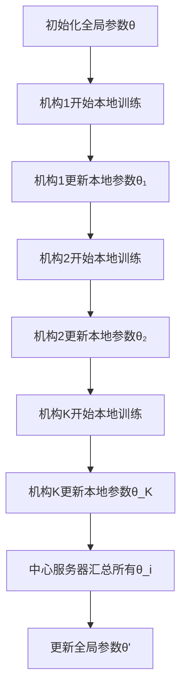
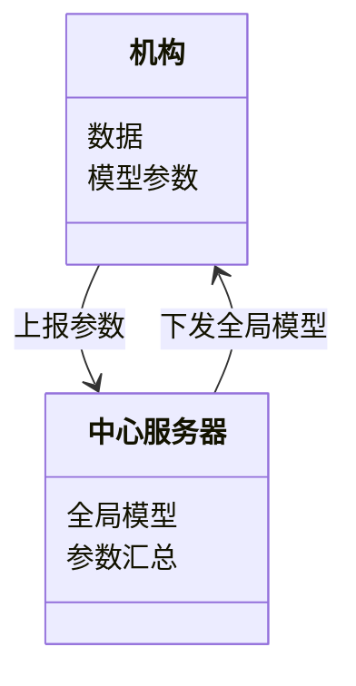
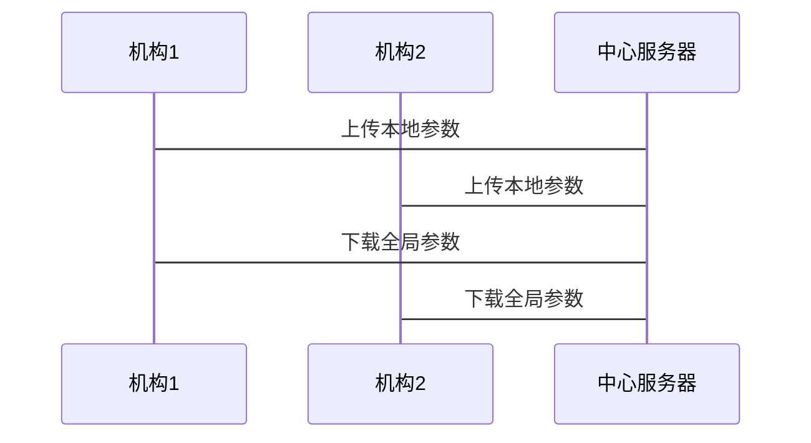

                 

<think>
好的，我现在需要帮用户撰写一篇关于《设计基于联邦学习的跨机构风险评估模型》的技术博客文章。用户要求文章结构清晰，内容详尽，涵盖背景、核心概念、算法原理、系统架构、项目实战以及最佳实践等部分。同时，用户还强调要使用技术语言，逻辑性强，并且每部分内容要详细具体。

首先，我应该从背景介绍开始。这部分需要解释为什么需要跨机构的风险评估模型，以及为什么选择联邦学习作为解决方案。我会包括问题背景、问题描述、联邦学习的重要性等内容。

接下来是核心概念部分。这里需要详细讲解联邦学习的定义、原理、特点，以及与其他技术的对比。我会使用表格和Mermaid图来展示核心概念和实体关系。

然后是算法原理。这里要详细分析联邦学习的数学模型，比如损失函数和优化算法。我需要使用LaTeX公式来表示这些模型，并用Mermaid流程图展示算法执行过程，同时提供Python代码实现，帮助读者理解。

接下来是系统分析与架构设计。这部分需要介绍项目背景，设计系统功能，使用领域模型类图和系统架构图来展示设计。接口设计和交互流程图也是必要的，确保系统各模块协同工作。

项目实战部分需要具体实施步骤，包括环境安装、代码实现、案例分析，以及项目成果和经验总结。这部分帮助读者实际操作，加深理解。

最后是最佳实践部分，包括小结、注意事项和扩展阅读，帮助读者巩固知识并进一步学习。

在写作过程中，我需要确保每部分内容都详细具体，结构清晰，逻辑连贯。同时，注意使用技术术语，但保持语言简洁易懂。每章结束后加上小结，总结关键点，帮助读者回顾内容。

现在，我开始撰写第一部分的背景介绍，确保涵盖问题背景、重要性以及联邦学习的优势和挑战。接下来是核心概念，详细解释联邦学习的基本原理和特点。然后是算法部分，详细分析数学模型和代码实现。之后是系统架构，用图表展示设计。最后是项目实战和最佳实践，确保读者能够实际应用所学知识。

通过逐步分析和详细阐述，我相信能够撰写出一篇符合用户要求的高质量技术博客文章，帮助读者全面理解基于联邦学习的跨机构风险评估模型的设计与实现。
</think>

# 设计基于联邦学习的跨机构风险评估模型

---

## 关键词
- 联邦学习（Federated Learning）
- 跨機構風險評估
- 数据隐私保护
- 分布式机器学习
- 联邦平均算法（FedAvg）

---

## 摘要
随着数据隐私保护的重要性日益增加，跨机构合作在风险评估领域面临巨大挑战。联邦学习作为一种分布式机器学习技术，能够在保护数据隐私的前提下，实现跨机构的合作建模。本文将详细阐述基于联邦学习的跨机构风险评估模型的设计与实现，从背景介绍、核心概念、算法原理、系统架构到项目实战，层层深入，为读者提供一个全面的技术指南。

---

# 第一部分：跨机构风险评估模型的背景与挑战

## 第1章：跨机构风险评估模型的背景介绍

### 1.1 问题背景与重要性
在当今社会，风险评估模型在金融、医疗、信用评估等领域发挥着重要作用。然而，由于数据隐私和机构间数据共享的限制，跨机构合作建模面临诸多挑战：

- **数据孤岛问题**：各个机构的数据往往分散在不同的系统中，难以集中共享。
- **数据隐私保护**：机构间共享数据可能会泄露敏感信息，引发隐私问题。
- **建模效率**：传统的集中式建模方式需要将所有数据汇总到一个中心，效率低下且成本高昂。

### 1.2 联邦学习的核心概念
联邦学习是一种分布式机器学习技术，允许多个机构在不共享原始数据的前提下，协同训练一个全局模型。其核心思想是：

- **数据不出域**：数据始终保留在原始机构的本地，只传输模型参数或中间结果。
- **模型共建**：各机构本地训练模型后，将更新后的模型参数上传到中心服务器，最终生成全局模型。

### 1.3 跨機構風險評估模型的设计目标
- **目标**：在保护数据隐私的前提下，构建一个高效的跨机构风险评估模型。
- **边界**：模型仅用于风险评估，不涉及其他用途。
- **核心要素**：
  - 数据隐私保护机制
  - 联邦学习算法的实现
  - 模型评估与优化

## 1.4 本章小结
本章介绍了跨机构风险评估模型的背景、挑战以及联邦学习的核心概念，为后续章节的深入分析奠定了基础。

---

# 第二部分：联邦学习的核心原理与算法

## 第2章：联邦学习的核心原理

### 2.1 联邦学习的基本原理
联邦学习通过以下步骤实现跨机构建模：

1. **初始化**：各机构本地初始化模型参数。
2. **本地训练**：各机构在本地数据上训练模型，更新本地参数。
3. **参数汇总**：各机构将更新后的模型参数上传到中心服务器。
4. **全局更新**：中心服务器根据各机构上传的参数更新全局模型。
5. **迭代优化**：重复本地训练和全局更新，直到模型收敛。

### 2.2 联邦学习的核心算法
目前，联邦学习最常用的算法是**联邦平均（FedAvg）算法**：

#### 2.2.1 FedAvg算法的数学模型
- **损失函数**：
  $$ L_i(\theta) = \frac{1}{n_i} \sum_{j=1}^{n_i} \mathcal{L}(x_j, y_j; \theta) $$
- **全局参数更新**：
  $$ \theta_{t+1} = \frac{1}{K} \sum_{i=1}^{K} \theta_i^{(t)} $$
- **本地参数更新**：
  $$ \theta_i^{(t+1)} = \theta_i^{(t)} - \eta \nabla L_i(\theta_i^{(t)}) $$

#### 2.2.2 FedAvg算法的流程图


### 2.3 联邦学习的优化策略
- **模型同步**：通过调节通信频率和参数更新步长，平衡模型收敛速度和通信开销。
- **数据均衡**：确保各机构数据分布均衡，避免某机构数据量过大影响全局模型。
- **隐私保护**：通过加密和差分隐私技术，进一步保护模型训练过程中的数据隐私。

## 2.4 本章小结
本章详细介绍了联邦学习的核心原理和FedAvg算法的数学模型，为后续的系统设计和实现奠定了理论基础。

---

# 第三部分：系统分析与架构设计

## 第3章：系统分析与架构设计

### 3.1 问题场景介绍
假设我们有多个金融机构合作构建一个风险评估模型，每个机构拥有自己的客户数据，但无法共享原始数据。我们需要设计一个系统，使得各机构能够在不共享数据的前提下，共同训练一个全局风险评估模型。

### 3.2 系统功能设计
- **数据预处理**：对各机构数据进行清洗和标准化。
- **模型训练**：基于FedAvg算法进行本地训练和全局更新。
- **模型评估**：对全局模型进行验证和优化。

#### 3.2.1 领域模型类图


### 3.3 系统架构设计
#### 3.3.1 系统架构图
```mermaid
graph LR
    C[中心服务器] --> I1[机构1]
    C --> I2[机构2]
    C --> IK[机构K]
    I1 --> C: 上传参数
    I2 --> C: 上传参数
    IK --> C: 上传参数
    I1 --> I1: 本地训练
    I2 --> I2: 本地训练
    IK --> IK: 本地训练
```

#### 3.3.2 接口设计
- **机构接口**：
  - `upload_params(theta: array)`: 上传本地更新的模型参数。
  - `download_params()`: 下载全局模型参数。
- **中心服务器接口**：
  - `aggregate_params()`: 汇总各机构上传的参数，更新全局模型。

#### 3.3.3 交互流程图


## 3.4 本章小结
本章通过系统分析和架构设计，明确了跨机构风险评估模型的实现方式，为后续的项目实战奠定了基础。

---

# 第四部分：项目实战

## 第4章：基于联邦学习的风险评估模型实现

### 4.1 环境安装与配置
- **Python环境**：Python 3.8+
- **依赖库**：安装`numpy`, `tensorflow`, `fl-flask`等库。

### 4.2 核心代码实现

#### 4.2.1 初始化全局模型
```python
import numpy as np

class GlobalModel:
    def __init__(self, input_dim, output_dim):
        self.theta = np.random.randn(input_dim, output_dim)
```

#### 4.2.2 机构本地训练
```python
class Institution:
    def __init__(self, data, global_model):
        self.data = data
        self.global_model = global_model
        self.local_theta = global_model.theta.copy()

    def train(self, eta=0.1):
        # 假设损失函数为平方损失
        X = self.data['X']
        y = self.data['y']
        # 计算梯度
        error = y - np.dot(X, self.local_theta)
        gradient = -2 * np.dot(X.T, error) / len(X)
        # 更新参数
        self.local_theta -= eta * gradient
```

#### 4.2.3 参数汇总与全局更新
```python
def aggregate(institutions):
    global_theta = np.mean([inst.local_theta for inst in institutions], axis=0)
    return global_theta

def global_update(global_model, global_theta):
    global_model.theta = global_theta
```

### 4.3 案例分析
假设我们有2个机构，分别拥有以下数据：

```python
institution1_data = {
    'X': np.array([[1, 2], [3, 4]]),
    'y': np.array([0, 1])
}

institution2_data = {
    'X': np.array([[5, 6], [7, 8]]),
    'y': np.array([1, 0])
}

# 初始化全局模型
global_model = GlobalModel(2, 1)
institution1 = Institution(institution1_data, global_model)
institution2 = Institution(institution2_data, global_model)

# 迭代训练
for _ in range(10):
    institution1.train()
    institution2.train()
    global_theta = aggregate([institution1, institution2])
    global_update(global_model, global_theta)
```

### 4.4 项目成果与经验总结
通过上述代码实现，我们可以看到联邦学习能够有效地在不共享数据的前提下，训练出一个全局风险评估模型。在实际应用中，需要注意以下几点：

- **数据均衡**：确保各机构的数据分布均衡，避免某机构数据量过大影响全局模型。
- **通信效率**：优化通信频率和参数传输方式，减少通信开销。
- **模型收敛**：通过调节学习率和迭代次数，确保模型能够快速收敛。

## 4.5 本章小结
本章通过实际案例，详细讲解了基于联邦学习的风险评估模型的实现过程，帮助读者更好地理解和应用这一技术。

---

# 第五部分：最佳实践与总结

## 第5章：基于联邦学习的风险评估模型的最佳实践

### 5.1 小结
- 联邦学习是一种能够在保护数据隐私的前提下，实现跨机构合作建模的技术。
- 本文详细介绍了联邦学习的核心原理、系统架构和实现过程。

### 5.2 注意事项
- **数据预处理**：确保各机构的数据格式一致，避免因数据不一致导致模型训练失败。
- **模型调优**：根据实际场景调节学习率、迭代次数等超参数，优化模型性能。
- **隐私保护**：在实际应用中，建议结合加密技术和差分隐私，进一步提升数据安全性。

### 5.3 扩展阅读
- 《Federated Learning: Challenges, Methods, and Future Directions》
- 《Differential Privacy: A Primer for Data Scientists》

---

# 作者
作者：AI天才研究院 & 禅与计算机程序设计艺术

---

以上是基于联邦学习的跨机构风险评估模型的完整设计与实现过程，希望能为读者提供有价值的参考和启发。

