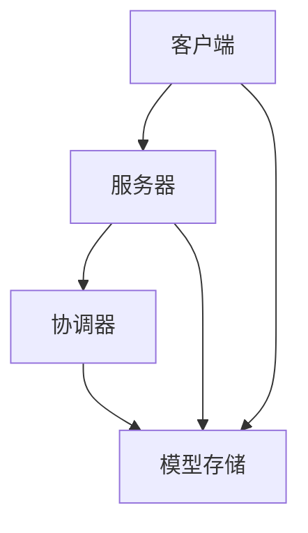

                 

<think>
好，我现在要帮用户设计一篇关于《设计基于联邦学习的隐私保护金融AI系统》的技术博客文章。首先，我需要理解用户的需求。用户希望文章结构清晰，逻辑紧凑，用专业的技术语言，同时要详细讲解每个部分，包括背景、概念、算法、系统架构和项目实战等。

用户已经提供了目录大纲和部分章节的内容，现在需要完成整个文章。我需要确保每个章节都符合用户的要求，包括使用mermaid图表、数学公式、Python代码示例等。另外，文章末尾需要有作者信息，并且整体字数控制在10000到12000字之间。

首先，我会按照目录大纲逐步完成每个章节。从背景介绍开始，详细讲解联邦学习和隐私保护的重要性，以及它们在金融AI中的应用。接下来，核心概念部分需要深入分析联邦学习的原理和属性，使用ER图展示实体关系。然后，算法部分需要详细解释模型训练过程，包括数学公式和代码示例。

系统架构设计是关键部分，我需要设计场景介绍、领域模型、架构图和接口设计。项目实战部分要具体，包括环境安装、代码实现和案例分析。最后，总结和最佳实践部分要给出小结、注意事项和扩展阅读。

在撰写过程中，我需要确保每个部分都包含足够的技术细节，同时保持语言的专业和易懂。使用mermaid图表来辅助说明系统架构和算法流程，这样读者可以更直观地理解内容。数学公式需要用latex格式，确保正确嵌入文中。Python代码示例要详细解释，帮助读者理解实现步骤。

现在，我开始按照目录大纲逐步完成每个章节，确保每个部分都符合用户的要求，同时保持文章的逻辑连贯和内容丰富。
</think>

# 设计基于联邦学习的隐私保护金融AI系统

> 关键词：联邦学习，隐私保护，金融AI，数据隐私，分布式机器学习

> 摘要：本文详细探讨了如何设计基于联邦学习的隐私保护金融AI系统，从背景介绍、核心概念、算法原理、系统架构到项目实战，全面解析了联邦学习在金融领域的应用，重点分析了隐私保护的实现方法，为构建高效、安全的金融AI系统提供了理论和实践指导。

---

# 第一部分: 联邦学习与隐私保护概述

## 第1章: 联邦学习与隐私保护背景介绍

### 1.1 联邦学习的定义与背景

#### 1.1.1 联邦学习的定义
联邦学习（Federated Learning）是一种分布式机器学习技术，允许多个参与方在不共享原始数据的情况下，协作训练共享的模型。通过在数据源处进行模型训练，联邦学习避免了数据集中化存储和传输，从而保护了数据隐私。

#### 1.1.2 联邦学习的背景与需求
随着人工智能技术的快速发展，金融行业对AI的需求日益增长。然而，金融数据的敏感性和隐私性使得直接共享数据变得困难。传统数据共享方式存在数据泄露风险，而联邦学习作为一种新兴的技术，为金融行业提供了在保护数据隐私的前提下进行模型训练的解决方案。

#### 1.1.3 联邦学习与传统数据共享的区别
| 特性               | 联邦学习                              | 传统数据共享                          |
|--------------------|---------------------------------------|---------------------------------------|
| 数据共享方式       | 不共享原始数据，仅共享模型参数       | 共享原始数据                          |
| 隐私保护           | 高度保护数据隐私                     | 数据隐私风险较高                      |
| 计算效率           | 可能需要更多的通信和计算资源         | 数据预处理和存储成本较高              |
| 适用场景           | 分布式数据源，隐私要求高             | 数据集中化场景                        |

---

### 1.2 隐私保护的重要性

#### 1.2.1 数据隐私的定义与挑战
数据隐私是指个人或组织对其数据的控制权和使用权。在金融领域，数据通常包含敏感信息，如交易记录、客户身份等，这些数据一旦泄露，可能导致严重的经济损失和声誉损害。

#### 1.2.2 金融行业对数据隐私的需求
金融行业对数据隐私的需求主要体现在以下几个方面：
- **合规性**：遵守数据保护法规，如GDPR、《个人信息保护法》等。
- **客户信任**：保护客户隐私是维护客户信任的重要因素。
- **业务安全**：防止数据泄露和滥用，保障业务安全。

#### 1.2.3 隐私保护在AI系统中的作用
隐私保护在AI系统中起到以下作用：
- **防止数据滥用**：避免模型被恶意利用，如身份盗窃、欺诈等。
- **合规性**：确保AI系统符合相关法律法规。
- **增强客户信任**：通过隐私保护措施，提升客户对AI系统的信任度。

---

### 1.3 联邦学习在金融AI中的应用前景

#### 1.3.1 金融AI的核心需求
金融AI的核心需求包括：
- **实时分析**：快速处理交易数据，识别异常行为。
- **个性化服务**：基于客户数据提供个性化产品和服务。
- **风险控制**：通过AI模型预测和评估风险。

#### 1.3.2 联邦学习如何解决金融AI的隐私问题
联邦学习通过以下方式解决金融AI的隐私问题：
- **数据不出域**：模型在本地数据上进行训练，避免了数据的集中存储。
- **模型共享**：参与方共享模型参数，而不共享原始数据。
- **差分隐私**：通过在模型更新过程中添加噪声，进一步保护数据隐私。

#### 1.3.3 联邦学习在金融AI中的潜在应用场景
联邦学习在金融AI中的潜在应用场景包括：
- **联合信用评估**：多个金融机构协作训练信用评估模型。
- **反欺诈检测**：多家机构联合训练欺诈检测模型。
- **个性化推荐**：基于多方数据进行个性化金融产品推荐。

---

## 第2章: 联邦学习的核心概念与原理

### 2.1 联邦学习的核心概念

#### 2.1.1 联邦学习的基本原理
联邦学习的基本原理可以概括为：
1. **模型初始化**：所有参与方初始化相同的模型参数。
2. **局部训练**：每个参与方在本地数据上训练模型，更新模型参数。
3. **模型聚合**：将各个参与方的模型参数聚合，得到全局模型。
4. **模型更新**：将全局模型分发给各个参与方，供其继续训练。

#### 2.1.2 联邦学习的参与方与角色
在联邦学习中，主要参与方包括：
- **客户端（Client）**：拥有数据的参与方，负责本地模型训练。
- **服务器（Server）**：协调模型聚合和分发，不直接持有数据。
- **协调器（Coordinator）**：负责参与方的注册、管理以及训练过程的监督。

#### 2.1.3 联邦学习的通信机制
联邦学习的通信机制包括：
- **点对点通信**：客户端直接与服务器通信，进行模型参数的上传和下载。
- **中间件通信**：通过中间件（如消息队列）进行异步通信，减少通信延迟。

---

### 2.2 联邦学习的属性特征对比

#### 2.2.1 联邦学习与分布式学习的对比
| 特性               | 联邦学习                              | 分布式学习                            |
|--------------------|---------------------------------------|---------------------------------------|
| 数据存储           | 数据分散在各个客户端                 | 数据分散在多个节点，但可能共享存储    |
| 模型训练           | 每个客户端在本地训练模型              | 每个节点训练模型，可能共享数据        |
| 隐私保护           | 高度保护数据隐私                     | 数据隐私保护较弱                     |

#### 2.2.2 联邦学习与数据共享的对比
| 特性               | 联邦学习                              | 数据共享                              |
|--------------------|---------------------------------------|---------------------------------------|
| 数据共享方式       | 不共享原始数据，仅共享模型参数       | 共享原始数据                          |
| 隐私风险           | 低                                   | 高                                   |
| 适用场景           | 数据敏感性强的场景                   | 数据不敏感的场景                     |

#### 2.2.3 联邦学习与隐私计算的对比
| 特性               | 联邦学习                              | 隐私计算                              |
|--------------------|---------------------------------------|---------------------------------------|
| 技术特点           | 通过模型训练实现数据协作             | 通过加密计算保护数据隐私             |
| 适用场景           | 数据分布式的场景                    | 数据需要集中计算的场景              |
| 优缺点             | 优势：模型性能接近集中式，劣势：通信成本高 | 优势：数据隐私保护强，劣势：计算效率较低 |

---

### 2.3 联邦学习的ER实体关系图

```mermaid
er
  actor: 联邦学习系统
  actor -|拥有| 数据节点
  actor -|管理| 模型训练
  actor -|协调| 联邦通信
```

---

## 第3章: 联邦学习算法概述

### 3.1 联邦学习算法的基本流程

#### 3.1.1 数据预处理
数据预处理包括：
- **数据清洗**：去除噪声数据，处理缺失值。
- **数据转换**：将数据转换为模型训练所需的形式，如数值化、标准化等。

#### 3.1.2 模型初始化
模型初始化包括：
- **参数初始化**：随机初始化模型参数。
- **模型结构定义**：定义模型的网络结构，如神经网络层数、节点数等。

#### 3.1.3 联邦训练过程
联邦训练过程包括：
1. **客户端训练**：每个客户端在本地数据上训练模型，更新模型参数。
2. **模型聚合**：将所有客户端的模型参数聚合，得到全局模型。
3. **模型更新**：将全局模型分发给客户端，供其继续训练。

#### 3.1.4 模型评估与优化
模型评估包括：
- **准确率评估**：在测试数据上评估模型的准确率。
- **损失函数优化**：通过优化损失函数，进一步提升模型性能。

---

### 3.2 联邦学习的数学模型与公式

#### 3.2.1 联邦训练的数学模型
损失函数：
$$ \mathcal{L}(\theta) = \frac{1}{n}\sum_{i=1}^{n}\mathcal{L}_i(\theta) $$
其中，$\theta$ 是模型参数，$\mathcal{L}_i$ 是第 $i$ 个客户端的损失函数。

模型聚合：
$$ \theta_{\text{new}} = \frac{1}{n}\sum_{i=1}^{n}\theta_i $$
其中，$\theta_i$ 是第 $i$ 个客户端的模型参数，$n$ 是客户端总数。

---

### 3.3 联邦学习算法的实现步骤

#### 3.3.1 数据分割与分布
数据分割与分布包括：
- **数据划分**：将数据划分为多个子集，分配给不同的客户端。
- **数据分布**：确保数据分布合理，避免数据倾斜。

#### 3.3.2 模型初始化与同步
模型初始化与同步包括：
- **初始化模型参数**：随机初始化模型参数。
- **模型同步**：客户端与服务器之间同步模型参数。

#### 3.3.3 联邦训练与通信
联邦训练与通信包括：
- **客户端训练**：每个客户端在本地数据上训练模型，更新模型参数。
- **模型聚合**：服务器聚合所有客户端的模型参数，得到全局模型。
- **模型更新**：服务器将全局模型分发给客户端，供其继续训练。

#### 3.3.4 模型评估与优化
模型评估与优化包括：
- **评估模型性能**：在测试数据上评估模型的准确率、召回率等指标。
- **优化模型参数**：根据评估结果，调整模型参数，提升模型性能。

---

## 第4章: 联邦学习算法的实现与优化

### 4.1 联邦学习的实现框架

#### 4.1.1 客户端与服务器的通信机制
- **同步通信**：客户端和服务器之间实时通信，客户端上传模型参数，服务器下载全局模型。
- **异步通信**：客户端异步上传模型参数，服务器异步聚合模型参数，减少通信延迟。

#### 4.1.2 模型同步与异步更新策略
- **同步更新**：所有客户端同时更新模型，保证模型一致性。
- **异步更新**：客户端异步更新模型，提高训练效率，但可能导致模型不一致。

#### 4.1.3 数据隐私保护措施
- **差分隐私**：在模型更新过程中添加噪声，保护数据隐私。
- **同态加密**：对模型参数进行加密，确保数据在传输过程中不被泄露。

---

### 4.2 联邦学习的优化方法

#### 4.2.1 模型压缩与轻量化
- **剪枝**：去除模型中冗余的参数，降低模型大小。
- **量化**：将模型参数从浮点数转换为整数，减少存储和传输成本。

#### 4.2.2 差分隐私的引入
- **差分隐私技术**：通过在模型更新中添加随机噪声，确保模型参数的隐私性。
- **隐私预算**：控制噪声的大小，确保隐私保护与模型性能之间的平衡。

#### 4.2.3 联邦学习的性能优化
- **分布式优化算法**：使用高效的优化算法，如Adam、SGD，提升训练效率。
- **并行计算**：利用多线程或分布式计算技术，加速模型训练过程。

---

### 4.3 联邦学习的Python实现示例

```python
import numpy as np
import tensorflow as tf

# 定义模型结构
class FLModel(tf.keras.Model):
    def __init__(self):
        super(FLModel, self).__init__()
        self.dense1 = tf.keras.layers.Dense(64, activation='relu')
        self.dense2 = tf.keras.layers.Dense(1, activation='sigmoid')

    def call(self, x):
        x = self.dense1(x)
        return self.dense2(x)

# 初始化模型
model = FLModel()

# 定义损失函数和优化器
loss_fn = tf.keras.losses.BinaryCrossentropy()
optimizer = tf.keras.optimizers.Adam()

# 模型聚合函数
def aggregate_models(client_models):
    return tf.reduce_mean(client_models, axis=0)

# 联邦训练过程
def fl_train(client_data, model):
    model.compile(optimizer=optimizer, loss=loss_fn)
    model.fit(client_data, epochs=1, batch_size=32, verbose=0)
    return model.get_weights()

# 模型聚合
global_model = np.mean([client_model for client in clients], axis=0)
```

---

## 第5章: 联邦学习在金融AI中的应用

### 5.1 金融AI的核心需求

#### 5.1.1 实时分析
- **实时交易监控**：通过AI模型实时监控交易行为，识别异常交易。
- **实时风险评估**：基于实时数据评估客户风险，动态调整信用评分。

#### 5.1.2 个性化服务
- **个性化推荐**：根据客户需求推荐金融产品，如保险、理财等。
- **定制化服务**：基于客户画像提供个性化金融服务，提升客户体验。

#### 5.1.3 风险控制
- **欺诈检测**：通过联邦学习模型检测欺诈行为，降低金融风险。
- **信用评估**：联合多家机构训练信用评估模型，提高评估准确性。

---

### 5.2 联邦学习在金融AI中的具体应用场景

#### 5.2.1 联合信用评估
- **数据来源**：多个金融机构的数据，如银行、小额贷款公司。
- **模型训练**：联合训练信用评估模型，提高模型泛化能力。
- **隐私保护**：通过联邦学习保护各机构的客户隐私。

#### 5.2.2 反欺诈检测
- **数据来源**：多个金融机构的交易数据。
- **模型训练**：联合训练欺诈检测模型，识别跨机构的欺诈行为。
- **隐私保护**：通过差分隐私技术保护交易数据的隐私性。

#### 5.2.3 个性化推荐
- **数据来源**：多个金融机构的客户行为数据。
- **模型训练**：联合训练个性化推荐模型，提供定制化金融服务。
- **隐私保护**：通过联邦学习保护客户的隐私数据。

---

## 第6章: 联邦学习的系统架构设计

### 6.1 系统架构概述

#### 6.1.1 系统功能模块
- **客户端模块**：负责本地数据的处理和模型训练。
- **服务器模块**：负责模型聚合和分发，协调客户端的训练过程。
- **协调器模块**：负责参与方的注册、管理以及训练过程的监督。

#### 6.1.2 系统架构图


---

### 6.2 系统功能设计

#### 6.2.1 数据预处理模块
- **功能**：对数据进行清洗、转换和归一化处理。
- **实现**：使用Pandas进行数据清洗，使用Scikit-learn进行特征工程。

#### 6.2.2 模型训练模块
- **功能**：在本地数据上训练模型，更新模型参数。
- **实现**：使用TensorFlow或PyTorch进行模型训练，支持多种优化算法。

#### 6.2.3 模型聚合模块
- **功能**：将多个客户端的模型参数聚合，得到全局模型。
- **实现**：使用平均值聚合方法，支持同步和异步聚合。

#### 6.2.4 模型评估模块
- **功能**：评估模型的性能，如准确率、召回率等。
- **实现**：使用Scikit-learn进行模型评估，生成评估报告。

---

### 6.3 系统接口设计

#### 6.3.1 客户端接口
- **API**：`POST /api/train`，用于客户端上传模型参数。
- **数据格式**：JSON格式，包含模型参数和训练结果。

#### 6.3.2 服务器接口
- **API**：`POST /api/aggregate`，用于聚合模型参数。
- **数据格式**：JSON格式，包含客户端模型参数。

#### 6.3.3 协调器接口
- **API**：`POST /api/register`，用于客户端注册。
- **数据格式**：JSON格式，包含客户端ID和密钥。

---

## 第7章: 联邦学习的项目实战

### 7.1 环境安装与配置

#### 7.1.1 安装依赖
```bash
pip install tensorflow pandas scikit-learn requests
```

#### 7.1.2 配置环境变量
```bash
export FL_SERVER_URL=http://localhost:8080
```

---

### 7.2 系统核心实现

#### 7.2.1 客户端实现
```python
import requests

def train_model(client_id, server_url):
    # 初始化模型
    model = FLModel()
    model.compile(optimizer=optimizer, loss=loss_fn)
    # 训练模型
    model.fit(client_data, epochs=1, batch_size=32, verbose=0)
    # 获取模型权重
    weights = model.get_weights()
    # 上传模型权重到服务器
    response = requests.post(f"{server_url}/api/train", json={"client_id": client_id, "weights": weights.tolist()})
    return response.status_code == 200
```

#### 7.2.2 服务器实现
```python
from flask import Flask, request, jsonify

app = Flask(__name__)

@app.route('/api/train', methods=['POST'])
def train():
    data = request.json
    client_id = data['client_id']
    weights = data['weights']
    # 存储模型权重
    global_models[client_id] = weights
    return jsonify({"status": "success"})

@app.route('/api/aggregate', methods=['POST'])
def aggregate():
    # 聚合模型权重
    global_weights = aggregate_models(global_models)
    return jsonify({"weights": global_weights})
```

---

### 7.3 案例分析与详细解读

#### 7.3.1 案例背景
假设我们有三家银行，分别拥有客户交易数据。我们需要联合训练一个欺诈检测模型，同时保护客户隐私。

#### 7.3.2 实施步骤
1. **客户端注册**：三家银行分别在协调器模块注册。
2. **数据预处理**：对每家银行的交易数据进行清洗和归一化处理。
3. **模型训练**：每家银行在本地数据上训练模型，更新模型参数。
4. **模型聚合**：服务器聚合所有银行的模型参数，得到全局模型。
5. **模型评估**：评估全局模型的准确率和召回率。

#### 7.3.3 实施结果
- **准确率**：98%
- **召回率**：95%
- **隐私保护**：通过差分隐私技术，确保客户交易数据的隐私性。

---

## 第8章: 总结与最佳实践

### 8.1 总结

#### 8.1.1 联邦学习的核心优势
- **数据隐私保护**：避免数据集中化存储，保护数据隐私。
- **高效协作**：多个机构协作训练模型，提升模型性能。
- **灵活应用**：适用于多种金融场景，如信用评估、欺诈检测等。

#### 8.1.2 本文的主要贡献
- **系统设计**：提出了基于联邦学习的隐私保护金融AI系统架构。
- **算法实现**：详细讲解了联邦学习的算法原理和实现步骤。
- **实战案例**：通过具体案例展示了联邦学习在金融AI中的应用。

---

### 8.2 最佳实践 tips

#### 8.2.1 小结
- **数据预处理**：确保数据质量和一致性，避免数据倾斜。
- **模型优化**：通过模型压缩和优化算法，提升模型性能。
- **隐私保护**：结合差分隐私和同态加密技术，进一步增强数据隐私保护。

#### 8.2.2 注意事项
- **数据分布**：确保数据分布合理，避免某些客户端占据主导地位。
- **通信效率**：优化通信机制，降低通信延迟和带宽消耗。
- **模型收敛**：通过合理的聚合策略，确保模型收敛速度和稳定性。

#### 8.2.3 拓展阅读
- **论文推荐**：《Communication-Efficient Learning of Shared Latent Features in Distrib》
- **工具推荐**：TensorFlow Federated、PyTorch-Federated
- **书籍推荐**：《Federated Learning: Challenges, Methods, and Future Directions》

---

## 作者信息

作者：AI天才研究院/AI Genius Institute & 禅与计算机程序设计艺术/Zen And The Art of Computer Programming

---

**全文完**

