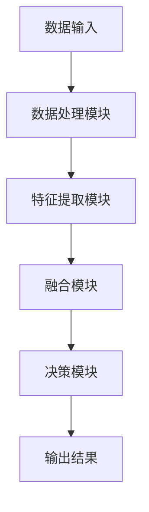

                 


# 设计多模态AI Agent：整合文本、语音与视觉能力

> 关键词：多模态AI Agent, 文本处理, 语音处理, 视觉处理, 数据融合, 模态对齐

> 摘要：本文详细探讨了多模态AI Agent的设计与实现，重点介绍了如何整合文本、语音和视觉能力。通过分析多模态数据的处理方法、融合策略和系统架构，结合实际案例，展示了如何构建一个高效、智能的多模态AI Agent。

---

# 引言

多模态AI Agent是一种能够同时处理和理解多种数据形式（如文本、语音和视觉）的智能体。随着人工智能技术的快速发展，整合多种模态信息已成为提升AI系统性能和用户体验的关键。本文将从基础概念、处理方法、融合策略到系统设计，全面解析多模态AI Agent的实现过程。

---

# 第一部分: 多模态AI Agent概述

## 第1章: 多模态AI Agent的基本概念

### 1.1 多模态AI Agent的定义

- **多模态数据**：指多种数据形式的集合，包括文本、语音、图像、视频等。
- **多模态AI Agent**：能够同时处理和理解多种模态数据，并通过这些数据进行交互和决策的智能体。

### 1.2 多模态AI Agent的应用背景

- **问题背景**：单一模态数据的局限性，如文本无法提供上下文信息，语音受限于语境理解。
- **市场需求**：多模态交互的需求，如智能音箱、虚拟助手等。
- **技术趋势**：深度学习在多模态数据处理中的应用。

### 1.3 多模态AI Agent的关键技术

- **数据处理**：文本、语音、视觉数据的预处理与特征提取。
- **数据融合**：模态间信息的对齐与融合。
- **模型训练**：多任务学习与跨模态训练。

---

## 第2章: 多模态数据的处理方法

### 2.1 文本数据的处理

- **自然语言处理基础**：词袋模型、词嵌入（如Word2Vec）、句嵌入（如BERT）。
- **文本特征提取**：使用预训练模型提取文本向量。
- **文本数据的预处理**：分词、去除停用词、处理标点符号。

### 2.2 语音数据的处理

- **语音信号处理**：采样、分帧、特征提取（如梅尔频率倒谱系数MFCC）。
- **语音特征提取**：使用预训练模型（如Tacotron、Wavenet）提取语音特征。
- **语音数据的预处理**：去噪、端点检测。

### 2.3 视觉数据的处理

- **计算机视觉基础**：图像分割、目标检测、图像特征提取（如CNN）。
- **图像特征提取**：使用预训练模型（如ResNet、VGG）提取图像向量。
- **视觉数据的预处理**：归一化、调整尺寸、颜色空间转换。

### 2.4 多模态数据的标准化与对齐

- **数据标准化**：将不同模态的数据转换为相同的尺度或格式。
- **模态间数据对齐**：时间对齐（如语音和视频的时间同步）。
- **数据对齐的实现步骤**：同步数据流、特征对齐、模型对齐。

---

## 第3章: 多模态数据融合方法

### 3.1 模态间信息融合的策略

- **特征融合**：将不同模态的特征向量进行线性组合或非线性变换。
- **注意力机制**：通过自注意力网络（如Transformer）对不同模态的信息进行加权。
- **联合训练**：在多任务学习框架下，同时优化多个模态的任务。

### 3.2 数据融合的实现步骤

1. **特征提取**：分别提取文本、语音、视觉特征。
2. **特征对齐**：将不同模态的特征对齐到同一时间或空间尺度。
3. **融合策略**：选择合适的融合方法（如加权平均、注意力机制）。
4. **模型训练**：构建多模态模型，进行端到端训练。

### 3.3 融合方法的对比分析

- **特征融合**：简单易实现，但可能忽略模态间的交互信息。
- **注意力机制**：能够捕捉模态间的依赖关系，但计算复杂度较高。
- **联合训练**：能够同时优化多个任务，但需要更多的计算资源。

---

## 第4章: 多模态AI Agent的系统架构设计

### 4.1 系统架构概述

- **模块化设计**：将系统划分为数据处理模块、特征提取模块、融合模块和决策模块。
- **系统功能设计**：支持多模态数据输入、特征提取、融合处理和智能决策。
- **系统架构图**：使用Mermaid绘制系统架构图。



### 4.2 系统接口设计

- **输入接口**：支持文本、语音和图像的输入。
- **输出接口**：提供多模态融合后的结果输出。
- **交互接口**：支持用户与AI Agent的交互操作。

### 4.3 系统交互流程

- **用户输入**：用户通过文本、语音或图像输入指令。
- **数据处理**：系统对输入数据进行预处理和特征提取。
- **融合处理**：将不同模态的特征进行融合。
- **智能决策**：基于融合后的特征进行决策并输出结果。

---

## 第5章: 多模态AI Agent的实现与优化

### 5.1 实现步骤

1. **环境搭建**：安装必要的库和工具（如Python、TensorFlow、Keras）。
2. **数据准备**：收集和整理多模态数据集。
3. **模型设计**：设计多模态融合模型（如基于Transformer的多模态模型）。
4. **模型训练**：使用多任务学习框架进行训练。
5. **模型优化**：调整超参数，优化模型性能。

### 5.2 实现代码示例

```python
import tensorflow as tf
from tensorflow.keras import layers

# 定义多模态融合模型
def multimodal_model():
    input_text = layers.Input(shape=(None,))
    input_audio = layers.Input(shape=(128,))
    input_image = layers.Input(shape=(224, 224, 3))

    # 文本处理
    text_embedding = layers.Embedding(1000, 64)(input_text)
    text_lstm = layers.LSTM(64)(text_embedding)

    # 语音处理
    audio_dense = layers.Dense(64, activation='relu')(input_audio)

    # 图像处理
    image_resnet = ResNet50(weights='imagenet')(input_image)
    image_embedding = layers.GlobalAveragePooling2D()(image_resnet)

    # 融合特征
    merged = layers.Concatenate()([text_lstm, audio_dense, image_embedding])
    dense = layers.Dense(64, activation='relu')(merged)
    output = layers.Dense(1, activation='sigmoid')(dense)

    model = tf.keras.Model(inputs=[input_text, input_audio, input_image], outputs=output)
    return model

# 模型训练
model = multimodal_model()
model.compile(optimizer='adam', loss='binary_crossentropy', metrics=['accuracy'])
model.fit([text_data, audio_data, image_data], labels, epochs=10, batch_size=32)
```

### 5.3 模型优化技巧

- **数据增强**：在文本、语音和图像数据上进行增强，提升模型的泛化能力。
- **模型调优**：使用网格搜索或随机搜索调整超参数。
- **模型压缩**：通过剪枝、量化等技术减少模型的计算量。

---

## 第6章: 多模态AI Agent的实际应用与案例分析

### 6.1 应用场景

- **智能音箱**：支持语音指令和文本反馈。
- **虚拟助手**：结合语音、文本和图像进行交互。
- **智能监控**：通过视频图像和语音进行实时监控。

### 6.2 案例分析

- **案例1：智能音箱**：
  - 输入：用户通过语音指令播放音乐。
  - 处理：系统提取语音特征，识别指令内容。
  - 输出：通过文本反馈确认指令。

- **案例2：虚拟助手**：
  - 输入：用户通过图像输入问题。
  - 处理：系统提取图像特征，结合文本特征进行理解。
  - 输出：生成相应的文本回答。

---

## 第7章: 多模态AI Agent的未来发展方向

### 7.1 技术发展趋势

- **更高效的融合方法**：探索更复杂的融合策略，如图神经网络。
- **更强大的模型架构**：发展更大规模的预训练模型。
- **更丰富的应用场景**：扩展到更多领域，如医疗、教育、娱乐。

### 7.2 挑战与解决方案

- **计算资源限制**：通过模型压缩和轻量化技术减少计算需求。
- **数据多样性不足**：通过数据增强和合成数据提升数据多样性。

---

## 第8章: 总结与展望

### 8.1 本章总结

- 本文详细介绍了多模态AI Agent的设计与实现，从数据处理、融合策略到系统架构，全面解析了多模态AI Agent的核心技术。
- 通过实际案例和代码示例，展示了如何将理论应用于实践。

### 8.2 未来展望

- 多模态AI Agent将在更多领域得到应用，技术也将更加成熟。
- 更多创新性的融合方法和模型架构将不断涌现，推动AI技术的发展。

---

# 作者信息

作者：AI天才研究院/AI Genius Institute & 禅与计算机程序设计艺术 /Zen And The Art of Computer Programming

---

# 版权声明

本文版权归作者所有，未经授权不得转载。如需转载，请联系作者获取授权。

