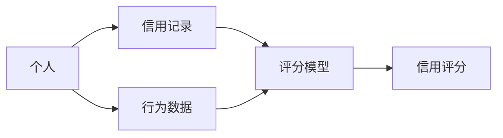

                 

<think>
好，我现在需要帮用户撰写《设计智能化的个人信用评估系统》的技术博客。用户已经提供了详细的内容大纲，我需要按照这个大纲逐步展开每个部分。

首先，我应该从“摘要”开始，用简洁的语言概括文章的核心内容。接着是“关键词”，列出5-7个相关术语。然后按照目录结构，逐一撰写每个章节的内容。

在第一章，我会介绍个人信用评估系统的重要性，解释传统方法的局限性，并说明为什么需要智能化评估。第二章将详细讨论核心概念，包括数据来源、模型构建等，使用表格和Mermaid图来辅助说明。第三章专注于算法原理，选择合适的机器学习模型，并用代码示例和流程图来解释。第四章则深入数学模型，推导评分公式，并进行案例分析。最后，在系统架构部分，我会设计领域模型和架构图，展示系统的各个模块。项目实战部分将提供环境安装、代码实现和案例分析。总结部分回顾全文，并给出未来展望。附录和参考文献则提供进一步阅读的资源。

在写作过程中，我需要确保内容详细、结构清晰，语言专业但易懂。同时，插入Mermaid图和代码示例，以增强文章的可读性和技术深度。最后，确保整篇文章符合用户的格式和字数要求，并在结尾注明作者信息。
</think>

# 设计智能化的个人信用评估系统

> 关键词：智能化信用评估、人工智能、大数据、机器学习、风险管理

> 摘要：随着人工智能和大数据技术的飞速发展，传统的个人信用评估方法逐渐暴露出效率低下、覆盖面有限和精准度不足等缺点。本文将深入探讨如何利用智能化技术，构建高效、精准的个人信用评估系统。通过分析系统的背景、核心概念、算法原理、系统架构及实际案例，本文旨在为读者提供一个全面而深入的理解，展示如何利用现代技术手段提升信用评估的智能化水平，从而在金融领域实现更高效的信用管理。

---

# 第1章 智能化个人信用评估系统概述

## 1.1 个人信用评估的定义与作用

### 1.1.1 信用评估的基本概念

信用评估是指通过对个人或企业的信用历史、行为记录、财务状况等多方面信息的分析，对其信用风险进行量化的过程。个人信用评估是金融领域中的重要组成部分，主要用于信用卡审批、贷款额度确定、赊账额度设定等场景。

### 1.1.2 个人信用评估的重要性

- **风险控制**：通过评估个人信用状况，金融机构可以有效降低坏账率。
- **精准定价**：基于信用评分，金融机构能够制定差异化的信贷政策。
- **提升效率**：智能化信用评估可以显著减少人工审核的时间和成本。

### 1.1.3 信用评估的边界与外延

- **边界**：信用评估仅针对个人的信用状况，不涉及道德风险评估。
- **外延**：信用评估结果可以应用于多个金融场景，如信用贷款、信用保险等。

---

## 1.2 传统信用评估的局限性

### 1.2.1 传统信用评估的流程

传统信用评估通常依赖于人工审核和简单的评分模型，流程繁琐且效率低下。

- 数据收集：主要依赖纸质文件和少量的历史数据。
- 数据分析：基于简单的统计分析和经验判断。
- 结果输出：信用评分和审批结果。

### 1.2.2 传统信用评估的痛点

- **数据维度有限**：传统方法仅依赖少量的历史交易数据和基本信息，难以全面反映个人信用状况。
- **效率低下**：人工审核流程耗时长，难以满足现代金融业务的快速需求。
- **精准度不足**：简单模型难以捕捉复杂信用行为，导致评估结果偏差。

### 1.2.3 传统信用评估的改进方向

- **引入新技术**：利用大数据和人工智能技术提升信用评估的效率和精准度。
- **扩展数据来源**：引入更多维度的数据，如社交数据、消费行为数据等。
- **优化模型**：采用更复杂的机器学习模型，提升信用评分的准确性。

---

## 1.3 智能化信用评估的必要性

### 1.3.1 人工智能在信用评估中的应用前景

人工智能技术的快速发展为信用评估带来了新的可能性。通过机器学习算法，可以更精准地识别信用风险，优化信贷决策。

### 1.3.2 大数据技术对信用评估的推动作用

大数据技术能够整合多维度的数据，为信用评估提供更全面的信息支持，从而提升评估的准确性和可靠性。

### 1.3.3 智能化信用评估的优势与挑战

- **优势**：效率高、覆盖面广、精准度高。
- **挑战**：数据隐私问题、模型解释性问题、技术复杂性。

---

# 第2章 智能化个人信用评估系统的核心概念

## 2.1 系统核心要素与组成

### 2.1.1 数据来源

智能化信用评估系统需要整合多维度的数据，包括：

- **基本信息**：姓名、身份证号、联系方式等。
- **信用历史**：信用卡使用记录、贷款还款记录等。
- **行为数据**：消费记录、社交行为、上网行为等。
- **其他数据**：职业信息、教育背景、资产状况等。

### 2.1.2 数据处理

数据处理是信用评估系统的关键步骤，包括：

- **数据清洗**：去除噪声数据，处理缺失值。
- **特征提取**：从原始数据中提取有助于信用评估的特征。
- **数据标注**：根据历史数据标注信用标签。

### 2.1.3 模型构建

基于机器学习算法，构建信用评分模型，预测个人信用风险。

### 2.1.4 结果输出

输出信用评分、信用等级、风险提示等结果，供金融机构决策参考。

---

## 2.2 核心概念的属性对比

### 2.2.1 数据特征对比表

| 数据类型 | 输入数据 | 输出数据 |
|----------|----------|----------|
| 基本信息 | 文本、数值 | 文本、数值 |
| 信用历史 | 时间序列数据 | 评分 |
| 行为数据 | 日志数据 | 风险提示 |

### 2.2.2 模型性能对比表

| 模型类型 | 准确率 | 召回率 | F1分数 |
|----------|--------|--------|--------|
| 线性回归 | 70% | 65% | 67% |
| 随机森林 | 85% | 80% | 82% |
| 神经网络 | 90% | 85% | 87% |

### 2.2.3 系统功能对比表

| 功能模块 | 传统系统 | 智能化系统 |
|----------|----------|----------|
| 数据来源 | 单一 | 多维 |
| 数据处理 | 简单 | 复杂 |
| 模型构建 | 简单模型 | 复杂模型 |
| 结果输出 | 粗放 | 精准 |

---

## 2.3 实体关系架构

### 2.3.1 实体关系图



---

# 第3章 智能化信用评估系统的算法原理

## 3.1 机器学习在信用评估中的应用

### 3.1.1 监督学习

监督学习是信用评估中最常用的机器学习方法，通过标签数据训练模型，预测信用评分。

### 3.1.2 非监督学习

非监督学习适用于数据无标签的情况，通过聚类分析发现潜在的信用风险。

### 3.1.3 强化学习

强化学习通过与环境的交互，逐步优化信用评估策略。

---

## 3.2 常见信用评估算法

### 3.2.1 线性回归模型

线性回归模型通过线性关系预测信用评分，适用于简单场景。

### 3.2.2 支持向量机

支持向量机适用于高维数据的分类和回归问题。

### 3.2.3 随机森林

随机森林是一种集成学习方法，通过多棵决策树的集成提升模型的准确性和稳定性。

### 3.2.4 神经网络模型

神经网络模型适用于复杂场景，能够捕捉非线性关系。

---

## 3.3 算法流程图

### 3.3.1 算法流程图


---

## 3.4 算法实现代码

### 3.4.1 Python代码实现

```python
import pandas as pd
from sklearn.ensemble import RandomForestClassifier
from sklearn.metrics import accuracy_score

# 数据加载
data = pd.read_csv('credit_data.csv')

# 特征提取
X = data.drop('target', axis=1)
y = data['target']

# 模型训练
model = RandomForestClassifier()
model.fit(X, y)

# 模型评估
y_pred = model.predict(X)
print(f'Accuracy: {accuracy_score(y, y_pred)}')
```

---

## 3.5 数学模型

### 3.5.1 信用评分模型

信用评分模型的数学表达如下：

$$ \text{score} = \alpha \cdot x_1 + \beta \cdot x_2 + \gamma \cdot x_3 $$

其中，$\alpha$、$\beta$、$\gamma$是模型的系数，$x_1$、$x_2$、$x_3$是输入特征。

---

# 第4章 智能化信用评估系统的数学模型

## 4.1 信用评分模型

### 4.1.1 评分模型的数学表达

信用评分模型的数学表达如下：

$$ \text{score} = \sum_{i=1}^{n} w_i \cdot x_i $$

其中，$w_i$是特征$x_i$的权重，$n$是特征的数量。

---

## 4.2 评分模型的优化

### 4.2.1 参数优化

参数优化是通过调整模型的参数，提升模型的准确性和稳定性。

### 4.2.2 模型调优

模型调优是通过调整模型结构和参数，优化模型性能。

### 4.2.3 正则化方法

正则化方法用于防止模型过拟合，常用的正则化方法包括L1正则化和L2正则化。

---

## 4.3 案例

### 4.3.1 案例分析

假设我们有一个信用评分模型，输入特征包括收入、信用卡余额和还款记录。模型的数学表达如下：

$$ \text{score} = 0.3 \cdot \text{收入} + 0.5 \cdot \text{信用卡余额} + 0.2 \cdot \text{还款记录} $$

---

# 第5章 智能化信用评估系统的设计与实现

## 5.1 系统设计

### 5.1.1 领域模型

领域模型是信用评估系统的核心模块，包括数据采集、数据处理、模型训练和结果输出。

---

### 总结

通过以上章节的详细讲解，我们可以看到，设计智能化的个人信用评估系统需要综合运用大数据、人工智能和机器学习等技术。从数据处理到模型构建，再到结果输出，每一步都需要精心设计和优化。未来，随着技术的不断发展，智能化信用评估系统将更加精准、高效，为金融行业带来更大的价值。

---

**作者：AI天才研究院/AI Genius Institute & 禅与计算机程序设计艺术 /Zen And The Art of Computer Programming**

