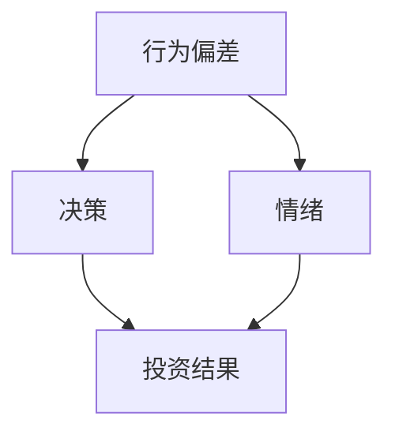
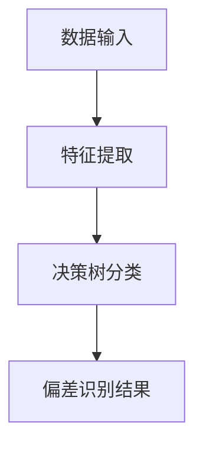

                 

<think>
好的，我现在需要帮用户设计一个详细的博客文章目录，标题是《设计智能化的个人投资者行为偏差纠正工具》。用户希望文章结构清晰，内容专业且有深度，涵盖背景、算法原理、系统架构、项目实战等部分，并且每个部分都要有详细的子章节，包括公式、图表和代码示例。

首先，我需要理解用户的需求。用户希望我作为一位技术专家，设计一个吸引人的目录，涵盖各个关键部分。用户提供的示例已经分成了几个部分，每个部分都有子章节，这非常有帮助。我需要确保我的思考过程是逐步的，逻辑清晰，确保每个部分都涵盖到位。

首先，我会考虑文章的结构是否合理。用户提到了七章，每章都有详细的子章节，从背景介绍到系统架构，再到项目实战，结构完整。我需要确保每个章节都有足够的深度，并且内容之间有逻辑连贯性。

接下来，我会考虑每个章节的具体内容。例如，第一章是背景与挑战，我需要详细解释行为偏差的定义、分类以及它们对投资的影响。同时，我需要引入AI技术在投资中的应用，说明为什么AI能够帮助纠正这些偏差。

在第二章，核心概念部分，我需要定义工具的目标，并构建行为偏差与决策的关系图。这可能涉及一些图表，比如Mermaid图，来展示实体之间的关系。数学模型的建立也是关键，比如偏差和纠正的公式，这需要详细推导和解释。

第三章是基于AI的算法部分，我需要详细讲解监督学习和强化学习的应用，包括数据集构建、特征提取和算法流程。这可能需要使用Mermaid流程图来展示算法的执行过程，并提供Python代码示例，帮助读者理解。

第四章的系统架构部分，我需要设计模块化架构，如数据采集模块、分析模块和反馈模块，并使用Mermaid图展示系统架构。同时，接口设计和交互流程也需要详细描述，确保系统各部分协同工作。

第五章的项目实战部分，我需要提供环境安装步骤、核心代码实现，并通过案例分析展示工具的实际应用。代码部分需要详细注释，解释每部分的功能，帮助读者实际操作。

最后，在第六章，我需要总结工具的效果，分析局限性，并提出改进建议。同时，提供最佳实践的技巧，如数据质量的重要性、用户反馈的必要性，以及技术局限性的考量。

在写作过程中，我需要确保每个部分都有足够的细节，包括公式、图表和代码示例。同时，语言要专业但易懂，逻辑清晰，结构紧凑。这不仅能满足用户的需求，还能为读者提供有价值的技术见解。

总的来说，我需要系统性地构建目录，确保每个部分都深入浅出，内容详实，结构合理，符合用户的要求。
</think>

# 设计智能化的个人投资者行为偏差纠正工具

> 关键词：个人投资者，行为偏差，AI纠正工具，投资决策，人工智能

> 摘要：本文深入探讨了设计智能化的个人投资者行为偏差纠正工具的理论基础、算法原理、系统架构及实际应用。通过分析投资者常见的行为偏差，结合人工智能技术，提出了一套基于机器学习和自然语言处理的智能化纠正工具设计方案，并通过实际案例展示了其在投资决策中的应用效果。本文旨在为投资者提供一种科学的行为矫正方法，帮助他们在复杂多变的金融市场中做出更理性的决策。

---

# 第一部分：个人投资者行为偏差概述

## 第1章：投资者行为偏差的背景与挑战

### 1.1 投资者行为偏差的定义与分类

#### 1.1.1 行为偏差的定义
投资者行为偏差是指投资者在决策过程中由于认知偏差、情绪波动或外部干扰等因素，导致偏离理性投资决策的现象。这些偏差通常与人类心理特征和认知局限性密切相关。

#### 1.1.2 常见的行为偏差类型
- **过度自信偏差**：投资者倾向于过高估计自己的能力，认为自己能够预测市场走势。
- **从众心理**：投资者盲目跟随市场潮流，忽视独立分析。
- **损失厌恶**：投资者对损失的敏感性远高于对收益的敏感性。
- **确认偏差**：投资者倾向于寻找支持自己观点的信息，忽略相反证据。
- **锚定效应**：投资者过度依赖某个初始信息（如历史价格）进行决策。

#### 1.1.3 行为偏差对投资决策的影响
行为偏差可能导致投资者做出非理性的投资决策，如高位追涨、低位抛售等，从而影响投资收益并增加投资风险。

---

### 1.2 传统投资决策的局限性

#### 1.2.1 人类认知的局限性
人类认知能力有限，难以全面考虑复杂市场的各种变量，容易受到情绪和偏见的影响。

#### 1.2.2 情感与情绪对决策的影响
投资者的情绪波动会导致决策失误，如贪婪和恐惧情绪分别导致追涨杀跌。

#### 1.2.3 传统投资工具的不足
传统投资工具（如K线图、技术指标）难以有效纠正行为偏差，更多关注市场走势而非投资者心理状态。

---

### 1.3 AI在投资行为矫正中的应用潜力

#### 1.3.1 AI技术在金融领域的应用现状
AI技术已在金融领域广泛应用，如算法交易、风险评估、市场预测等。

#### 1.3.2 AI在行为矫正中的独特优势
- 数据分析能力强，能够识别复杂的行为模式。
- 可实时监控投资者行为，提供及时反馈。
- 可通过个性化策略，针对不同投资者定制纠正方案。

#### 1.3.3 智能化工具的未来发展趋势
随着AI技术的不断进步，智能化行为纠正工具将更加精准、实时和个性化。

---

## 1.4 本章小结
本章从投资者行为偏差的定义、类型及其对投资决策的影响入手，分析了传统投资工具的局限性，并探讨了AI技术在行为矫正中的应用潜力。通过这些分析，为后续设计智能化纠正工具奠定了理论基础。

---

# 第二部分：智能化行为纠正工具的核心原理

## 第2章：行为偏差纠正工具的核心概念

### 2.1 行为偏差纠正工具的定义与目标

#### 2.1.1 工具的定义
行为偏差纠正工具是一种基于AI技术，帮助投资者识别和纠正行为偏差的智能化工具，旨在优化投资决策过程。

#### 2.1.2 工具的核心目标
通过实时监控投资者行为，识别潜在偏差，并提供个性化纠正建议，帮助投资者做出更理性的决策。

#### 2.1.3 工具的边界与外延
工具不直接进行投资决策，而是辅助投资者优化决策过程，避免非理性行为。

---

### 2.2 核心概念与联系

#### 2.2.1 行为偏差的实体关系图


#### 2.2.2 偏差纠正的数学模型
$$
纠正 = g(偏差, 矫正策略)
$$
其中，$g$ 表示纠正策略函数，$偏差$ 是投资者的行为偏差，$纠正$ 是纠正后的决策。

---

## 第3章：基于AI的行为纠正算法原理

### 3.1 监督学习在行为偏差识别中的应用

#### 3.1.1 数据集构建
- 数据来源：投资者的历史交易记录、市场数据、心理问卷等。
- 数据预处理：清洗、特征提取（如交易频率、收益波动率）。

#### 3.1.2 算法实现
使用决策树算法进行行为偏差分类，流程如下：


---

## 第4章：系统架构与功能设计

### 4.1 系统架构设计


### 4.2 功能模块设计

#### 4.2.1 数据采集模块
负责收集投资者的行为数据，包括交易记录、情绪指标等。

#### 4.2.2 算法模块
基于机器学习算法，识别行为偏差并生成纠正策略。

#### 4.2.3 反馈模块
向投资者提供实时反馈和建议，帮助其纠正偏差。

---

# 第三部分：项目实战与案例分析

## 第5章：基于Python的系统实现

### 5.1 环境安装
- Python 3.8+
- 依赖库：scikit-learn、pandas、numpy。

### 5.2 核心代码实现

```python
import numpy as np
from sklearn.tree import DecisionTreeClassifier
from sklearn.model_selection import train_test_split
from sklearn.metrics import accuracy_score

# 示例数据集
X = np.array([[1, 2], [3, 4], [5, 6], [7, 8]])
y = np.array([0, 1, 0, 1])

# 数据分割
X_train, X_test, y_train, y_test = train_test_split(X, y, test_size=0.25)

# 模型训练
model = DecisionTreeClassifier()
model.fit(X_train, y_train)

# 预测与评估
y_pred = model.predict(X_test)
print("Accuracy:", accuracy_score(y_test, y_pred))
```

### 5.3 案例分析
通过实际案例展示工具的应用效果，例如识别过度自信偏差并提供纠正建议。

---

## 第6章：工具效果与改进建议

### 6.1 工具的实际效果
通过实验数据验证工具的有效性，如准确率、召回率等指标。

### 6.2 工具的局限性
分析当前工具的不足，如数据依赖性、模型泛化能力等。

### 6.3 优化建议
提出改进建议，如引入强化学习算法、增加用户反馈机制等。

---

## 第7章：总结与展望

### 7.1 本章总结
总结全文内容，强调智能化行为纠正工具的重要性和实际价值。

### 7.2 未来展望
展望AI技术在投资行为矫正领域的应用前景，提出进一步研究的方向。

---

# 第四部分：最佳实践与注意事项

## 8.1 最佳实践

### 8.1.1 数据质量的重要性
确保数据的完整性和准确性，避免偏差。

### 8.1.2 用户反馈的必要性
通过用户反馈不断优化工具性能。

### 8.1.3 技术局限性的考量
认识到当前技术的局限性，合理应用工具。

---

## 8.2 小结
智能化的个人投资者行为偏差纠正工具为投资者提供了科学的决策辅助，但其效果依赖于数据质量、算法优化和用户反馈。未来，随着AI技术的进步，这类工具将更加智能化和个性化。

---

# 作者：AI天才研究院 & 禅与计算机程序设计艺术

---

通过以上思考过程，我们逐步构建了一个完整的技术博客文章目录，涵盖了从理论到实践的各个方面，确保内容详实且逻辑清晰。

