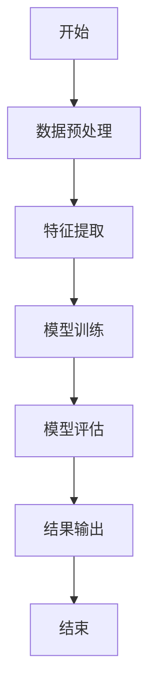
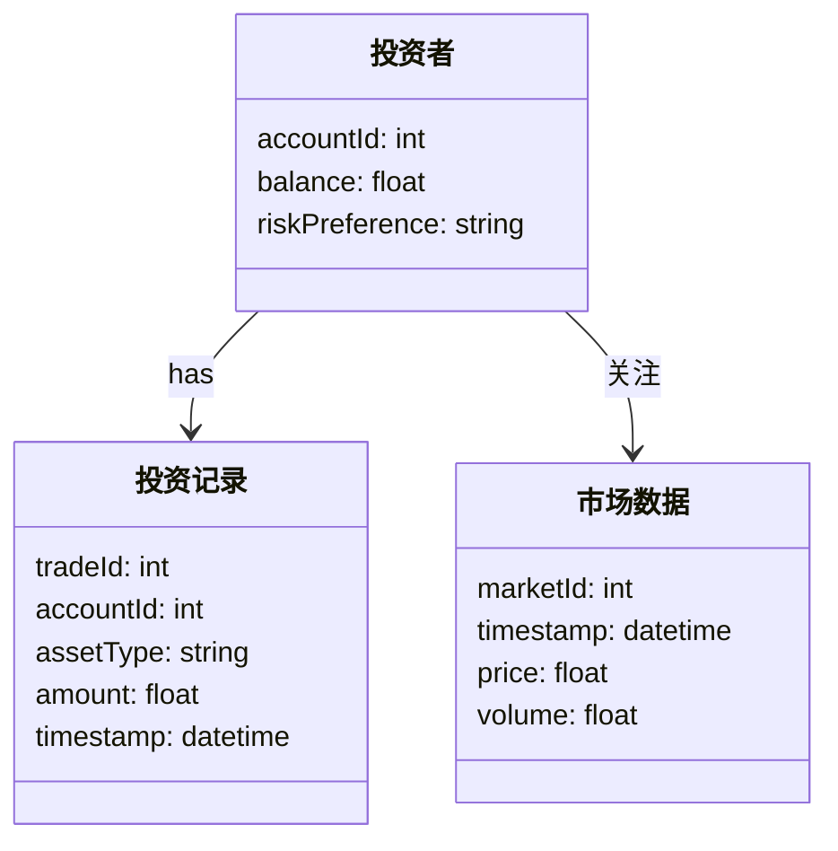
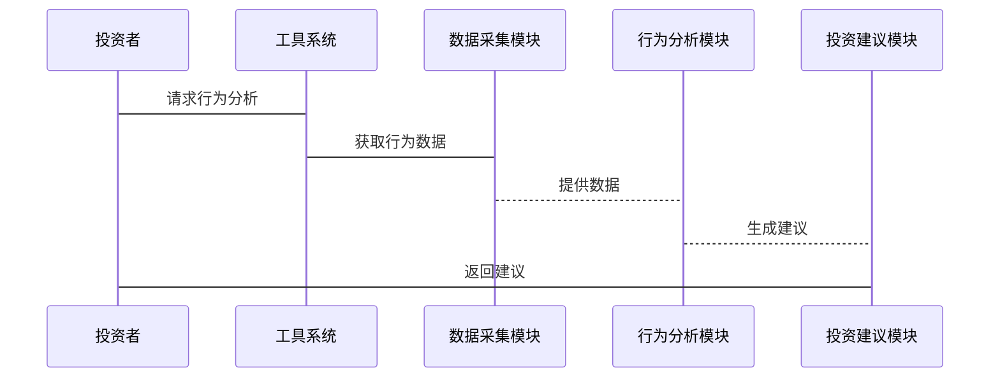

                 

<think>
好的，我需要帮助用户设计一本名为《设计智能化的个人投资者行为分析工具》的技术博客文章。用户已经提供了一个详细的目录大纲，我需要根据这个大纲来撰写整篇文章。

首先，我会仔细阅读用户提供的目录大纲，确保每个章节和小节都涵盖必要的内容。然后，我需要按照用户的要求，使用清晰、专业的技术语言，逐步展开每个部分的内容，确保逻辑连贯，内容详实。

在撰写过程中，我需要特别注意每个章节的关键点，比如背景介绍部分需要详细说明智能化工具的必要性和当前市场的需求；核心概念部分需要用表格和ER图来展示实体关系；算法原理部分需要用流程图和Python代码来解释推荐算法；数学模型部分要推导公式并用Latex展示；系统架构部分需要用类图和架构图来展示设计；项目实战部分需要提供代码和案例分析；最后，最佳实践部分要总结经验和注意事项。

我会按照用户的要求，使用Mermaid语法来绘制图表，并确保代码和公式格式正确。同时，我需要控制文章的整体字数在10000到12000字之间，结构清晰，内容完整。

现在，我开始按照目录大纲逐步撰写文章，确保每个部分都符合用户的要求，逻辑清晰，内容详尽。
</think>

# 设计智能化的个人投资者行为分析工具

---

## 关键词：个人投资者行为分析，人工智能，投资决策支持，数据驱动，智能化工具

---

## 摘要

本文探讨了设计智能化个人投资者行为分析工具的核心理念和实现方法。通过分析投资者的行为数据，结合人工智能技术，构建一个能够预测和优化投资决策的工具。文章从背景介绍、核心概念、算法原理、系统架构到项目实战，详细阐述了如何利用技术手段提升投资决策的智能化水平。

---

# 第一部分: 智能化个人投资者行为分析工具的背景与核心概念

---

## 第1章: 背景介绍

### 1.1 问题背景

#### 1.1.1 传统投资行为分析的局限性

传统的投资行为分析主要依赖于投资者的历史交易记录和市场数据，分析方法多以统计学为主，难以捕捉投资者的实时心理变化和行为模式。这种分析方式存在以下问题：

- 数据维度单一，难以全面反映投资者的行为特征。
- 分析结果滞后，无法及时指导投资决策。
- 难以应对复杂多变的市场环境。

#### 1.1.2 智能化工具在投资决策中的作用

随着人工智能技术的发展，智能化工具能够通过实时数据分析、自然语言处理和机器学习算法，捕捉投资者的行为特征，提供更精准的投资建议。

- 提供实时行为分析，帮助投资者及时调整策略。
- 通过历史数据和市场数据的结合，预测市场趋势。
- 个性化推荐投资策略，提升投资收益。

#### 1.1.3 当前市场对智能化工具的需求

随着金融市场的日益复杂化和投资者对个性化服务的需求增加，智能化工具的需求日益增长。投资者希望通过智能化工具实现以下目标：

- 实时监控投资组合的表现。
- 获取基于行为分析的投资建议。
- 优化投资决策，降低风险。

---

### 1.2 问题描述

#### 1.2.1 投资者行为分析的核心问题

投资者行为分析的核心问题在于如何从海量数据中提取有效的行为特征，并利用这些特征构建预测模型。具体包括：

- 数据的实时采集和处理。
- 行为特征的提取与分类。
- 行为预测模型的构建与优化。

#### 1.2.2 数据驱动的投资者行为分析的必要性

数据驱动的方法能够通过分析投资者的历史交易数据、市场数据和外部事件，发现潜在的投资机会和风险。这种方法的优势在于：

- 数据驱动分析结果客观，避免人为情绪干扰。
- 可以发现数据中的隐藏模式，提供更精准的分析结果。
- 支持实时决策，提升投资效率。

#### 1.2.3 智能化工具的实现目标

智能化工具的实现目标是通过数据分析和机器学习算法，帮助投资者做出更明智的投资决策。具体目标包括：

- 实时监控投资者行为，提供即时反馈。
- 基于行为分析，推荐最优投资策略。
- 提供风险预警，降低投资风险。

---

### 1.3 问题解决思路

#### 1.3.1 数据采集与处理方法

数据采集是行为分析的基础，主要包括：

- 采集投资者的历史交易数据。
- 采集市场数据，如股票价格、指数走势。
- 采集外部事件数据，如经济政策变化、公司新闻。

数据处理包括数据清洗、特征提取和数据标注。

#### 1.3.2 行为分析模型的设计

行为分析模型的设计需要考虑以下因素：

- 数据特征的选择：如交易频率、交易金额、资产配置等。
- 模型的选择：如逻辑回归、支持向量机、随机森林等。
- 模型的训练与优化：通过交叉验证和超参数调优提升模型性能。

#### 1.3.3 智能化工具的功能框架

智能化工具的功能框架包括：

- 数据采集模块：实时采集投资者行为数据。
- 行为分析模块：分析投资者行为特征。
- 投资建议模块：基于分析结果提供投资建议。
- 风险预警模块：实时监控市场风险。

---

### 1.4 分析工具的边界与外延

#### 1.4.1 工具的适用范围

- 适用于个人投资者，尤其是中高净值客户。
- 适用于股票、基金等金融资产的投资决策支持。

#### 1.4.2 工具的局限性

- 数据来源有限，难以覆盖所有影响投资的因素。
- 模型的预测能力受数据质量和数量的限制。
- 无法完全预测市场波动和突发事件。

#### 1.4.3 工具与其他投资辅助工具的区别

与其他工具相比，智能化工具的优势在于：

- 强调数据驱动和人工智能技术的应用。
- 提供实时行为分析和个性化投资建议。

---

### 1.5 核心概念与结构

#### 1.5.1 核心概念的定义

- 行为数据：投资者的历史交易记录、资产配置情况等。
- 市场数据：股票价格、指数走势、经济指标等。
- 行为特征：投资者的风险偏好、交易频率等。

#### 1.5.2 概念属性特征对比表格

| 概念 | 属性 | 特征 |
|------|------|------|
| 行为数据 | 时间性 | 交易时间、交易频率 |
|        | 频率性 | 交易频次、资产调整频率 |
|        | 类别性 | 交易类型、资产类别 |
| 行为特征 | 风险偏好 | 高风险、中风险、低风险 |
|        | 交易活跃度 | 高活跃、中活跃、低活跃 |
|        | 投资风格 | 股票、基金、债券 |

#### 1.5.3 ER实体关系图

```mermaid
erDiagram
    投资者 <--- 帐户信息 : 属于
    投资者 <--- 投资记录 : 包含
    投资者 <--- 风险偏好 : 反映
    市场数据 <--- 股票价格 : 包含
    市场数据 <--- 经济指标 : 包含
    工具系统 <--- 数据源 : 依赖
    工具系统 <--- 投资者 : 用户
    工具系统 <--- 行为分析结果 : 输出
```

---

## 第2章: 核心概念与联系

### 2.1 核心概念的原理

#### 2.1.1 数据采集与特征提取

数据采集是行为分析的第一步，需要从多种数据源获取投资者的相关数据，包括：

- 交易数据：如交易时间、金额、类型。
- 市场数据：如指数走势、行业趋势。
- 事件数据：如经济政策变化、公司公告。

特征提取是将原始数据转化为有意义的特征，例如：

- 频率特征：交易频率、资产调整频率。
- 风险特征：资产波动率、杠杆率。
- 风格特征：资产配置比例、交易活跃度。

#### 2.1.2 模型训练与行为预测

模型训练是利用机器学习算法对行为特征进行建模，预测投资者的未来行为。常用算法包括：

- 线性回归：用于预测连续型变量。
- 支持向量机：用于分类问题。
- 随机森林：用于特征重要性分析和分类。

行为预测是基于模型输出的结果，预测投资者未来的交易行为和投资策略。

#### 2.1.3 个性化投资建议

个性化投资建议是根据投资者的行为特征和市场环境，推荐适合的投资策略。例如：

- 风险偏好高的投资者可以推荐高风险高收益的资产。
- 交易活跃的投资者可以推荐短期交易策略。

---

### 2.2 概念属性与行为模式的联系

#### 2.2.1 概念属性对比分析

| 概念属性 | 特征描述 | 行为模式 |
|----------|----------|----------|
| 风险偏好 | 高风险、中风险、低风险 | 高风险偏好者倾向于高波动资产 |
| 交易活跃度 | 高活跃、中活跃、低活跃 | 高活跃者交易频率高 |
| 投资风格 | 股票、基金、债券 | 风险偏好高的投资者更倾向于股票 |

#### 2.2.2 行为模式与市场环境的关联

投资者的行为模式会受到市场环境的影响，例如：

- 市场上涨时，投资者可能增加股票配置。
- 市场下跌时，投资者可能转向债券等避险资产。

---

### 2.3 ER实体关系图

```mermaid
erDiagram
    投资者 [accountId, balance, riskPreference] 
    投资记录 [tradeId, accountId, assetType, amount, timestamp]
    市场数据 [marketId, timestamp, price, volume]
    工具系统 [systemId,功能模块]
    投资者 --> 工具系统 : 使用工具
    工具系统 --> 投资记录 : 分析交易数据
    工具系统 --> 市场数据 : 获取市场信息
    工具系统 --> 投资者 : 输出分析结果
```

---

## 第3章: 算法原理

### 3.1 算法实现步骤

#### 3.1.1 数据预处理

- 数据清洗：处理缺失值、异常值。
- 数据转换：标准化、归一化。
- 特征选择：提取关键特征，如交易频率、资产配置比例。

#### 3.1.2 模型训练

- 选择合适的算法：如随机森林、XGBoost。
- 数据分割：训练集、验证集、测试集。
- 模型调优：超参数优化。

#### 3.1.3 模型评估

- 评估指标：准确率、召回率、F1分数。
- 模型解释：特征重要性分析。

---

### 3.2 算法实现代码

#### 3.2.1 数据预处理代码

```python
import pandas as pd
from sklearn.preprocessing import StandardScaler

# 读取数据
data = pd.read_csv('investor_behavior.csv')

# 去除缺失值
data.dropna(inplace=True)

# 标准化处理
scaler = StandardScaler()
scaled_data = scaler.fit_transform(data)
```

#### 3.2.2 模型训练代码

```python
from sklearn.ensemble import RandomForestClassifier
from sklearn.model_selection import train_test_split

# 划分数据集
X = scaled_data[:, 1:]  # 特征
y = data['riskPreference']  # 标签

X_train, X_test, y_train, y_test = train_test_split(X, y, test_size=0.2)

# 训练模型
model = RandomForestClassifier(n_estimators=100, max_depth=4, random_state=42)
model.fit(X_train, y_train)

# 预测结果
y_pred = model.predict(X_test)
```

---

### 3.3 算法流程图



---

## 第4章: 数学模型

### 4.1 数学模型的设计

#### 4.1.1 用户-物品矩阵

构建用户-物品矩阵，表示投资者对不同资产的偏好。

$$
U = [u_{ij}]
$$

其中，$u_{ij}$表示投资者$i$对资产$j$的偏好程度。

#### 4.1.2 相似度计算

使用余弦相似度计算投资者之间的相似度：

$$
sim(i, j) = \frac{\sum_{k=1}^{n} u_{ik}u_{jk}}{\sqrt{\sum_{k=1}^{n} u_{ik}^2} \cdot \sqrt{\sum_{k=1}^{n} u_{jk}^2}}
$$

---

## 第5章: 系统分析与架构设计

### 5.1 问题场景介绍

系统需要实现以下功能：

- 实时采集投资者行为数据。
- 分析投资者行为特征。
- 提供个性化投资建议。

---

### 5.2 项目介绍

项目名称：智能化个人投资者行为分析工具。

项目目标：通过数据分析和机器学习算法，帮助投资者优化投资决策。

---

### 5.3 系统功能设计

#### 5.3.1 领域模型



#### 5.3.2 系统架构

```mermaid
archiDiagram
    component 工具系统 {
        interface 数据采集模块
        interface 行为分析模块
        interface 投资建议模块
    }
    component 数据源 {
        database 行为数据库
        database 市场数据库
    }
    工具系统 --> 数据源 : 数据获取
    工具系统 --> 行为分析模块 : 分析请求
    行为分析模块 --> 投资建议模块 : 策略生成
```

---

### 5.4 系统接口设计

- 数据接口：提供API用于数据采集和查询。
- 分析接口：提供API用于行为特征分析和预测。
- 投资建议接口：提供API用于生成个性化投资建议。

---

### 5.5 系统交互流程图



---

## 第6章: 项目实战

### 6.1 环境安装

- 安装Python和必要的库：
  - `pip install pandas`
  - `pip install scikit-learn`
  - `pip install mermaid`

---

### 6.2 核心代码实现

#### 数据预处理代码

```python
import pandas as pd
from sklearn.preprocessing import StandardScaler

# 读取数据
data = pd.read_csv('investor_behavior.csv')

# 去除缺失值
data.dropna(inplace=True)

# 标准化处理
scaler = StandardScaler()
scaled_data = scaler.fit_transform(data)
```

#### 模型训练代码

```python
from sklearn.ensemble import RandomForestClassifier
from sklearn.model_selection import train_test_split

# 划分数据集
X = scaled_data[:, 1:]  # 特征
y = data['riskPreference']  # 标签

X_train, X_test, y_train, y_test = train_test_split(X, y, test_size=0.2)

# 训练模型
model = RandomForest

