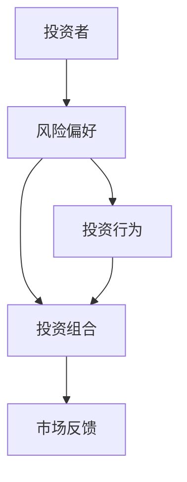
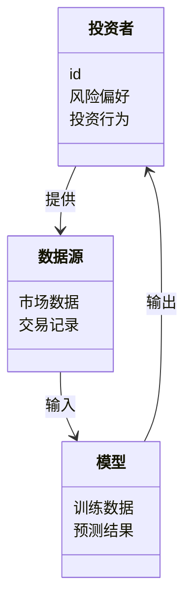
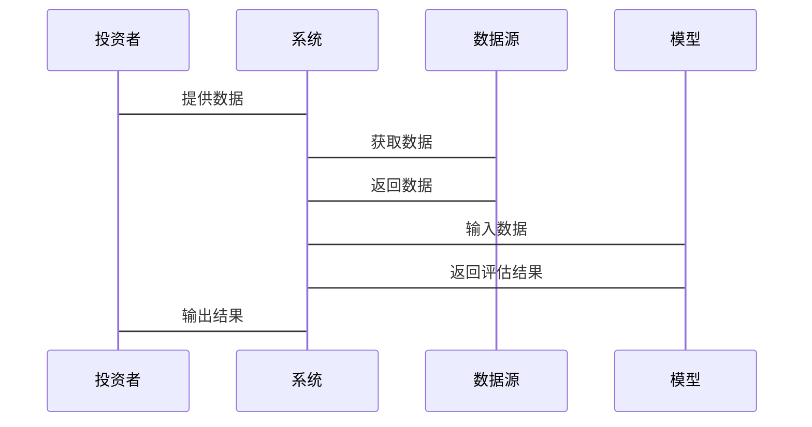

                 


# 设计智能化的个人投资者风险偏好动态评估工具

> 关键词：智能化，风险偏好，动态评估，投资者行为分析，机器学习，系统架构

> 摘要：本文深入探讨了设计智能化的个人投资者风险偏好动态评估工具的核心原理、技术实现和系统架构。通过分析投资者行为特征、心理因素和市场反馈，结合机器学习算法和动态模型，提出了一个高效、精准的评估方案。文章详细讲解了算法实现、系统架构设计、项目实战和最佳实践，为金融领域的智能化风险管理提供了理论支持和实践指导。

---

## 第1章：背景与核心概念

### 1.1 投资者风险偏好评估的重要性

#### 1.1.1 风险偏好在投资决策中的作用
投资者的风险偏好是其投资决策的核心因素之一。不同风险偏好的投资者会在不同的市场条件下做出不同的投资选择，例如，激进型投资者倾向于高风险高回报的资产，而保守型投资者则倾向于低风险低回报的资产。

#### 1.1.2 传统风险评估方法的局限性
传统的风险评估方法通常基于静态的问卷调查和历史数据分析，难以捕捉投资者在动态市场环境中的行为变化。此外，传统方法往往忽视了投资者的心理因素和情绪波动对投资决策的影响。

#### 1.1.3 动态评估的必要性与优势
动态评估工具能够实时捕捉投资者的行为特征和市场反馈，从而提供更加精准的风险偏好评估结果。通过智能化的动态评估工具，投资者和金融机构可以更好地应对市场波动，优化投资组合，降低风险。

---

### 1.2 个人投资者行为分析

#### 1.2.1 投资者决策过程中的心理因素
投资者的决策受到心理因素的显著影响，例如风险厌恶、贪婪、恐惧等情绪。这些心理因素会直接影响投资者的风险偏好，进而影响其投资行为。

#### 1.2.2 不同风险偏好的投资者行为特征
- **保守型投资者**：倾向于选择低风险资产，如债券、银行存款等，对市场波动较为敏感。
- **平衡型投资者**：在风险和收益之间寻求平衡，倾向于配置混合型资产。
- **激进型投资者**：倾向于选择高风险高回报的资产，如股票、加密货币等，对市场波动的容忍度较高。

#### 1.2.3 风险偏好与投资组合优化的关系
投资者的风险偏好直接影响其投资组合的构建。例如，激进型投资者可能倾向于配置更多的股票，而保守型投资者则倾向于配置更多的债券。动态评估工具可以帮助投资者根据市场变化实时调整其投资组合。

---

### 1.3 智能化评估工具的必要性

#### 1.3.1 传统评估工具的局限性
传统风险评估工具通常基于静态的问卷调查和历史数据分析，难以捕捉投资者在动态市场环境中的行为变化。

#### 1.3.2 AI技术在风险评估中的应用潜力
人工智能技术可以通过分析大量的投资者行为数据，动态捕捉投资者的风险偏好变化，从而提供更加精准的评估结果。

#### 1.3.3 动态评估工具的核心价值
动态评估工具可以帮助投资者和金融机构实时了解投资者的风险偏好变化，从而优化投资决策，降低投资风险。

---

## 第2章：风险偏好评估的核心概念与联系

### 2.1 风险偏好评估的原理

#### 2.1.1 风险偏好的定义与分类
风险偏好是指投资者在面对风险和收益时的偏好程度。通常可以分为保守型、平衡型和激进型三类。

#### 2.1.2 风险偏好与投资组合的关系
投资者的风险偏好直接影响其投资组合的构建和调整。动态评估工具可以根据投资者的风险偏好变化，实时优化其投资组合。

#### 2.1.3 风险偏好与市场波动的关系
市场波动会影响投资者的风险偏好，例如在市场下跌时，投资者可能会变得更加保守，减少高风险资产的配置。

---

### 2.2 核心概念的属性特征对比

#### 2.2.1 风险偏好与风险承受能力的对比
- **风险偏好**：投资者对风险的主观态度，影响其投资决策。
- **风险承受能力**：投资者在面对风险时的实际承受能力，通常与资产规模和财务状况相关。

#### 2.2.2 风险偏好与投资目标的关系
- 风险偏好与投资目标密切相关。例如，长期投资目标的投资者可能更倾向于承担短期市场波动的风险，以追求长期收益。

#### 2.2.3 风险偏好与市场反馈的关联
市场反馈（如市场波动、资产价格变化）会直接影响投资者的风险偏好，从而影响其投资行为。

---

### 2.3 实体关系图



---

## 第3章：算法原理与数学模型

### 3.1 算法原理

#### 3.1.1 基于机器学习的风险偏好预测模型
机器学习模型（如随机森林、支持向量机）可以用于预测投资者的风险偏好。模型输入包括投资者的历史交易数据、市场数据等，输出为风险偏好评分。

#### 3.1.2 时间序列分析在动态评估中的应用
时间序列分析（如ARIMA模型）可以用于捕捉投资者风险偏好的动态变化。模型可以基于历史数据预测未来的风险偏好。

#### 3.1.3 聚类分析与风险偏好分类
聚类分析可以将投资者分为不同的类别，例如保守型、平衡型和激进型投资者。

---

### 3.2 数学模型与公式

#### 风险偏好评估的数学模型
$$ R = f(x_1, x_2, ..., x_n) $$
其中，$x_i$ 表示投资者的特征变量，$R$ 表示风险偏好值。

#### 动态评估模型
$$ R(t) = \alpha R(t-1) + \beta \cdot 新数据 $$

---

### 3.3 算法实现

```python
def risk_assessment(data):
    # 数据预处理
    normalized_data = normalize(data)
    # 模型训练
    model = train_model(normalized_data)
    # 风险偏好预测
    risk_score = model.predict(normalized_data)
    return risk_score
```

---

## 第4章：系统架构设计方案

### 4.1 问题场景介绍

#### 4.1.1 问题场景
投资者需要实时了解自己的风险偏好变化，以便优化投资决策。

#### 4.1.2 系统需要解决的核心问题
- 实时捕捉投资者行为数据
- 动态评估投资者风险偏好
- 提供个性化投资建议

#### 4.1.3 系统的目标与功能需求
- 提供实时风险偏好评估
- 自动生成投资组合建议
- 提供市场波动预警

---

### 4.2 领域模型设计



---

## 第5章：系统交互设计



---

## 第6章：项目实战

### 6.1 环境安装

```bash
pip install numpy pandas scikit-learn
```

---

### 6.2 系统核心实现源代码

```python
import numpy as np
from sklearn.ensemble import RandomForestClassifier
from sklearn.model_selection import train_test_split

def normalize(data):
    # 数据归一化处理
    return (data - np.mean(data)) / np.std(data)

def train_model(normalized_data):
    # 训练随机森林模型
    model = RandomForestClassifier()
    model.fit(normalized_data, labels)
    return model

def risk_assessment(data):
    normalized_data = normalize(data)
    model = train_model(normalized_data)
    risk_score = model.predict(normalized_data)
    return risk_score
```

---

### 6.3 实际案例分析

#### 案例分析：保守型投资者的风险偏好动态评估

假设某投资者在过去一个月内主要投资于债券和银行存款，风险偏好评分为3（满分10分）。最近市场波动加剧，投资者开始关注高风险资产，如股票。动态评估工具会根据投资者的交易行为和市场反馈，重新评估其风险偏好，可能将其风险偏好评分提高到7分。

---

## 第7章：总结与展望

### 7.1 最佳实践 tips

- 定期更新模型，确保评估结果的准确性。
- 结合市场反馈，优化投资组合。
- 注意数据隐私保护。

### 7.2 小结
本文设计了一个智能化的个人投资者风险偏好动态评估工具，结合机器学习算法和系统架构设计，为投资者和金融机构提供了高效、精准的风险评估服务。

### 7.3 注意事项
- 数据隐私保护是设计系统时的重要考虑因素。
- 模型需要定期更新，以适应市场变化。
- 投资者需要理解风险偏好评估的局限性。

### 7.4 拓展阅读
- 《机器学习在金融领域的应用》
- 《动态风险评估的算法优化》
- 《投资者行为分析与心理因素研究》

---

## 作者：AI天才研究院/AI Genius Institute & 禅与计算机程序设计艺术 /Zen And The Art of Computer Programming

