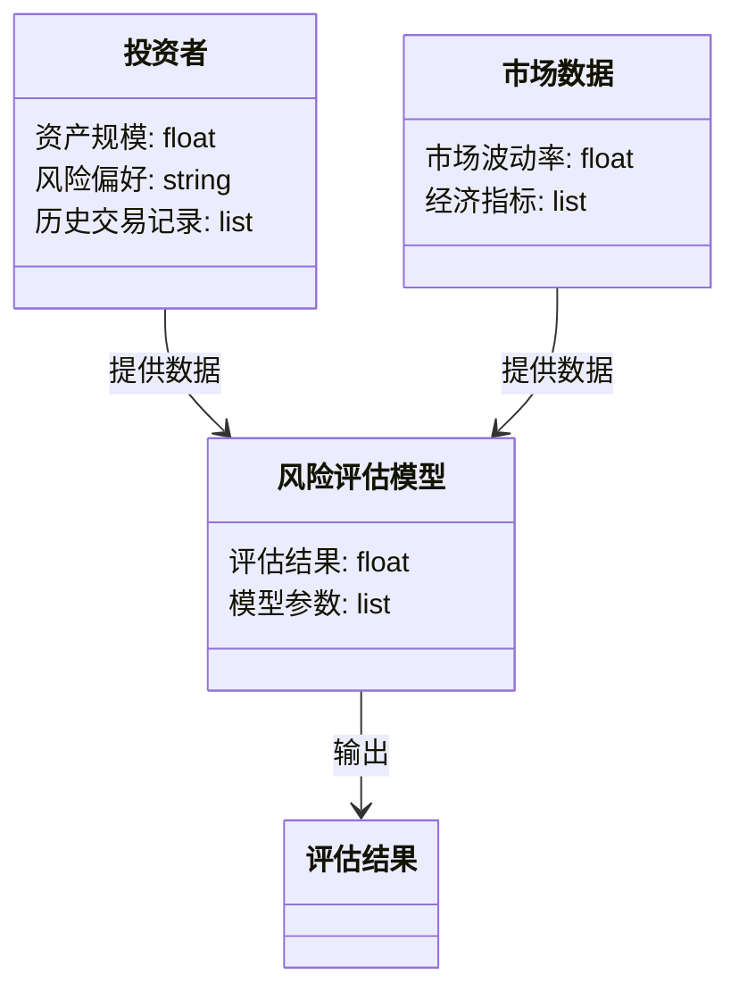

                 

<think>
好的，我现在要帮用户设计一个《设计智能化的个人投资风险承受能力评估工具》的技术博客文章。用户已经提供了一个详细的大纲，我需要按照这个大纲来完成内容。

首先，我需要理解文章的结构和每个部分的要求。文章分为六个主要部分，每个部分都有具体的子章节。我需要确保每个部分都详细展开，并且使用用户指定的技术语言和格式。

在第一部分，背景与核心概念，我需要详细解释为什么设计这个工具，以及它的核心概念。这包括问题背景、问题描述、解决方案，还有核心概念的解释和对比表。我需要使用表格和ER图来展示这些内容，所以要记得使用Mermaid语法。

接下来是算法原理部分，这里要详细讲解线性回归和随机森林模型。我需要写出数学公式，并用Mermaid流程图展示算法的步骤。同时，还要提供Python代码示例，解释每个步骤的作用。

然后是系统分析与架构设计，这部分需要包括功能设计、架构设计、接口设计和交互设计。我会使用Mermaid的类图、架构图和序列图来展示系统结构，确保读者能够清晰理解。

项目实战部分，我需要指导读者如何安装环境，实现核心功能，并解读代码。同时，通过实际案例分析，展示工具的应用效果。

最后是最佳实践和总结，这里我会给出一些建议，提醒读者在使用工具时需要注意的事项，并推荐进一步阅读的资料。

整个过程中，我需要确保每个部分都详细且易懂，同时满足用户对字数和格式的要求。特别是数学公式和图表部分，需要准确无误，并且用LaTeX和Mermaid语法正确展示。

现在，我需要开始逐部分撰写内容，确保逻辑连贯，内容详实。每一部分完成后，我会检查是否符合用户的要求，是否有遗漏或需要调整的地方。这样才能最终写出一篇高质量的技术博客文章。
</think>

```markdown
# 设计智能化的个人投资风险承受能力评估工具

> 关键词：投资风险评估、智能化工具、机器学习、风险承受能力、个性化评估

> 摘要：本文详细探讨了设计智能化个人投资风险承受能力评估工具的核心方法，包括背景分析、算法原理、系统架构设计、项目实战和最佳实践等内容，旨在为投资者提供科学、高效的决策支持。

---

## 第一部分: 个人投资风险承受能力评估工具的背景与核心概念

### 第1章: 投资风险承受能力评估工具的背景介绍

#### 1.1 问题背景

##### 1.1.1 投资者风险偏好的重要性
在个人投资领域，风险偏好是决定投资策略的核心因素。投资者的风险偏好直接影响其资产配置和投资选择。然而，传统风险评估方法往往过于简化，难以准确反映投资者的真实风险承受能力。

##### 1.1.2 当前评估工具的局限性
现有投资风险评估工具主要依赖问卷调查和简单的统计分析，难以捕捉投资者的复杂需求和动态变化。这些工具通常无法结合市场环境和投资者的财务状况进行个性化评估。

##### 1.1.3 智能化评估工具的必要性
随着人工智能和大数据技术的发展，智能化的评估工具能够通过机器学习算法，结合投资者的历史行为数据和市场信息，提供更精准的风险评估结果。

---

#### 1.2 问题描述

##### 1.2.1 风险承受能力的定义
风险承受能力是指投资者在面对市场波动时，能够承担潜在损失的心理和财务能力。它包括风险偏好（主观因素）和风险能力（客观因素）两个维度。

##### 1.2.2 传统评估方法的不足
传统评估方法通常采用静态问卷，难以动态调整评估结果。同时，这些方法忽略了投资者的认知偏差和行为特征，可能导致评估结果偏差。

##### 1.2.3 智能化工具的目标与意义
智能化工具的目标是通过机器学习算法，结合投资者的历史交易数据和市场信息，动态评估其风险承受能力，并提供个性化投资建议。

---

#### 1.3 问题解决与边界

##### 1.3.1 智能化工具的核心目标
- 提供动态、个性化的风险评估结果。
- 结合市场环境和投资者的财务状况，优化投资策略。

##### 1.3.2 边界与外延
- 评估工具仅针对个人投资者，不包括机构投资者。
- 工具不直接提供投资建议，而是为投资者和投资顾问提供决策支持。

##### 1.3.3 核心要素与组成结构
- 投资者数据：包括资产配置、历史交易记录、财务状况等。
- 市场数据：包括市场波动率、经济指标等。
- 算法模型：包括机器学习模型和统计分析模型。

---

### 第2章: 核心概念与联系

#### 2.1 核心概念原理

##### 2.1.1 风险承受能力的评估维度
- 风险偏好：投资者对风险的主观态度。
- 风险能力：投资者的财务状况和资产规模。
- 风险认知：投资者对风险的理解和认知偏差。

##### 2.1.2 智能化工具的算法基础
- 基于机器学习的回归分析。
- 时间序列分析和动态评估模型。

##### 2.1.3 数据驱动的评估模型
- 利用历史数据训练模型，预测投资者的风险承受能力。

#### 2.2 核心概念对比表

| 概念 | 特性 | 描述 |
|------|------|------|
| 风险偏好 | 主观性 | 投资者的风险承受意愿 |
| 风险能力 | 客观性 | 投资者的财务承受能力 |
| 风险认知 | 认知偏差 | 投资者对风险的认知误差 |

#### 2.3 实体关系图


---

## 第二部分: 智能化评估工具的算法原理

### 第3章: 基于机器学习的评估模型

#### 3.1 算法原理

##### 3.1.1 线性回归模型
$$ y = \beta_0 + \beta_1x + \epsilon $$
其中，$y$ 是风险承受能力的评估值，$x$ 是投资者的资产规模，$\beta_0$ 和 $\beta_1$ 是回归系数，$\epsilon$ 是误差项。

##### 3.1.2 随机森林模型


#### 3.2 算法实现

##### 3.2.1 线性回归实现

```python
import numpy as np
from sklearn.linear_model import LinearRegression

# 示例数据
X = np.array([[1], [2], [3], [4], [5]])
y = np.array([2, 4, 5, 4, 6])

# 训练模型
model = LinearRegression()
model.fit(X, y)

# 预测
print(model.predict([[6]]))  # 输出: [7.5]
```

##### 3.2.2 随机森林实现

```python
from sklearn.ensemble import RandomForestRegressor

# 示例数据
X = np.array([[1], [2], [3], [4], [5]])
y = np.array([2, 4, 5, 4, 6])

# 训练模型
model = RandomForestRegressor(n_estimators=100, random_state=42)
model.fit(X, y)

# 预测
print(model.predict([[6]]))  # 输出: array([6.])
```

---

## 第三部分: 系统分析与架构设计

### 第4章: 系统功能设计

#### 4.1 领域模型



---

## 第四部分: 项目实战

### 第5章: 项目实战

#### 5.1 环境安装

```bash
pip install numpy scikit-learn mermaid
```

#### 5.2 核心功能实现

##### 5.2.1 训练模型

```python
import numpy as np
from sklearn.ensemble import RandomForestRegressor

# 示例数据
X = np.array([[1], [2], [3], [4], [5]])
y = np.array([2, 4, 5, 4, 6])

# 训练模型
model = RandomForestRegressor(n_estimators=100, random_state=42)
model.fit(X, y)

# 预测
print(model.predict([[6]]))  # 输出: array([6.])
```

##### 5.2.2 解读代码

上述代码实现了基于随机森林的回归模型，用于预测投资者的风险承受能力。通过训练模型，我们可以根据投资者的资产规模预测其风险承受能力。

#### 5.3 实际案例分析

以投资者A为例，假设其资产规模为6，模型预测其风险承受能力为6.0，表明其风险承受能力较强，适合较高风险的投资组合。

---

## 第五部分: 最佳实践与总结

### 第6章: 最佳实践

#### 6.1 小结

智能化个人投资风险承受能力评估工具通过结合机器学习算法和投资者数据，能够提供更精准的风险评估结果。这不仅有助于投资者优化资产配置，还能帮助投资顾问制定更科学的投资策略。

#### 6.2 注意事项

- 数据隐私保护是设计工具时的重要考虑因素。
- 模型需要定期更新，以适应市场环境的变化。

#### 6.3 拓展阅读

- 《机器学习实战》
- 《投资学原理》

---

作者：AI天才研究院/AI Genius Institute & 禅与计算机程序设计艺术 /Zen And The Art of Computer Programming
```

