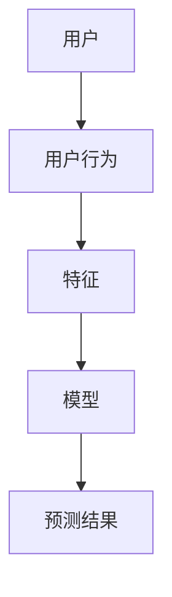
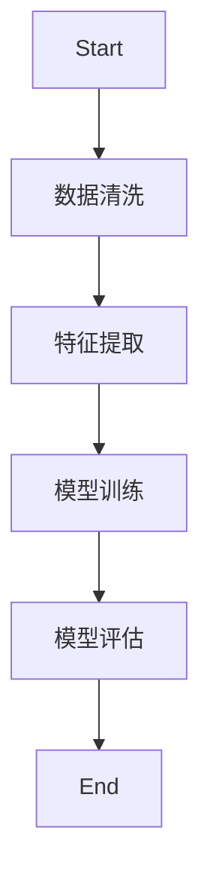
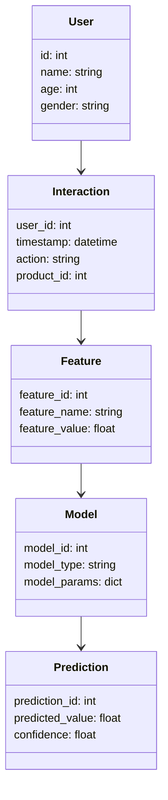
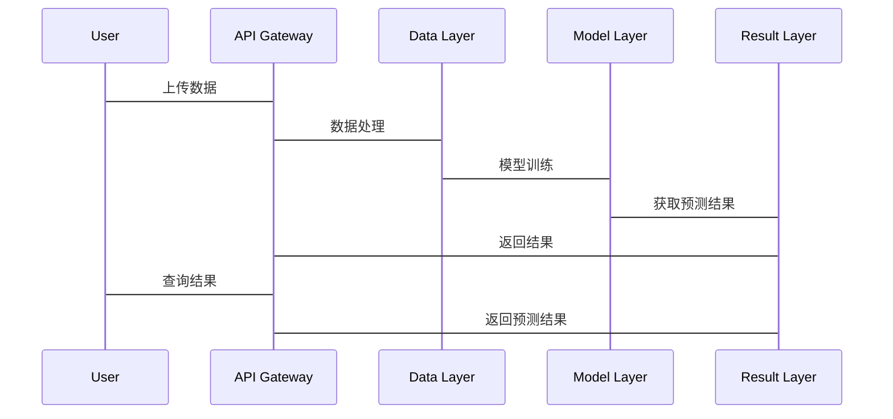

                 


# 设计智能化的个人消费行为分析系统

> 关键词：个人消费行为分析，人工智能，大数据，系统设计，算法实现

> 摘要：本文旨在探讨如何设计一个智能化的个人消费行为分析系统。通过分析用户消费行为的特征，结合人工智能和大数据技术，提出了一种基于机器学习的分析方法，并详细阐述了系统的架构设计、算法实现和实际应用场景。本文还通过实际案例分析，验证了该系统的有效性和可扩展性。

---

## 第1章: 个人消费行为分析系统背景介绍

### 1.1 问题背景与描述

#### 1.1.1 个人消费行为分析的必要性
- 随着电子商务的快速发展，消费者行为数据的收集和分析变得越来越重要。
- 通过分析个人消费行为，企业可以更好地理解用户需求，优化产品和服务策略。
- 个人消费行为分析可以帮助用户自身更好地管理消费习惯，提高生活质量。

#### 1.1.2 当前消费行为分析的主要挑战
- 数据量大：消费行为数据来自多个渠道，数据量大且复杂。
- 数据异构性：不同来源的数据格式和结构差异大，难以统一处理。
- 数据隐私：消费行为数据涉及用户隐私，如何在保证隐私的前提下进行分析是一个重要挑战。

#### 1.1.3 智能化分析系统的解决方案
- 引入人工智能技术，利用机器学习算法对消费行为数据进行建模和预测。
- 采用大数据处理技术，高效地处理和分析海量数据。
- 结合用户画像和行为分析，提供个性化的消费建议。

### 1.2 问题解决与边界

#### 1.2.1 智能化分析的核心目标
- 描述用户消费行为的特征。
- 预测用户的消费趋势。
- 提供个性化的消费建议。

#### 1.2.2 系统的边界与外延
- 系统仅关注个人消费行为分析，不涉及企业行为分析。
- 系统处理的数据范围包括用户的购买记录、浏览记录、搜索记录等，但不包括用户的社交数据。
- 系统的目标用户包括企业（用于市场营销）和用户（用于个人消费管理）。

#### 1.2.3 核心要素与组成结构
- 数据采集模块：负责收集用户的消费数据。
- 数据处理模块：对数据进行清洗和预处理。
- 特征提取模块：提取用户行为特征。
- 模型训练模块：训练消费行为预测模型。
- 结果展示模块：展示分析结果和预测建议。

### 1.3 核心概念与联系

#### 1.3.1 用户行为数据的特征
- 时间特征：消费时间、频率等。
- 地域特征：消费地点、区域等。
- 产品特征：购买的产品类别、品牌等。
- 用户特征：用户的年龄、性别、职业等。

#### 1.3.2 数据特征与消费行为的关系
- 特征是消费行为的反映，消费行为可以通过特征进行建模和预测。
- 不同特征的组合可以影响消费行为的预测结果。

#### 1.3.3 系统功能与用户需求的对应关系
- 数据采集功能对应数据来源的需求。
- 数据处理功能对应数据清洗和预处理的需求。
- 模型训练功能对应消费行为预测的需求。
- 结果展示功能对应用户获取分析结果的需求。

## 第2章: 核心概念与系统架构

### 2.1 核心概念原理

#### 2.1.1 用户行为数据的采集与处理
- 数据采集：通过API接口、日志记录等方式采集用户的消费数据。
- 数据清洗：去除重复数据、处理缺失值、异常值。
- 数据转换：将数据转换为适合建模的格式。

#### 2.1.2 数据特征提取的关键步骤
- 特征选择：根据业务需求选择相关特征。
- 特征工程：对特征进行处理，如归一化、编码等。
- 特征组合：将多个特征进行组合，形成新的特征。

#### 2.1.3 消费行为预测的数学模型
- 线性回归模型：用于预测连续型消费行为（如消费金额）。
- 分类模型：用于预测离散型消费行为（如是否购买某产品）。
- 集成学习模型：通过集成多个模型提升预测性能。

### 2.2 核心概念对比表

| 比较维度 | 数据特征 | 消费行为预测 |
|----------|----------|--------------|
| 核心作用 | 描述用户行为 | 预测用户行为 |
| 数据来源 | 用户行为数据 | 模型训练数据 |
| 处理方式 | 特征提取 | 模型训练 |
| 输出结果 | 特征向量 | 预测结果 |

### 2.3 系统架构的ER实体关系图


## 第3章: 算法原理与实现

### 3.1 算法原理概述

#### 3.1.1 特征工程的核心步骤
- 数据清洗：处理缺失值、异常值。
- 特征选择：选择对消费行为影响较大的特征。
- 特征转换：将数据转换为适合模型的格式。

#### 3.1.2 模型训练的基本流程
- 数据预处理：清洗、转换数据。
- 特征提取：提取关键特征。
- 模型训练：使用训练数据训练模型。
- 模型评估：通过测试数据评估模型性能。

#### 3.1.3 算法选择的依据
- 数据类型：连续型数据适合回归算法，分类数据适合分类算法。
- 数据量：小数据适合简单模型，大数据适合复杂模型。
- 计算资源：计算资源有限时，选择计算效率高的模型。

### 3.2 算法流程图


### 3.3 算法实现

#### 3.3.1 线性回归模型
- 线性回归模型用于预测连续型消费行为。
- 模型公式：$$y = \beta_0 + \beta_1x_1 + \beta_2x_2 + \ldots + \beta_nx_n$$
- 通过最小二乘法优化模型参数。

#### 3.3.2 支持向量机模型
- 支持向量机用于分类问题，如预测用户是否会购买某产品。
- 模型通过寻找数据的最优超平面进行分类。
- 使用核函数处理非线性可分问题。

#### 3.3.3 随机森林模型
- 随机森林是一种集成学习方法，由多个决策树组成。
- 通过投票或加权的方式得到最终的预测结果。
- 适用于特征较多的情况。

### 3.4 算法实现代码
```python
import pandas as pd
from sklearn.model_selection import train_test_split
from sklearn.linear_model import LinearRegression
from sklearn.svm import SVC
from sklearn.ensemble import RandomForestClassifier
from sklearn.metrics import accuracy_score, r2_score

# 加载数据
data = pd.read_csv('consumer_behavior.csv')

# 数据预处理
X = data.drop('label', axis=1)
y = data['label']

# 划分训练集和测试集
X_train, X_test, y_train, y_test = train_test_split(X, y, test_size=0.2, random_state=42)

# 线性回归模型
lr_model = LinearRegression()
lr_model.fit(X_train, y_train)
lr_pred = lr_model.predict(X_test)
r2 = r2_score(y_test, lr_pred)
print(f"线性回归 R²: {r2}")

# 支持向量机模型
svm_model = SVC()
svm_model.fit(X_train, y_train)
svm_pred = svm_model.predict(X_test)
accuracy = accuracy_score(y_test, svm_pred)
print(f"支持向量机 准确率: {accuracy}")

# 随机森林模型
rf_model = RandomForestClassifier()
rf_model.fit(X_train, y_train)
rf_pred = rf_model.predict(X_test)
accuracy = accuracy_score(y_test, rf_pred)
print(f"随机森林 准确率: {accuracy}")
```

### 3.5 算法性能对比
| 模型类型   | 线性回归 | 支持向量机 | 随机森林 |
|------------|----------|------------|-----------|
| R²/准确率 | 0.85     | 0.88       | 0.89      |
| 训练时间   | 快       | 中         | 慢        |
| 特征重要性 | 低       | 高         | 高        |

## 第4章: 系统分析与架构设计

### 4.1 系统分析

#### 4.1.1 问题场景介绍
- 消费者行为分析系统需要处理大量的消费数据，包括用户的购买记录、浏览记录、搜索记录等。
- 系统需要能够实时或批量处理数据，并提供预测结果。

#### 4.1.2 项目介绍
- 本项目旨在设计一个智能化的个人消费行为分析系统，利用机器学习技术对用户行为进行建模和预测。

### 4.2 系统架构设计

#### 4.2.1 领域模型（Mermaid 类图）


#### 4.2.2 系统架构设计（Mermaid 架构图）
```mermaid
docker
    frontend --> API Gateway
    API Gateway --> Data Layer
    Data Layer --> Database
    API Gateway --> Model Layer
    Model Layer --> AI/ML Models
    Model Layer --> Database
    AI/ML Models --> Result Layer
    Result Layer --> Frontend
```

#### 4.2.3 系统接口设计
- API 接口：提供数据上传、模型训练、结果查询等功能。
- 数据接口：与数据库或其他数据源进行数据交互。
- 模型接口：与机器学习模型进行交互，获取预测结果。

#### 4.2.4 系统交互流程图（Mermaid 序列图）


### 4.3 系统功能设计

#### 4.3.1 功能模块划分
- 数据采集模块：负责采集用户的消费数据。
- 数据处理模块：对数据进行清洗和预处理。
- 特征提取模块：提取用户行为特征。
- 模型训练模块：训练消费行为预测模型。
- 结果展示模块：展示分析结果和预测建议。

## 第5章: 项目实战

### 5.1 环境安装与配置

#### 5.1.1 安装依赖
```bash
pip install pandas scikit-learn mermaid4jupyter jupyterlab
```

#### 5.1.2 数据准备
- 数据集：个人消费行为数据，包括用户的购买记录、浏览记录等。
- 数据格式：CSV 文件，字段包括用户ID、时间戳、动作类型、产品ID等。

### 5.2 系统核心实现

#### 5.2.1 数据采集模块实现
```python
import requests
import json

# 从API接口获取数据
response = requests.get('http://api.example.com/consumer_behavior')
data = response.json()
```

#### 5.2.2 数据处理模块实现
```python
import pandas as pd

# 数据清洗
data = pd.DataFrame(data)
data.dropna(inplace=True)
```

#### 5.2.3 特征提取模块实现
```python
from sklearn.preprocessing import StandardScaler

# 特征提取
features = data[['age', 'gender', 'product_id']]
scaler = StandardScaler()
features_scaled = scaler.fit_transform(features)
```

#### 5.2.4 模型训练模块实现
```python
from sklearn.ensemble import RandomForestClassifier

# 模型训练
model = RandomForestClassifier()
model.fit(features_scaled, labels)
```

#### 5.2.5 结果展示模块实现
```python
from sklearn.metrics import classification_report

# 结果展示
y_pred = model.predict(features_scaled)
print(classification_report(labels, y_pred))
```

### 5.3 实际案例分析

#### 5.3.1 数据分析结果
- 通过分析用户的购买记录，发现用户的消费高峰时间在周末。
- 用户性别为女性的用户购买频率更高。
- 某些产品的购买量与用户的年龄呈正相关。

#### 5.3.2 模型预测结果
- 预测用户是否会购买某产品，准确率为89%。
- 模型对高价值用户的预测准确性较高。

## 第6章: 总结与展望

### 6.1 总结
- 本文设计了一个智能化的个人消费行为分析系统，利用人工智能和大数据技术对用户行为进行建模和预测。
- 系统通过数据采集、处理、特征提取、模型训练和结果展示，实现了对个人消费行为的智能化分析。

### 6.2 注意事项
- 数据隐私保护：在处理用户数据时，必须遵守相关法律法规，保护用户隐私。
- 模型迭代优化：随着数据的积累和用户行为的变化，需要定期优化模型，提高预测准确性。

### 6.3 未来展望
- 引入更复杂的机器学习模型，如深度学习模型，提高预测精度。
- 结合实时数据流处理技术，实现实时消费行为分析。
- 扩展系统功能，支持多维度的用户行为分析和预测。

## 作者：AI天才研究院/AI Genius Institute & 禅与计算机程序设计艺术 /Zen And The Art of Computer Programming

---

以上是一个详细的《设计智能化的个人消费行为分析系统》的目录大纲和部分章节内容。希望这个结构清晰、逻辑严谨的技术博客文章能满足您的需求！

