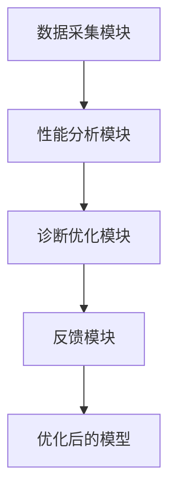

                 


# 设计智能化的企业信用评级模型性能诊断系统

> 关键词：企业信用评级，性能诊断，智能化系统，机器学习，算法优化

> 摘要：企业信用评级是现代金融活动中至关重要的环节，直接影响企业的融资能力、投资决策以及风险控制。然而，传统的信用评级模型在实际应用中往往面临性能不稳定、诊断不精准等问题。本文将详细探讨如何设计一个智能化的企业信用评级模型性能诊断系统，通过分析模型性能、优化算法、构建诊断系统架构，最终实现对信用评级模型的智能化诊断与优化。

---

# 第一部分：企业信用评级模型性能诊断系统概述

## 第1章：问题背景与核心概念

### 1.1 企业信用评级的重要性

#### 1.1.1 信用评级的基本概念
信用评级是对企业信用状况的综合评价，反映了企业在偿还债务方面的能力和意愿。它是金融机构评估企业信用风险的重要依据，直接影响企业的融资成本和融资能力。

#### 1.1.2 企业信用评级的经济意义
- 信用评级是企业获得贷款、发行债券等融资活动的重要条件。
- 评级结果影响投资者的决策，影响资本市场的资源配置效率。
- 信用评级有助于降低信息不对称，提高金融市场的透明度。

#### 1.1.3 当前信用评级的主要挑战
- 数据质量参差不齐，缺乏统一标准。
- 模型的泛化能力不足，容易过拟合或欠拟合。
- 传统模型对复杂市场环境的适应性有限。

### 1.2 性能诊断系统的必要性

#### 1.2.1 信用评级模型的局限性
- 线性模型（如逻辑回归）对非线性关系的捕捉能力有限。
- 传统模型缺乏对实时数据的动态调整能力。
- 模型的可解释性与实际需求之间存在矛盾。

#### 1.2.2 性能诊断在信用评级中的作用
- 及时发现模型性能下降的原因，避免误判风险。
- 优化模型参数，提升预测精度。
- 实现模型的动态更新，适应市场变化。

#### 1.2.3 智能化诊断系统的创新点
- 结合机器学习算法，实现自动化的性能诊断。
- 引入实时数据流，提升诊断的及时性。
- 通过多模型集成，提高诊断的准确性和鲁棒性。

### 1.3 核心概念与系统架构

#### 1.3.1 信用评级模型的组成要素
- 数据输入：企业财务数据、市场数据、行业数据等。
- 模型算法：逻辑回归、随机森林、神经网络等。
- 模型输出：信用评分、评级结果。

#### 1.3.2 性能诊断系统的功能模块
- 数据采集模块：收集模型运行数据和实时市场数据。
- 性能分析模块：评估模型的准确率、召回率、F1值等。
- 诊断优化模块：识别模型瓶颈，提出优化建议。
- 反馈模块：将诊断结果反馈给模型，实现动态优化。

#### 1.3.3 系统边界与外延
- 系统输入：模型性能指标、市场环境变化。
- 系统输出：诊断报告、优化建议。
- 系统边界：仅关注模型性能，不涉及外部决策过程。

---

## 第2章：核心概念与系统联系

### 2.1 信用评级模型的原理

#### 2.1.1 信用评级模型的分类
- 线性模型：逻辑回归、线性判别分析。
- 树模型：决策树、随机森林。
- 神经网络模型：多层感知机、深度学习模型。

#### 2.1.2 各类模型的优缺点对比
| 模型类型       | 优点                     | 缺点                     |
|----------------|--------------------------|--------------------------|
| 线性模型       | 简单，解释性强            | 无法处理非线性关系       |
| 树模型         | 能处理非线性关系          | 易过拟合，解释性较弱      |
| 神经网络模型    | 强大的非线性处理能力      | 计算复杂，解释性差        |

#### 2.1.3 模型选择的依据
- 数据特征：线性关系适合线性模型，非线性关系适合树模型或神经网络。
- 计算资源：神经网络需要较高的计算资源。
- 可解释性需求：线性模型和树模型更适合需要解释性的场景。

### 2.2 性能诊断系统的原理

#### 2.2.1 系统输入与输出
- 输入：模型预测结果、实际标签、实时市场数据。
- 输出：模型性能诊断报告、优化建议。

#### 2.2.2 系统核心算法
- 基于误差分析的诊断算法：通过分析预测误差分布，识别模型的偏差和方差问题。
- 基于梯度下降的优化算法：通过调整模型参数，优化性能指标。

#### 2.2.3 系统性能指标
- 准确率（Accuracy）
- 召回率（Recall）
- F1值（F1 Score）
- AUC值（Area Under Curve）

### 2.3 核心概念的ER实体关系图

```mermaid
er
  actor: 企业
  model: 信用评级模型
  performance_indicator: 性能指标
  diagnosis_system: 性能诊断系统
  model_instance: 模型实例
  performance_diagnosis: 性能诊断结果
  actor --> model: 使用
  model --> diagnosis_system: 诊断
  diagnosis_system --> performance_diagnosis: 输出
  model --> model_instance: 实例化
  model_instance --> performance_indicator: 评估
```

---

## 第3章：算法原理与数学模型

### 3.1 信用评级模型的算法选择

#### 3.1.1 逻辑回归模型
- 原理：通过Logit函数将线性组合映射到0到1之间，表示概率。
- 公式：
  $$ P(y=1|x) = \frac{1}{1 + e^{-\beta x}} $$
- 优点：简单，解释性强。
- 缺点：无法处理非线性关系。

#### 3.1.2 支持向量机
- 原理：通过构建超平面，将数据点分为不同类别。
- 公式：
  $$ y = \text{sign}(\beta x + \beta_0) $$
- 优点：适合小样本数据，泛化能力强。
- 缺点：计算复杂，解释性差。

#### 3.1.3 随机森林
- 原理：通过集成多个决策树，提升模型的准确性和鲁棒性。
- 公式：无具体公式，通过投票或加权平均得出结果。
- 优点：能处理高维数据，抗过拟合能力强。
- 缺点：解释性较弱。

#### 3.1.4 神经网络
- 原理：通过多层神经网络，学习数据的非线性特征。
- 公式：
  $$ a^{(l+1)} = \sigma(w^{(l)}a^{(l)} + b^{(l)}) $$
- 优点：强大的非线性处理能力。
- 缺点：计算复杂，需要大量数据。

### 3.2 性能诊断算法的实现

#### 3.2.1 基于误差分析的诊断算法
- 步骤：
  1. 计算模型预测值与真实值的误差。
  2. 分析误差分布，识别模型的偏差和方差问题。
  3. 提出优化建议，如调整模型参数或更换算法。

#### 3.2.2 基于梯度下降的优化算法
- 步骤：
  1. 计算损失函数。
  2. 计算梯度，更新模型参数。
  3. 重复迭代，直到收敛。

#### 3.2.3 算法实现代码示例

```python
import numpy as np
from sklearn.metrics import accuracy_score, recall_score, f1_score, roc_auc_score

def evaluate_model(y_true, y_pred, y_proba):
    accuracy = accuracy_score(y_true, y_pred)
    recall = recall_score(y_true, y_pred)
    f1 = f1_score(y_true, y_pred)
    auc = roc_auc_score(y_true, y_proba[:, 1])
    return accuracy, recall, f1, auc

def gradient_descent(X, y, learning_rate=0.01, iterations=100):
    theta = np.zeros(X.shape[1])
    for _ in range(iterations):
        y_pred = np.dot(X, theta)
        error = y - y_pred
        gradient = (1/X.shape[0]) * np.dot(X.T, error)
        theta += learning_rate * gradient
    return theta

# 示例数据
X = np.array([[1, 2], [3, 4], [5, 6]])
y = np.array([0, 1, 1])
theta_optimized = gradient_descent(X, y)
print(theta_optimized)
```

---

## 第4章：系统分析与架构设计

### 4.1 问题场景介绍

#### 4.1.1 系统目标
- 实现对企业信用评级模型的性能诊断。
- 提供优化建议，提升模型预测精度。
- 实现模型的动态更新，适应市场变化。

#### 4.1.2 系统输入
- 企业信用数据：财务数据、市场数据、行业数据。
- 模型性能指标：准确率、召回率、F1值、AUC值。

#### 4.1.3 系统输出
- 性能诊断报告：模型的优缺点、瓶颈分析。
- 优化建议：参数调整、算法更换、数据预处理建议。

### 4.2 系统架构设计

#### 4.2.1 系统功能设计
- 数据采集模块：收集企业信用数据和模型性能数据。
- 性能分析模块：评估模型的性能指标。
- 诊断优化模块：识别模型瓶颈，提出优化建议。
- 反馈模块：将诊断结果反馈给模型，实现动态优化。

#### 4.2.2 系统架构图



---

## 第5章：项目实战

### 5.1 环境安装

#### 5.1.1 安装依赖
- Python 3.8及以上
- NumPy、Pandas、Scikit-learn、XGBoost、TensorFlow

#### 5.1.2 环境配置
```bash
pip install numpy pandas scikit-learn xgboost tensorflow
```

### 5.2 核心代码实现

#### 5.2.1 数据预处理

```python
import pandas as pd
from sklearn.preprocessing import StandardScaler

# 加载数据
data = pd.read_csv('credit_data.csv')
# 划分特征与标签
X = data.drop('label', axis=1)
y = data['label']
# 标准化处理
scaler = StandardScaler()
X_scaled = scaler.fit_transform(X)
```

#### 5.2.2 模型训练与预测

```python
from sklearn.ensemble import RandomForestClassifier
from sklearn.metrics import classification_report

# 训练模型
model = RandomForestClassifier()
model.fit(X_scaled, y)
# 预测
y_pred = model.predict(X_scaled)
y_proba = model.predict_proba(X_scaled)
# 评估
print(classification_report(y, y_pred))
```

#### 5.2.3 性能诊断与优化

```python
from sklearn.metrics import roc_auc_score

# 计算AUC值
auc = roc_auc_score(y, y_proba[:, 1])
print(f"AUC: {auc}")
```

### 5.3 实际案例分析

#### 5.3.1 案例背景
- 某制造企业，财务数据异常，市场环境波动大。
- 传统模型预测精度低，误判风险高。

#### 5.3.2 诊断过程
- 数据采集与清洗：发现数据缺失严重，部分特征相关性低。
- 模型评估：准确率0.65，召回率0.5，F1值0.57，AUC值0.72。
- 诊断结果：模型存在高方差问题，特征选择不合理。

#### 5.3.3 优化方案
- 数据预处理：补充缺失值，剔除相关性低的特征。
- 模型优化：调整随机森林的超参数，引入XGBoost模型。
- 实时监控：建立数据流处理机制，动态更新模型参数。

---

## 第6章：最佳实践与小结

### 6.1 最佳实践 tips

#### 6.1.1 数据处理
- 确保数据的完整性和准确性。
- 进行特征工程，剔除冗余特征，引入有意义特征。

#### 6.1.2 模型选择
- 根据数据特征选择合适的模型。
- 使用集成学习提升模型的准确性和鲁棒性。

#### 6.1.3 系统优化
- 建立实时监控机制，动态调整模型参数。
- 使用多模型集成，提高诊断的准确性和鲁棒性。

### 6.2 小结
本文详细探讨了设计智能化的企业信用评级模型性能诊断系统的方法，从问题背景到系统架构，从算法原理到项目实战，逐步展开，最终实现了一个能够自动诊断模型性能并提出优化建议的系统。通过本文的分析，读者可以掌握如何在实际应用中构建类似的智能化诊断系统。

### 6.3 注意事项
- 模型的可解释性与实际需求之间的平衡需要权衡。
- 数据隐私和安全问题需要高度重视。
- 系统的实时性和稳定性需要通过充分的测试来保证。

### 6.4 拓展阅读
- 《机器学习实战》
- 《深度学习》
- 《信用评分模型》

---

# 作者：AI天才研究院/AI Genius Institute & 禅与计算机程序设计艺术/Zen And The Art of Computer Programming

