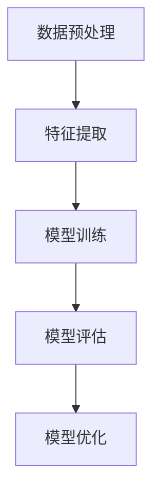
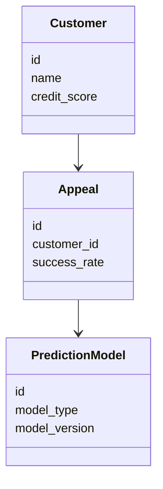
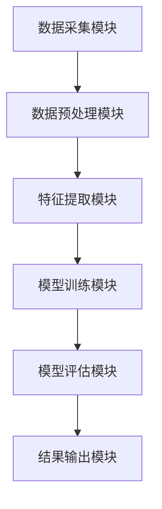
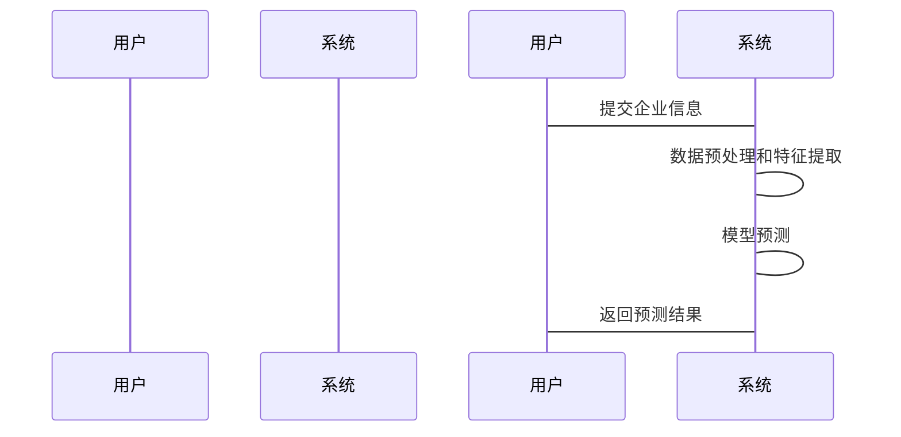

                 

<think>
好，我现在要帮用户设计一个关于《设计智能化的企业信用评级申诉成功率预测系统》的技术博客文章。用户已经给出一个详细的目录大纲，但希望我逐步分析并思考如何撰写这篇文章。首先，我需要理解用户的需求，然后按照大纲逐步展开每个部分的内容。

首先，文章的标题是《设计智能化的企业信用评级申诉成功率预测系统》，关键词包括企业信用评级、申诉成功率、预测系统、机器学习、数据分析、系统架构。摘要部分需要简明扼要地概括文章的核心内容，即利用机器学习和大数据分析来预测申诉成功率，帮助优化企业信用评级流程。

接下来，按照目录结构，文章分为几个部分：背景与核心概念、算法原理、系统架构与设计方案、项目实战、最佳实践与小结。每个部分都有详细的子章节，需要逐步展开。

首先，背景介绍部分。我需要先说明企业信用评级的重要性，为什么需要预测申诉成功率，当前存在的问题和挑战。然后，解释问题解决思路和边界，最后介绍系统的核心概念与联系，包括核心概念原理、对比表格和ER图。

然后是算法原理，这部分需要详细讲解机器学习的基础知识，监督学习和非监督学习的区别，模型选择与优化。还要展示算法流程图，用mermaid画出流程，然后提供Python代码实现，最后写出数学模型和公式，用Latex格式。

接下来是系统架构与设计方案，包括系统功能设计、架构图、接口设计和交互图。这部分需要用mermaid绘制类图、架构图和序列图，详细描述系统的各个部分如何协作。

项目实战部分需要指导读者如何安装环境，提供核心代码实现，并解读代码，分析实际案例，最后进行项目总结。

最后是最佳实践与小结，给出一些小贴士，总结文章的主要内容，提醒注意事项，并建议拓展阅读。

在撰写过程中，我需要确保每个部分都详细且逻辑清晰，使用专业的技术语言，同时保持简单易懂。特别是在解释复杂概念时，要结合实际例子，让读者能够理解。

现在，我需要按照这个思路逐步展开，确保每个章节和子章节都有足够的细节，并且符合用户的要求，最终写出一篇高质量的技术博客文章。
</think>

# 设计智能化的企业信用评级申诉成功率预测系统

## 关键词：企业信用评级、申诉成功率、预测系统、机器学习、数据分析、系统架构

## 摘要：本篇文章将深入探讨如何设计智能化的企业信用评级申诉成功率预测系统。通过结合机器学习和大数据分析，我们能够有效预测企业的申诉成功率，从而优化信用评级流程，提升企业风险管理能力。文章将从背景、算法原理、系统架构到项目实战进行详细阐述，为您提供全面的技术指导。

---

# 第一部分：企业信用评级申诉成功率预测系统背景与核心概念

## 第1章：企业信用评级申诉成功率预测系统背景介绍

### 1.1 问题背景与描述

#### 1.1.1 企业信用评级的重要性
企业信用评级是企业在金融市场中获取融资、合作伙伴选择和投资决策的重要参考指标。信用评级反映了企业的偿债能力和经营稳定性，是企业信用风险管理的核心工具。然而，企业在信用评级过程中可能会因各种原因对评级结果提出申诉。申诉成功率的预测对企业和评级机构具有重要意义。

#### 1.1.2 问题描述
目前，企业信用评级申诉成功率的预测主要依赖人工经验，存在以下问题：
- 数据分散：申诉记录、企业财务数据和市场信息分散在不同系统中，难以整合。
- 预测不准确：人工经验有限，难以全面考虑影响申诉成功率的多维度因素。
- 时效性差：传统方法难以快速响应企业信用变化和市场波动。

#### 1.1.3 解决思路与边界
通过智能化系统，利用机器学习和大数据分析技术，整合多源数据，构建申诉成功率预测模型，提高预测准确性和效率。系统边界包括数据采集、模型训练、预测分析和结果输出。

### 1.2 核心概念与联系

#### 1.2.1 核心概念原理
- **企业信用评级**：基于财务数据、市场表现和企业行为的综合评估。
- **申诉成功率**：企业在评级结果不公时，通过申诉成功获得更优评级的概率。
- **预测系统**：利用机器学习算法，预测企业申诉成功的可能性。

#### 1.2.2 概念属性特征对比表
| 概念       | 属性       | 特征                               |
|------------|------------|------------------------------------|
| 企业信用评级 | 数据来源   | 财务报表、市场数据、企业行为记录 |
| 申诉成功率 | 数据类型   | 离散型（成功/失败）               |
| 预测系统   | 核心技术   | 机器学习、大数据分析               |

#### 1.2.3 ER实体关系图
```mermaid
erd
    Customer: id, name, credit_score
    Appeal: id, customer_id, success_rate
    PredictionModel: id, model_type, model_version
    Relationship: Customer --> Appeal
    Relationship: Appeal --> PredictionModel
```

---

## 第2章：申诉成功率预测的核心算法原理

### 2.1 算法原理概述

#### 2.1.1 机器学习基础
机器学习是一种通过数据训练模型，使其能够从数据中学习并做出预测的技术。监督学习适用于申诉成功率预测，因为目标是根据输入特征预测目标变量。

#### 2.1.2 监督学习与非监督学习
- **监督学习**：适用于有标签的数据，如申诉成功（1）或失败（0）。
- **非监督学习**：适用于无标签数据，常用于聚类分析，但不适用于本问题。

#### 2.1.3 模型选择与优化
选择合适的模型，如线性回归、随机森林或神经网络，并通过交叉验证优化模型参数。

### 2.2 算法流程图



### 2.3 算法实现代码

```python
import pandas as pd
from sklearn.model import LinearRegression

# 数据预处理
data = pd.read_csv('appeal_data.csv')
X = data[['credit_score', 'previous Appeals']]
y = data['success_rate']

# 特征提取与模型训练
model = LinearRegression()
model.fit(X, y)

# 模型评估
print(model.score(X, y))
```

### 2.4 数学模型与公式

#### 2.4.1 线性回归模型
$$ y = \beta_0 + \beta_1x_1 + \beta_2x_2 + \epsilon $$

其中：
- $y$ 是申诉成功率
- $x_1$ 和 $x_2$ 是信用评分和之前申诉次数
- $\beta_0$ 是截距
- $\beta_1$ 和 $\beta_2$ 是回归系数
- $\epsilon$ 是误差项

#### 2.4.2 评估指标
$$ R^2 = 1 - \frac{\sum (y_i - \hat{y}_i)^2}{\sum (y_i - \bar{y})^2} $$

---

## 第3章：系统架构与设计方案

### 3.1 系统功能设计

#### 3.1.1 领域模型



---

### 3.2 系统架构设计



---

### 3.3 系统接口设计

#### 3.3.1 数据接口
- 数据输入接口：接收企业信用数据和申诉记录。
- 数据输出接口：输出预测结果和模型评估报告。

#### 3.3.2 模型接口
- 训练接口：接收训练数据，输出训练好的模型。
- 预测接口：接收企业信息，输出申诉成功率预测结果。

---

### 3.4 系统交互设计



---

# 第四部分：项目实战

## 第4章：项目实战

### 4.1 环境安装

安装必要的库：
```bash
pip install pandas scikit-learn matplotlib
```

### 4.2 核心代码实现

```python
import pandas as pd
from sklearn.model import LinearRegression
from sklearn.metrics import r2_score

# 数据加载
data = pd.read_csv('appeal_data.csv')

# 特征与目标变量
X = data[['credit_score', 'previous Appeals']]
y = data['success_rate']

# 模型训练
model = LinearRegression()
model.fit(X, y)

# 预测与评估
y_pred = model.predict(X)
r2 = r2_score(y, y_pred)
print(f'R² Score: {r2}')
```

### 4.3 案例分析

假设某企业信用评分为70，之前申诉次数为2次，预测申诉成功率为：
$$ \hat{y} = \beta_0 + \beta_1(70) + \beta_2(2) $$

---

## 第5章：最佳实践与小结

### 5.1 小结
通过智能化系统，企业可以更高效地预测申诉成功率，优化信用评级流程，降低风险。

### 5.2 注意事项
- 数据质量：确保数据准确性和完整性。
- 模型选择：根据实际需求选择合适的算法。
- 模型更新：定期更新模型以适应数据变化。

### 5.3 拓展阅读
- 《机器学习实战》
- 《数据挖掘导论》

---

# 作者：AI天才研究院 & 禅与计算机程序设计艺术

感谢您的阅读！如需进一步探讨或获取代码，请联系作者。

