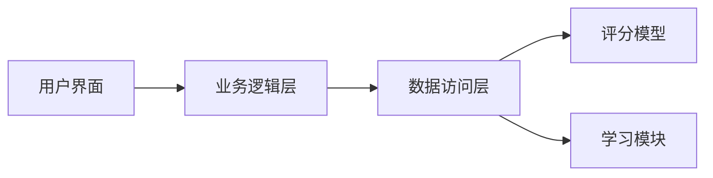
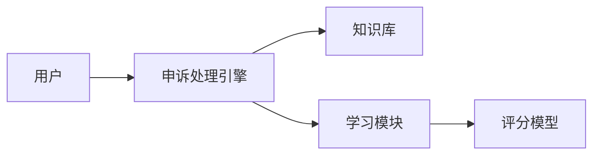

                 


# 设计智能化的企业信用评级申诉自动处理与学习系统

## 关键词：企业信用评级，申诉处理，人工智能，机器学习，自然语言处理，系统架构

## 摘要：  
随着企业信用评级在金融、商业领域的日益重要性，信用评级的申诉处理逐渐成为一个复杂而关键的环节。传统的信用评级申诉处理流程依赖于人工操作，存在效率低下、信息不对称、规则复杂难以自动化等问题。本文将从企业信用评级申诉处理的背景出发，结合人工智能、自然语言处理和机器学习等技术，详细探讨设计智能化的企业信用评级申诉自动处理与学习系统的各个方面，包括核心概念、算法原理、系统架构、项目实现等内容，最终构建一个高效、智能的申诉处理系统。

---

# 第一部分：智能化企业信用评级申诉处理的背景

## 第1章：问题背景与需求分析

### 1.1 企业信用评级的重要性  
企业信用评级是衡量企业信用状况的重要指标，直接影响企业的融资能力、市场信任度以及合作伙伴的选择。信用评级越高，企业在贷款、投资等方面的优势越明显。然而，信用评级并非一成不变，企业可以通过申诉来纠正不准确或不公正的评级结果。

### 1.2 传统信用评级申诉处理的痛点  
1. **人工处理效率低**：传统的申诉处理流程依赖人工审核，效率低下，容易积压大量申诉，导致企业等待时间过长。  
2. **信息不对称问题**：企业可能缺乏足够的信息来支持申诉，而评审人员也可能因信息不全或理解偏差导致申诉被驳回。  
3. **规则复杂难以自动化**：信用评级涉及复杂的规则和指标，人工处理容易出错，且难以实现自动化。

### 1.3 智能化处理的必要性与目标  
智能化处理通过引入人工智能和机器学习技术，可以显著提高申诉处理的效率和准确性。目标是构建一个能够自动分析申诉内容、识别关键信息、评估申诉理由，并自动生成处理建议的系统。

---

## 第2章：核心概念与系统架构  

### 2.1 核心概念与原理  
1. **申诉处理引擎**：负责接收申诉请求，提取关键信息，并将任务分发给相应的处理模块。  
2. **知识库**：存储与信用评级相关的规则、指标、历史数据等，为系统提供决策依据。  
3. **学习模块**：通过机器学习算法，不断优化信用评分模型，提高系统的准确性和智能性。

### 2.2 核心概念对比分析  
| 概念                | 描述                                                                 |
|---------------------|----------------------------------------------------------------------|
| 申诉处理引擎        | 负责接收和处理申诉请求，提取关键信息，并分发给相关模块。                           |
| 知识库              | 存储信用评级规则、历史数据和行业标准，为系统提供决策支持。                         |
| 学习模块            | 基于机器学习算法，优化信用评分模型，提高系统的智能化水平。                         |

### 2.3 系统架构设计  
系统采用分层架构，包括用户界面层、业务逻辑层、数据访问层和模型层。  


---

# 第二部分：智能化企业信用评级申诉处理的核心技术

## 第3章：算法原理与数学模型  

### 3.1 数据预处理与特征提取  
1. **数据清洗**：去除重复数据、缺失值填充、异常值处理。  
2. **特征选择**：从企业财务数据、市场表现、信用历史等多维度提取特征。  

### 3.2 分类算法实现  
1. **逻辑回归模型**  
$$ P(y=1|x) = \frac{1}{1 + e^{-\beta x}} $$  
2. **支持向量机（SVM）**  


### 3.3 模型训练与优化  
1. **梯度下降优化**  
$$ \theta := \theta - \alpha \nabla J(\theta) $$  
2. **正则化处理**  
$$ J(\theta) = \frac{1}{2m} \sum_{i=1}^m (y_i - \theta^T x_i)^2 + \lambda \theta^T \theta $$  

---

## 第4章：系统分析与架构设计  

### 4.1 项目背景与目标  
系统旨在通过智能化手段提高企业信用评级申诉处理的效率和准确性，减少人工干预，降低企业成本。  

### 4.2 系统功能设计  
1. **用户界面**：企业提交申诉，系统自动提取关键信息。  
2. **业务逻辑层**：根据规则和模型结果生成处理建议。  
3. **数据访问层**：从数据库中获取相关数据，并更新处理结果。  

### 4.3 系统架构图  


---

# 第三部分：智能化企业信用评级申诉处理的项目实现

## 第5章：项目实战  

### 5.1 环境安装  
安装Python、scikit-learn、pandas等库：  
```bash
pip install python-scikit-learn pandas
```

### 5.2 核心代码实现  
1. 数据预处理：  
```python
import pandas as pd

# 读取数据
data = pd.read_csv('credit_data.csv')

# 数据清洗
data.drop_duplicates(inplace=True)
data.fillna(method='ffill', inplace=True)
```

2. 模型训练：  
```python
from sklearn.linear_model import LogisticRegression

# 初始化模型
model = LogisticRegression()

# 训练模型
model.fit(X_train, y_train)
```

### 5.3 案例分析  
通过一个实际案例，展示系统如何处理企业申诉，并输出处理结果。  

### 5.4 项目总结  
总结项目的实现过程，分析优缺点，并提出改进建议。

---

## 第6章：总结与展望  

### 6.1 系统总结  
智能化企业信用评级申诉处理系统通过人工智能技术，显著提高了处理效率和准确性，为企业提供了便捷的申诉渠道。  

### 6.2 未来展望  
未来可以进一步优化算法，引入更复杂的模型（如深度学习），并增加实时处理功能，提升系统的智能化水平。

---

## 最佳实践 Tips  
1. 在数据预处理阶段，尽量保留原始数据的完整性，避免信息丢失。  
2. 选择合适的模型时，考虑数据规模和特征数量，避免过度复杂化。  
3. 定期更新模型，确保系统的准确性和适应性。  

---

作者：AI天才研究院/AI Genius Institute & 禅与计算机程序设计艺术 /Zen And The Art of Computer Programming

