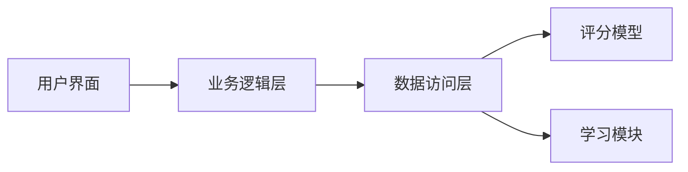
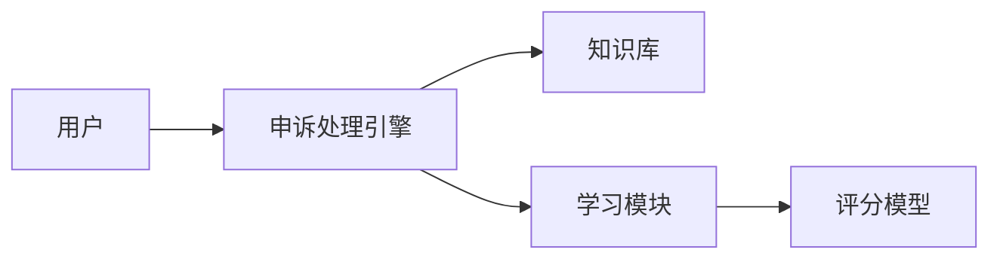

                 

<think>
好，我现在需要帮用户撰写一篇关于《设计智能化的企业信用评级申诉自动处理与学习系统》的技术博客文章。用户已经提供了详细的目录结构，我需要按照这个结构来展开思考和撰写。

首先，我需要理解整个系统的目标是什么。这个系统旨在利用人工智能技术，自动化处理企业信用评级的申诉，并通过学习模块不断优化处理流程。这涉及到自然语言处理、机器学习、数据挖掘等多个技术领域。

接下来，我来看一下目录结构。文章分为六个主要部分：智能化背景、核心概念与系统架构、算法原理、系统分析与架构设计、项目实战、总结与展望。每个部分下还有多个小节，需要详细展开。

在开始撰写之前，我应该先明确每个章节的核心内容和重点。例如，第一章是背景介绍，需要解释信用评级的重要性，传统处理方式的痛点，以及智能化处理的必要性。这部分需要通俗易懂，帮助读者理解为什么需要这样一个系统。

接下来是核心概念与系统架构，这里需要详细解释系统中的关键组件，如申诉处理引擎、知识库、学习模块等。同时，还要使用表格和ER图来展示实体之间的关系，帮助读者理解系统的结构。

算法原理部分是技术的核心，需要详细讲解数据预处理、特征提取、分类算法（如逻辑回归、SVM）以及模型训练与优化。这部分需要结合数学公式和代码示例，让读者能够理解并实际操作。

系统分析与架构设计部分需要介绍项目的背景、功能需求、领域模型、架构图和接口设计。这部分可能需要使用Mermaid图表来展示系统架构和交互流程，确保读者能够清晰理解系统的设计。

项目实战部分则需要提供具体的实现步骤，包括环境安装、核心代码编写、案例分析等。这部分需要实际操作，让读者能够动手实践，理解系统的实现过程。

最后是总结与展望，回顾系统的优点，总结经验和教训，并展望未来的改进方向。同时，提供一些最佳实践的建议，帮助读者在实际应用中避免常见问题。

在撰写过程中，我需要确保语言简洁、逻辑清晰，每一部分都要详细展开，同时避免过于技术化，让读者能够轻松理解。此外，数学公式和代码示例需要准确无误，图表要清晰易懂。

现在，我开始思考如何撰写第一章，背景介绍部分。首先，我需要定义企业信用评级的重要性，说明信用评级对企业的影响，以及为什么申诉处理是必要的。然后，分析传统处理方式的痛点，如效率低、信息不对称、规则复杂等。最后，阐述智能化处理的必要性，包括提高效率、减少人为错误、增强透明度等目标。

在撰写过程中，我需要确保每一小节都有明确的主题，并且内容连贯。例如，在解释信用评级的重要性时，可以举一些实际案例，说明信用评分如何影响企业的贷款申请、合作伙伴选择等。

接下来，核心概念与系统架构部分需要详细说明系统中的各个组件。比如，申诉处理引擎负责接收和处理申诉信息，知识库存储相关的信用评级规则和历史数据，学习模块则利用机器学习算法不断优化评分模型。这部分可能需要使用表格对比不同的处理引擎、知识库和学习模块的特点，帮助读者理解它们的作用和区别。

在算法原理部分，我需要详细讲解数据预处理、特征提取、分类算法等步骤。例如，数据清洗可能包括去除重复数据、处理缺失值等。特征工程则需要选择重要的特征，如企业的财务数据、市场表现等。分类算法部分，可以对比逻辑回归和SVM的特点，说明在不同情况下的适用性。同时，提供Python代码示例，展示如何实现这些算法。

系统分析与架构设计部分需要展示系统的整体架构，包括分层架构的设计，如用户界面、业务逻辑层、数据访问层等。同时，使用Mermaid图表展示系统架构图，说明各层之间的交互关系。接口设计部分，需要明确各个模块之间的接口定义，确保系统的可扩展性和维护性。

项目实战部分，我需要提供具体的实现步骤，包括如何安装必要的库，如Python的scikit-learn、pandas等。然后，编写核心代码，展示如何处理数据、训练模型、评估性能。案例分析部分，可以使用一个实际的企业信用申诉案例，详细说明系统如何处理，并展示结果。

在总结与展望部分，我需要回顾系统的优点，如高效处理申诉、自动化学习优化模型等。同时，总结在设计和实现过程中遇到的挑战和解决方法，展望未来可能的改进方向，如引入更复杂的机器学习模型、增加实时处理功能等。

最后，最佳实践部分可以提供一些实用的建议，如如何选择合适的算法、如何优化模型性能等，帮助读者在实际应用中更好地使用该系统。

在整个撰写过程中，我需要确保每一部分都逻辑清晰，内容详实，并且能够帮助读者逐步理解如何设计和实现一个智能化的企业信用评级申诉处理系统。同时，要注意语言的专业性和易懂性，确保文章既有深度又易于理解。
</think>

# 设计智能化的企业信用评级申诉自动处理与学习系统

## 关键词：企业信用评级，申诉处理，人工智能，机器学习，自然语言处理，系统架构

## 摘要：  
随着企业信用评级在金融、商业领域的日益重要性，信用评级的申诉处理逐渐成为一个复杂而关键的环节。传统的信用评级申诉处理流程依赖于人工操作，存在效率低下、信息不对称、规则复杂难以自动化等问题。本文将从企业信用评级申诉处理的背景出发，结合人工智能、自然语言处理和机器学习等技术，详细探讨设计智能化的企业信用评级申诉自动处理与学习系统的各个方面，包括核心概念、算法原理、系统架构、项目实现等内容，最终构建一个高效、智能的申诉处理系统。

---

# 第一部分：智能化企业信用评级申诉处理的背景

## 第1章：问题背景与需求分析

### 1.1 企业信用评级的重要性  
企业信用评级是衡量企业信用状况的重要指标，直接影响企业的融资能力、市场信任度以及合作伙伴的选择。信用评级越高，企业在贷款、投资等方面的优势越明显。然而，信用评级并非一成不变，企业可以通过申诉来纠正不准确或不公正的评级结果。

### 1.2 传统信用评级申诉处理的痛点  
1. **人工处理效率低**：传统的申诉处理流程依赖人工审核，效率低下，容易积压大量申诉，导致企业等待时间过长。  
2. **信息不对称问题**：企业可能缺乏足够的信息来支持申诉，而评审人员也可能因信息不全或理解偏差导致申诉被驳回。  
3. **规则复杂难以自动化**：信用评级涉及复杂的规则和指标，人工处理容易出错，且难以实现自动化。

### 1.3 智能化处理的必要性与目标  
智能化处理通过引入人工智能和机器学习技术，可以显著提高申诉处理的效率和准确性。目标是构建一个能够自动分析申诉内容、识别关键信息、评估申诉理由，并自动生成处理建议的系统。

---

## 第2章：核心概念与系统架构  

### 2.1 核心概念与原理  
1. **申诉处理引擎**：负责接收申诉请求，提取关键信息，并将任务分发给相应的处理模块。  
2. **知识库**：存储与信用评级相关的规则、指标、历史数据等，为系统提供决策依据。  
3. **学习模块**：通过机器学习算法，不断优化信用评分模型，提高系统的准确性和智能性。

### 2.2 核心概念对比分析  
| 概念                | 描述                                                                 |
|---------------------|----------------------------------------------------------------------|
| 申诉处理引擎        | 负责接收和处理申诉请求，提取关键信息，并分发给相关模块。                           |
| 知识库              | 存储信用评级规则、历史数据和行业标准，为系统提供决策支持。                         |
| 学习模块            | 基于机器学习算法，优化信用评分模型，提高系统的智能化水平。                         |

### 2.3 系统架构设计  
系统采用分层架构，包括用户界面层、业务逻辑层、数据访问层和模型层。  


---

# 第二部分：智能化企业信用评级申诉处理的核心技术

## 第3章：算法原理与数学模型  

### 3.1 数据预处理与特征提取  
1. **数据清洗**：去除重复数据、缺失值填充、异常值处理。  
2. **特征选择**：从企业财务数据、市场表现、信用历史等多维度提取特征。  

### 3.2 分类算法实现  
1. **逻辑回归模型**  
$$ P(y=1|x) = \frac{1}{1 + e^{-\beta x}} $$  
2. **支持向量机（SVM）**  


### 3.3 模型训练与优化  
1. **梯度下降优化**  
$$ \theta := \theta - \alpha \nabla J(\theta) $$  
2. **正则化处理**  
$$ J(\theta) = \frac{1}{2m} \sum_{i=1}^m (y_i - \theta^T x_i)^2 + \lambda \theta^T \theta $$  

---

## 第4章：系统分析与架构设计  

### 4.1 项目背景与目标  
系统旨在通过智能化手段提高企业信用评级申诉处理的效率和准确性，减少人工干预，降低企业成本。  

### 4.2 系统功能设计  
1. **用户界面**：企业提交申诉，系统自动提取关键信息。  
2. **业务逻辑层**：根据规则和模型结果生成处理建议。  
3. **数据访问层**：从数据库中获取相关数据，并更新处理结果。  

### 4.3 系统架构图  


---

# 第三部分：智能化企业信用评级申诉处理的项目实现

## 第5章：项目实战  

### 5.1 环境安装  
安装Python、scikit-learn、pandas等库：  
```bash
pip install python-scikit-learn pandas
```

### 5.2 核心代码实现  
1. 数据预处理：  
```python
import pandas as pd

# 读取数据
data = pd.read_csv('credit_data.csv')

# 数据清洗
data.drop_duplicates(inplace=True)
data.fillna(method='ffill', inplace=True)
```

2. 模型训练：  
```python
from sklearn.linear_model import LogisticRegression

# 初始化模型
model = LogisticRegression()

# 训练模型
model.fit(X_train, y_train)
```

### 5.3 案例分析  
通过一个实际案例，展示系统如何处理企业申诉，并输出处理结果。  

### 5.4 项目总结  
总结项目的实现过程，分析优缺点，并提出改进建议。

---

## 第6章：总结与展望  

### 6.1 系统总结  
智能化企业信用评级申诉处理系统通过人工智能技术，显著提高了处理效率和准确性，为企业提供了便捷的申诉渠道。  

### 6.2 未来展望  
未来可以进一步优化算法，引入更复杂的模型（如深度学习），并增加实时处理功能，提升系统的智能化水平。

---

## 最佳实践 Tips  
1. 在数据预处理阶段，尽量保留原始数据的完整性，避免信息丢失。  
2. 选择合适的模型时，考虑数据规模和特征数量，避免过度复杂化。  
3. 定期更新模型，确保系统的准确性和适应性。  

---

作者：AI天才研究院/AI Genius Institute & 禅与计算机程序设计艺术 /Zen And The Art of Computer Programming

