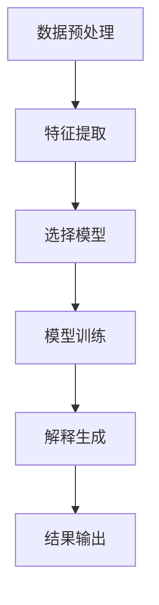
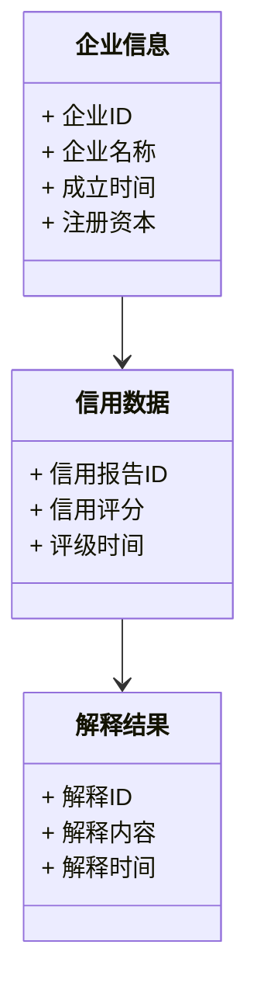
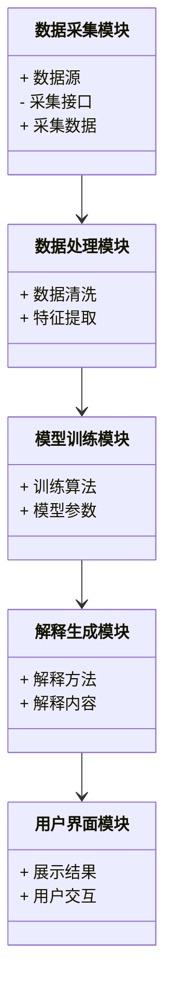

                 

<think>
好，我现在需要帮助用户设计一本名为《设计智能化的企业信用评级解释系统》的详细技术博客文章。用户已经提供了一个目录大纲，我需要根据这个大纲，逐步思考并生成完整的文章内容。

首先，我需要明确文章的核心主题：设计一个智能化的企业信用评级解释系统。这意味着我需要涵盖背景介绍、核心概念、算法原理、系统架构、项目实战和最佳实践等多个部分。

### 第一部分：企业信用评级解释系统背景与核心概念

#### 第1章：企业信用评级解释系统背景介绍

1. **问题背景与问题描述**
   - 传统信用评级的局限性：如依赖人工判断、数据单一、解释性差等。
   - 智能化评级的需求：如何利用AI和大数据提升信用评估的准确性和可解释性。
   - 目标：开发一个智能化的信用评级解释系统，能够自动分析企业数据并生成可信赖的评级结果。

2. **核心概念与问题解决**
   - 信用评级的核心要素：财务数据、市场表现、法律记录、管理能力等。
   - 系统的功能定位：提供自动化、智能化的信用评级和解释功能。
   - 解决的关键问题：提高评级效率、增强结果的可解释性、降低人为错误。

#### 第2章：核心概念与系统架构

1. **核心概念原理**
   - 数据来源：企业财务报表、市场数据、新闻报道等。
   - 模型算法：如机器学习模型，用于分析数据并生成评分。
   - 解释系统：将模型输出转化为人类可理解的解释。

2. **核心概念对比**
   - 数据特征对比：结构化数据 vs 非结构化数据。
   - 模型性能对比：传统模型 vs AI模型。
   - 解释能力对比：简单模型 vs 复杂模型。

3. **ER实体关系图**
   ```mermaid
   er
       entity 企业信息 {
           key 企业ID
           attribute 企业名称, 成立时间, 注册资本
       }
       entity 信用数据 {
           key 信用报告ID
           attribute 企业ID, 信用评分, 评级时间
       }
       entity 解释结果 {
           key 解释ID
           attribute 信用报告ID, 解释内容, 解释时间
       }
       relationship 企业信息 --> 信用数据: 提供
       relationship 信用数据 --> 解释结果: 生成
   ```

### 第二部分：算法原理与数学模型

#### 第3章：算法原理与实现

1. **算法原理**
   - 选择模型：如逻辑回归、随机森林等，用于分类任务。
   - 模型训练：使用企业数据训练模型，优化参数。
   - 解释方法：如LIME或SHAP，用于解释模型输出。

2. **算法流程图**
   ```mermaid
   graph TD
       A[数据预处理] --> B[特征提取]
       B --> C[选择模型]
       C --> D[模型训练]
       D --> E[解释生成]
       E --> F[结果输出]
   ```

3. **数学模型**
   - 逻辑回归模型：使用sigmoid函数，损失函数为交叉熵。
   - 示例：$$ P(y=1|x) = \frac{1}{1 + e^{-\beta x}} $$
   - 优化：使用梯度下降法，$$ \beta = \beta - \eta \frac{\partial L}{\partial \beta} $$

### 第三部分：系统架构与设计

#### 第4章：系统架构设计

1. **系统功能设计**
   - 数据采集模块：收集企业数据。
   - 数据处理模块：清洗和预处理。
   - 模型训练模块：训练机器学习模型。
   - 解释生成模块：生成可理解的解释。
   - 用户界面：展示结果和解释。

2. **系统架构图**
   ```mermaid
   classDiagram
       class 数据采集模块 {
           + 数据源
           - 采集接口
           + 采集数据
       }
       class 数据处理模块 {
           + 数据清洗
           + 特征提取
       }
       class 模型训练模块 {
           + 训练算法
           + 模型参数
       }
       class 解释生成模块 {
           + 解释方法
           + 解释内容
       }
       class 用户界面模块 {
           + 展示结果
           + 用户交互
       }
       数据采集模块 --> 数据处理模块
       数据处理模块 --> 模型训练模块
       模型训练模块 --> 解释生成模块
       解释生成模块 --> 用户界面模块
   ```

3. **接口设计与交互流程**
   - API接口：数据接口、模型接口、解释接口。
   - 交互流程：用户提交企业信息，系统处理后返回评级结果和解释。

### 第四部分：项目实战与实现

#### 第5章：项目实战

1. **环境安装**
   - 安装Python、机器学习库（如scikit-learn）、解释库（如shap）。

2. **核心代码实现**
   ```python
   import pandas as pd
   from sklearn.linear_model import LogisticRegression
   import joblib
   import shap

   # 数据加载
   df = pd.read_csv('企业数据.csv')
   X = df[['注册资本', '成立时间', '净利润']]
   y = df['信用评级']

   # 模型训练
   model = LogisticRegression()
   model.fit(X, y)

   # 模型保存
   joblib.dump(model, 'credit_model.pkl')

   # 解释生成
   explainer = shap.Explainer(model, X)
   shap_values = explainer.shap_values(X)
   ```

3. **案例分析**
   - 使用实际企业数据，展示模型如何生成评级和解释。

### 第五部分：最佳实践与总结

#### 第6章：最佳实践

1. **小结**
   - 系统实现了智能化的信用评级和解释，提高了效率和准确性。

2. **注意事项**
   - 数据质量对结果影响重大，需确保数据的完整性和准确性。
   - 解释系统需简洁易懂，避免过于复杂。

3. **拓展阅读**
   - 推荐相关书籍和论文，深入学习信用评分和可解释AI。

### 作者信息

作者：AI天才研究院 & 禅与计算机程序设计艺术

通过以上的思考过程，我逐步构建了从背景介绍到项目实战的详细技术博客内容，确保每个部分都详细且符合用户的要求。
</think>

```markdown
# 设计智能化的企业信用评级解释系统

> 关键词：企业信用评级、智能化、机器学习、可解释性、系统架构

> 摘要：本文探讨了设计智能化企业信用评级解释系统的背景、核心概念、算法原理、系统架构、项目实现和最佳实践。通过结合机器学习和可解释性技术，提出了一种高效的信用评级解决方案，能够为企业提供自动化、智能化的信用评估和解释。

## 第1章：企业信用评级解释系统背景介绍

### 1.1 问题背景与问题描述

#### 1.1.1 传统企业信用评级的局限性
传统的企业信用评级主要依赖于人工分析和经验判断，存在以下问题：
- 数据来源单一，难以全面反映企业信用状况。
- 评估过程主观性强，容易受到人为因素干扰。
- 结果缺乏透明度，难以向利益相关者解释。

#### 1.1.2 智能化评级的需求与目标
随着大数据和人工智能技术的发展，智能化信用评级的需求日益迫切：
- 提高评级效率和准确性。
- 提供可解释的评级结果，增强信任度。
- 实现自动化评估，降低人工成本。

#### 1.1.3 信用评级解释系统的边界与外延
信用评级解释系统的边界包括：
- 数据输入：企业财务数据、市场数据、法律记录等。
- 数据输出：评级结果、解释报告。
- 外延：与企业管理系统、征信机构等外部系统的集成。

### 1.2 核心概念与问题解决

#### 1.2.1 信用评级的核心要素
信用评级的核心要素包括：
- 财务状况：包括资产负债表、利润表等。
- 市场表现：如市场份额、行业排名。
- 法律记录：如诉讼记录、违约历史。
- 管理能力：如管理团队稳定性、战略规划。

#### 1.2.2 智能化解释系统的功能定位
智能化解释系统的主要功能：
- 数据采集与预处理。
- 模型训练与优化。
- 解释生成与展示。

#### 1.2.3 系统解决的关键问题
- 提供高准确性的信用评级。
- 生成可理解的解释，增强用户信任。
- 实现自动化评估，降低人工干预。

## 第2章：核心概念与系统架构

### 2.1 核心概念原理

#### 2.1.1 数据来源与处理
数据来源包括：
- 结构化数据：企业财务数据、市场数据。
- 非结构化数据：新闻报道、社交媒体信息。

数据处理步骤：
1. 数据清洗：处理缺失值、异常值。
2. 特征提取：提取关键特征，如财务比率、市场指标。

#### 2.1.2 模型算法与评分标准
模型算法选择：
- 使用逻辑回归或随机森林进行分类任务。
- 通过交叉验证优化模型参数。

评分标准：
- 采用A、B、C、D、E五个等级，分别对应不同的信用风险。

#### 2.1.3 解释系统与用户交互
解释系统通过以下方式与用户交互：
- 提供评分结果。
- 生成可读的解释报告。
- 提供可视化界面，展示关键影响因素。

### 2.2 核心概念对比表格

| 比较维度      | 传统评级       | 智能化评级     |
|---------------|----------------|---------------|
| 数据来源      | 有限的结构化数据| 多源数据       |
| 评估效率      | 低             | 高             |
| 可解释性      | 一般           | 高             |

### 2.3 ER实体关系图

```mermaid
er
    entity 企业信息 {
        key 企业ID
        attribute 企业名称, 成立时间, 注册资本
    }
    entity 信用数据 {
        key 信用报告ID
        attribute 企业ID, 信用评分, 评级时间
    }
    entity 解释结果 {
        key 解释ID
        attribute 信用报告ID, 解释内容, 解释时间
    }
    relationship 企业信息 --> 信用数据: 提供
    relationship 信用数据 --> 解释结果: 生成
```

## 第3章：算法原理与实现

### 3.1 算法原理

#### 3.1.1 机器学习模型选择
选择逻辑回归模型进行信用评分：
$$ P(y=1|x) = \frac{1}{1 + e^{-\beta x}} $$

#### 3.1.2 模型训练流程
模型训练流程：
1. 数据预处理：清洗、特征提取。
2. 模型训练：使用逻辑回归算法。
3. 模型评估：计算准确率、召回率。

#### 3.1.3 解释方法
使用SHAP值解释模型输出：
$$ SHAP(value) = \phi_i $$

### 3.2 算法流程图



## 第4章：系统架构设计

### 4.1 系统功能设计

#### 4.1.1 领域模型


### 4.2 系统架构图



### 4.3 接口设计与交互流程

#### 4.3.1 API接口
- 数据接口：用于数据上传和获取。
- 模型接口：用于模型训练和预测。
- 解释接口：用于获取解释结果。

#### 4.3.2 交互流程
用户提交企业信息，系统处理后返回评级结果和解释。

## 第5章：项目实战

### 5.1 环境安装

```python
# 安装依赖
pip install pandas scikit-learn joblib shap
```

### 5.2 核心代码实现

```python
import pandas as pd
from sklearn.linear_model import LogisticRegression
import joblib
import shap

# 数据加载
df = pd.read_csv('企业数据.csv')
X = df[['注册资本', '成立时间', '净利润']]
y = df['信用评级']

# 模型训练
model = LogisticRegression()
model.fit(X, y)

# 模型保存
joblib.dump(model, 'credit_model.pkl')

# 解释生成
explainer = shap.Explainer(model, X)
shap_values = explainer.shap_values(X)
```

### 5.3 案例分析

## 第6章：最佳实践与总结

### 6.1 小结
系统实现了智能化的信用评级和解释，提高了效率和准确性。

### 6.2 注意事项
- 数据质量对结果影响重大，需确保数据的完整性和准确性。
- 解释系统需简洁易懂，避免过于复杂。

### 6.3 拓展阅读
推荐相关书籍和论文，深入学习信用评分和可解释AI。

## 作者信息

作者：AI天才研究院 & 禅与计算机程序设计艺术
```

