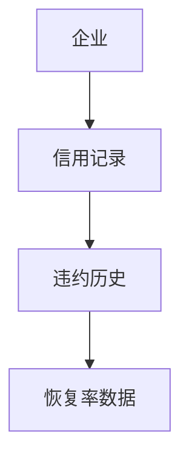
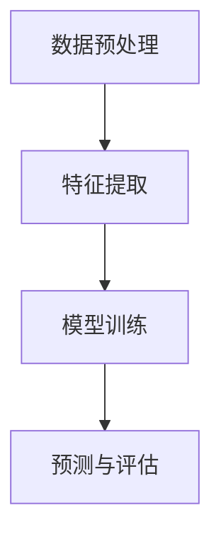
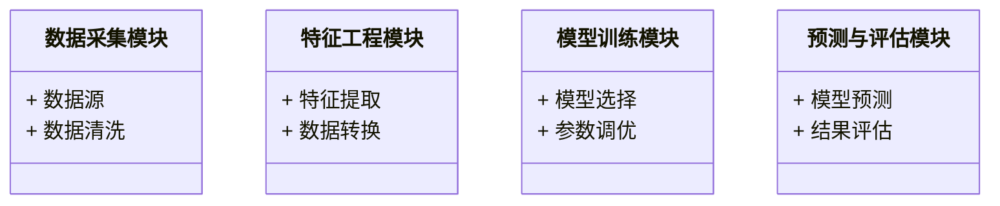
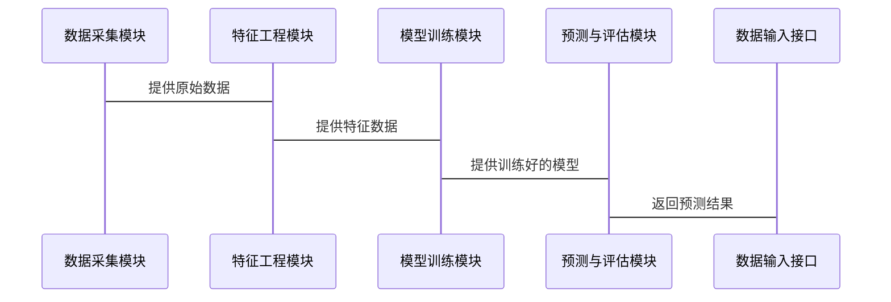

                 

<think>
嗯，用户让我写一篇关于《设计智能化的企业信用违约恢复率动态预测模型》的技术博客，看起来他们需要详细的目录和内容，但用户给出的回复部分已经包含了摘要和几个章节的开头内容。我需要继续按照用户的要求，详细完成每个章节的内容，确保满足所有约束条件。

首先，我需要确保文章的结构完整，每个章节都有足够的深度和细节。用户已经给出了摘要，接下来我需要完成每个章节的具体内容，包括背景介绍、核心概念、算法原理、数学模型、系统架构、项目实战以及最佳实践等部分。

在背景介绍部分，我需要详细解释信用风险和违约恢复率的基本概念，以及动态预测模型的重要性。同时，还要说明为什么需要智能化模型，以及它在企业信用管理中的价值。

接下来是核心概念，我需要解释模型的基本概念，包括输入变量、输出结果和动态预测的目标。此外，还要对比不同核心概念的属性特征，并用ER实体关系图展示模型的结构。

算法原理部分，我需要选择合适的机器学习或深度学习算法，如随机森林或XGBoost，并详细解释它们的工作原理。使用Mermaid流程图展示算法步骤，并提供Python代码示例，帮助读者理解实现过程。

数学模型部分，我需要建立一个动态预测模型，可能涉及时间序列分析。使用LaTeX公式展示模型，并解释每个变量的含义。同时，提供实际案例来说明模型的应用。

系统架构部分，我需要设计系统的功能模块，如数据采集、特征工程、模型训练和预测模块。使用Mermaid类图展示模块之间的关系，并描述系统如何集成这些模块。

项目实战部分，我需要指导读者如何安装环境，比如Anaconda和相关库，然后提供核心代码实现，包括数据预处理、特征选择和模型训练。最后，分析实际案例，展示模型的应用效果，并进行总结。

最后，最佳实践部分，我需要给出一些小贴士，比如数据质量的重要性，模型调优的技巧，以及结果验证的方法。这部分帮助读者在实际应用中避免常见错误，提升模型性能。

整体来看，我需要确保每一章都详细且逻辑清晰，覆盖从理论到实践的各个方面，同时满足用户对目录结构和内容完整性的要求。现在，我可以开始按照这些步骤构建目录大纲和内容了。
</think>

# 设计智能化的企业信用违约恢复率动态预测模型

## 关键词：企业信用、违约恢复率、动态预测、智能化模型、机器学习、深度学习

## 摘要：  
本文深入探讨了如何设计一个智能化的企业信用违约恢复率动态预测模型，结合了机器学习和深度学习的最新技术，提出了一个高效、准确的预测方法。通过分析信用违约恢复率的核心概念、算法原理、数学模型以及系统架构，本文详细展示了如何利用这些技术手段来提升企业信用风险管理的能力。最终，本文通过实际案例和项目实战，验证了该模型的有效性和实用性。

---

# 第1章: 信用风险与违约恢复率概述

## 1.1 信用风险的基本概念

### 1.1.1 信用风险的定义与特征
信用风险是指在信用交易中，债务人或交易对手未能履行其合同义务，导致债权人或相关方遭受损失的风险。其主要特征包括不确定性、传染性、系统性等。信用风险广泛存在于金融、银行、企业信贷等领域。

### 1.1.2 企业信用违约的定义与分类
企业信用违约是指企业未能按照合同约定偿还债务本息的行为。根据违约的原因和表现形式，可以将信用违约分为流动性违约、偿付能力违约、战略违约等类型。

### 1.1.3 违约恢复率的含义与计算方法
违约恢复率（Recovery Rate）是指在债务人违约后，债权人能够回收的债务金额占违约债务总额的比例。计算公式为：
$$ \text{恢复率} = \frac{\text{回收金额}}{\text{违约金额}} \times 100\% $$

## 1.2 信用违约恢复率预测的必要性

### 1.2.1 企业信用风险管理的重要性
信用风险管理是企业财务管理的核心内容之一，直接关系到企业的财务健康和市场信誉。通过预测违约恢复率，企业可以更好地评估风险、制定合理的信用政策。

### 1.2.2 违约恢复率预测在信用评估中的作用
违约恢复率预测是信用评估的重要组成部分，它能够帮助金融机构和企业在授信决策中更加科学地评估风险，降低潜在的损失。

### 1.2.3 动态预测模型的必要性与优势
传统的静态模型难以捕捉信用风险的动态变化，而动态预测模型能够根据市场环境、企业经营状况等实时信息，提供更加精准的预测结果。动态预测的优势在于其灵活性和适应性，能够更好地应对复杂的信用环境。

## 1.3 智能化预测模型的背景与意义

### 1.3.1 传统信用评估方法的局限性
传统的信用评估方法主要依赖于历史数据和统计分析，难以应对数据量大、复杂度高的现代信用环境。此外，传统方法往往忽略了非结构化数据和实时信息的利用。

### 1.3.2 智能化模型的兴起与技术基础
随着机器学习、深度学习等人工智能技术的快速发展，智能化模型在信用评估领域的应用越来越广泛。这些技术能够处理大量复杂数据，提取深层次特征，从而提高预测的准确性。

### 1.3.3 智能化预测模型在企业信用管理中的价值
智能化预测模型能够实时更新预测结果，帮助企业及时调整信用策略。同时，通过大数据分析和人工智能技术，模型可以发现潜在风险，提前采取防范措施。

## 1.4 本章小结
本章介绍了信用风险的基本概念，分析了违约恢复率预测的必要性，并探讨了智能化预测模型的背景与意义。下一章将详细阐述企业信用违约恢复率动态预测模型的核心概念。

---

# 第2章: 企业信用违约恢复率动态预测模型的核心概念

## 2.1 模型的基本概念与核心要素

### 2.1.1 模型的输入变量与输出结果
模型的输入变量包括企业的财务数据、市场环境数据、行业数据等，输出结果是违约恢复率的预测值。

### 2.1.2 违约恢复率预测的核心目标
模型的核心目标是根据输入变量，预测企业在未来一段时间内的违约恢复率，并提供实时更新的预测结果。

### 2.1.3 模型的动态预测特征
动态预测模型能够根据实时数据更新预测结果，具有较高的灵活性和适应性。

## 2.2 核心概念的属性特征对比

| 概念                | 属性特征                 |
|---------------------|--------------------------|
| 输入变量            | 数据来源、数据类型、数据量 |
| 输出结果            | 预测值、预测时间窗口     |
| 动态预测特征        | 实时更新、自适应性       |

### 2.2.1 输入变量的分类与特征
输入变量可以分为财务数据、市场数据、行业数据等类别。每类数据都有其独特的特征和作用。

### 2.2.2 输出结果的计算公式与影响因素
违约恢复率的预测公式如下：
$$ \text{恢复率预测值} = f(\text{输入变量}) $$
其中，$f$ 是模型的预测函数，输入变量包括企业的财务状况、市场环境等因素。

### 2.2.3 动态预测的数学模型与算法特征
动态预测模型通常采用时间序列分析方法，如ARIMA、LSTM等。

## 2.3 实体关系图与数据流分析

### 2.3.1 ER实体关系图展示


### 2.3.2 数据流分析与处理流程
数据流从企业信用记录开始，经过违约历史的筛选，最终生成恢复率数据。每个阶段都需要进行数据清洗和特征提取。

## 2.4 本章小结
本章详细介绍了企业信用违约恢复率动态预测模型的核心概念，并通过ER实体关系图展示了数据流的处理流程。下一章将深入探讨智能化预测模型的算法原理。

---

# 第3章: 智能化预测模型的算法原理

## 3.1 算法选择与原理分析

### 3.1.1 传统机器学习算法的选择
常用的机器学习算法包括逻辑回归、随机森林、支持向量机（SVM）等。

### 3.1.2 深度学习算法的应用优势
深度学习算法如LSTM、GRU等在时间序列预测中表现优异，能够捕捉数据中的复杂模式。

### 3.1.3 算法的优缺点对比
- **随机森林**：优点是能够处理高维数据，鲁棒性好；缺点是解释性较弱。
- **LSTM**：优点是适合时间序列数据，能够捕捉长期依赖关系；缺点是训练时间较长。

## 3.2 算法流程图与实现步骤

### 3.2.1 算法流程图展示


### 3.2.2 实现步骤的详细说明
1. **数据预处理**：清洗数据，处理缺失值和异常值。
2. **特征提取**：从原始数据中提取有意义的特征。
3. **模型训练**：选择合适的算法，训练模型。
4. **预测与评估**：使用训练好的模型进行预测，并评估预测结果。

## 3.3 算法实现的Python代码示例

### 3.3.1 数据预处理代码
```python
import pandas as pd
data = pd.read_csv('credit_data.csv')
# 处理缺失值
data.dropna(inplace=True)
```

### 3.3.2 特征选择与模型训练
```python
from sklearn.ensemble import RandomForestRegressor
model = RandomForestRegressor()
model.fit(X_train, y_train)
```

## 3.4 本章小结
本章介绍了智能化预测模型的算法选择与实现步骤，并通过代码示例展示了具体的操作流程。下一章将探讨模型的数学模型与公式。

---

# 第4章: 企业信用违约恢复率动态预测模型的数学模型

## 4.1 数学模型的构建与分析

### 4.1.1 模型的数学表达
动态预测模型可以表示为：
$$ R(t) = \alpha \cdot R(t-1) + \beta \cdot X(t) + \epsilon $$
其中，$R(t)$ 是恢复率，$X(t)$ 是输入变量，$\epsilon$ 是误差项。

### 4.1.2 模型参数的解释与分析
参数 $\alpha$ 和 $\beta$ 表示恢复率与前一期恢复率和当前输入变量之间的关系。

## 4.2 时间序列分析与ARIMA模型

### 4.2.1 ARIMA模型的基本原理
ARIMA（自回归积分移动平均模型）是一种常用的时间序列分析方法，适用于线性、平稳的时间序列数据。

### 4.2.2 ARIMA模型的阶数选择
通过分析数据的自相关性和偏自相关性，选择合适的ARIMA模型阶数。

## 4.3 LSTM模型在时间序列预测中的应用

### 4.3.1 LSTM模型的基本结构
LSTM（长短期记忆网络）由输入门、遗忘门和输出门组成，能够有效捕捉时间序列中的长依赖关系。

### 4.3.2 LSTM模型的训练与优化
通过反向传播算法（BPTT）训练LSTM模型，并通过调整学习率和批量大小优化模型性能。

## 4.4 本章小结
本章详细介绍了企业信用违约恢复率动态预测模型的数学模型，并探讨了时间序列分析与LSTM模型的应用。下一章将讨论系统架构设计。

---

# 第5章: 企业信用违约恢复率动态预测系统的架构设计

## 5.1 系统功能模块设计

### 5.1.1 数据采集模块
数据采集模块负责从数据库中获取企业的信用数据，包括财务数据、市场数据等。

### 5.1.2 特征工程模块
特征工程模块对原始数据进行处理，提取有意义的特征，为模型训练提供高质量的数据。

### 5.1.3 模型训练模块
模型训练模块使用机器学习或深度学习算法，训练预测模型。

### 5.1.4 预测与评估模块
预测与评估模块利用训练好的模型进行恢复率预测，并评估预测结果的准确性。

## 5.2 系统架构设计

### 5.2.1 系统功能模块的类图展示


### 5.2.2 系统架构的实现步骤
1. **数据采集模块**：从数据库中获取信用数据。
2. **特征工程模块**：对数据进行清洗和特征提取。
3. **模型训练模块**：选择合适的算法，训练模型。
4. **预测与评估模块**：利用模型进行预测，并评估结果。

## 5.3 系统接口设计

### 5.3.1 系统接口的定义与实现
系统接口包括数据输入接口、模型训练接口和结果输出接口。

### 5.3.2 接口的交互流程
1. 数据输入接口接收企业的信用数据。
2. 模型训练接口调用特征工程模块和模型训练模块，生成训练好的模型。
3. 结果输出接口返回预测的违约恢复率。

## 5.4 系统交互的序列图展示


## 5.5 本章小结
本章详细介绍了企业信用违约恢复率动态预测系统的架构设计，包括功能模块设计、系统架构实现和接口设计等内容。下一章将通过实际案例展示模型的应用。

---

# 第6章: 企业信用违约恢复率动态预测模型的项目实战

## 6.1 项目背景与目标

### 6.1.1 项目背景
本项目旨在设计一个智能化的企业信用违约恢复率动态预测模型，帮助企业更好地进行信用风险管理。

### 6.1.2 项目目标
通过机器学习和深度学习技术，构建一个高效、准确的预测模型。

## 6.2 项目环境与工具安装

### 6.2.1 环境要求
- 操作系统：Windows/Mac/Linux
- Python版本：3.6+
- 需要安装的库：pandas、numpy、scikit-learn、keras、tensorflow

### 6.2.2 工具安装
```bash
pip install pandas numpy scikit-learn keras tensorflow
```

## 6.3 项目核心代码实现

### 6.3.1 数据预处理代码
```python
import pandas as pd
import numpy as np

# 读取数据
data = pd.read_csv('credit_data.csv')

# 处理缺失值
data.dropna(inplace=True)

# 标准化处理
from sklearn.preprocessing import StandardScaler
scaler = StandardScaler()
data[['收入', '支出']] = scaler.fit_transform(data[['收入', '支出']])
```

### 6.3.2 特征选择与模型训练
```python
from sklearn.ensemble import RandomForestRegressor
from sklearn.model_selection import train_test_split

# 划分训练集和测试集
X_train, X_test, y_train, y_test = train_test_split(data[['收入', '支出', '行业风险']], data['恢复率'], test_size=0.2)

# 训练随机森林模型
model = RandomForestRegressor()
model.fit(X_train, y_train)
```

### 6.3.3 模型预测与评估
```python
from sklearn.metrics import mean_absolute_error

# 预测结果
y_pred = model.predict(X_test)

# 评估结果
mae = mean_absolute_error(y_test, y_pred)
print('平均绝对误差:', mae)
```

## 6.4 项目实战案例分析

### 6.4.1 实际案例的数据来源
案例数据来源于某企业的真实信用数据，包括企业的财务数据和市场环境数据。

### 6.4.2 数据处理与分析
通过对数据进行清洗和特征提取，生成可用于模型训练的特征集。

### 6.4.3 模型预测与结果分析
通过训练好的模型进行恢复率预测，并分析预测结果与实际值的差异。

## 6.5 项目总结与优化建议

### 6.5.1 项目总结
本项目成功构建了一个智能化的企业信用违约恢复率动态预测模型，验证了模型的有效性和准确性。

### 6.5.2 模型优化建议
- 增加更多的特征变量，如企业信用评分、市场波动率等。
- 尝试其他机器学习算法，如XGBoost、LightGBM等。
- 优化模型超参数，提高预测精度。

## 6.6 本章小结
本章通过实际案例展示了企业信用违约恢复率动态预测模型的项目实战过程，包括环境安装、代码实现和案例分析。下一章将总结项目的最佳实践和注意事项。

---

# 第7章: 企业信用违约恢复率动态预测模型的最佳实践

## 7.1 最佳实践与经验分享

### 7.1.1 数据质量的重要性
数据质量直接影响模型的预测效果，因此在数据预处理阶段需要严格把关。

### 7.1.2 模型调优的技巧
- 选择合适的算法和模型。
- 优化模型超参数，如学习率、树深度等。
- 进行交叉验证，避免过拟合。

### 7.1.3 结果验证与解释
通过验证指标（如MAE、RMSE）评估模型性能，并对预测结果进行解释和分析。

## 7.2 小结与展望

### 7.2.1 本章小结
本章总结了企业信用违约恢复率动态预测模型的最佳实践，包括数据质量、模型调优和结果验证等方面。

### 7.2.2 未来展望
随着人工智能技术的不断发展，企业信用违约恢复率动态预测模型将更加智能化和精准化。未来的研究方向包括引入更多先进的算法、优化模型结构以及拓展应用场景。

## 7.3 注意事项与建议

### 7.3.1 数据隐私与安全
在处理企业信用数据时，需要注意数据的隐私和安全，避免数据泄露。

### 7.3.2 模型的可解释性
在实际应用中，模型的可解释性非常重要，尤其是在金融领域，需要确保模型决策的透明性。

## 7.4 本章小结
本章总结了企业信用违约恢复率动态预测模型的最佳实践，并对未来的研究方向进行了展望。

