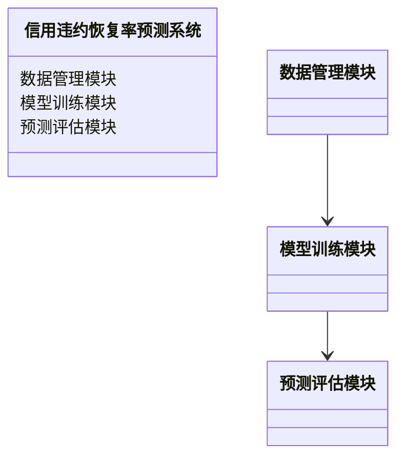
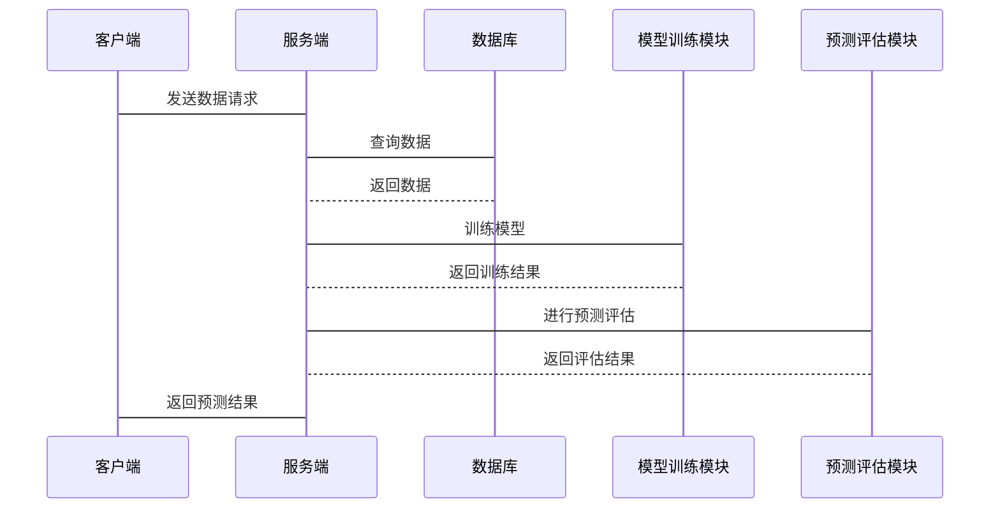

                 


# 设计智能化的企业信用违约恢复率预测模型

> 关键词：信用违约，恢复率预测，机器学习，深度学习，信用风险管理

> 摘要：本文旨在设计一种智能化的企业信用违约恢复率预测模型，通过分析信用违约的基本概念、恢复率预测的核心要素、相关算法原理以及系统架构设计，结合实际案例，提出一种基于机器学习和深度学习的混合模型，以实现对信用违约恢复率的精准预测。本文首先介绍信用违约与恢复率预测的基本概念及其在企业信用风险管理中的重要性，然后详细阐述恢复率预测的核心概念和数学基础，接着分析传统机器学习和深度学习算法在恢复率预测中的应用，最后通过系统架构设计和项目实战，展示如何将理论应用于实际信用风险管理场景中。

---

# 第一部分: 企业信用违约恢复率预测模型背景与核心概念

---

# 第1章: 信用违约与恢复率预测概述

## 1.1 信用违约的定义与特征

### 1.1.1 信用违约的基本概念

信用违约是指债务人未能按照合同约定履行还款义务，导致债权人遭受损失的行为。在企业信用管理中，信用违约是衡量企业信用风险的重要指标之一。信用违约的核心在于债务人无法按时偿还债务，这可能由多种因素引起，包括企业财务状况恶化、市场环境变化等。

### 1.1.2 信用违约的特征分析

信用违约具有以下特征：
1. **可预测性**：通过分析企业的财务数据和市场环境，可以对信用违约的可能性进行预测。
2. **复杂性**：信用违约的影响因素众多，包括宏观经济环境、企业内部管理、行业竞争状况等。
3. **风险性**：信用违约可能导致债权人遭受重大损失，尤其是在企业规模较大或涉及多个债权人的情况下。

### 1.1.3 信用违约的分类与场景

信用违约可以分为以下几种类型：
1. **企业违约**：企业无法偿还债务，导致债权人遭受损失。
2. **个人违约**：个人借款人未能按时偿还贷款。
3. **零售违约**：针对零售客户的信用违约。
4. **批发违约**：针对企业客户的信用违约。

信用违约的场景包括消费金融、企业贷款、信用卡违约等。

---

## 1.2 恢复率预测的定义与重要性

### 1.2.1 恢复率预测的基本概念

恢复率预测是指在信用违约发生后，预测债务人能够偿还的部分比例。恢复率是信用风险管理中的重要指标，反映了违约后的回收能力。

### 1.2.2 恢复率预测在信用风险管理中的作用

恢复率预测的作用包括：
1. **风险定价**：通过预测恢复率，可以更准确地定价信用产品，如贷款和债券。
2. **资本分配**：帮助金融机构合理分配资本，以应对潜在的信用风险。
3. **风险管理**：通过预测恢复率，金融机构可以更好地管理信用违约风险，制定相应的风险缓解策略。

### 1.2.3 恢复率预测的挑战与难点

恢复率预测的难点包括：
1. **数据稀缺性**：高质量的违约数据通常难以获取。
2. **模型复杂性**：恢复率预测涉及多种因素，模型需要具有较高的复杂性。
3. **动态变化**：市场环境和企业状况的变化会影响恢复率的预测结果。

---

## 1.3 企业信用违约恢复率预测的背景与意义

### 1.3.1 企业信用风险管理的现状

随着全球经济的快速发展，企业信用风险管理的重要性日益凸显。传统的信用风险管理方法依赖于经验判断和简单的统计分析，难以应对复杂多变的市场环境。

### 1.3.2 恢复率预测在企业信用管理中的价值

恢复率预测能够帮助金融机构更准确地评估信用风险，优化资本分配，提高风险控制能力。此外，恢复率预测还可以为信用产品的定价提供依据，从而提高金融机构的盈利能力。

### 1.3.3 人工智能技术在信用风险管理中的应用趋势

人工智能技术，尤其是机器学习和深度学习，为恢复率预测提供了新的解决方案。通过分析大量的非结构化数据，如文本、图像等，人工智能技术能够发现传统方法难以察觉的模式和趋势，从而提高预测的准确性。

---

## 1.4 本章小结

本章介绍了信用违约和恢复率预测的基本概念，分析了恢复率预测在信用风险管理中的重要性，并探讨了人工智能技术在恢复率预测中的应用前景。

---

# 第2章: 企业信用违约恢复率预测模型的核心概念

## 2.1 违约风险的核心要素

### 2.1.1 信用评分的定义与计算

信用评分是衡量企业信用状况的重要指标。常见的信用评分模型包括FICO评分、PD（Probability of Default）评分等。

### 2.1.2 违约概率的定义与计算

违约概率是指债务人在一定时间内发生违约的可能性。违约概率的计算通常基于历史数据和统计模型。

### 2.1.3 违约损失率的定义与计算

违约损失率是指在违约发生时，债权人实际损失的比例。违约损失率的计算需要考虑多种因素，包括债务人的资产状况、担保情况等。

---

## 2.2 恢复率预测的关键因素

### 2.2.1 恢复率的定义与影响因素

恢复率是指在违约发生后，债务人能够偿还的部分比例。影响恢复率的关键因素包括债务人的资产状况、担保情况、市场环境等。

### 2.2.2 企业财务状况对恢复率的影响

企业的财务状况是影响恢复率的重要因素。例如，企业的流动比率、速动比率、资产负债率等指标都可以影响恢复率。

### 2.2.3 市场环境对恢复率的影响

市场环境的变化，如经济周期波动、行业景气度等，也会影响恢复率。例如，在经济衰退时期，企业的违约概率和恢复率通常会增加。

---

## 2.3 核心概念的对比分析

### 2.3.1 违约概率与恢复率的关系

违约概率和恢复率密切相关。违约概率高的债务人，其恢复率通常较低。

### 2.3.2 不同信用评分模型的对比

常见的信用评分模型包括逻辑回归模型、决策树模型、随机森林模型等。不同模型的优缺点需要根据具体应用场景进行选择。

### 2.3.3 恢复率预测与传统信用风险管理的区别

传统的信用风险管理方法通常基于简单的统计分析，而恢复率预测则更加依赖于机器学习和深度学习等先进技术。

---

## 2.4 本章小结

本章分析了违约风险的核心要素，探讨了恢复率预测的关键因素，并对相关概念进行了对比分析。

---

# 第3章: 企业信用违约恢复率预测模型的数学基础

## 3.1 概率论与统计学基础

### 3.1.1 概率论基础

概率论是信用风险管理的基础。例如，违约概率的计算依赖于概率论中的基本概念。

### 3.1.2 统计学基础

统计学方法在信用风险管理中广泛应用，例如回归分析、聚类分析等。

### 3.1.3 数据分布与假设检验

数据分布和假设检验是信用风险管理中的重要工具。例如，正态分布常用于描述违约概率的分布。

---

## 3.2 线性回归模型

### 3.2.1 线性回归的基本原理

线性回归是一种常用的统计学方法，用于预测目标变量与自变量之间的线性关系。

### 3.2.2 线性回归的数学公式

线性回归的数学公式为：
$$ y = \beta_0 + \beta_1 x + \epsilon $$
其中，$y$ 是目标变量，$x$ 是自变量，$\beta_0$ 和 $\beta_1$ 是回归系数，$\epsilon$ 是误差项。

### 3.2.3 线性回归的应用与局限性

线性回归可以用于信用评分和违约概率预测，但其局限性在于只能捕捉线性关系。

---

## 3.3 逻辑回归模型

### 3.3.1 逻辑回归的基本原理

逻辑回归是一种用于分类的统计学方法，常用于信用评分和违约概率预测。

### 3.3.2 逻辑回归的数学公式

逻辑回归的数学公式为：
$$ P(Y=1|X) = \frac{1}{1 + e^{-(\beta_0 + \beta_1 x)}} $$
其中，$P(Y=1|X)$ 是违约概率，$\beta_0$ 和 $\beta_1$ 是回归系数，$x$ 是自变量。

### 3.3.3 逻辑回归在信用评分中的应用

逻辑回归可以用于信用评分，通过分析企业的财务数据和市场环境，预测违约概率。

---

## 3.4 本章小结

本章介绍了信用违约恢复率预测的数学基础，包括概率论、统计学、线性回归和逻辑回归等方法。

---

# 第4章: 企业信用违约恢复率预测模型的算法原理

## 4.1 传统机器学习算法

### 4.1.1 支持向量机（SVM）

支持向量机是一种常用的分类算法，可以用于信用评分和违约概率预测。

### 4.1.2 随机森林（Random Forest）

随机森林是一种基于决策树的集成算法，可以用于信用评分和恢复率预测。

### 4.1.3 K近邻算法（KNN）

K近邻算法是一种基于距离的分类算法，可以用于信用评分和违约概率预测。

---

## 4.2 深度学习算法

### 4.2.1 神经网络的基本原理

神经网络是一种模仿人脑结构的深度学习算法，可以用于信用评分和恢复率预测。

### 4.2.2 卷积神经网络（CNN）

卷积神经网络是一种常用的深度学习算法，可以用于处理图像和文本数据，应用于信用风险管理。

### 4.2.3 循环神经网络（RNN）

循环神经网络是一种用于处理序列数据的深度学习算法，可以用于信用评分和违约概率预测。

---

## 4.3 本章小结

本章分析了传统机器学习和深度学习算法在信用违约恢复率预测中的应用，介绍了SVM、随机森林、KNN、神经网络、CNN和RNN等算法的基本原理和应用场景。

---

# 第5章: 系统分析与架构设计

## 5.1 项目介绍

### 5.1.1 项目背景

随着企业信用风险管理的需求不断增加，设计一种智能化的信用违约恢复率预测模型显得尤为重要。

### 5.1.2 项目目标

本项目旨在设计一种基于机器学习和深度学习的混合模型，实现对信用违约恢复率的精准预测。

### 5.1.3 项目范围

本项目聚焦于企业信用违约恢复率预测，涵盖数据收集、特征提取、模型训练和预测评估等环节。

---

## 5.2 系统功能设计

### 5.2.1 领域模型

以下是领域模型的Mermaid图：



### 5.2.2 系统架构设计

以下是系统架构的Mermaid图：


### 5.2.3 系统接口设计

系统接口设计包括数据预处理接口、模型训练接口和预测评估接口。

### 5.2.4 系统交互设计

以下是系统交互的Mermaid图：



---

## 5.3 本章小结

本章通过系统分析与架构设计，明确了信用违约恢复率预测系统的功能模块、系统架构和交互流程。

---

# 第6章: 项目实战

## 6.1 环境安装

### 6.1.1 安装Python

安装Python 3.x版本，确保环境满足项目需求。

### 6.1.2 安装相关库

安装以下Python库：
- `numpy`
- `pandas`
- `scikit-learn`
- `xgboost`
- `keras`

---

## 6.2 系统核心实现

### 6.2.1 数据预处理

以下是数据预处理的Python代码：

```python
import pandas as pd
import numpy as np

# 读取数据
data = pd.read_csv('credit_data.csv')

# 处理缺失值
data = data.dropna()

# 标准化处理
from sklearn.preprocessing import StandardScaler
scaler = StandardScaler()
scaled_data = scaler.fit_transform(data)
```

### 6.2.2 模型训练

以下是模型训练的Python代码：

```python
from sklearn.model_selection import train_test_split
from sklearn.linear_model import LogisticRegression
from sklearn.metrics import accuracy_score

# 划分训练集和测试集
X_train, X_test, y_train, y_test = train_test_split(scaled_data, data['target'], test_size=0.2)

# 训练逻辑回归模型
model = LogisticRegression()
model.fit(X_train, y_train)

# 模型评估
y_pred = model.predict(X_test)
print("准确率：", accuracy_score(y_test, y_pred))
```

### 6.2.3 模型评估

以下是模型评估的Python代码：

```python
from sklearn.metrics import confusion_matrix, classification_report

print("混淆矩阵：")
print(confusion_matrix(y_test, y_pred))
print("\n分类报告：")
print(classification_report(y_test, y_pred))
```

---

## 6.3 实际案例分析

### 6.3.1 案例背景

以某企业信用数据为例，训练恢复率预测模型。

### 6.3.2 模型预测

以下是模型预测的Python代码：

```python
import pandas as pd
import numpy as np
from sklearn.model_selection import train_test_split
from sklearn.linear_model import LogisticRegression
from sklearn.metrics import accuracy_score

# 读取数据
data = pd.read_csv('credit_data.csv')

# 处理缺失值
data = data.dropna()

# 标准化处理
from sklearn.preprocessing import StandardScaler
scaler = StandardScaler()
scaled_data = scaler.fit_transform(data)

# 划分训练集和测试集
X_train, X_test, y_train, y_test = train_test_split(scaled_data, data['target'], test_size=0.2)

# 训练逻辑回归模型
model = LogisticRegression()
model.fit(X_train, y_train)

# 模型预测
y_pred = model.predict(X_test)
print("准确率：", accuracy_score(y_test, y_pred))
```

### 6.3.3 模型分析

通过混淆矩阵和分类报告，可以分析模型的性能，并根据结果进行优化。

---

## 6.4 本章小结

本章通过项目实战，详细介绍了信用违约恢复率预测系统的环境安装、核心实现和实际案例分析，展示了如何将理论应用于实际场景。

---

# 第7章: 最佳实践与小结

## 7.1 最佳实践

### 7.1.1 数据质量管理

确保数据的完整性和准确性是模型预测的基础。

### 7.1.2 模型调优

通过交叉验证和超参数调优，可以提高模型的性能。

### 7.1.3 模型解释性

通过特征重要性分析，可以更好地理解模型的预测结果。

---

## 7.2 小结

本文通过系统分析与实战，设计了一种基于机器学习和深度学习的混合模型，实现了对信用违约恢复率的精准预测。通过本文的分析，读者可以更好地理解信用违约恢复率预测的核心概念和算法原理，并能够将其应用于实际的信用风险管理场景中。

---

# 作者：AI天才研究院/AI Genius Institute & 禅与计算机程序设计艺术 /Zen And The Art of Computer Programming

