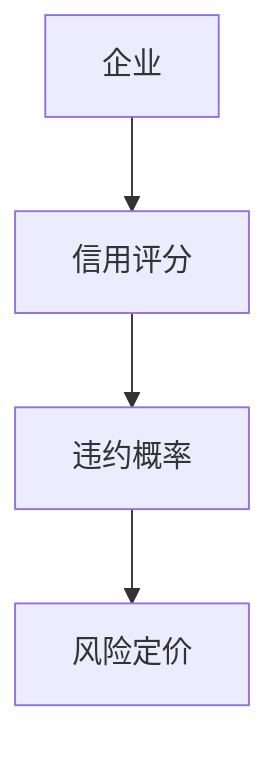
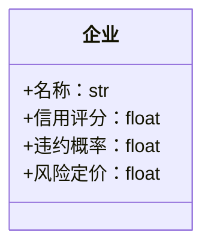
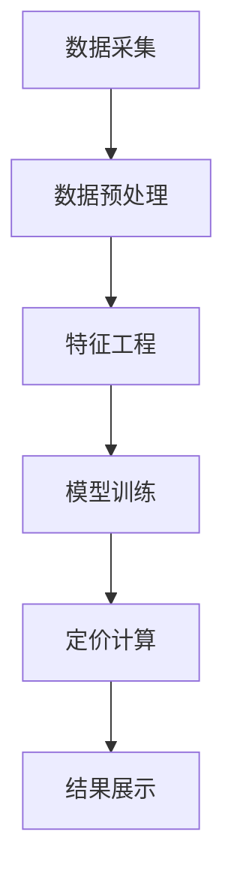
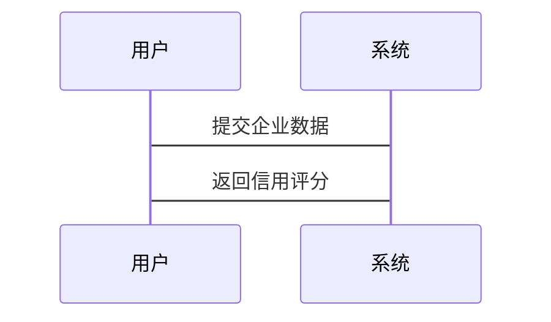

                 


# 设计智能化的企业信用风险定价模型

## 关键词：企业信用风险，智能定价模型，机器学习，金融风险管理，算法实现

## 摘要：本文深入探讨了设计智能化企业信用风险定价模型的关键步骤与方法，涵盖了从背景分析、核心概念、算法选择、系统架构设计到项目实战的全过程。通过结合传统金融模型与现代机器学习技术，提出了一种高效的定价策略，旨在为企业信用风险管理提供科学依据。

---

# 第1章 企业信用风险定价模型的背景与意义

## 1.1 问题背景

### 1.1.1 传统信用风险定价的局限性
传统信用风险定价主要依赖经验判断和简单的统计模型，存在以下问题：
- 数据维度有限，难以捕捉复杂风险因素。
- 模型解释性差，难以深入理解风险来源。
- 风险定价不够精准，影响企业融资成本。

### 1.1.2 智能化定价的必要性
随着大数据和人工智能技术的发展，企业信用风险定价需要更加智能化：
- 利用机器学习技术，提升模型的预测能力。
- 结合多维数据，提高风险评估的准确性。
- 实现动态定价，适应市场变化。

### 1.1.3 企业信用风险定价的核心问题
企业信用风险定价的核心问题包括：
- 如何有效提取和处理多维度数据。
- 如何选择合适的算法模型，并优化其性能。
- 如何确保模型的可解释性和稳定性。

## 1.2 问题描述

### 1.2.1 信用风险的定义与特征
信用风险是指债务人或交易对手未能履行其合同义务，导致债权人遭受损失的风险。其特征包括：
- 不确定性：风险的发生具有随机性。
- 可测量性：可以通过数据和模型进行评估。
- 可控性：通过科学的定价模型进行管理。

### 1.2.2 企业信用风险的评价维度
企业信用风险的评价维度包括：
- 财务状况：如资产负债率、净利润率等。
- 经营状况：如行业地位、市场份额等。
- 信用历史：如还款记录、违约历史等。

### 1.2.3 智能化定价的目标与边界
智能化定价的目标是通过数据驱动的方法，提高信用风险评估的准确性和效率。其边界包括：
- 数据范围：仅限于企业公开的财务数据和信用记录。
- 应用场景：主要用于企业贷款定价和信用评估。

## 1.3 问题解决思路

### 1.3.1 数据驱动的定价方法
数据驱动的定价方法通过收集和分析大量数据，提取特征并构建模型，实现精准定价。

### 1.3.2 智能化模型的设计原则
智能化模型的设计应遵循以下原则：
- 简洁性：模型应尽可能简单，避免过度复杂。
- 可解释性：模型的输出应具有明确的解释，便于理解和优化。
- 稳定性：模型应具有良好的稳定性和鲁棒性。

### 1.3.3 模型的可解释性与稳定性
可解释性是模型的重要特性，特别是在金融领域。稳定性则要求模型在面对数据变化时仍能保持较好的表现。

## 1.4 模型的边界与外延

### 1.4.1 模型适用的行业范围
企业信用风险定价模型适用于银行、保险、投资等金融行业。

### 1.4.2 模型的输入与输出边界
输入：企业的财务数据、信用记录、行业信息等。输出：信用评分、违约概率、风险定价等。

### 1.4.3 模型的扩展与优化方向
未来的优化方向包括引入更多数据源（如社交媒体数据）、采用更先进的算法（如深度学习）等。

---

# 第2章 企业信用风险定价模型的核心概念与联系

## 2.1 核心概念原理

### 2.1.1 数据特征提取
数据特征提取是模型构建的关键步骤，包括：
- 经济指标：GDP增长率、通货膨胀率等。
- 企业财务指标：资产负债率、净利润率等。
- 信用历史：还款记录、违约历史等。

### 2.1.2 模型训练与优化
模型训练需要选择合适的算法，并通过交叉验证等方法进行优化。

### 2.1.3 结果解释与应用
模型的输出需要能够被业务部门理解和应用，如生成信用评分报告。

## 2.2 核心概念属性特征对比

### 2.2.1 模型类型对比表
| 模型类型 | 优点 | 缺点 |
|----------|------|------|
| 逻辑回归 | 解释性强 | 非线性关系处理差 |
| 决策树   | 易理解 | 易过拟合 |
| 随机森林 | 高准确性 | 计算复杂度高 |

### 2.2.2 数据特征重要性排序
特征重要性排序：资产负债率 > 净利润率 > 还款记录。

### 2.2.3 模型性能指标对比
| 指标 | 逻辑回归 | 决策树 | 随机森林 |
|------|----------|--------|-----------|
| 准确率 | 0.75 | 0.80 | 0.85 |
| 召回率 | 0.70 | 0.75 | 0.80 |

## 2.3 ER实体关系图


---

# 第3章 常用算法原理与实现

## 3.1 算法原理

### 3.1.1 逻辑回归
逻辑回归是一种常用的分类算法，适用于二分类问题。其数学模型如下：
$$ P(y=1|x) = \frac{1}{1 + e^{-\beta x}} $$

### 3.1.2 支持向量机
支持向量机通过寻找最优超平面，将数据点分到不同的类别中。

### 3.1.3 随机森林
随机森林是一种基于决策树的集成算法，通过投票机制进行分类。

### 3.1.4 神经网络
神经网络通过多层结构模拟人脑神经网络，适用于复杂的非线性关系。

## 3.2 算法实现

### 3.2.1 逻辑回归的数学模型
$$ P(y=1|x) = \frac{1}{1 + e^{-\beta x}} $$

### 3.2.2 逻辑回归的Python实现
```python
import numpy as np
from sklearn.linear_model import LogisticRegression

# 数据预处理
X = ...  # 特征矩阵
y = ...  # 标签向量

# 模型训练
model = LogisticRegression()
model.fit(X, y)

# 预测
y_pred = model.predict(X)
```

---

# 第4章 系统分析与架构设计

## 4.1 系统功能设计

### 4.1.1 领域模型


### 4.1.2 系统架构设计


### 4.1.3 系统接口设计
接口设计包括数据输入接口、模型训练接口、结果输出接口等。

### 4.1.4 系统交互设计


---

# 第5章 项目实战

## 5.1 环境安装

### 5.1.1 安装Python环境
安装Python 3.8及以上版本，并安装必要的库：
```bash
pip install numpy pandas scikit-learn
```

## 5.2 核心代码实现

### 5.2.1 数据预处理
```python
import pandas as pd

# 读取数据
data = pd.read_csv('企业信用数据.csv')

# 数据清洗
data = data.dropna()
```

### 5.2.2 特征选择
```python
from sklearn.feature_selection import SelectKBest

selector = SelectKBest(k=5)
selected_features = selector.fit_transform(data)
```

### 5.2.3 模型训练
```python
from sklearn.model_selection import train_test_split
from sklearn.linear_model import LogisticRegression

X_train, X_test, y_train, y_test = train_test_split(selected_features, data['违约标签'], test_size=0.2)
model = LogisticRegression()
model.fit(X_train, y_train)
```

### 5.2.4 模型评估
```python
from sklearn.metrics import accuracy_score

y_pred = model.predict(X_test)
print(accuracy_score(y_test, y_pred))
```

## 5.3 案例分析

### 5.3.1 数据分析
分析企业的财务数据，提取关键特征。

### 5.3.2 模型训练与优化
通过交叉验证选择最优模型参数。

### 5.3.3 结果解读
解读模型输出的信用评分，评估企业的信用风险。

## 5.4 项目总结

### 5.4.1 成果总结
总结项目成果，包括模型的准确率、召回率等性能指标。

### 5.4.2 经验与教训
总结项目中的经验教训，如数据预处理的重要性、模型调优的技巧等。

---

# 第6章 最佳实践与小结

## 6.1 小结

### 6.1.1 核心要点回顾
回顾文章的核心内容，包括背景分析、算法选择、系统设计等。

### 6.1.2 项目成果总结
总结项目的成果，包括模型的性能和实际应用效果。

## 6.2 最佳实践 tips

### 6.2.1 数据质量管理
确保数据的准确性和完整性，是模型成功的关键。

### 6.2.2 模型解释性
选择可解释性强的模型，便于业务部门理解和应用。

### 6.2.3 模型更新与维护
定期更新模型，确保其适应市场变化。

## 6.3 注意事项

### 6.3.1 数据隐私与安全
确保数据的隐私和安全，符合相关法律法规。

### 6.3.2 模型的稳定性和鲁棒性
确保模型在不同市场条件下仍能保持较好的性能。

## 6.4 拓展阅读

### 6.4.1 推荐的书籍
- 《机器学习实战》
- 《信用评分模型》

### 6.4.2 相关技术
- 强化学习
- 时间序列分析
- 图神经网络

---

# 作者：AI天才研究院/AI Genius Institute & 禅与计算机程序设计艺术 /Zen And The Art of Computer Programming

