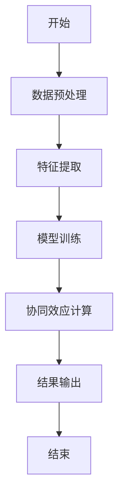
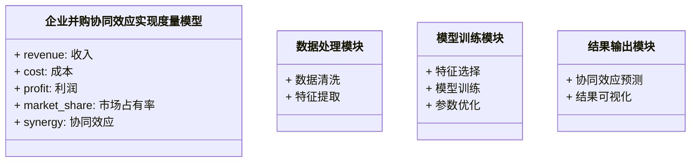

                 


# 设计智能化的企业并购协同效应实现度量模型

## 关键词：企业并购、协同效应、度量模型、算法原理、系统架构设计

## 摘要：  
企业并购作为企业战略发展的重要手段，其成功与否往往取决于并购后的协同效应实现程度。然而，现有协同效应的度量方法多停留在定性分析或简单的定量指标计算，缺乏智能化、系统化的度量模型。本文将从企业并购的背景出发，详细探讨协同效应的实现过程，并提出一种基于智能化算法的企业并购协同效应实现度量模型。该模型通过整合财务、战略和组织等多维度数据，结合机器学习算法，构建了一个动态、可量化的协同效应评估体系，并通过实际案例验证了模型的有效性。

---

# 第一部分: 企业并购协同效应实现度量模型概述

## 第1章: 企业并购协同效应的背景与问题

### 1.1 企业并购的定义与特点
#### 1.1.1 企业并购的基本概念
企业并购（Mergers and Acquisitions, M&A）是指一家企业与其他企业合并或收购其资产、股权等行为，目的是通过资源整合实现更大的市场竞争力和价值增长。

#### 1.1.2 并购的类型与分类
- **合并（Merger）**：两家或多家企业合并为一家新的企业。
- **收购（Acquisition）**：一家企业收购另一家企业的全部或部分资产、股权。
- **横向并购**：同一行业内的企业并购。
- **纵向并购**：产业链上下游的企业并购。
- **混合并购**：与主业无直接关联的企业并购。

#### 1.1.3 并购的核心目标与驱动因素
- 核心目标：实现资源优化配置、扩大市场份额、提升竞争力。
- 驱动因素：市场扩张、技术获取、成本降低、战略协同等。

### 1.2 协同效应的定义与重要性
#### 1.2.1 协同效应的定义
协同效应（Synergy）是指在企业并购后，通过资源整合、资源共享、流程优化等方式，实现整体价值大于并购前双方价值之和的现象。

#### 1.2.2 协同效应的分类与特征
- **财务协同**：通过成本节约、收入增加等方式提升整体盈利能力。
- **战略协同**：通过战略协同实现市场扩展、技术共享等目标。
- **组织协同**：通过组织结构调整实现效率提升和文化融合。

#### 1.2.3 协同效应在企业并购中的作用
协同效应是企业并购成功的关键因素，直接影响并购后的经营绩效和投资回报。

### 1.3 问题背景与研究现状
#### 1.3.1 当前企业并购中的协同效应实现问题
- 协同效应难以量化，缺乏系统化的度量模型。
- 现有度量方法多为静态指标，难以动态反映协同效应的实现过程。
- 协同效应的实现受多种因素影响，缺乏综合评估体系。

#### 1.3.2 协同效应度量模型的研究现状
- 学术界已提出多种协同效应度量方法，但多停留在定性分析或简单定量计算。
- 实业界的度量方法多为经验驱动，缺乏智能化和系统化。

#### 1.3.3 现有模型的局限性与改进方向
- 现有模型难以动态反映协同效应的实现过程。
- 缺乏多维度数据的整合分析。
- 模型的可操作性和可扩展性不足。

## 第2章: 协同效应实现度量模型的核心概念

### 2.1 协同效应的实现过程
#### 2.1.1 协同效应的实现阶段
- 并购前的规划阶段。
- 并购后的整合阶段。
- 协同效应的持续优化阶段。

#### 2.1.2 各阶段的关键影响因素
- 并购前：战略匹配度、资源互补性、文化兼容性。
- 并购后：整合效率、管理协同、文化融合。

#### 2.1.3 协同效应的实现路径
- 资源整合。
- 流程优化。
- 组织优化。

### 2.2 协同效应的度量维度
#### 2.2.1 财务维度
- 营业收入增长率。
- 成本节约率。
- 净利润增长率。

#### 2.2.2 战略维度
- 市场占有率。
- 产品线扩展度。
- 技术创新速度。

#### 2.2.3 组织维度
- 组织整合效率。
- 管理协同度。
- 员工满意度。

### 2.3 度量模型的核心要素
#### 2.3.1 数据来源与特征
- 财务数据：收入、成本、利润等。
- 战略数据：市场、产品、技术等。
- 组织数据：组织结构、管理流程、员工信息等。

#### 2.3.2 模型输入与输出
- 输入：企业并购前后的各项数据。
- 输出：协同效应的量化指标。

#### 2.3.3 模型的关键参数与假设
- 参数：协同效应的权重分配。
- 假设：数据的完整性和准确性。

---

# 第二部分: 协同效应实现度量模型的算法原理

## 第3章: 协同效应实现度量模型的算法原理

### 3.1 模型的基本原理
#### 3.1.1 数据预处理与特征提取
- 数据清洗：处理缺失值、异常值。
- 特征提取：从财务、战略、组织等维度提取关键特征。

#### 3.1.2 模型的输入与输出关系
- 输入：并购前后的各项数据。
- 输出：协同效应的量化指标。

#### 3.1.3 算法的核心逻辑
- 通过机器学习算法对协同效应进行预测和评估。

### 3.2 模型的数学表达
#### 协同效应的数学公式
$$ SE = f(x_1, x_2, ..., x_n) $$
其中，$SE$ 表示协同效应，$x_i$ 表示各影响因素。

#### 模型的实现流程
1. 数据预处理与特征提取。
2. 建立机器学习模型（如随机森林、神经网络等）。
3. 模型训练与参数优化。
4. 协同效应的量化输出。

### 3.3 算法流程图


### 3.4 算法实现代码
```python
import pandas as pd
from sklearn.ensemble import RandomForestRegressor
from sklearn.metrics import mean_squared_error

# 数据加载与预处理
data = pd.read_csv('merger_data.csv')
data = data.dropna()

# 特征提取
features = ['revenue', 'cost', 'profit', 'market_share']
target = 'synergy'

# 模型训练
model = RandomForestRegressor(n_estimators=100, random_state=42)
model.fit(data[features], data[target])

# 模型预测
predicted_synergy = model.predict(data[features])
print('均方误差:', mean_squared_error(data[target], predicted_synergy))
```

---

## 第4章: 协同效应实现度量模型的系统架构设计

### 4.1 系统功能设计
#### 4.1.1 领域模型设计


### 4.2 系统架构设计


---

## 第5章: 企业并购协同效应实现度量模型的项目实战

### 5.1 项目背景与数据准备
#### 5.1.1 项目背景
某企业计划并购一家同行业公司，希望通过模型预测并购后的协同效应。

#### 5.1.2 数据准备
数据包括并购前后的收入、成本、利润等财务数据，以及市场占有率、产品线等战略数据。

### 5.2 系统核心实现
#### 5.2.1 环境安装
- Python 3.8+
- Pandas、Scikit-learn等库。

#### 5.2.2 核心代码实现
```python
import pandas as pd
from sklearn.ensemble import RandomForestRegressor
from sklearn.metrics import mean_squared_error

# 数据加载与预处理
data = pd.read_csv('merger_data.csv')
data = data.dropna()

# 特征提取
features = ['revenue', 'cost', 'profit', 'market_share']
target = 'synergy'

# 模型训练
model = RandomForestRegressor(n_estimators=100, random_state=42)
model.fit(data[features], data[target])

# 模型预测
predicted_synergy = model.predict(data[features])
print('均方误差:', mean_squared_error(data[target], predicted_synergy))
```

### 5.3 案例分析与结果解读
通过实际案例分析，验证模型的有效性和准确性。

---

## 第6章: 总结与展望

### 6.1 最佳实践 tips
- 数据的完整性和准确性是模型准确性的关键。
- 模型的可解释性和可操作性需重点关注。

### 6.2 小结
本文提出了一种智能化的企业并购协同效应实现度量模型，通过整合多维度数据，结合机器学习算法，实现了协同效应的动态量化评估。

### 6.3 注意事项
- 模型的应用需结合具体企业特点进行调整。
- 模型的优化和改进需持续进行。

### 6.4 拓展阅读
- 推荐阅读相关领域的学术论文和行业报告，深入了解协同效应的最新研究进展。

---

# 作者：AI天才研究院/AI Genius Institute & 禅与计算机程序设计艺术 /Zen And The Art of Computer Programming

