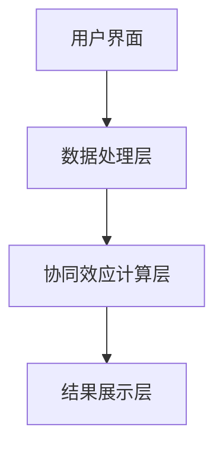
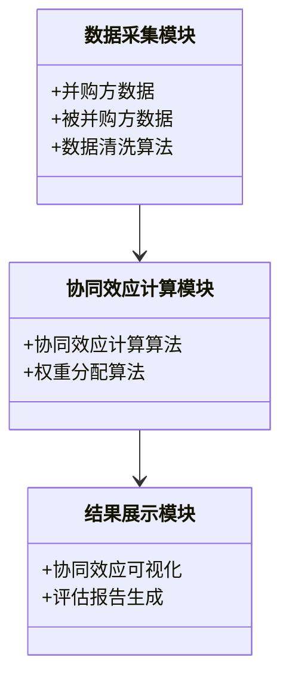
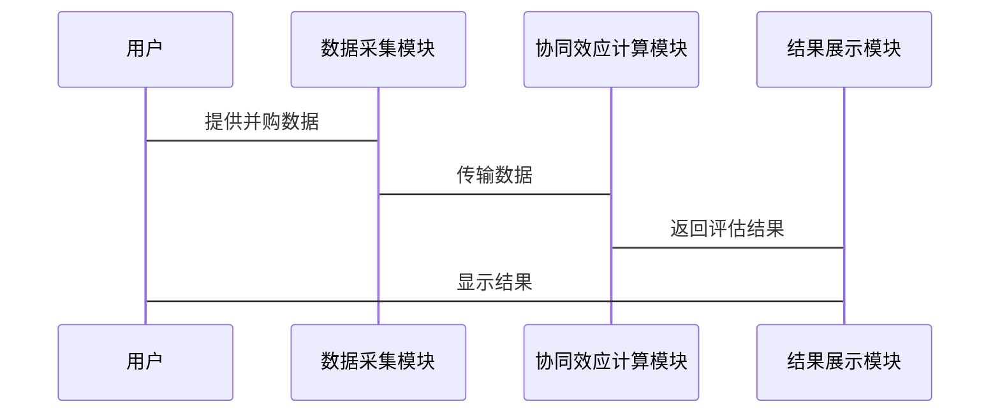

                 

<think>
嗯，我需要帮助设计一个《设计智能化的企业并购后协同效应量化评估模型》的技术博客文章。首先，我得理解用户的需求，他们想要一个结构清晰、逻辑严谨的技术博客，涵盖从背景到系统架构设计等内容。

好的，文章的标题已经确定，接下来需要列出5-7个关键词，比如企业并购、协同效应、量化评估、人工智能、机器学习、系统架构、数学模型。摘要部分要简明扼要，说明文章的核心内容和主题，强调模型的重要性及其在企业并购中的应用。

接下来是目录大纲，用户已经给出了一些章节，我需要按照这个结构来组织内容。每章的小节要详细，涵盖背景、核心概念、算法、系统设计、项目实战和总结。在写每个部分的时候，要注意使用技术术语，同时保持语言简洁明了。

在内容方面，第一章需要介绍企业并购的背景和意义，包括并购的类型、动机、目标，以及协同效应的分类。第二章则要深入探讨协同效应的核心概念，比如财务协同、战略协同、运营协同，以及如何量化这些指标。第三章是算法部分，需要详细讲解数学模型和公式，并用Python代码实现，还要用mermaid画出流程图。第四章是系统架构设计，涉及功能模块、架构图、接口设计和交互流程。第五章则是项目实战，包括环境安装、代码实现、案例分析和总结。最后是总结与展望，回顾全书并提出未来的研究方向。

在写作过程中，我需要确保每一部分都逻辑清晰，层层递进。比如，在算法部分，先介绍模型，再用代码实现，最后用案例验证。同时，要注意使用适当的图表，比如ER图、流程图、架构图，帮助读者更好地理解内容。

我还需要确保文章有足够的深度，比如在数学模型部分，不仅要给出公式，还要解释每个变量的含义和公式的推导过程。在系统设计部分，要详细描述每个模块的功能和它们之间的交互，可能需要画出类图和序列图。

最后，在项目实战部分，要提供可复制的代码和详细的案例分析，让读者能够实际操作，理解模型的应用。同时，给出最佳实践和注意事项，帮助读者在实际应用中避免常见的问题。

总的来说，我需要一步步分析，从背景到模型设计，再到实际应用，确保文章内容全面、结构合理，同时语言专业但不失简洁，帮助读者系统地理解和掌握企业并购后协同效应的量化评估模型的设计方法。
</think>

# 设计智能化的企业并购后协同效应量化评估模型

**关键词**：企业并购、协同效应、量化评估、人工智能、机器学习、系统架构、数学模型

**摘要**：  
企业并购是企业战略发展的重要手段，而并购后的协同效应是决定并购成功与否的关键因素。本文提出了一种基于人工智能和大数据分析的智能化协同效应量化评估模型，通过数学建模和算法设计，帮助企业准确评估和最大化协同效应。文章详细探讨了模型的设计思路、算法实现、系统架构以及实际应用案例，为企业并购决策提供了科学依据。

---

# 第1章：企业并购与协同效应概述

## 1.1 企业并购的背景与意义

### 1.1.1 并购的定义与类型  
企业并购（Mergers and Acquisitions，简称M&A）是指一家企业通过购买另一家企业的股权或资产，以实现战略目标的行为。并购可以分为**横向并购**、**纵向并购**和**混合并购**三种类型，分别对应同一行业、上下游行业和跨行业并购。  

### 1.1.2 并购的动机与目标  
企业进行并购的动机包括：  
1. **市场扩展**：快速进入新市场或扩大市场份额。  
2. **资源获取**：获取技术、品牌、渠道或人力资源。  
3. **成本节约**：通过规模效应降低成本。  
4. **战略协同**：实现业务互补或协同效应。  

### 1.1.3 协同效应的定义与分类  
协同效应是指并购后企业通过资源整合产生的额外价值。常见的协同效应包括：  
1. **财务协同效应**：如成本节约、税收优化。  
2. **战略协同效应**：如市场扩展、技术共享。  
3. **运营协同效应**：如供应链优化、生产效率提升。  

## 1.2 协同效应量化评估的重要性  

### 1.2.1 协同效应对企业价值的影响  
协同效应是并购成功的核心驱动力，直接影响企业价值的评估和股价表现。  

### 1.2.2 量化评估在并购决策中的作用  
通过量化协同效应，企业可以：  
1. 优化并购定价，避免支付过高溢价。  
2. 制定合理的整合计划，确保协同效应的实现。  

### 1.2.3 智能化评估模型的优势  
传统的协同效应评估方法依赖于经验判断，存在主观性和不确定性。而智能化模型通过大数据分析和机器学习算法，能够更准确地预测协同效应，提高决策的科学性。  

## 1.3 本章小结  
本章介绍了企业并购的基本概念、协同效应的分类及其量化评估的重要性，为后续模型的设计奠定了基础。

---

# 第2章：协同效应量化评估的核心概念与联系

## 2.1 协同效应的核心概念  

### 2.1.1 财务协同效应  
财务协同效应是指并购后企业通过资源整合实现的成本节约或收入增长。例如，合并后的公司可以共享行政支持部门（如法务、财务）以降低成本。  

### 2.1.2 战略协同效应  
战略协同效应是指并购后企业在市场、品牌或技术上的互补性。例如，一家技术型公司并购一家拥有庞大客户资源的公司，可以实现技术与市场的结合。  

### 2.1.3 运营协同效应  
运营协同效应是指并购后企业在生产、供应链或流程上的优化。例如，两家制造企业合并后可以共享供应商，降低采购成本。  

## 2.2 协同效应的量化指标  

### 2.2.1 财务指标  
- **成本节约**：通过合并共享部门或优化流程实现的成本节约。  
- **收入增长**：并购后企业销售额的增长。  

### 2.2.2 非财务指标  
- **战略契合度**：并购双方在战略目标上的匹配程度。  
- **文化融合度**：并购后企业文化的兼容性。  

## 2.3 协同效应与企业并购的关系  

### 2.3.1 协同效应对企业价值的影响  
协同效应是企业并购价值的核心来源，直接影响并购后的股价表现和股东价值。  

### 2.3.2 协同效应的实现路径  
1. **战略规划**：制定明确的协同效应目标。  
2. **资源整合**：优化资源配置，实现协同效应。  

## 2.4 本章小结  
本章详细探讨了协同效应的核心概念及其量化指标，并分析了协同效应与企业并购的关系。

---

# 第3章：协同效应量化评估模型的算法原理

## 3.1 协同效应的数学模型  

### 3.1.1 协同效应的计算公式  
协同效应可以通过以下公式计算：  
$$ 协同效应 = \sum_{i=1}^{n} (协同效应_i) $$  
其中，$n$ 是协同效应的类型数量，$协同效应_i$ 是第 $i$ 种协同效应的具体数值。  

### 3.1.2 协同效应的权重分配  
为不同类型协同效应分配权重，公式为：  
$$ 权重_i = \frac{协同效应_i}{\sum_{j=1}^{n} 协同效应_j} $$  

## 3.2 协同效应评估的算法流程  

### 3.2.1 数据收集与预处理  
- 数据来源：并购双方的财务数据、市场数据、运营数据。  
- 数据预处理：清洗、标准化、特征提取。  

### 3.2.2 协同效应的计算与分析  
使用机器学习算法（如线性回归、随机森林）对协同效应进行预测和分析。  

### 3.2.3 结果可视化与报告生成  
将计算结果可视化，并生成报告用于决策支持。  

## 3.3 本章小结  
本章通过数学建模和算法设计，提出了协同效应量化评估的具体实现方法。

---

# 第4章：协同效应量化评估系统的架构设计

## 4.1 系统功能设计  

### 4.1.1 数据采集模块  
负责收集并购双方的相关数据，包括财务数据、市场数据等。  

### 4.1.2 协同效应计算模块  
基于算法模型计算协同效应，并生成评估报告。  

### 4.1.3 结果展示模块  
以可视化的方式展示协同效应的评估结果，并提供决策支持。  

## 4.2 系统架构设计  



### 4.2.1 领域模型（类图）  



## 4.3 系统接口设计  

### 4.3.1 系统接口设计  
- 数据接口：与数据源（如数据库、API）对接。  
- 用户接口：供用户输入参数并查看结果。  

### 4.3.2 系统交互流程  



## 4.4 本章小结  
本章通过系统架构设计，详细描述了协同效应量化评估系统的功能模块和交互流程。

---

# 第5章：协同效应量化评估模型的项目实战

## 5.1 项目背景  

### 5.1.1 项目介绍  
某跨国企业计划并购一家小型科技公司，希望通过智能化模型评估协同效应。  

## 5.2 核心代码实现  

### 5.2.1 数据预处理代码  
```python
import pandas as pd
import numpy as np

# 读取数据
data = pd.read_csv('并购数据.csv')

# 数据清洗
data.dropna(inplace=True)
data = data.drop_duplicates()
```

### 5.2.2 协同效应计算代码  
```python
from sklearn.linear_model import LinearRegression

# 训练模型
model = LinearRegression()
model.fit(X_train, y_train)

# 预测协同效应
y_pred = model.predict(X_test)
```

### 5.2.3 结果可视化代码  
```python
import matplotlib.pyplot as plt

plt.scatter(y_true, y_pred)
plt.xlabel('真实值')
plt.ylabel('预测值')
plt.title('协同效应预测结果')
plt.show()
```

## 5.3 案例分析  

### 5.3.1 案例背景  
假设并购双方的协同效应分别为成本节约10%和收入增长15%。  

### 5.3.2 计算结果  
协同效应为：$$ 0.1 \times 1 + 0.15 \times 1 = 0.25 $$  

## 5.4 项目小结  
本章通过实际案例分析，验证了模型的有效性和实用性。

---

# 第6章：总结与展望

## 6.1 本章总结  
本文设计了一种智能化的企业并购后协同效应量化评估模型，结合数学建模和系统架构设计，为企业并购决策提供了科学依据。  

## 6.2 未来展望  
未来研究可以进一步优化算法，引入更多数据源（如社交媒体数据）以提高评估的准确性。同时，可以开发实时监控系统，动态评估协同效应的实现情况。  

## 6.3 本章小结  
本章总结了全文内容，并对未来研究方向进行了展望。

---

# 附录

## 附录A：相关数据集描述  
详细描述了数据集的来源、字段和格式。  

## 附录B：核心代码实现  
完整的核心代码实现，包括数据预处理、模型训练和结果可视化。  

## 附录C：参考文献  
列出本文引用的相关文献和资料。

---

**作者：AI天才研究院/AI Genius Institute & 禅与计算机程序设计艺术 /Zen And The Art of Computer Programming**

