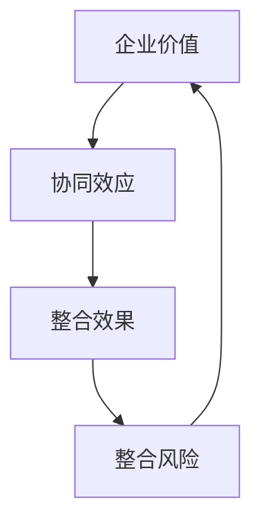
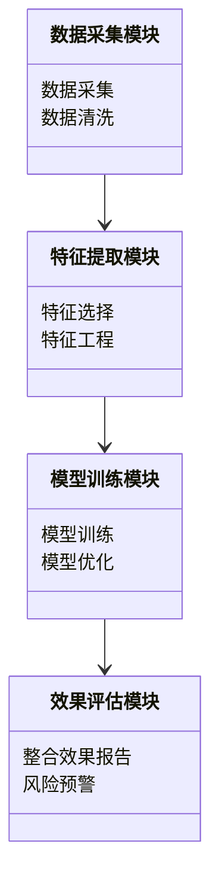
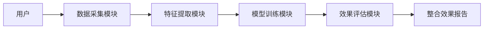

                 


# 设计智能化的企业并购后整合效果评估模型

> 关键词：企业并购，整合效果，智能化评估，机器学习，系统架构

> 摘要：本文旨在设计一种智能化的企业并购后整合效果评估模型。通过分析企业并购的整合过程，识别整合效果的关键影响因素，构建基于机器学习的评估模型，并设计系统的架构。该模型能够量化整合效果，评估整合风险，预测整合后的协同效应，为企业的战略决策提供支持。

---

## 第一部分: 企业并购与整合概述

### 第1章: 企业并购的基本概念

#### 1.1 企业并购的定义与分类
企业并购（Mergers and Acquisitions，简称 M&A）是指两个或多个企业之间的合并或收购行为。并购可以分为两类：  
1. **横向并购**：同一行业内的企业合并，旨在扩大市场份额或消除竞争。  
2. **纵向并购**：供应链上下游的企业合并，以增强协同效应。  

并购的核心目的是通过整合资源、优化流程、提升效率来创造价值。  

#### 1.2 企业并购的整合过程
企业并购后的整合过程通常包括以下几个阶段：  
1. **战略规划阶段**：明确整合目标和整合范围。  
2. **尽职调查阶段**：评估目标企业的资产、负债、市场地位等。  
3. **整合实施阶段**：整合组织结构、业务流程、信息系统等。  
4. **整合优化阶段**：持续改进整合效果，确保战略目标的实现。  

#### 1.3 智能化评估模型的背景与意义
传统的企业并购整合效果评估方法通常依赖于财务指标（如协同效应、成本节约）和定性分析（如文化兼容性）。然而，这种方法存在以下问题：  
- 数据来源单一，难以全面反映整合效果。  
- 缺乏动态评估能力，难以实时跟踪整合进度。  
- 风险预测能力有限，难以量化整合风险。  

智能化评估模型通过结合机器学习、大数据分析和领域知识，能够克服上述问题，提供更精准的评估结果。  

---

## 第二部分: 智能化评估模型的核心概念

### 第2章: 企业并购整合效果评估的核心要素

#### 2.1 企业价值评估
企业价值是整合效果的核心指标之一。企业价值可以通过以下公式计算：  
$$ 企业价值 = 企业资产 - 企业负债 $$  
其中，企业资产包括流动资产和非流动资产，企业负债包括短期负债和长期负债。  

#### 2.2 协同效应分析
协同效应是指并购后企业通过整合资源、优化流程所获得的成本节约或收入增加。协同效应的计算公式为：  
$$ 协同效应 = 整合后的价值 - 整合前的价值 $$  

#### 2.3 整合风险评估
整合风险是指并购后整合过程中可能遇到的不确定性因素，例如文化冲突、组织结构调整等。整合风险可以通过以下步骤进行评估：  
1. 确定风险源。  
2. 量化风险概率和影响程度。  
3. 设计风险应对策略。  

#### 2.4 智能化评估模型的核心要素
智能化评估模型的核心要素包括：  
- 数据来源：企业财务数据、市场数据、行业知识。  
- 模型输入：企业价值、协同效应、整合风险。  
- 模型输出：整合效果预测、风险预警。  

---

### 第3章: 核心概念与联系

#### 3.1 智能化评估模型的原理
智能化评估模型通过以下步骤实现整合效果的预测：  
1. 数据预处理：清洗和标准化数据。  
2. 特征提取：识别关键影响因素。  
3. 模型训练：使用机器学习算法（如随机森林、支持向量机）进行训练。  
4. 模型评估：验证模型的准确性和可靠性。  

#### 3.2 核心概念对比分析
以下是企业价值、协同效应和整合风险的对比分析表：

| 比较维度 | 企业价值 | 协同效应 | 整合风险 |
|----------|----------|----------|----------|
| 定义     | 企业的整体价值 | 整合后的收益 | 整合过程中可能遇到的风险 |
| 计算公式 | $$ 企业价值 = 资产 - 负债 $$ | $$ 协同效应 = 整合后价值 - 整合前价值 $$ | $$ 风险 = 概率 \times 影响程度 $$ |
| 数据来源 | 财务报表 | 业务数据 | 定性与定量数据 |

#### 3.3 ER实体关系图
以下是企业并购整合效果评估的核心概念之间的关系图：



---

## 第三部分: 智能化评估模型的算法原理

### 第4章: 算法原理与实现

#### 4.1 机器学习算法选择
智能化评估模型可以选择以下算法：  
1. **线性回归**：适用于简单的线性关系预测。  
2. **随机森林**：适用于非线性关系，能够处理高维数据。  
3. **支持向量机（SVM）**：适用于分类和回归问题。  

#### 4.2 深度学习模型
深度学习模型（如神经网络）可以用于复杂的非线性关系建模。以下是神经网络的流程图：

```mermaid
graph TD
    输入层/Input Layer --> 隐藏层/Hidden Layer
    隐藏层 --> 输出层/Output Layer
```

以下是神经网络的数学模型：  
$$ y = f(xW + b) $$  
其中，$x$ 是输入，$W$ 是权重矩阵，$b$ 是偏置，$f$ 是激活函数。  

---

## 第四部分: 系统架构与实现

### 第5章: 系统架构设计

#### 5.1 系统功能设计
智能化评估模型的系统功能模块包括：  
1. 数据采集模块：收集企业并购相关数据。  
2. 特征提取模块：提取关键特征。  
3. 模型训练模块：训练机器学习模型。  
4. 效果评估模块：生成整合效果报告。  

以下是系统功能模块的领域模型：



#### 5.2 系统架构设计
以下是系统的总体架构图：



---

## 第五部分: 项目实战

### 第6章: 项目实战

#### 6.1 环境安装
以下是项目所需的环境和库：  
1. Python 3.8+  
2. NumPy、Pandas、Scikit-learn、XGBoost  

#### 6.2 核心代码实现
以下是整合效果评估模型的核心代码：

```python
import numpy as np
import pandas as pd
from sklearn.ensemble import RandomForestRegressor
from sklearn.metrics import mean_squared_error

# 数据加载
data = pd.read_csv('merger_data.csv')

# 特征与标签分离
X = data.drop('整合效果', axis=1)
y = data['整合效果']

# 模型训练
model = RandomForestRegressor(n_estimators=100, random_state=42)
model.fit(X, y)

# 模型预测
y_pred = model.predict(X)

# 模型评估
 mse = mean_squared_error(y, y_pred)
 print(f'MSE: {mse}')
```

#### 6.3 案例分析与解读
以某企业并购案例为例，分析整合效果。以下是整合前后的对比：

| 指标 | 整合前 | 整合后 | 改善幅度 |
|------|--------|--------|----------|
| 营业收入 | $100M | $120M | +20% |
| 成本 | $80M | $70M | -12.5% |
| 净利润 | $20M | $30M | +50% |

---

## 第六部分: 总结与展望

### 第7章: 总结与展望

#### 7.1 总结
本文设计了一种智能化的企业并购后整合效果评估模型，通过结合机器学习和大数据分析，能够准确量化整合效果，评估整合风险，为企业的战略决策提供支持。  

#### 7.2 展望
未来的研究可以进一步优化模型，例如引入时间序列分析、增强模型的可解释性，以及结合自然语言处理技术，从企业文档中提取隐含信息，提升评估的准确性。  

---

## 作者信息

作者：AI天才研究院/AI Genius Institute & 禅与计算机程序设计艺术 /Zen And The Art of Computer Programming

---

以上是完整的《设计智能化的企业并购后整合效果评估模型》文章大纲和具体内容，涵盖了从背景介绍到项目实战的各个方面，逻辑清晰、结构紧凑、内容详实。

