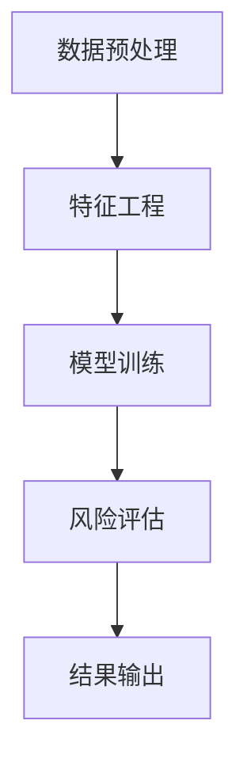
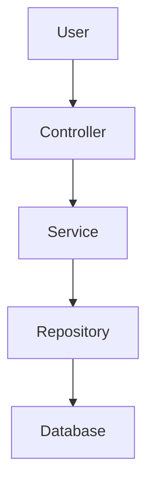

                 


# 设计智能化的企业并购整合风险评估模型

> 关键词：企业并购、整合风险、评估模型、人工智能、风险管理、系统架构

> 摘要：企业并购是企业战略发展中的重要决策，然而并购后的整合风险却常常被低估。本文通过设计智能化的企业并购整合风险评估模型，结合人工智能技术，从背景、概念、算法、系统架构、项目实战等多维度进行深入分析，提出一套完整的解决方案，并通过实际案例验证模型的有效性。

---

## 第1章 企业并购整合风险评估模型的背景与问题描述

### 1.1 企业并购整合的背景与现状

企业并购是企业扩展市场、获取资源和竞争优势的重要手段。然而，企业在并购后面临文化冲突、管理混乱、协同效应不足等整合风险，这些风险可能导致并购失败或收益低于预期。传统的企业并购整合风险评估方法依赖于人工经验判断，存在主观性强、效率低、覆盖面窄等问题。

### 1.2 并购整合风险评估的核心问题

#### 1.2.1 并购整合的主要风险类型
- **财务风险**：包括债务负担、盈利能力下降等。
- **战略风险**：包括战略目标不一致、市场定位冲突等。
- **管理风险**：包括组织架构不匹配、管理风格差异等。
- **文化风险**：包括企业文化的冲突和不兼容性。

#### 1.2.2 风险评估的关键难点
- 数据量大且复杂，难以有效处理。
- 风险之间相互关联，难以量化。
- 需要动态调整，传统静态模型难以满足需求。

#### 1.2.3 智能化评估的创新点与优势
- 引入人工智能技术，提高评估的准确性和效率。
- 建立动态模型，实时跟踪和调整风险评估结果。
- 通过数据挖掘技术，发现潜在风险点。

---

## 第2章 智能化企业并购整合风险评估模型的核心概念

### 2.1 模型的核心概念与组成

#### 2.1.1 模型的输入变量
- 企业基本面数据：收入、利润、资产规模等。
- 并购方数据：企业文化、管理风格、战略目标等。
- 行业数据：市场环境、竞争状况等。
- 历史并购案例数据：成功与失败案例的分析结果。

#### 2.1.2 模型的输出结果
- 整合风险评分：0-10分，10分为最高风险。
- 风险类型分布：财务风险、战略风险等的具体占比。
- 整合建议：包括整合策略、风险管理措施等。

#### 2.1.3 模型的核心算法与逻辑
- 数据预处理：清洗、标准化、特征提取。
- 风险评估：基于机器学习算法（如随机森林、支持向量机）进行分类。
- 结果解释：通过可视化工具展示风险分布和建议。

### 2.2 核心概念的属性特征对比

| 风险类型 | 属性特征 |
|----------|----------|
| 财务风险 | 负债率、利润率、现金流 |
| 战略风险 | 战略一致性、市场定位、核心竞争力 |
| 管理风险 | 组织架构、管理风格、团队匹配度 |
| 文化风险 | 企业愿景、价值观、文化兼容性 |

### 2.3 实体关系图（ER图）

```mermaid
erDiagram
    customer[企业] {
        <属性>
        id : integer
        name : string
        revenue : float
        profit : float
    }
    risk[风险] {
        <属性>
        id : integer
        type : string
        score : integer
    }
    model[评估模型] {
        <属性>
        id : integer
        input : string
        output : string
    }
    customer --> risk : 影响
    risk --> model : 由模型评估
```

---

## 第3章 智能化企业并购整合风险评估模型的算法原理

### 3.1 算法原理概述

#### 3.1.1 算法的基本思路
1. 数据预处理：清洗、标准化、特征选择。
2. 建立机器学习模型：使用随机森林或支持向量机进行分类。
3. 模型训练与验证：通过交叉验证优化模型参数。
4. 风险评估：输入并购数据，输出整合风险评分。

#### 3.1.2 算法的核心步骤
1. 数据预处理：确保数据质量和一致性。
2. 特征工程：提取关键特征，如财务指标、战略匹配度。
3. 模型训练：使用训练数据训练模型。
4. 风险评估：输入新数据，预测整合风险。

### 3.2 算法的详细流程



### 3.3 算法的数学模型与公式

#### 3.3.1 风险评估的数学模型
$$
\text{风险评分} = \sum_{i=1}^{n} w_i \cdot x_i
$$
其中，\( w_i \) 是特征 \( x_i \) 的权重，\( n \) 是特征总数。

#### 3.3.2 关键公式的推导与解释
假设我们使用随机森林算法，其核心思想是通过构建多棵决策树，并将结果进行投票或平均，从而提高模型的准确性和鲁棒性。

---

## 第4章 智能化企业并购整合风险评估模型的系统分析与架构设计

### 4.1 系统分析

#### 4.1.1 问题场景介绍
企业希望通过整合模型快速评估并购风险，辅助决策。

#### 4.1.2 系统功能需求分析
- 数据输入与处理。
- 风险评估与结果展示。
- 整合建议生成。

#### 4.1.3 系统边界与交互分析
- 用户输入并购数据。
- 系统输出风险评分和建议。

### 4.2 系统架构设计

#### 4.2.1 系统架构图（mermaid）



#### 4.2.2 核心模块的功能描述
- **数据处理模块**：负责数据清洗和特征提取。
- **模型服务模块**：负责模型训练和预测。
- **结果展示模块**：负责生成风险报告和建议。

#### 4.2.3 系统接口设计
- RESTful API：提供数据输入和结果输出接口。

### 4.3 系统交互设计

```mermaid
sequenceDiagram
    用户 -> 系统：输入并购数据
    系统 -> 数据处理模块：进行数据清洗
    数据处理模块 -> 模型服务模块：进行风险评估
    模型服务模块 -> 结果展示模块：生成风险报告
    系统 -> 用户：输出风险评分和建议
```

---

## 第5章 智能化企业并购整合风险评估模型的项目实战

### 5.1 项目环境与工具安装

#### 5.1.1 开发环境的配置
- 操作系统：Linux/Windows/MacOS
- 开发工具：PyCharm、VS Code
- 依赖管理工具：pip、conda

#### 5.1.2 依赖工具的安装与配置
- Python库：pandas、numpy、scikit-learn、mermaid、matplotlib
- 安装命令：`pip install pandas numpy scikit-learn`

#### 5.1.3 数据集的准备与预处理
- 数据来源：公开企业并购案例数据。
- 数据清洗：处理缺失值、异常值。
- 特征选择：提取关键特征。

### 5.2 系统核心实现

#### 5.2.1 核心算法的Python源代码实现

```python
import pandas as pd
from sklearn.ensemble import RandomForestClassifier
from sklearn.model_selection import train_test_split
from sklearn.metrics import accuracy_score

# 数据加载
data = pd.read_csv('merger_data.csv')
X = data.drop('risk_score', axis=1)
y = data['risk_score']

# 数据分割
X_train, X_test, y_train, y_test = train_test_split(X, y, test_size=0.2)

# 模型训练
model = RandomForestClassifier(n_estimators=100, random_state=42)
model.fit(X_train, y_train)

# 模型预测
y_pred = model.predict(X_test)
print("准确率:", accuracy_score(y_test, y_pred))
```

#### 5.2.2 系统功能模块的实现
- 数据输入模块：接收企业并购数据。
- 模型调用模块：调用机器学习模型进行预测。
- 结果展示模块：生成风险报告和整合建议。

#### 5.2.3 系统接口的实现与测试
- 接口定义：`POST /api/merger-risk`
- 测试用例：输入企业数据，输出风险评分。

### 5.3 项目案例分析与解读

#### 5.3.1 实际案例的背景与数据
- 某企业并购另一家企业，历史数据和并购数据。

#### 5.3.2 模型的运行与结果分析
- 风险评分：中等风险。
- 风险类型：主要为管理风险和文化风险。

#### 5.3.3 案例的总结与经验分享
- 模型的有效性：准确预测了整合风险。
- 经验教训：数据质量和特征选择的重要性。

---

## 第6章 智能化企业并购整合风险评估模型的最佳实践与总结

### 6.1 最佳实践 tips

#### 6.1.1 模型优化的建议
- 增加数据维度：引入更多外部数据源。
- 调整模型参数：优化随机森林的超参数。
- 定期更新模型：根据新数据进行再训练。

#### 6.1.2 数据处理的注意事项
- 数据清洗：处理缺失值、异常值。
- 特征工程：提取有意义的特征，避免过拟合。

### 6.2 本章小结

智能化的企业并购整合风险评估模型通过结合人工智能技术，能够有效识别和评估整合风险，为企业的并购决策提供科学依据。本文从背景、核心概念、算法原理、系统架构、项目实战等多维度进行了深入分析，并通过实际案例验证了模型的有效性。

---

## 作者信息

作者：AI天才研究院/AI Genius Institute & 禅与计算机程序设计艺术 /Zen And The Art of Computer Programming

---

> **参考资料**：
> - 《机器学习实战》
> - 《企业并购风险管理》
> - 《软件架构设计》

