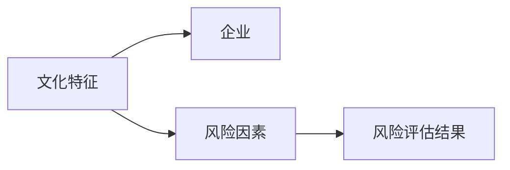
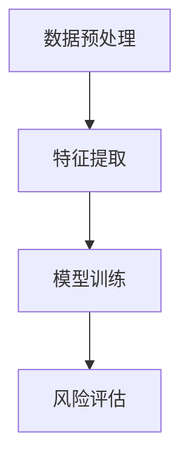

                 

<think>
好的，我需要设计一本名为《设计智能化的企业并购文化整合风险评估模型》的目录大纲。首先，我要理解这本书的核心内容和目标读者是谁。这本书的目标读者应该是企业并购相关的管理人员、风险评估专家以及对人工智能在企业应用中感兴趣的读者。

接下来，我需要考虑这本书需要涵盖哪些主要部分。企业并购涉及很多方面，比如企业战略、文化差异、管理整合等等。而文化整合又是并购后整合中的关键部分，涉及到企业文化的融合、员工适应新文化的能力、管理风格的协调等问题。

为了智能化地评估文化整合的风险，可能需要引入人工智能和大数据分析的手段。这部分可能需要涵盖数据采集、模型构建、算法设计等技术内容。

然后，我需要考虑目录的结构。通常技术书籍会有引言、理论基础、方法论、实践案例、结论等部分。考虑到智能化模型的设计，可能需要从背景、理论、方法、系统架构、实现案例等几个方面展开。

在目录的每一章中，我需要细化内容。例如，在引言部分，介绍企业并购的背景、文化整合的重要性，以及为什么需要智能化的评估模型。接下来，定义文化整合风险的核心概念，讨论文化差异、评估指标等。然后，详细讲解智能化模型的设计原理，包括使用的算法、数据处理、模型训练等。接着，讨论系统架构，包括模块划分、数据流、接口设计等。最后，通过实际案例展示模型的应用和效果，并总结经验教训。

我还需要确保每一章都有足够的细节和深度，涵盖读者可能感兴趣的关键点。比如，在算法部分，可能需要具体说明使用了哪些机器学习算法，如何处理数据，模型的评估标准是什么。在系统架构部分，可能需要详细描述各个模块的功能和它们之间的关系。

最后，我需要检查目录是否完整，是否覆盖了从概念到实践的全过程，确保读者能够系统地理解并应用智能化的企业并购文化整合风险评估模型。
</think>

# 设计智能化的企业并购文化整合风险评估模型

> 关键词：企业并购、文化整合、风险评估、人工智能、智能化模型

> 摘要：本文旨在设计一种智能化的企业并购文化整合风险评估模型。通过分析企业并购中的文化整合问题，提出一种基于机器学习的智能化评估方法，结合实际案例和系统架构设计，详细阐述模型的设计原理、实现过程及应用效果，为企业并购中的文化整合风险评估提供理论依据和实践指导。

---

# 第1章: 企业并购与文化整合风险概述

## 1.1 企业并购的背景与现状
### 1.1.1 企业并购的定义与特点
企业并购是指一家企业通过购买另一家企业的一部分或全部股权，以实现战略扩张和资源整合。其特点包括规模效应、资源优化配置和风险共担。

### 1.1.2 并购中的文化整合问题
文化整合是企业并购后整合的关键环节，涉及企业愿景、价值观、管理风格和员工文化适应性等方面。文化差异可能导致协同效应不足，甚至引发管理冲突。

### 1.1.3 文化整合风险的定义与分类
文化整合风险是指在企业并购过程中，由于文化差异导致整合失败的可能性。分类包括文化冲突风险、管理风格不兼容风险和员工适应性风险。

## 1.2 企业并购中的文化整合挑战
### 1.2.1 文化差异对企业整合的影响
文化差异可能导致企业战略不一致、管理混乱和员工士气低落。

### 1.2.2 并购失败的典型案例分析
通过分析实际案例，如某跨国并购失败的原因，揭示文化整合失败对企业的影响。

### 1.2.3 文化整合风险的复杂性
文化整合风险涉及多个维度，如企业战略、管理风格和员工适应性，具有高度复杂性和动态性。

## 1.3 智能化评估模型的必要性
### 1.3.1 传统文化整合评估方法的局限性
传统评估方法依赖主观判断，缺乏数据支持和动态调整能力。

### 1.3.2 智能化评估模型的优势
智能化模型利用大数据和机器学习技术，能够量化文化差异，提供动态评估和风险预警。

### 1.3.3 模型的应用场景与目标
模型适用于跨国并购、混合并购和战略并购，目标是降低文化整合风险，提高并购成功率。

## 1.4 本章小结
本章介绍了企业并购的背景、文化整合的挑战以及智能化评估模型的必要性，为后续模型设计奠定了基础。

---

# 第2章: 企业并购文化整合风险评估的核心概念

## 2.1 文化整合风险的构成要素
### 2.1.1 企业文化的核心维度
企业文化包括企业愿景、价值观、管理风格和员工行为规范等核心维度。

### 2.1.2 风险评估的关键要素
关键要素包括文化差异、管理层风格、员工适应性和企业战略一致性。

### 2.1.3 核心概念的属性对比
通过对比分析，明确文化差异、管理风格和员工适应性在文化整合中的不同作用。

## 2.2 文化整合风险评估的理论框架
### 2.2.1 模型的输入与输出
输入包括企业文化数据和并购战略，输出包括风险评估结果和整合建议。

### 2.2.2 核心概念的ER实体关系图


## 2.3 本章小结
本章通过分析文化整合风险的构成要素和理论框架，为模型的设计提供了理论支持。

---

# 第3章: 智能化评估模型的算法原理

## 3.1 算法选择与原理
### 3.1.1 机器学习在风险评估中的应用
机器学习算法能够处理大量文化数据，发现潜在风险因素。

### 3.1.2 分类模型的原理
分类模型通过训练数据，学习文化差异与风险之间的关系，预测整合风险。

### 3.1.3 模型的训练与优化
通过交叉验证和参数调优，提升模型的准确性和鲁棒性。

## 3.2 算法流程图


## 3.3 数学模型与公式
### 3.3.1 风险概率计算公式
$$ P(risk) = \frac{\sum_{i=1}^{n} w_i x_i}{\sum_{i=1}^{n} w_i} $$
其中，$w_i$ 是第 $i$ 个风险因素的权重，$x_i$ 是其对应的特征值。

### 3.3.2 模型评估指标
$$ accuracy = \frac{TP + TN}{TP + TN + FP + FN} $$
其中，$TP$ 是真正例数，$TN$ 是真反例数，$FP$ 是假正例数，$FN$ 是假反例数。

## 3.4 本章小结
本章详细介绍了算法选择、流程设计和数学模型，为模型的实现提供了技术依据。

---

# 第4章: 系统架构与设计方案

## 4.1 系统功能设计
### 4.1.1 数据采集模块
负责收集企业文化和并购相关的数据，包括企业愿景、管理风格和员工文化适应性。

### 4.1.2 风险评估模块
通过机器学习算法，评估文化整合风险，并生成风险报告。

### 4.1.3 结果展示模块
以可视化方式呈现风险评估结果，为决策者提供直观的参考。

## 4.2 系统架构设计


## 4.3 系统接口设计
系统接口包括数据输入接口、模型调用接口和结果展示接口，确保各模块协同工作。

## 4.4 系统交互设计


## 4.5 本章小结
本章通过系统架构设计和功能模块划分，明确了智能化评估模型的实现路径。

---

# 第5章: 项目实战与案例分析

## 5.1 项目背景与目标
以某跨国企业并购项目为例，目标是评估文化整合风险，制定整合策略。

## 5.2 系统实现
### 5.2.1 环境安装与配置
安装Python、机器学习库和可视化工具，搭建开发环境。

### 5.2.2 核心代码实现
实现数据预处理、特征提取和模型训练的代码，具体如下：

```python
import pandas as pd
from sklearn.ensemble import RandomForestClassifier
from sklearn.metrics import accuracy_score

# 数据加载与预处理
data = pd.read_csv('culture_data.csv')
X = data.drop('risk', axis=1)
y = data['risk']

# 模型训练
model = RandomForestClassifier()
model.fit(X, y)

# 模型评估
y_pred = model.predict(X)
print("Accuracy:", accuracy_score(y, y_pred))
```

### 5.2.3 系统功能解读
详细解读代码的功能，包括数据加载、模型训练和结果评估。

## 5.3 实际案例分析
分析某跨国并购项目的文化整合风险，验证模型的预测效果。

## 5.4 本章小结
本章通过实际案例分析，验证了智能化评估模型的有效性和实用性。

---

# 第6章: 总结与展望

## 6.1 本章总结
总结智能化企业并购文化整合风险评估模型的设计方法、实现过程和应用效果。

## 6.2 未来展望
探讨模型的优化方向，包括引入更先进的算法、扩展应用场景和提升模型的实时性。

---

# 附录

## 附录A: 数据格式与接口规范
详细说明数据输入格式和系统接口规范。

## 附录B: 模型参数与调优建议
提供模型参数的设置建议和调优方法。

---

# 参考文献

（此处列出相关参考文献）

---

作者：AI天才研究院/AI Genius Institute & 禅与计算机程序设计艺术 /Zen And The Art of Computer Programming

