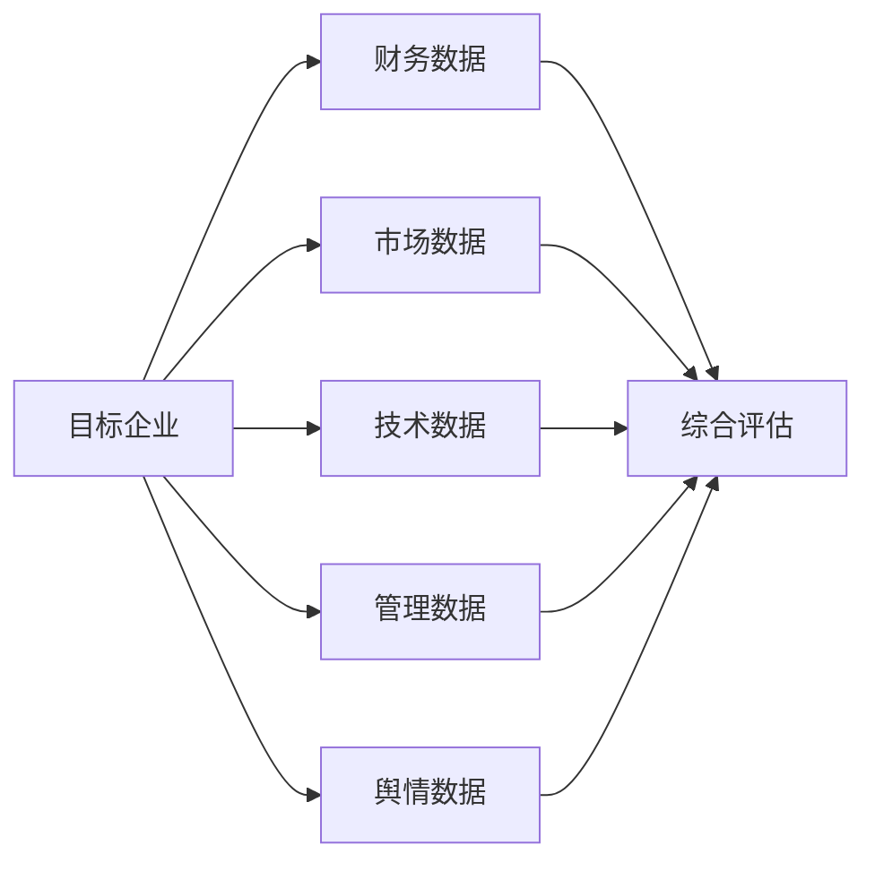
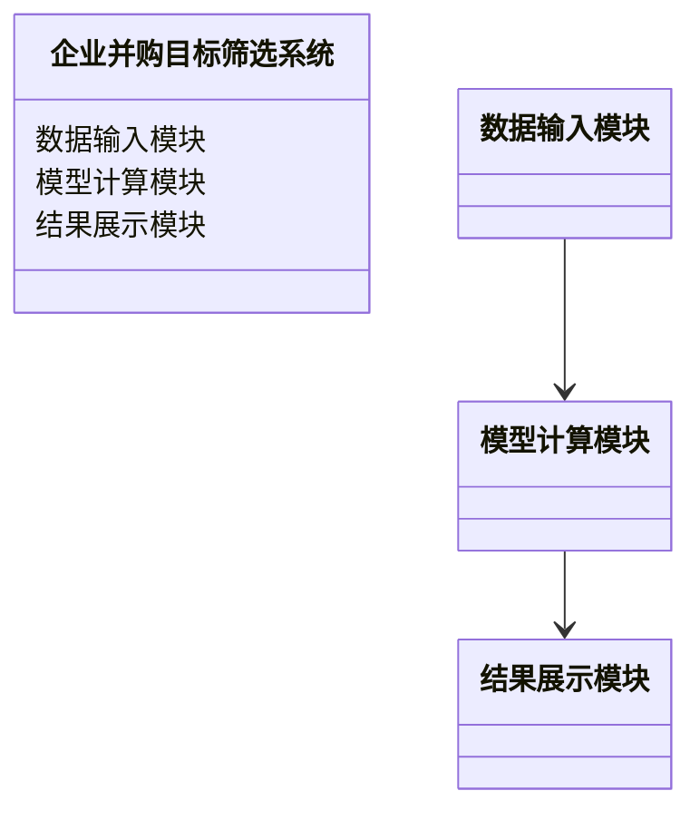

                 


# 设计智能化的企业并购目标筛选多维度评估模型

> 关键词：企业并购，目标筛选，多维度评估，智能化模型，人工智能，数据驱动

> 摘要：在企业并购过程中，目标企业的筛选是决定交易成功与否的关键因素。传统的目标筛选方法依赖于人工分析和经验判断，存在效率低、主观性强、覆盖面窄等问题。随着人工智能技术的快速发展，如何设计一个智能化的企业并购目标筛选多维度评估模型，利用数据驱动的方法实现精准、高效的评估，成为企业并购领域的重要研究方向。本文将从背景、理论、算法、系统设计到实际应用，全面探讨如何构建这样一个智能化的评估模型。

---

## 第1章 企业并购概述与智能化需求

### 1.1 企业并购的基本概念

#### 1.1.1 企业并购的定义与类型
企业并购（Mergers and Acquisitions, M&A）是指一家企业与其他企业（目标企业）通过合并或收购的方式，整合资源、扩展业务或进入新市场。企业并购可以分为两类：
1. **合并（Merger）**：两家或多家企业合并成一家新公司。
2. **收购（Acquisition）**：一家企业收购另一家企业的全部或部分资产或股权。

#### 1.1.2 企业并购的核心目标与流程
企业并购的核心目标是通过整合资源，提升市场竞争力，扩大业务规模，或实现战略转型。典型的并购流程包括：
1. 确定并购目标。
2. 进行尽职调查。
3. 谈判与签订协议。
4. 完成交割。
5. 整合与整合后管理。

#### 1.1.3 传统企业并购中的问题与挑战
传统的企业并购目标筛选方法主要依赖于财务报表分析、行业经验判断和主观评估，存在以下问题：
- **信息不对称**：目标企业的实际经营状况难以全面掌握。
- **主观性强**：评估结果依赖于个人经验和判断，缺乏客观性。
- **效率低下**：手动筛选目标企业耗时长，覆盖面有限。
- **数据碎片化**：缺乏系统化的数据整合和分析工具。

---

### 1.2 智能化筛选的必要性

#### 1.2.1 传统目标筛选的局限性
传统目标筛选方法存在以下局限性：
- **信息处理能力有限**：难以处理海量数据，尤其是非结构化数据（如新闻、社交媒体数据）。
- **评估维度单一**：主要依赖财务指标，忽视市场、技术、管理等多维度因素。
- **决策周期长**：从筛选到最终决策的时间较长，难以快速响应市场变化。

#### 1.2.2 数据驱动决策的优势
通过数据驱动的方法，企业可以实现以下目标：
- **全面性**：整合财务、市场、技术等多维度数据，全面评估目标企业。
- **准确性**：利用机器学习算法，基于历史数据和模式识别，提高评估的准确性。
- **高效性**：自动化筛选和评估过程，缩短决策周期，提高效率。

#### 1.2.3 智能化筛选的潜在价值
智能化的目标筛选模型可以为并购方提供以下价值：
- **精准定位目标企业**：通过多维度数据挖掘，发现潜在的优质目标。
- **降低并购风险**：提前识别目标企业的潜在问题，减少并购后的整合风险。
- **提升决策效率**：自动化筛选和评估，缩短并购周期，降低人工成本。

---

## 第2章 多维度评估模型的结构与属性

### 2.1 模型的核心概念

#### 2.1.1 智能化筛选的基本原理
智能化筛选的基本原理是通过数据挖掘、机器学习和自然语言处理等技术，从目标企业的多维度数据中提取特征，并利用算法进行综合评估。

#### 2.1.2 多维度评估的核心要素
多维度评估的核心要素包括：
1. **财务数据**：如收入、利润、资产负债率等。
2. **市场数据**：如市场份额、竞争对手分析、行业趋势等。
3. **技术数据**：如专利数量、技术先进性、研发能力等。
4. **管理数据**：如管理层稳定性、管理团队能力等。
5. **舆情数据**：如新闻报道、社交媒体情绪、行业评价等。

#### 2.1.3 模型的输入与输出
- **输入**：目标企业的多维度数据。
- **输出**：目标企业的综合评估得分及排序。

---

### 2.2 模型的属性对比

#### 2.2.1 不同评估维度的特征分析
以下表格展示了不同评估维度的关键特征对比：

| 维度 | 特征 |
|------|------|
| 财务数据 | 客观性高，可量化的指标丰富 |
| 市场数据 | 动态变化，反映行业趋势 |
| 技术数据 | 体现企业核心竞争力，但难以量化 |
| 管理数据 | 关系企业长期发展，但主观性强 |
| 舆情数据 | 反映市场情绪，具有实时性 |

#### 2.2.2 各维度权重的计算方法
为了平衡不同维度的重要性，需要为每个维度分配适当的权重。权重的计算方法可以采用层次分析法（AHP）或熵值法。以下是一个简单的层次分析法示例：

1. 构建判断矩阵：
   $$ A = \begin{bmatrix}
   1 & 3 & 2 & 4 & 3 \\
   1/3 & 1 & 2/3 & 2 & 1.5 \\
   1/2 & 3/2 & 1 & 3 & 2 \\
   1/4 & 1/2 & 1/3 & 1 & 0.75 \\
   1/3 & 2/3 & 1/2 & 1.33 & 1 \\
   \end{bmatrix} $$

2. 计算权重向量：
   $$ W = \begin{bmatrix} 0.2 & 0.15 & 0.25 & 0.3 & 0.1 \end{bmatrix} $$

---

#### 2.2.3 实体关系图的构建



---

## 第3章 多维度评估模型的算法原理

### 3.1 模型的数学基础

#### 3.1.1 多维度评估的数学模型
综合评估模型可以表示为：
$$ S = \sum_{i=1}^{n} w_i \cdot f_i $$
其中，$w_i$ 是第 $i$ 个维度的权重，$f_i$ 是第 $i$ 个维度的评估分数。

#### 3.1.2 模型的权重分配公式
权重分配可以采用层次分析法（AHP）或熵值法。熵值法的计算步骤如下：
1. 标准化数据：
   $$ x_{ij} = \frac{x_{ij}}{\sum_{j=1}^{m} x_{ij}} $$
2. 计算熵值：
   $$ H_i = -\sum_{j=1}^{m} x_{ij} \ln x_{ij} $$
3. 计算权重：
   $$ w_i = \frac{H_i - \bar{H}}{\sum_{i=1}^{n} (H_i - \bar{H})} $$
   其中，$\bar{H}$ 是熵值的平均值。

---

#### 3.1.3 综合评分公式
综合评分公式为：
$$ S = \sum_{i=1}^{n} w_i \cdot f_i $$

---

### 3.2 算法的实现步骤

#### 3.2.1 数据预处理与特征提取
1. 数据清洗：去除缺失值和异常值。
2. 特征提取：从文本数据中提取关键词（如新闻标题中的关键词）。

#### 3.2.2 维度权重的计算方法
采用熵值法计算各维度的权重。

#### 3.2.3 综合评分的计算流程
1. 对每个目标企业进行多维度评估。
2. 根据权重计算综合评分。
3. 根据评分排序目标企业。

---

### 3.3 算法的优化与改进

#### 3.3.1 算法的优化方向
- **动态权重调整**：根据市场变化动态调整各维度的权重。
- **非线性回归**：引入非线性模型（如随机森林、神经网络）提高评估准确性。

#### 3.3.2 算法的实现代码

```python
import pandas as pd
import numpy as np
from sklearn.preprocessing import MinMaxScaler

# 示例数据
data = {
    '企业名称': ['A', 'B', 'C', 'D', 'E'],
    '收入': [100, 80, 90, 120, 110],
    '市场份额': [0.3, 0.2, 0.25, 0.35, 0.3],
    '专利数量': [20, 15, 18, 25, 22],
    '管理团队稳定性': [0.8, 0.7, 0.6, 0.9, 0.8],
    '舆情得分': [0.7, 0.6, 0.75, 0.8, 0.7]
}

df = pd.DataFrame(data)

# 计算熵值权重
n = df.shape[1]  # 列数（维度数）
m = df.shape[0]  # 样本数

# 标准化数据
normalized_df = df.apply(lambda x: (x - x.min()) / (x.max() - x.min()), axis=0)

# 计算熵值
entropy = np.zeros(n)
for i in range(n):
    prob = normalized_df.iloc[:, i].values
    entropy[i] = -np.sum(prob * np.log2(prob + 1e-10)) / np.log2(m)

# 计算权重
weights = (entropy - np.mean(entropy)) / np.std(entropy)
weights = weights / sum(weights)

# 计算综合评分
df['综合评分'] = np.dot(normalized_df.values, weights)
```

---

## 第4章 系统分析与架构设计

### 4.1 系统功能模块划分

#### 4.1.1 数据输入模块
- **功能**：接收目标企业的多维度数据，包括财务数据、市场数据、技术数据、管理数据和舆情数据。

#### 4.1.2 模型计算模块
- **功能**：对输入数据进行预处理、特征提取和综合评估，输出目标企业的综合评分和排序结果。

#### 4.1.3 结果展示模块
- **功能**：以可视化形式展示目标企业的评估结果，包括综合评分、各维度得分及权重。

---

### 4.2 系统的领域模型



---

## 第5章 项目实战

### 5.1 环境安装

#### 5.1.1 Python环境
安装Python和必要的库：
```bash
pip install pandas numpy scikit-learn
```

### 5.2 系统核心实现源代码

```python
import pandas as pd
import numpy as np

# 示例数据
data = {
    '企业名称': ['A', 'B', 'C', 'D', 'E'],
    '收入': [100, 80, 90, 120, 110],
    '市场份额': [0.3, 0.2, 0.25, 0.35, 0.3],
    '专利数量': [20, 15, 18, 25, 22],
    '管理团队稳定性': [0.8, 0.7, 0.6, 0.9, 0.8],
    '舆情得分': [0.7, 0.6, 0.75, 0.8, 0.7]
}

df = pd.DataFrame(data)

# 熵值法计算权重
n = df.shape[1]
m = df.shape[0]

normalized_df = df.apply(lambda x: (x - x.min()) / (x.max() - x.min()), axis=0)

entropy = np.zeros(n)
for i in range(n):
    prob = normalized_df.iloc[:, i].values
    entropy[i] = -np.sum(prob * np.log2(prob + 1e-10)) / np.log2(m)

weights = (entropy - np.mean(entropy)) / np.std(entropy)
weights = weights / sum(weights)

# 计算综合评分
df['综合评分'] = np.dot(normalized_df.values, weights)
print(df)
```

### 5.3 实际案例分析

#### 5.3.1 案例分析
以目标企业D为例，计算其综合评分为：
$$ S_D = (收入 \times 权重_{收入}) + (市场份额 \times 权重_{市场份额}) + (专利数量 \times 权重_{专利数量}) + (管理团队稳定性 \times 权重_{管理团队稳定性}) + (舆情得分 \times 权重_{舆情得分}) $$

---

## 第6章 总结与展望

### 6.1 本章小结
智能化的企业并购目标筛选多维度评估模型通过数据驱动的方法，实现了对目标企业的全面、精准评估，显著提高了并购决策的效率和准确性。

### 6.2 注意事项
- 数据质量直接影响评估结果，需确保数据的准确性和完整性。
- 模型的权重需根据实际情况动态调整。
- 模型的可解释性需进一步提升，以便更好地辅助决策。

### 6.3 拓展阅读
- 《企业并购的策略与风险管理》
- 《数据驱动的企业决策》
- 《人工智能在金融领域的应用》

---

作者：AI天才研究院/AI Genius Institute & 禅与计算机程序设计艺术 /Zen And The Art of Computer Programming

