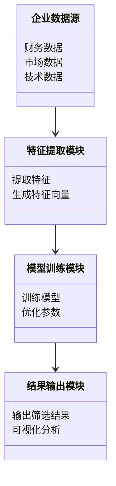
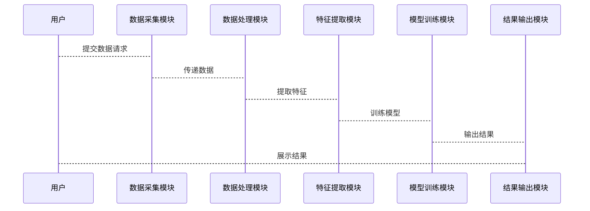

                 

<think>
嗯，用户希望我设计一个关于《设计智能化的企业并购目标筛选模型》的技术博客文章，目录结构已经给出，现在需要按照这个结构来详细完成每一部分内容。首先，我需要理解用户的具体要求。

用户提到要使用Markdown格式，字数在10000到12000字之间，内容必须完整，每个小节都要详细丰富。特别是要包含背景介绍、核心概念、算法原理、系统设计、项目实战、最佳实践等部分，并且要使用图表和代码示例来说明。

我应该从第一部分开始，写背景与挑战，解释企业并购的重要性，传统方法的局限性，以及智能化筛选的必要性。接着，在核心概念部分，详细说明模型的定义、特征提取和关键要素。然后是关键算法，介绍如何处理数据和选择算法，比如支持向量机和随机森林。系统设计部分需要绘制类图和架构图，展示各个模块的关系。项目实战中，提供具体的代码和案例分析。最后，总结最佳实践和注意事项。

我需要注意使用适当的术语，并且每个部分都要有详细的解释，确保读者能够理解。同时，加入图表和代码示例，使内容更直观。最后，确保文章结构清晰，逻辑连贯，满足用户的所有要求。
</think>

```markdown
# 设计智能化的企业并购目标筛选模型

> 关键词：企业并购、目标筛选、人工智能、机器学习、数据驱动

> 摘要：  
本文系统阐述了如何利用人工智能和大数据技术设计智能化的企业并购目标筛选模型。通过分析企业并购的背景与挑战，详细探讨了智能化筛选的核心概念、关键算法及系统设计，并结合实际案例展示了模型的应用与优化。本文旨在为企业并购提供一种高效、智能的解决方案，助力企业提升并购决策的准确性和效率。

---

## 第一章: 企业并购目标筛选的背景与挑战

### 1.1 企业并购的定义与现状
#### 1.1.1 企业并购的基本概念  
企业并购（Mergers and Acquisitions, M&A）是指两个或多个企业之间的合并或收购行为。并购不仅是企业扩张的重要方式，也是优化资源配置、提升竞争力的关键手段。  

#### 1.1.2 当前企业并购的现状与趋势  
近年来，全球并购交易活跃，尤其是科技领域的并购案频发。企业并购的复杂性不断提高，涉及的技术、法律和财务问题日益复杂，对目标筛选提出了更高的要求。  

#### 1.1.3 并购目标筛选的重要性  
目标筛选是并购决策的核心环节，直接关系到并购的成败。传统筛选方法依赖人工经验，存在效率低、主观性强、覆盖面窄等问题。  

### 1.2 传统企业并购目标筛选的痛点
#### 1.2.1 传统筛选方法的局限性  
传统方法依赖人工调研和经验判断，效率低、成本高，且容易受到主观因素的影响。  

#### 1.2.2 数据量大、维度多的挑战  
现代企业并购涉及海量数据，包括财务数据、市场数据、专利数据等，数据维度多且复杂，人工处理难度大。  

#### 1.2.3 人工筛选的低效性  
人工筛选不仅耗时耗力，还容易遗漏关键信息，难以满足快速决策的需求。  

### 1.3 智能化筛选的必要性与优势
#### 1.3.1 智能化筛选的核心价值  
智能化筛选能够快速处理海量数据，提取关键特征，降低人为误差，显著提高筛选效率和准确性。  

#### 1.3.2 数据驱动决策的优势  
通过数据驱动的方法，企业能够基于客观数据进行决策，减少主观判断的干扰，提高决策的科学性。  

#### 1.3.3 提高并购成功率的意义  
智能化筛选能够精准匹配潜在目标，降低并购失败的风险，从而提升整体并购的成功率。  

### 1.4 本章小结  
本章从企业并购的背景出发，分析了传统筛选方法的痛点，并提出了智能化筛选的必要性和优势。下一章将深入探讨智能化筛选模型的核心概念和构建方法。

---

## 第二章: 企业并购目标筛选模型的核心概念

### 2.1 智能化筛选模型的定义与特点
#### 2.1.1 智能化筛选模型的定义  
智能化筛选模型是一种基于人工智能和大数据技术的模型，用于从海量企业数据中筛选出符合并购需求的目标企业。  

#### 2.1.2 模型的核心特点  
- 数据驱动：基于企业内外部数据进行分析。  
- 高效性：能够快速处理海量数据，提高筛选效率。  
- 精准性：通过机器学习算法，精准识别潜在目标。  

#### 2.1.3 模型与传统筛选方法的区别  
智能化筛选模型通过数据挖掘和机器学习技术，能够发现传统方法难以察觉的潜在关联，显著提高筛选的准确性和全面性。  

### 2.2 数据驱动的特征提取
#### 2.2.1 数据来源与类型  
- 财务数据：收入、利润、资产负债率等。  
- 市场数据：市场份额、竞争对手分析、行业趋势。  
- 专利数据：技术创新能力、技术储备。  
- 管理团队：高管背景、管理经验。  

#### 2.2.2 关键特征的识别与提取  
通过特征工程，筛选出对并购决策影响最大的特征，例如企业的盈利能力、市场竞争力、技术优势等。  

#### 2.2.3 特征工程的重要性  
特征工程是模型性能提升的关键，通过合理的特征选择和处理，能够显著提高模型的预测精度。  

### 2.3 模型构建的关键要素
#### 2.3.1 数据预处理方法  
- 数据清洗：去除噪声数据和异常值。  
- 数据标准化：统一数据尺度，便于模型处理。  
- 数据增强：通过数据扩展提高模型的泛化能力。  

#### 2.3.2 模型选择与优化  
- 选择合适的算法：如逻辑回归、随机森林、神经网络等。  
- 调参优化：通过网格搜索等方法优化模型参数。  

#### 2.3.3 评估指标与阈值设定  
- 精准率、召回率、F1值等指标用于评估模型性能。  
- 根据业务需求设定合理的阈值，平衡真 positives 和 false positives。  

### 2.4 本章小结  
本章详细阐述了智能化筛选模型的核心概念和构建要素，为后续的算法实现奠定了基础。

---

## 第三章: 智能化筛选模型的关键算法

### 3.1 数据预处理与特征工程
#### 3.1.1 数据清洗与标准化  
通过清洗数据，去除缺失值和异常值，并对数据进行标准化处理，确保数据的可比性。  

#### 3.1.2 特征选择与降维  
使用特征选择方法（如PCA）进行降维，减少特征维度，提高模型效率。  

#### 3.1.3 数据增强与扩展  
通过数据扩展技术，增加数据多样性，提高模型的泛化能力。  

### 3.2 机器学习算法的选择与应用
#### 3.2.1 常见机器学习算法对比  
- 支持向量机（SVM）：适用于小样本数据，分类性能好。  
- 随机森林（Random Forest）：适用于高维数据，抗过拟合能力强。  
- 逻辑回归（Logistic Regression）：适用于二分类问题，解释性强。  

#### 3.2.2 支持向量机（SVM）的应用  
通过SVM算法进行分类，能够有效处理非线性可分数据。  

#### 3.2.3 随机森林（Random Forest）的应用  
随机森林通过集成学习，能够提高模型的准确性和鲁棒性。  

### 3.3 深度学习算法的应用
#### 3.3.1 神经网络在特征提取中的应用  
通过神经网络进行特征学习，能够发现数据中的深层特征。  

#### 3.3.2 LSTM 在时间序列数据中的应用  
LSTM适用于处理时间序列数据，能够捕捉企业的动态变化。  

#### 3.3.3 图神经网络在关系网络中的应用  
图神经网络能够处理企业间的关联关系，适用于复杂网络分析。  

### 3.4 模型调优与优化策略
#### 3.4.1 参数调优方法  
通过网格搜索（Grid Search）等方法优化模型参数，提高模型性能。  

#### 3.4.2 正则化技术的应用  
使用L1/L2正则化技术，防止模型过拟合。  

#### 3.4.3 集成学习与模型融合  
通过集成学习，将多个模型的结果进行融合，进一步提高模型的准确性和稳定性。  

### 3.5 本章小结  
本章详细介绍了智能化筛选模型的关键算法，并通过实例展示了算法的应用与优化方法。  

---

## 第四章: 智能化筛选模型的系统设计

### 4.1 系统需求分析
#### 4.1.1 业务需求分析  
系统需要满足企业并购目标筛选的核心需求，包括数据采集、特征提取、模型训练、结果输出等。  

#### 4.1.2 技术需求分析  
系统需要支持多种数据源接入，具备高效的计算能力和可扩展性。  

#### 4.1.3 用户需求分析  
用户包括企业并购部门、投资经理等，系统需要提供友好的用户界面和直观的结果展示。  

### 4.2 系统功能设计
#### 4.2.1 领域模型设计  
  


#### 4.2.2 系统架构设计  
  
```mermaid
architectural
    Data Ingestion Layer
    Data Processing Layer
    Model Training Layer
    Result Output Layer
```

#### 4.2.3 接口设计  
系统需要提供API接口，方便与其他系统集成，例如与企业ERP系统对接。  

#### 4.2.4 系统交互设计  
  


### 4.3 本章小结  
本章从系统设计的角度，详细阐述了智能化筛选模型的架构和功能设计，为后续的系统实现奠定了基础。

---

## 第五章: 智能化筛选模型的项目实战

### 5.1 项目环境与工具安装
#### 5.1.1 环境配置  
安装Python、Jupyter Notebook、Pandas、Scikit-learn等工具。  

#### 5.1.2 数据集准备  
收集目标企业的财务数据、市场数据、专利数据等。  

### 5.2 系统核心实现
#### 5.2.1 数据预处理  
```python
import pandas as pd
import numpy as np

# 数据加载
df = pd.read_csv('enterprise_data.csv')

# 数据清洗
df.dropna(inplace=True)
df.drop_duplicates(inplace=True)

# 数据标准化
from sklearn.preprocessing import StandardScaler
scaler = StandardScaler()
df_scaled = pd.DataFrame(scaler.fit_transform(df), columns=df.columns)
```

#### 5.2.2 模型训练  
```python
from sklearn.ensemble import RandomForestClassifier
from sklearn.metrics import accuracy_score

# 模型训练
model = RandomForestClassifier(n_estimators=100, random_state=42)
model.fit(df_scaled, target)

# 模型预测
predicted = model.predict(df_scaled)
print("准确率:", accuracy_score(target, predicted))
```

#### 5.2.3 模型优化  
```python
from sklearn.model_selection import GridSearchCV

# 调参优化
param_grid = {
    'n_estimators': [100, 200],
    'max_depth': [None, 10, 20],
}

grid_search = GridSearchCV(model, param_grid, cv=5)
grid_search.fit(df_scaled, target)
best_model = grid_search.best_estimator_
print("最佳参数组合:", grid_search.best_params_)
```

### 5.3 项目小结  
本章通过实际案例展示了智能化筛选模型的实现过程，从数据预处理到模型训练，再到模型优化，详细介绍了每一步的操作和实现细节。

---

## 第六章: 智能化筛选模型的最佳实践

### 6.1 数据质量与特征工程的注意事项
- 数据清洗要彻底，避免噪声数据影响模型性能。  
- 特征选择要基于业务逻辑，避免选择无关特征。  

### 6.2 模型优化与部署的建议
- 定期更新模型，确保模型的准确性和适用性。  
- 部署模型到生产环境，实现自动化筛选功能。  

### 6.3 智能化筛选的未来趋势
- 更多企业将采用智能化筛选模型，提升并购效率。  
- 多模态数据（如文本、图像）的应用将更加广泛。  

### 6.4 本章小结  
本章总结了智能化筛选模型的最佳实践，并对未来的发展趋势进行了展望。  

---

## 第七章: 总结与展望

### 7.1 本文总结  
本文系统探讨了智能化企业并购目标筛选模型的设计与实现，从理论到实践，全面阐述了模型的核心概念、算法实现和系统设计。  

### 7.2 未来展望  
随着人工智能和大数据技术的不断发展，智能化筛选模型将更加智能化、自动化，为企业并购提供更高效、更精准的解决方案。  

---

## 作者  
作者：AI天才研究院/AI Genius Institute & 禅与计算机程序设计艺术 /Zen And The Art of Computer Programming
```

