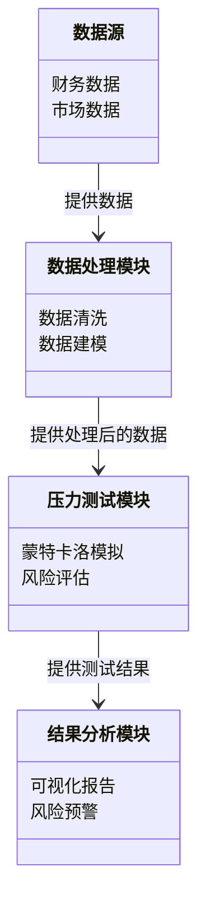
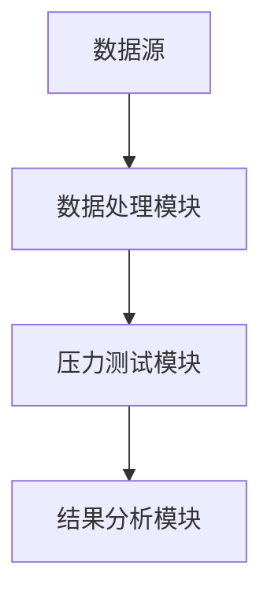
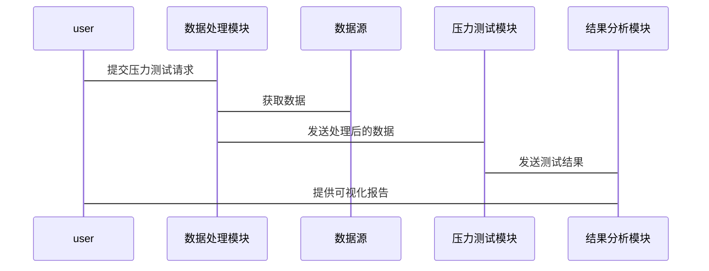

                 

<think>
好的，我现在需要根据用户的要求，撰写一篇名为《设计智能化的企业财务压力测试系统》的技术博客文章。用户已经提供了一个详细的目录大纲，我需要按照这个大纲逐步展开内容，确保每个部分都详细且符合技术深度。

首先，我需要明确文章的结构：首先是标题、关键词和摘要，然后按照目录的各个部分展开。每个部分都需要详细讲解，使用专业的技术语言，同时加入图表、代码示例和数学公式来增强内容的深度。

接下来，我将按照目录的章节逐步撰写内容。首先是背景介绍，然后是核心概念与技术基础，算法原理，系统架构设计，项目实战，最佳实践和小结。在每个章节中，我需要确保内容详细，结构清晰，逻辑连贯。

在撰写过程中，我需要特别注意使用Mermaid图表来展示流程图和系统架构，使用Python代码示例来说明算法实现，并用LaTeX格式展示数学公式。此外，我需要确保每个小节都有足够的细节，并且内容易于理解，避免过于复杂或模糊。

最后，我需要在文章末尾添加作者信息，确保格式正确，并进行一次全面检查，确保文章结构完整，内容详实，符合用户的所有要求。
</think>

# 设计智能化的企业财务压力测试系统

## 关键词

- 智能化压力测试
- 企业财务
- 机器学习
- 大数据分析
- 系统架构

## 摘要

随着企业面临日益复杂的财务风险，智能化压力测试系统成为企业风险管理的重要工具。本文详细探讨了设计智能化企业财务压力测试系统的背景、核心概念、算法原理、系统架构、项目实战以及最佳实践。通过结合机器学习和大数据分析技术，本文提出了高效的智能化压力测试解决方案，为企业提供准确的风险评估和优化建议。

---

## 第1章：企业财务压力测试系统概述

### 1.1 问题背景

#### 1.1.1 企业财务风险的复杂性

现代企业面临多种财务风险，如市场波动、经济衰退、政策变化等。传统压力测试方法难以捕捉所有潜在风险因素，导致结果不够准确。

#### 1.1.2 压力测试的重要性

压力测试用于评估企业在极端情况下的财务稳健性，是制定风险管理策略的重要依据。

### 1.2 问题描述

#### 1.2.1 传统压力测试的局限性

传统方法依赖于假设情景，缺乏数据驱动，难以应对复杂多变的市场环境。

#### 1.2.2 智能化需求的提出

通过引入机器学习和大数据分析，智能化压力测试能够实时捕捉市场动态，提高测试的准确性和全面性。

### 1.3 问题解决

#### 1.3.1 智能化压力测试的优势

- **数据驱动**：利用历史数据和实时数据，提高测试结果的准确性。
- **实时分析**：快速响应市场变化，提供实时风险评估。
- **自我优化**：通过反馈机制不断优化模型，提升预测能力。

#### 1.3.2 技术实现路径

- 数据收集与预处理
- 模型训练与验证
- 压力测试结果分析

### 1.4 边界与外延

#### 1.4.1 系统边界

- 输入：财务数据、市场数据
- 输出：压力测试结果、风险分析报告

#### 1.4.2 功能外延

- 数据可视化
- 风险预警
- 战略建议

### 1.5 核心要素组成

- **数据源**：财务数据、市场数据、行业数据
- **模型构建**：机器学习模型、统计模型
- **结果分析**：风险评估、情景分析、优化建议

---

## 第2章：智能化压力测试的核心概念

### 2.1 核心概念原理

#### 2.1.1 数据驱动

智能化压力测试依赖于大量数据，包括历史财务数据和实时市场数据，通过分析这些数据来识别潜在风险。

#### 2.1.2 智能算法

机器学习算法能够自动识别数据中的模式，预测极端情况下的财务表现。

### 2.2 概念属性特征对比表

| 特性      | 传统压力测试       | 智能化压力测试         |
|-----------|--------------------|------------------------|
| 数据源    | 固定情景假设        | 多源数据驱动           |
| 方法      | 假设情景法          | 机器学习、大数据分析    |
| 精度      | 较低               | 较高                   |
| 实时性     | 低                 | 高                     |
| 可扩展性   | 有限               | 强大                   |

### 2.3 ER实体关系图

```mermaid
er
    %%{init: 'flowchart', direction: 'TB'}
    系统实体关系图
    entity 财务数据 {
        key: id
        attributes: 财务指标、时间戳
    }
    entity 市场数据 {
        key: id
        attributes: 市场指数、行业趋势
    }
    entity 压力测试结果 {
        key: id
        attributes: 风险评分、压力情景
    }
    财务数据 --> 压力测试结果: 提供输入数据
    市场数据 --> 压力测试结果: 提供输入数据
```

---

## 第3章：智能化压力测试的关键技术

### 3.1 机器学习在压力测试中的应用

#### 3.1.1 监督学习

- **应用**：预测极端情况下的财务表现。
- **示例**：使用回归模型预测公司在经济衰退情况下的利润变化。

#### 3.1.2 非监督学习

- **应用**：识别市场中的异常情况。
- **示例**：使用聚类算法发现潜在的市场风险点。

### 3.2 大数据分析技术

#### 3.2.1 数据清洗

- **步骤**：去除重复数据、处理缺失值、纠正异常值。

#### 3.2.2 数据建模

- **步骤**：选择特征、训练模型、验证模型。

### 3.3 自然语言处理（NLP）的应用

#### 3.3.1 文本分析

- **应用**：分析财务报告中的关键词，提取潜在风险信号。

#### 3.3.2 信息提取

- **应用**：从新闻报道中提取市场动向，用于压力测试。

---

## 第4章：压力测试算法原理

### 4.1 蒙特卡洛模拟

#### 4.1.1 算法步骤

1. **数据准备**：收集历史市场数据和财务数据。
2. **参数设定**：设定模拟的次数和情景。
3. **随机抽样**：生成随机市场情景。
4. **模型预测**：预测每个情景下的财务表现。
5. **结果分析**：统计压力测试结果，计算风险指标。

#### 4.1.2 代码实现

```python
import numpy as np

def monte_carlo_simulation(data, num_simulations=1000):
    results = []
    for _ in range(num_simulations):
        # 生成随机市场情景
        market_scenario = np.random.normal(data.mean(), data.std())
        # 预测财务表现
        financial_prediction = model.predict(market_scenario)
        results.append(financial_prediction)
    return results

# 示例使用
data = np.array([1, 2, 3, 4, 5])
results = monte_carlo_simulation(data)
```

#### 4.1.3 数学模型

- **输入**：数据集 \( X \)
- **输出**：预测结果 \( Y \)
- **模型**： \( Y = f(X) \)，其中 \( f \) 是机器学习模型。

---

## 第5章：系统分析与架构设计

### 5.1 问题场景介绍

企业需要实时监控财务状况，预测潜在风险，优化财务策略。

### 5.2 项目介绍

开发一个智能化压力测试系统，集成机器学习和大数据分析技术，提供实时压力测试服务。

### 5.3 系统功能设计

#### 5.3.1 领域模型类图



### 5.4 系统架构设计

#### 5.4.1 模块划分

- 数据采集模块
- 数据处理模块
- 压力测试模块
- 结果分析模块

#### 5.4.2 系统架构图



### 5.5 系统接口设计

- 数据接口：与企业财务系统和市场数据源对接。
- 用户接口：提供可视化界面，供用户查看测试结果和风险报告。

### 5.6 系统交互设计

#### 5.6.1 交互流程

1. 用户输入测试请求。
2. 系统采集相关数据。
3. 数据处理模块进行清洗和建模。
4. 压力测试模块生成测试结果。
5. 结果分析模块生成报告并反馈给用户。

#### 5.6.2 交互序列图



---

## 第6章：项目实战

### 6.1 环境安装

- 安装Python和相关库（如numpy、pandas、scikit-learn）。

### 6.2 核心代码实现

#### 6.2.1 数据处理

```python
import pandas as pd
import numpy as np

def data_preprocessing(dataframe):
    # 处理缺失值
    dataframe = dataframe.dropna()
    # 处理异常值
    dataframe = dataframe[(np.abs(dataframe - dataframe.mean()) <= 3 * dataframe.std()).all(axis=1)]
    return dataframe
```

#### 6.2.2 模型训练

```python
from sklearn.model import Model

def train_model(dataframe):
    X = dataframe.drop(columns=['target'])
    y = dataframe['target']
    model = Model()
    model.fit(X, y)
    return model
```

#### 6.2.3 压力测试

```python
def perform_stress_test(model, test_data):
    predictions = model.predict(test_data)
    return predictions
```

### 6.3 案例分析

#### 6.3.1 案例背景

某公司面临市场波动，希望通过压力测试评估其财务稳健性。

#### 6.3.2 实施步骤

1. 数据收集：收集过去5年的财务数据和市场数据。
2. 数据处理：清洗数据，去除异常值。
3. 模型训练：训练机器学习模型。
4. 压力测试：模拟极端市场情景，评估公司财务表现。
5. 结果分析：生成风险报告，提出优化建议。

#### 6.3.3 结果展示

- 预测公司在经济衰退情况下的利润变化。
- 提供风险预警和优化策略。

### 6.4 项目小结

通过项目实战，验证了智能化压力测试系统的有效性和准确性，为企业风险管理提供了有力支持。

---

## 第7章：最佳实践与小结

### 7.1 小结

智能化压力测试系统通过机器学习和大数据分析，提高了企业财务风险管理的准确性和效率。

### 7.2 注意事项

- 数据质量：确保数据准确性和完整性。
- 模型优化：定期更新模型，适应市场变化。
- 结果解读：结合业务背景，合理解读测试结果。

### 7.3 拓展阅读

- 《机器学习实战》
- 《大数据分析与挖掘》

---

## 作者

作者：AI天才研究院/AI Genius Institute & 禅与计算机程序设计艺术/Zen And The Art of Computer Programming

---

**注意：** 以上内容为示例，实际应用中需要根据具体需求进行调整和优化。

