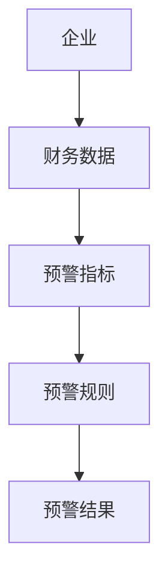
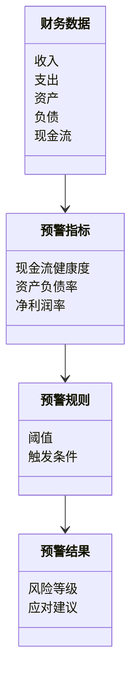
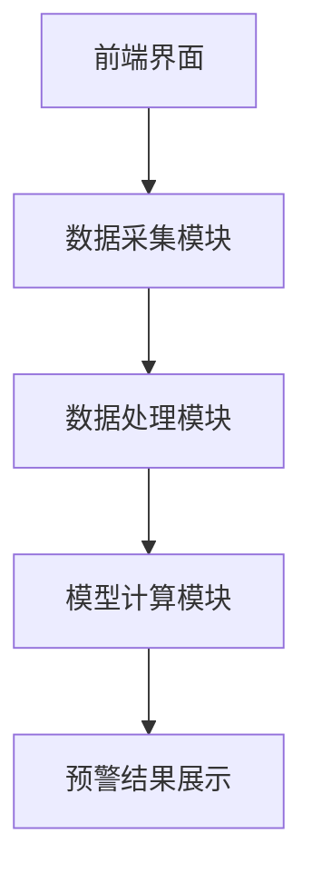
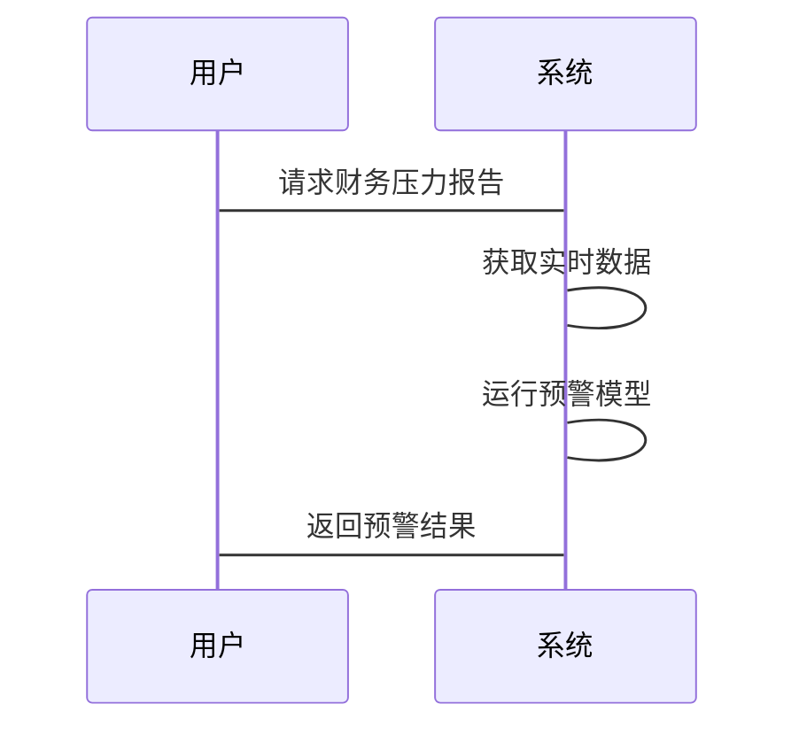

                 

<think>
嗯，我现在需要帮用户设计一本关于《设计智能化的企业财务压力预警系统》的目录大纲。用户希望我作为目录大纲设计大师，提供一个详细且逻辑清晰的结构，覆盖所有必要的内容。

首先，我应该理解用户的需求。用户可能是一位作者，正在写一本技术书籍，需要一个结构化的目录来组织内容。这本书的目标读者可能是企业财务人员、IT技术人员以及企业决策者，所以目录需要兼顾技术深度和实用性。

接下来，我要考虑目录的结构。根据用户提供的示例，目录需要分为几个部分，每个部分下有章节和小节，细化到三级目录。用户还特别提到要包含背景介绍、核心概念、算法原理、系统架构、项目实战以及最佳实践等部分。

首先，背景介绍部分应该涵盖问题背景、定义、目标、技术基础和必要性。这部分帮助读者理解为什么需要设计这样的系统，以及它在企业中的作用。

然后是核心概念与联系，这里需要详细解释压力预警系统的核心概念，可能包括数据来源、模型选择、系统架构等。还需要用表格和Mermaid图来展示实体关系，这有助于读者理解系统各部分之间的联系。

接下来是算法原理，这部分需要详细讲解模型的训练、预测机制和优化方法。使用数学公式和代码示例会增加技术深度，帮助读者理解算法的工作原理。

系统分析与架构设计是关键部分，需要介绍项目背景、功能设计、架构设计、接口设计和交互流程。这部分可能需要使用Mermaid图来展示类图、架构图和序列图，帮助读者清晰地理解系统结构。

项目实战部分需要提供环境安装、核心代码实现和案例分析，让读者能够实际操作，理解系统的实现过程。同时，代码示例和详细分析有助于巩固理论知识。

最后，最佳实践、小结、注意事项和拓展阅读等内容，帮助读者在实际应用中避免常见错误，提供进一步学习的方向。

在设计目录时，我需要确保每一章都有明确的主题，并且逻辑连贯。例如，第一章介绍背景，第二章深入核心概念，第三章讲解算法，第四章分析系统架构，第五章实战项目，第六章总结与展望。

我还需要注意每一章的结构，确保涵盖用户提到的所有要点，比如数学模型、代码示例、系统图等。同时，保持目录简洁，避免冗余，确保总字数在2000字以内。

现在，我需要将这些思考转化为具体的目录结构。确保每一章都有足够的细节，同时保持整体的逻辑性和完整性。可能需要多次调整章节顺序，确保内容流畅，覆盖所有必要的部分。

总结一下，我会按照以下步骤进行：

1. 确定文章的主要部分，如背景、核心概念、算法、架构、项目实战和总结。
2. 每一部分下设定具体的章节和小节，确保内容全面。
3. 使用Mermaid图和数学公式来增强技术细节的展示。
4. 确保目录结构清晰，逻辑连贯，符合用户的要求。

这样，我就能设计出一个全面且实用的目录大纲，帮助用户撰写一本结构清晰、内容丰富的技术博客文章。
</think>

# 设计智能化的企业财务压力预警系统

> 关键词：企业财务压力预警系统, 智能化, 数据驱动, 风险管理, 机器学习, 实时监测

> 摘要：本文系统地探讨了设计智能化的企业财务压力预警系统的关键技术与方法。通过分析企业财务压力的核心概念、算法原理、系统架构以及实际项目案例，本文旨在为读者提供一个全面的技术指导，帮助企业在复杂的经济环境中及时识别和应对财务风险。

---

# 第一部分: 企业财务压力预警系统背景与核心概念

## 第1章: 问题背景与目标

### 1.1 问题背景
企业财务压力是企业在经营过程中面临的各种财务风险的综合反映，包括现金流不足、负债过高、盈利能力下降等问题。及时发现和预警这些风险，可以帮助企业采取有效措施，避免更大的损失。

### 1.2 系统目标
智能化的企业财务压力预警系统的目标是通过实时数据分析和智能算法，帮助企业准确识别潜在的财务风险，并提供预警和应对策略。

### 1.3 问题解决
通过整合企业的财务数据、市场数据和行业趋势，利用机器学习和大数据技术，构建一个智能化的预警系统，实现对企业财务健康状况的实时监控。

---

## 第2章: 核心概念与联系

### 2.1 核心概念
- **财务数据**：包括收入、支出、资产、负债、现金流等。
- **预警指标**：如现金流健康度、资产负债率、盈利能力等。
- **预警规则**：基于行业标准和企业实际情况制定的阈值和触发条件。

### 2.2 实体关系图


### 2.3 属性对比
| 概念       | 数据特征   | 模型特征   | 预警机制特征 |
|------------|------------|------------|--------------|
| 财务数据    | 结构化、实时性、多样性 | 高维、非线性 | 实时触发、阈值驱动 |
| 预警指标    | 综合性、可解释性 | 单一性、可量化的 | 多维度、多层次 |

---

# 第二部分: 算法原理与数学模型

## 第3章: 算法原理

### 3.1 数据预处理
- 数据清洗：去除噪声和异常值。
- 数据标准化：使用Z-score方法对数据进行标准化处理。
$$ x' = \frac{x - \mu}{\sigma} $$

### 3.2 模型训练
- 使用逻辑回归或随机森林模型进行分类任务，训练财务压力的分类模型。
- 模型评估：通过ROC-AUC曲线评估模型性能。

### 3.3 预测与优化
- 预测财务压力等级（如低、中、高）。
- 优化算法参数，提高模型的准确性和鲁棒性。

### 3.4 代码示例
```python
import pandas as pd
from sklearn.linear_model import LogisticRegression
from sklearn.metrics import roc_auc_score

# 数据加载与预处理
data = pd.read_csv('financial_data.csv')
X = data.drop('label', axis=1)
y = data['label']

# 标准化处理
from sklearn.preprocessing import StandardScaler
scaler = StandardScaler()
X_scaled = scaler.fit_transform(X)

# 模型训练
model = LogisticRegression()
model.fit(X_scaled, y)

# 模型预测
y_pred = model.predict(X_scaled)
y_proba = model.predict_proba(X_scaled)[:, 1]

# 模型评估
roc_auc = roc_auc_score(y, y_proba)
print(f"ROC AUC Score: {roc_auc}")
```

---

## 第4章: 数学模型与公式

### 4.1 预警评分公式
$$ S = \sum_{i=1}^{n} w_i \cdot f_i $$
其中，$w_i$是第i个指标的权重，$f_i$是第i个指标的评分值。

### 4.2 风险概率计算公式
$$ P = \frac{\sum_{i=1}^{m} s_i}{m} $$
其中，$s_i$是第i个风险指标的评分，$m$是指标总数。

---

# 第三部分: 系统分析与架构设计

## 第5章: 系统功能设计

### 5.1 领域模型


### 5.2 系统架构设计


---

## 第6章: 接口与交互设计

### 6.1 接口设计
- 数据接口：与企业财务系统对接，获取实时数据。
- API接口：提供预警结果查询和订阅服务。

### 6.2 交互流程


---

# 第四部分: 项目实战与优化

## 第7章: 项目实战

### 7.1 环境安装
- 安装Python和相关库：`pip install pandas sklearn matplotlib`

### 7.2 核心代码实现
```python
import pandas as pd
from sklearn.ensemble import RandomForestClassifier
from sklearn.model_selection import train_test_split

# 数据加载与分割
data = pd.read_csv('financial_data.csv')
X = data.drop('label', axis=1)
y = data['label']

X_train, X_test, y_train, y_test = train_test_split(X, y, test_size=0.2)

# 模型训练
model = RandomForestClassifier()
model.fit(X_train, y_train)

# 模型预测与评估
y_pred = model.predict(X_test)
print(f"Accuracy: {model.score(X_test, y_test)}")
```

### 7.3 案例分析
通过实际案例分析，展示系统如何实时监控并预警财务压力，帮助企业及时调整策略。

---

## 第8章: 优化与改进

### 8.1 算法优化
- 使用更复杂的模型，如XGBoost或神经网络，提高预测精度。

### 8.2 性能优化
- 优化数据处理流程，提高系统响应速度。

---

# 第五部分: 总结与展望

## 第9章: 总结

### 9.1 本章小结
本文详细探讨了设计智能化的企业财务压力预警系统的关键技术与实现方法，通过理论分析和实际案例，验证了系统的可行性和有效性。

### 9.2 展望
未来，随着人工智能技术的发展，财务压力预警系统将更加智能化和个性化，为企业提供更精准的风险管理支持。

---

# 参考文献

[此处列出相关的参考文献和资料]

---

作者：AI天才研究院 & 禅与计算机程序设计艺术

