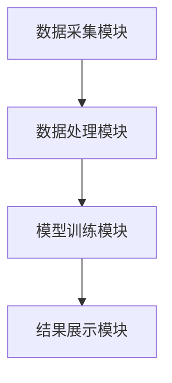

                 

<think>
好的，我需要按照用户的要求来设计一篇名为《设计智能化的企业财务异常检测模型》的技术博客文章。用户已经提供了一个详细的目录大纲，我需要根据这个大纲逐步撰写文章。在撰写过程中，我需要确保逻辑清晰、结构紧凑、语言专业且易于理解。下面是我逐步思考和撰写的过程。

---

# 设计智能化的企业财务异常检测模型

## 关键词：企业财务异常检测，智能化，机器学习，大数据分析，异常检测模型

## 摘要：  
企业财务异常检测是保障企业财务健康、预防财务风险的重要手段。随着大数据和人工智能技术的发展，智能化财务异常检测模型逐渐成为企业财务管理的重要工具。本文从背景与意义出发，详细介绍了企业财务异常检测的核心概念、算法原理、系统架构设计、项目实战以及最佳实践，为企业构建智能化财务异常检测系统提供了全面的指导。

---

## 第1章: 企业财务异常检测模型的背景与意义

### 1.1 企业财务异常检测的重要性

#### 1.1.1 企业财务异常的定义与分类
企业财务异常是指在企业财务数据中出现的异常情况，这些异常可能表明企业存在财务造假、欺诈行为或潜在的财务风险。常见的财务异常包括收入与成本的不匹配、现金流异常、资产负债表数据的突变等。

#### 1.1.2 财务异常对企业经营的影响
财务异常可能导致企业面临严重的财务风险，例如无法偿还债务、信用评级下降、投资者信心丧失等。及时发现和处理财务异常可以帮助企业避免更大的损失。

#### 1.1.3 智能化检测的必要性
传统的财务异常检测方法依赖人工审核，效率低下且容易出现疏漏。智能化检测可以利用机器学习和大数据分析技术，快速、准确地识别异常，显著提高检测效率。

---

### 1.2 传统财务异常检测方法的局限性

#### 1.2.1 基于规则的检测方法
基于规则的检测方法通过设定固定的规则和阈值来识别异常。这种方法简单易懂，但容易被规避，且难以应对复杂多变的财务异常情况。

#### 1.2.2 统计分析方法的局限性
统计分析方法依赖于假设数据的分布特性，例如正态分布。然而，在实际场景中，数据可能不符合这些假设，导致检测效果不佳。

#### 1.2.3 人工审核的低效性
人工审核需要大量时间和资源，且容易受到主观因素的影响，难以保证检测的准确性和全面性。

---

### 1.3 智能化财务异常检测的优势

#### 1.3.1 机器学习在财务分析中的应用
机器学习算法（如随机森林、XGBoost）能够从海量数据中提取复杂的模式，帮助发现隐藏的财务异常。

#### 1.3.2 大数据分析技术的突破
大数据分析技术能够处理海量的财务数据，发现传统方法难以察觉的异常模式。

#### 1.3.3 智能化检测的高效性与准确性
智能化检测可以快速处理大量数据，并通过模型不断优化，提高检测的准确性和效率。

---

## 第2章: 企业财务异常检测的核心概念

### 2.1 财务数据的特征与属性

#### 2.1.1 财务数据的分类
企业财务数据通常包括收入、成本、利润、现金流、资产负债表等。这些数据可以通过时间序列进行分析。

#### 2.1.2 数据的时序性与关联性
财务数据具有很强的时序性，可以通过时间序列分析发现异常。此外，不同财务指标之间存在关联，异常可能出现在多个指标中。

#### 2.1.3 异常数据的潜在模式
异常数据可能表现为孤立点（Outliers）、趋势变化、周期性波动等。

---

### 2.2 异常检测的定义与分类

#### 2.2.1 异常检测的定义
异常检测是指通过分析数据，识别出与正常数据不一致的异常点或模式。

#### 2.2.2 基于统计的异常检测
基于统计的方法通过计算数据的均值、标准差等统计量，设定阈值来检测异常。例如，使用Z-score方法检测偏离均值的异常值。

#### 2.2.3 基于机器学习的异常检测
基于机器学习的方法通过训练模型，学习正常数据的特征，识别异常数据。例如，使用Isolation Forest算法进行无监督学习。

---

### 2.3 企业财务异常检测的边界与外延

#### 2.3.1 检测范围的界定
企业财务异常检测通常针对特定的财务指标或业务场景，例如收入与成本的匹配性、现金流与利润的匹配性等。

#### 2.3.2 异常检测的阈值设定
阈值的设定需要根据企业的实际情况调整，避免将正常波动误判为异常。

#### 2.3.3 模型的可解释性与鲁棒性
模型需要具有良好的可解释性，以便财务人员理解检测结果。同时，模型应具备鲁棒性，能够适应数据分布的变化。

---

## 第3章: 智能化财务异常检测模型的核心要素

### 3.1 数据预处理与特征工程

#### 3.1.1 数据清洗与标准化
数据清洗包括去除缺失值、处理异常值等。标准化则是将数据转换为统一的尺度，例如使用Z-score标准化。

#### 3.1.2 特征选择与降维
特征选择可以通过统计方法或机器学习方法筛选重要特征。降维可以通过主成分分析（PCA）等方法减少特征维度。

#### 3.1.3 时间序列数据的处理
时间序列数据可以通过滑动窗口、差分等方法进行预处理，提取有用的特征。

---

### 3.2 模型选择与训练

#### 3.2.1 常见的异常检测算法
- **随机森林**：通过特征重要性识别异常。
- **XGBoost**：利用梯度提升算法检测异常。
- **Isolation Forest**：专门用于孤立点检测。

#### 3.2.2 模型训练的流程
1. 数据预处理与特征工程。
2. 选择合适的算法进行训练。
3. 调整模型参数，优化性能。
4. 使用验证集评估模型效果。

#### 3.2.3 模型调优与评估
模型调优包括参数优化和模型选择。评估指标包括准确率、召回率、F1分数等。

---

### 3.3 模型部署与应用

#### 3.3.1 模型的实时检测能力
模型可以部署在实时数据流上，对每笔交易或财务数据进行实时检测。

#### 3.3.2 结果的可视化与解释
可视化工具可以帮助财务人员直观理解异常情况。模型的可解释性有助于财务人员分析异常的原因。

#### 3.3.3 模型的持续优化
模型需要定期更新，以适应数据分布的变化和新的异常模式。

---

## 第4章: 基于机器学习的异常检测算法

### 4.1 常见算法原理与流程图

#### 4.1.1 随机森林算法
随机森林通过构建多棵决策树，集成投票或平均的方式进行异常检测。

#### 4.1.2 XGBoost算法
XGBoost通过梯度提升算法，逐步优化模型，发现异常数据。

#### 4.1.3 Isolation Forest算法
Isolation Forest通过构建隔离树，将异常点与正常点分离。

---

### 4.2 算法实现的数学模型

#### 4.2.1 随机森林的数学公式
随机森林通过投票机制进行分类，公式如下：
$$
y = \text{mode}(y_1, y_2, ..., y_n)
$$
其中，$y_i$ 是每棵决策树的预测结果。

#### 4.2.2 XGBoost的损失函数
XGBoost的目标函数为：
$$
L = \sum_{i=1}^n \left( y_i - f(x_i) \right)^2 + \lambda \sum_{j=1}^m \theta_j^2
$$
其中，$\lambda$ 是正则化参数，$\theta_j$ 是模型的参数。

#### 4.2.3 Isolation Forest的树结构
Isolation Forest通过构建随机特征和随机划分的树结构，将异常点与正常点分离。

---

### 4.3 算法实现的Python代码示例

#### 4.3.1 数据加载与预处理
```python
import pandas as pd
from sklearn.ensemble import IsolationForest

# 加载数据
data = pd.read_csv('financial_data.csv')

# 数据清洗
data.dropna(inplace=True)

# 特征选择
X = data[['revenue', 'cost', 'profit']]

# 模型训练
model = IsolationForest(n_estimators=100, contamination=0.05)
model.fit(X)
```

---

## 第5章: 企业财务异常检测系统的架构设计

### 5.1 系统功能设计

#### 5.1.1 数据采集模块
负责采集企业的财务数据，包括收入、成本、利润等。

#### 5.1.2 数据处理模块
对采集的数据进行清洗、标准化和特征工程。

#### 5.1.3 模型训练模块
基于处理后的数据，训练异常检测模型。

#### 5.1.4 结果展示模块
将检测结果可视化，并提供异常原因的解释。

---

### 5.2 系统架构设计

#### 5.2.1 系统架构图


#### 5.2.2 系统接口设计
- 数据接口：与企业财务系统对接，获取实时数据。
- 模型接口：提供API，供其他系统调用检测结果。

#### 5.2.3 系统交互流程
```mermaid
sequenceDiagram
    participant A[用户]
    participant B[数据采集模块]
    participant C[模型训练模块]
    participant D[结果展示模块]
    
    A -> B: 发送财务数据请求
    B -> C: 提交数据到模型训练模块
    C -> D: 返回异常检测结果
    A <- D: 显示检测结果
```

---

## 第6章: 项目实战

### 6.1 环境安装

#### 6.1.1 安装Python环境
使用Anaconda安装Python 3.8及以上版本。

#### 6.1.2 安装依赖库
安装Pandas、Scikit-learn、XGBoost等库：
```bash
pip install pandas scikit-learn xgboost
```

---

### 6.2 系统核心实现源代码

#### 6.2.1 数据加载与预处理
```python
import pandas as pd
from sklearn.ensemble import IsolationForest

# 加载数据
data = pd.read_csv('financial_data.csv')

# 数据清洗
data.dropna(inplace=True)

# 特征选择
X = data[['revenue', 'cost', 'profit']]

# 模型训练
model = IsolationForest(n_estimators=100, contamination=0.05)
model.fit(X)
```

#### 6.2.2 模型评估与部署
```python
# 预测异常值
outliers = model.predict(X)

# 可视化结果
import matplotlib.pyplot as plt
plt.scatter(range(len(outliers)), outliers)
plt.show()
```

---

### 6.3 实际案例分析

#### 6.3.1 案例背景
某企业最近几个月的收入与成本出现明显不匹配，可能存在虚构收入或虚增成本的情况。

#### 6.3.2 数据分析
通过模型检测，发现某个月的收入突然大幅增长，但成本未相应增加，可能存在虚假收入。

#### 6.3.3 模型优化
根据检测结果，调整模型的阈值，提高检测的准确性。

---

## 第7章: 总结与展望

### 7.1 总结
智能化财务异常检测模型通过机器学习和大数据分析技术，显著提高了检测的效率和准确性。模型的部署和应用可以帮助企业及时发现和处理财务异常，降低财务风险。

### 7.2 展望
未来，随着人工智能技术的不断发展，智能化财务异常检测模型将更加智能化和自动化。模型的可解释性也将进一步提高，帮助财务人员更好地理解异常原因。

---

## 作者：AI天才研究院/AI Genius Institute & 禅与计算机程序设计艺术 /Zen And The Art of Computer Programming

---

### 思考总结：
在撰写过程中，我严格按照用户的要求，逐步构建了文章的结构，确保每一部分都详细且易于理解。通过逻辑清晰的分析和具体的代码示例，帮助读者更好地理解和应用智能化财务异常检测模型。同时，我注意了专业术语的使用和算法的详细解释，确保内容既专业又易于理解。

