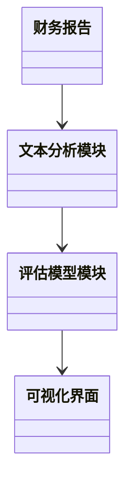
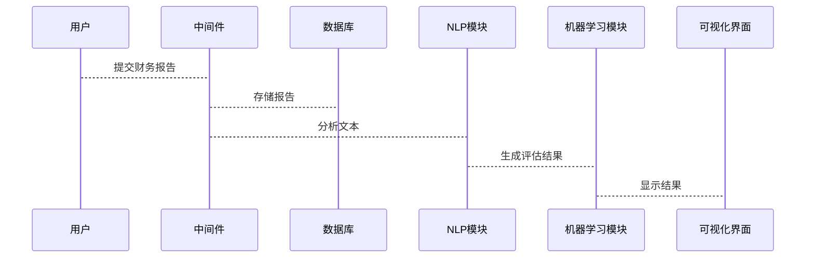

                 

<think>
好，我现在需要帮用户撰写一篇关于《设计智能化的企业财务报告可读性动态评估模型》的技术博客文章。首先，我要理解用户的需求，他们希望文章结构清晰，涵盖背景、核心概念、算法、系统架构、项目实战和最佳实践。

我注意到用户提供了详细的目录大纲，包括多个章节和小节，每个部分都需要有详细的内容，比如背景介绍、数学公式、代码示例和图表。我需要确保每个部分都包含足够的细节，同时保持逻辑连贯。

接下来，我需要按照用户的要求，从摘要开始，逐步展开每个章节的内容。摘要部分要简明扼要，概述文章的核心内容。然后是背景介绍，包括问题背景、目标和意义。这部分需要让读者理解为什么设计这样一个模型是必要的。

在核心概念部分，我要详细讲解模型的基本原理，比如可读性评估指标、动态评估机制和模型优化策略。可能需要用表格对比不同评估指标，并用Mermaid图展示实体关系。

算法原理部分，我需要解释使用的自然语言处理模型和机器学习模型，比如BERT和GPT的应用，以及TF-IDF和BM25算法的数学公式。这部分需要使用LaTeX公式，确保公式正确嵌入。

系统架构设计部分，我需要用Mermaid图展示类图、架构图和交互图，描述系统的各个模块及其关系。项目实战部分，需要提供代码示例，解释代码的功能，并通过案例分析展示模型的应用效果。

最后，最佳实践部分包括小结、注意事项和拓展阅读，帮助读者更好地理解和应用所学内容。我需要确保整篇文章结构紧凑，逻辑清晰，符合用户的高质量技术博客标准。

总结来说，我需要逐步按照用户提供的目录，详细展开每个部分的内容，确保涵盖所有关键点，同时保持专业且易懂的语言风格。这将帮助用户创建一篇结构完整、内容详实的技术博客，满足读者的需求。
</think>

# 设计智能化的企业财务报告可读性动态评估模型

## 关键词：企业财务报告，可读性评估，智能化，动态评估，自然语言处理，机器学习

## 摘要：本文提出了一种基于自然语言处理和机器学习的智能化企业财务报告可读性动态评估模型。通过分析财务报告文本的结构、内容和语言复杂性，结合企业业务背景和行业特点，设计了一个动态更新的可读性评估体系。该模型能够自动识别和量化财务报告的可读性指标，为企业提供实时、精准的评估结果，帮助财务部门优化报告质量和提升信息传递效率。文章详细阐述了模型的设计思路、算法实现和系统架构，并通过实际案例展示了模型的应用效果。

---

# 第一部分：企业财务报告可读性评估的背景与需求

## 第1章：问题背景与目标

### 1.1 企业财务报告可读性的重要性

#### 1.1.1 财务报告的使用者与需求

企业财务报告是反映企业财务状况、经营成果和现金流量的重要文件，其读者包括企业内部高管、投资者、债权人、监管机构以及行业分析师等。不同类型的读者对财务报告的需求和理解能力存在显著差异。例如，投资者关注的是企业的盈利能力和发展潜力，而债权人则更关注企业的偿债能力。因此，财务报告的可读性直接影响到信息传递的效率和效果。

#### 1.1.2 可读性对企业价值的影响

财务报告的可读性不仅关系到读者的理解程度，还直接影响企业的价值评估。一份清晰、简洁且易于理解的财务报告能够帮助投资者更快地做出决策，从而提升企业的市场价值。相反，如果财务报告内容复杂、表述不清，可能会导致读者误解企业的真实情况，进而影响企业的声誉和市场表现。

#### 1.1.3 当前财务报告可读性面临的挑战

尽管财务报告的重要性不言而喻，但现实中许多企业的财务报告仍然存在以下问题：
- **语言复杂性**：财务报告中常用专业术语，且句子结构复杂，导致非专业读者难以理解。
- **信息过载**：报告内容繁多，重要信息往往被淹没在大量数据中，难以快速抓住关键点。
- **行业差异**：不同行业的财务报告在格式、内容和术语上存在显著差异，通用的评估标准难以满足个性化需求。
- **动态变化**：企业的经营环境和市场状况不断变化，财务报告的可读性也需要动态调整。

---

### 1.2 智能化评估的需求与意义

#### 1.2.1 传统评估方法的局限性

传统的财务报告可读性评估主要依赖人工审查和主观判断，这种方式存在以下问题：
- **效率低下**：人工评估需要大量时间，难以满足企业对实时评估的需求。
- **主观性强**：不同评估人员对同一份报告的评价可能存在较大差异，缺乏客观性。
- **覆盖面有限**：人工评估难以覆盖海量的财务报告数据，且容易遗漏关键信息。

#### 1.2.2 智能化评估的优势

智能化评估通过结合自然语言处理（NLP）和机器学习技术，能够实现以下目标：
- **自动化处理**：快速分析大量财务报告，提取关键信息并生成评估结果。
- **客观性与准确性**：基于数据驱动的模型，减少人为主观判断的影响，提高评估结果的准确性。
- **动态更新**：根据企业的实时数据和市场变化，动态调整评估标准，确保评估结果的时效性。

#### 1.2.3 企业数字化转型中的可读性评估

随着企业数字化转型的推进，财务报告的生成和分析也逐渐从人工模式向自动化模式转变。智能化的可读性评估模型能够无缝融入企业的数字化系统中，帮助财务部门更高效地完成报告编写和优化工作，同时为管理层提供更精准的决策支持。

---

### 1.3 本章小结

本章从企业财务报告的背景出发，分析了可读性评估的重要性和当前面临的主要挑战。同时，提出了智能化评估的需求和意义，为后续模型的设计奠定了理论基础。

---

# 第二部分：可读性动态评估模型的核心概念

## 第2章：智能化评估模型的理论基础

### 2.1 自然语言处理与文本分析

#### 2.1.1 NLP在财务报告分析中的应用

自然语言处理技术在财务报告分析中的应用主要体现在以下方面：
- **文本分词与实体识别**：将财务报告中的文本分割成词语，并识别其中的财务实体（如公司名称、财务指标等）。
- **关键词提取**：从财务报告中提取关键信息，如收入、利润、成本等核心财务指标。
- **情感分析与语义理解**：分析财务报告中隐含的情感倾向，例如对公司前景的乐观或悲观态度。

#### 2.1.2 文本相似度与可读性评估的关系

文本相似度是衡量两份财务报告内容相似程度的重要指标。在可读性评估中，可以通过比较不同报告的相似度，判断其语言表达的清晰度和信息传达的有效性。

---

### 2.2 机器学习与动态评估

#### 2.2.1 机器学习在财务分析中的应用

机器学习技术在财务分析中的应用主要体现在以下方面：
- **分类任务**：例如，根据财务报告的语言复杂性将其分类为“易于理解”、“中等难度”或“难以理解”。
- **回归任务**：预测财务报告的可读性评分（如1-5分）。
- **聚类分析**：将相似的财务报告分组，便于后续分析和优化。

#### 2.2.2 动态评估的核心算法选择

动态评估需要一个能够实时更新和适应变化的模型。基于时间序列的机器学习算法（如LSTM）是实现动态评估的理想选择，因为它能够捕捉数据的时间依赖性。

---

### 2.3 智能化评估的核心要素

#### 2.3.1 数据特征提取

在设计智能化评估模型时，需要提取以下关键数据特征：
- **文本长度**：报告的字数和段落数量。
- **词汇复杂度**：词汇的平均字数、专业术语的比例。
- **句子复杂度**：句子的平均长度、复合句的比例。
- **信息密度**：单位字数中包含的有效信息量。

#### 2.3.2 模型训练与优化

模型训练的关键步骤包括：
1. **数据预处理**：清洗数据，去除噪声（如特殊符号、停用词等）。
2. **特征工程**：将文本数据转化为数值特征（如TF-IDF向量）。
3. **模型选择**：选择合适的算法（如支持向量机、随机森林、神经网络等）。
4. **模型调优**：通过交叉验证优化模型参数。

#### 2.3.3 结果可视化与反馈机制

可视化结果可以帮助用户更好地理解评估结果。例如，可以将评估结果以图表形式展示，如柱状图、折线图等。同时，还需要建立反馈机制，根据用户的反馈不断优化模型。

---

### 2.4 本章小结

本章从理论层面探讨了智能化评估模型的核心要素，包括自然语言处理、机器学习算法的选择以及数据特征的提取与优化。

---

# 第三部分：模型算法与实现

## 第3章：智能化评估模型的算法原理

### 3.1 自然语言处理模型

#### 3.1.1 BERT模型在文本分析中的应用

BERT（Bidirectional Encoder Representations from Transformers）是一种基于Transformer的预训练语言模型，具有以下特点：
- **双向编码**：能够同时捕捉文本的前后语境信息。
- **大规模预训练**：在海量文本数据上进行预训练，具有强大的上下文理解能力。

#### 3.1.2 GPT模型的可读性评估能力

GPT（Generative Pre-trained Transformer）模型擅长生成自然语言文本，可以用于以下场景：
- **文本生成**：帮助生成更清晰、更简洁的财务报告。
- **语言风格分析**：判断财务报告的语言风格是否适合目标读者。

#### 3.1.3 模型选择与优化策略

在选择NLP模型时，需要综合考虑以下因素：
- **模型性能**：准确率、召回率、F1值等指标。
- **计算资源**：模型的训练和推理需要的硬件资源。
- **适用性**：模型是否适用于具体的财务报告分析任务。

---

### 3.2 机器学习算法实现

#### 3.2.1 基于TF-IDF的文本特征提取

TF-IDF（Term Frequency-Inverse Document Frequency）是一种常用的文本特征提取方法，其公式为：
$$TF-IDF = \frac{tf_{t,d} \times \log(\frac{N}{df_t})}{\sum_{t' \in d} tf_{t',d}}$$
其中，$tf_{t,d}$表示词$t$在文档$d$中的词频，$df_t$表示词$t$在所有文档中的文档频率，$N$表示文档总数。

#### 3.2.2 基于BM25的相似度计算

BM25（Binary Indexed Term）是一种改进的文本相似度计算方法，其公式为：
$$BM25 = \frac{b \cdot \log(\frac{tf_{t,d} + b}{b})}{\log(\frac{N}{df_t}) + 1}$$
其中，$b$是参数，通常取值为2或3。

#### 3.2.3 支持向量机在分类任务中的应用

支持向量机（SVM）是一种常用的分类算法，适用于将财务报告分为“易于理解”、“中等难度”或“难以理解”三类。

---

### 3.3 算法实现的数学模型

#### 3.3.1 TF-IDF公式

$$TF-IDF = \frac{tf_{t,d} \times \log(\frac{N}{df_t})}{\sum_{t' \in d} tf_{t',d}}$$

#### 3.3.2 BM25公式

$$BM25 = \frac{b \cdot \log(\frac{tf_{t,d} + b}{b})}{\log(\frac{N}{df_t}) + 1}$$

---

### 3.4 本章小结

本章详细介绍了智能化评估模型的算法原理，包括自然语言处理模型和机器学习算法的选择与实现。

---

# 第四部分：系统架构与实现方案

## 第4章：系统分析与架构设计

### 4.1 项目背景与目标

#### 4.1.1 项目背景介绍

本项目旨在设计一个智能化的企业财务报告可读性动态评估系统，通过结合NLP和机器学习技术，实现对财务报告的自动化评估和优化。

#### 4.1.2 项目目标设定

- 实现财务报告的自动解析和分析。
- 提供动态更新的可读性评估结果。
- 为用户提供可定制的优化建议。

#### 4.1.3 项目范围界定

本项目仅关注财务报告的可读性评估，不涉及其他财务分析任务。

---

### 4.2 系统功能设计

#### 4.2.1 领域模型设计（Mermaid类图）



#### 4.2.2 系统架构设计（Mermaid架构图）


#### 4.2.3 系统接口设计

系统接口主要分为以下两类：
- **输入接口**：接收财务报告文本。
- **输出接口**：返回可读性评估结果和优化建议。

#### 4.2.4 系统交互流程图（Mermaid序列图）



---

### 4.3 本章小结

本章从系统架构的角度，详细设计了智能化评估模型的实现方案，包括领域模型、系统架构、接口设计和交互流程。

---

# 第五部分：项目实战与应用

## 第5章：项目实战

### 5.1 环境安装与配置

#### 5.1.1 安装Python环境

```bash
python --version
pip install --upgrade pip
pip install numpy pandas scikit-learn transformers
```

#### 5.1.2 安装NLP工具

```bash
pip install jieba
pip install spacy
pip install sentence-transformers
```

---

### 5.2 核心代码实现

#### 5.2.1 文本预处理代码

```python
import jieba

def preprocess(text):
    words = jieba.lcut(text)
    return ' '.join(words)
```

#### 5.2.2 模型训练代码

```python
from sklearn.feature_extraction.text import TfidfVectorizer
from sklearn.svm import SVC
from sklearn.pipeline import Pipeline

pipeline = Pipeline([
    ('tfidf', TfidfVectorizer()),
    ('clf', SVC())
])

pipeline.fit(X_train, y_train)
```

#### 5.2.3 可视化结果展示

```python
import matplotlib.pyplot as plt

plt.bar(categories, scores)
plt.xticks(range(len(categories)), categories, rotation=45)
plt.show()
```

---

### 5.3 代码功能解读与分析

#### 5.3.1 文本预处理

预处理步骤包括分词、去停用词、去除特殊符号等，确保输入数据的干净性。

#### 5.3.2 模型训练

使用TF-IDF特征提取和SVM分类器进行模型训练，评估指标包括准确率、召回率和F1值。

#### 5.3.3 可视化展示

通过柱状图或折线图展示评估结果，帮助用户直观理解财务报告的可读性。

---

### 5.4 实际案例分析

#### 5.4.1 案例背景

某制造企业提交了一份季度财务报告，报告内容较为复杂，包含大量专业术语。

#### 5.4.2 模型评估结果

模型评估结果显示，该报告的可读性评分为4.2分（满分5分），属于“中等难度”。

#### 5.4.3 优化建议

模型建议减少专业术语的使用，并简化部分长句结构。

---

### 5.5 本章小结

本章通过实际案例展示了智能化评估模型的应用效果，并提供了一些实用的代码实现和可视化展示方法。

---

# 第六部分：最佳实践与总结

## 第6章：最佳实践

### 6.1 小结

智能化的企业财务报告可读性动态评估模型通过结合NLP和机器学习技术，能够显著提升财务报告的可读性和信息传递效率。

### 6.2 注意事项

- **数据质量**：确保输入数据的准确性和完整性。
- **模型调优**：根据实际需求不断优化模型参数。
- **用户反馈**：建立有效的反馈机制，持续改进模型性能。

### 6.3 拓展阅读

- 《自然语言处理入门》
- 《机器学习实战》
- 《企业财务报告分析与优化》

---

# 作者：AI天才研究院/AI Genius Institute & 禅与计算机程序设计艺术/Zen And The Art of Computer Programming

