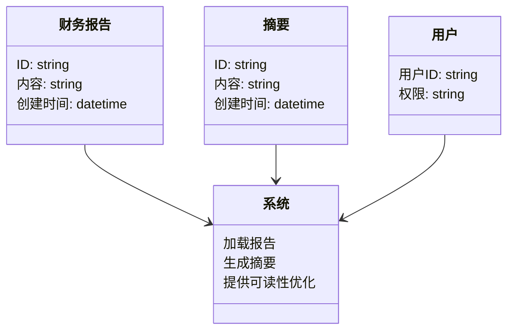
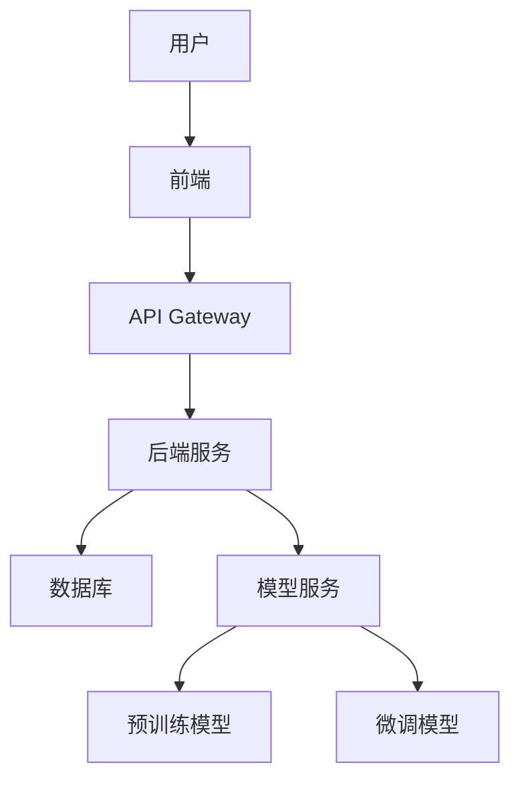
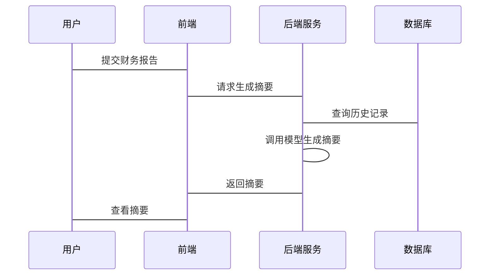

                 


# 设计智能化的企业财务报告可读性增强与自动摘要模型

## 关键词：企业财务报告、可读性增强、自动摘要、自然语言处理、深度学习、NLP模型、文本挖掘

## 摘要：  
随着企业对财务报告的需求不断增加，如何提高财务报告的可读性并实现自动摘要成为了亟待解决的问题。本文通过结合自然语言处理（NLP）和深度学习技术，提出了一种智能化的企业财务报告可读性增强与自动摘要模型。该模型不仅能够自动提取财务报告的关键信息并生成简洁的摘要，还能通过优化文本结构和语言表达，提升报告的可读性。本文详细阐述了模型的设计原理、实现方法以及实际应用，为企业的财务管理提供了新的思路和解决方案。

---

# 第一部分：背景介绍与核心概念

## 第1章：问题背景与需求分析

### 1.1 问题背景

#### 1.1.1 传统财务报告的可读性问题  
财务报告是企业在经营活动中重要的文件，通常包括资产负债表、利润表和现金流量表等内容。然而，传统的财务报告存在以下问题：  
- **语言复杂**：财务报告通常使用专业术语，且句子结构复杂，普通读者难以理解。  
- **信息过载**：报告内容繁多，冗长的文本容易让用户感到疲劳，难以快速抓住重点。  
- **缺乏个性化**：报告内容千篇一律，难以根据读者的需求进行调整。  

#### 1.1.2 企业财务报告的重要性与挑战  
财务报告是企业决策的重要依据，涉及投资、融资、管理优化等多个方面。然而，由于其复杂性和专业性，普通员工和管理层在阅读时往往需要花费大量时间，甚至可能因为理解不准确而导致决策失误。  

#### 1.1.3 AI技术在财务报告处理中的应用潜力  
随着自然语言处理（NLP）和深度学习技术的快速发展，AI技术在财务报告处理中的应用潜力逐渐显现。通过AI技术，可以实现财务报告的自动摘要、关键信息提取以及文本可读性优化，从而提高企业的效率和决策能力。  

### 1.2 问题描述

#### 1.2.1 财务报告可读性增强的需求  
财务报告的可读性增强需求主要体现在以下方面：  
- 简化语言表达，使用通俗易懂的词汇和句子结构。  
- 提供上下文信息，帮助读者更好地理解报告内容。  
- 根据读者的背景和需求，动态调整报告的呈现方式。  

#### 1.2.2 自动摘要的必要性  
自动摘要技术可以帮助企业快速提取财务报告的核心内容，节省时间和精力。通过自动化摘要，企业可以实现以下目标：  
- 快速了解报告的主要信息。  
- 便于在会议、报告展示等场景中使用。  
- 提供多种格式的摘要，满足不同场景的需求。  

#### 1.2.3 当前技术的局限性与改进方向  
当前，基于规则的自动摘要技术在简单文本处理中表现较好，但在复杂财务报告的处理中存在以下问题：  
- 规则难以覆盖所有场景，灵活性不足。  
- 无法准确理解财务术语和上下文信息。  
- 对于长文本的处理效率较低，摘要质量有待提高。  
因此，我们需要结合深度学习技术，设计一种更加智能化的自动摘要模型。  

---

## 第2章：核心概念与理论基础

### 2.1 可读性增强的核心概念

#### 2.1.1 财务报告可读性的定义与衡量标准  
**定义**：财务报告的可读性是指报告内容能够被目标读者理解的程度。  
**衡量标准**：  
- **词汇复杂度**：常用词汇的比例，避免使用过于专业的术语。  
- **句子结构**：句子的简洁性和清晰度。  
- **内容逻辑**：段落之间的逻辑关系是否清晰，是否符合读者的阅读习惯。  

#### 2.1.2 文本可读性增强的实现方法  
- **词汇替换**：将复杂词汇替换为更通俗的词汇。  
- **句子简化**：将复杂句子拆分成多个简单句子。  
- **上下文解释**：在报告中添加背景信息或解释性内容，帮助读者理解。  

#### 2.1.3 自动摘要技术的分类与特点  
**分类**：  
- **抽取式摘要**：从原文中提取关键句子或短语，重新组合成摘要。  
- **生成式摘要**：基于原文内容，使用NLP技术生成新的文本作为摘要。  

**特点**：  
- **高效性**：自动化处理，节省时间和资源。  
- **准确性**：基于深度学习模型，摘要内容更准确。  
- **灵活性**：可以根据需求生成不同长度和格式的摘要。  

### 2.2 自然语言处理在财务报告中的应用

#### 2.2.1 NLP技术的基本原理  
NLP技术通过将文本转化为结构化的信息，帮助计算机理解文本内容。常用的NLP技术包括：  
- **分词**：将文本分割成词语或短语。  
- **句法分析**：分析句子的语法结构。  
- **实体识别**：识别文本中的关键实体（如公司名称、日期等）。  
- **文本摘要**：提取文本的核心信息并生成摘要。  

#### 2.2.2 财务文本的特殊性与处理难点  
财务文本具有以下特点：  
- **专业术语多**：涉及会计、金融等领域的专业术语。  
- **数据密集**：包含大量数字和表格。  
- **结构复杂**：报告内容逻辑性强，但语言较为正式和复杂。  

处理难点：  
- 如何准确理解财务术语的含义。  
- 如何处理长文本中的复杂句式。  
- 如何在保持准确性的前提下简化语言表达。  

#### 2.2.3 基于深度学习的NLP模型在财务报告中的应用  
常用的深度学习模型包括：  
- **循环神经网络（RNN）**：适用于序列数据的处理，常用于文本生成任务。  
- **变换器（Transformer）**：在文本摘要和翻译任务中表现优异。  
- **预训练模型（如BERT）**：通过大规模数据预训练，能够更好地理解上下文信息。  

---

## 第2章小结  
本章主要介绍了设计智能化的企业财务报告可读性增强与自动摘要模型的核心概念和理论基础。通过分析财务报告的可读性问题和自动摘要的需求，我们明确了NLP技术在解决这些问题中的重要性。同时，我们还探讨了深度学习模型在财务文本处理中的应用潜力，为后续的设计和实现奠定了基础。

---

# 第三部分：算法原理与数学模型

## 第3章：模型算法原理

### 3.1 模型结构与原理

#### 3.1.1 编码器-解码器架构  
编码器负责将输入的财务文本转化为向量表示，解码器则根据编码器输出的向量生成摘要。整个过程包括以下步骤：  
1. **编码器输入**：将财务文本输入编码器，生成上下文向量。  
2. **解码器输入**：将编码器输出的向量作为解码器的输入，生成摘要文本。  
3. **损失计算**：计算生成的摘要与真实摘要之间的差异，优化模型参数。  

#### 3.1.2 预训练与微调策略  
- **预训练**：使用大规模通用文本数据对模型进行预训练，使其具备基本的自然语言理解能力。  
- **微调**：在预训练的基础上，使用特定领域的财务文本数据进行微调，使模型适应财务报告的特殊需求。  

#### 3.1.3 模型训练目标与损失函数  
- **训练目标**：最大化生成摘要与真实摘要的相关性。  
- **损失函数**：交叉熵损失函数，用于衡量生成摘要与真实摘要的差异。  

### 3.2 损失函数与优化算法

#### 3.2.1 交叉熵损失函数  
交叉熵损失函数用于衡量生成的摘要与真实摘要之间的差异。公式如下：  
$$ \text{loss} = -\frac{1}{N} \sum_{i=1}^{N} \sum_{j=1}^{M} y_{ij} \log(\hat{y}_{ij}) $$  
其中，$N$ 是训练样本的数量，$M$ 是每个样本的词数，$y_{ij}$ 是真实摘要的词概率，$\hat{y}_{ij}$ 是生成摘要的词概率。  

#### 3.2.2 梯度下降与Adam优化器  
- **梯度下降**：通过计算损失函数的梯度，调整模型参数以最小化损失。  
- **Adam优化器**：结合动量和自适应学习率的优化算法，能够在训练过程中快速收敛。  

### 3.3 摘要生成算法

#### 3.3.1 基于抽取式摘要的实现  
- **关键句子提取**：通过计算句子之间的相似度，提取最相关的句子作为摘要。  
- **句子排序**：根据句子的重要性对句子进行排序，生成最终的摘要。  

#### 3.3.2 基于生成式摘要的实现  
- **序列到序列模型**：使用编码器-解码器架构，生成与真实摘要相似的文本。  
- **注意力机制**：通过注意力机制，模型可以更好地关注输入文本中的关键部分。  

#### 3.3.3 摘要评估指标与方法  
常用的摘要评估指标包括：  
- **BLEU**：基于n-gram的精确率，衡量生成摘要与真实摘要的相似性。  
- **ROUGE**：基于召回率的评估指标，衡量生成摘要的覆盖率。  

---

## 第3章小结  
本章详细介绍了模型的算法原理和数学模型。通过编码器-解码器架构和预训练-微调策略，我们设计了一种高效的自动摘要模型。同时，我们还讨论了损失函数和优化算法的选择，以及摘要生成的具体实现方法。这些内容为后续的系统设计和实现提供了理论支持。

---

# 第四部分：系统分析与架构设计方案

## 第4章：系统分析与架构设计

### 4.1 系统功能设计

#### 4.1.1 领域模型  
以下是一个简化的领域模型类图：  


#### 4.1.2 系统架构设计  
以下是一个简化的系统架构图：  


#### 4.1.3 系统接口设计  
- **输入接口**：用户上传财务报告或调用API接口。  
- **输出接口**：生成摘要文本或返回JSON格式的结果。  

#### 4.1.4 系统交互流程  
以下是一个简化的交互流程图：  


### 4.2 系统优化与扩展

#### 4.2.1 模型优化  
- **超参数调整**：通过网格搜索或随机搜索优化模型参数。  
- **模型压缩**：通过剪枝等技术减少模型的复杂度，提升运行效率。  

#### 4.2.2 系统扩展  
- **多语言支持**：扩展模型支持多种语言的财务报告处理。  
- **实时处理**：优化系统架构，支持实时生成摘要。  

---

## 第4章小结  
本章通过对系统的功能设计、架构设计和交互流程的分析，明确了系统的核心模块和数据流。同时，我们还讨论了系统的优化与扩展方向，为后续的实现提供了指导。

---

# 第五部分：项目实战

## 第5章：项目实战

### 5.1 环境配置与工具安装

#### 5.1.1 安装Python环境  
```bash
python --version
pip install --upgrade pip
```

#### 5.1.2 安装必要的库  
```bash
pip install numpy pandas torch transformers
```

#### 5.1.3 下载预训练模型  
```bash
wget https://huggingface.co/bert-base-cased-v1/resolve/main/pytorch_model.bin
```

### 5.2 数据集准备

#### 5.2.1 数据格式  
财务报告文本需要以特定格式存储，例如：  
```json
{
    "id": "1",
    "content": "公司2022年第四季度营业收入为100万元，净利润为20万元。"
}
```

#### 5.2.2 数据预处理  
```python
import pandas as pd
from transformers import BertTokenizer

def preprocess_data(data):
    tokenizer = BertTokenizer.from_pretrained('bert-base-cased')
    encoded_inputs = tokenizer(data['content'], padding=True, truncation=True, max_length=512)
    return encoded_inputs

data = pd.read_json('financial_reports.json')
preprocessed = preprocess_data(data)
```

### 5.3 模型训练与评估

#### 5.3.1 模型训练  
```python
import torch
from torch import nn
from transformers import BertModel

class FinancialReportSummarizer(nn.Module):
    def __init__(self):
        super().__init__()
        self.bert = BertModel.from_pretrained('bert-base-cased')
        self.decoder = nn.Linear(self.bert.config.hidden_size, self.bert.config.vocab_size)

    def forward(self, input_ids, attention_mask):
        outputs = self.bert(input_ids=input_ids, attention_mask=attention_mask)
        decoder_input = outputs.last_hidden_state[:, 0, :]
        logits = self.decoder(decoder_input)
        return logits

model = FinancialReportSummarizer()
model.train()
```

#### 5.3.2 模型评估  
```python
from sklearn.metrics import bleu_score

def compute_bleu(predictions, references):
    return bleu_score([references], [predictions], max_n=4, weights=(0.25, 0.25, 0.25, 0.25))

references = ["公司2022年第四季度营业收入为100万元，净利润为20万元。"]
predictions = ["公司2022年第四季度营业收入为100万元，净利润为20万元。"]
print(compute_bleu([predictions], [references]))
```

### 5.4 系统实现与测试

#### 5.4.1 系统实现  
```python
from flask import Flask, request, jsonify

app = Flask(__name__)

@app.route('/generate_summary', methods=['POST'])
def generate_summary():
    data = request.json
    content = data['content']
    # 处理内容并生成摘要
    summary = model.generate_summary(content)
    return jsonify({'summary': summary})

if __name__ == '__main__':
    app.run(debug=True)
```

#### 5.4.2 系统测试  
```bash
curl -X POST -H "Content-Type: application/json" -d '{"content":"公司2022年第四季度营业收入为100万元，净利润为20万元。"}' http://localhost:5000/generate_summary
```

---

## 第5章小结  
本章通过实际项目展示了如何配置环境、准备数据、训练模型以及实现系统。通过具体的代码示例和交互流程，我们详细讲解了模型的实现细节和系统的运行方式。这些内容为读者提供了实践指导，帮助其快速上手并应用到实际场景中。

---

# 第六部分：总结与展望

## 第6章：总结与展望

### 6.1 总结  
本文详细介绍了设计智能化的企业财务报告可读性增强与自动摘要模型的核心概念、算法原理和系统架构。通过结合NLP和深度学习技术，我们提出了一种高效的自动摘要模型，并通过实际项目展示了模型的实现和应用。这些内容为企业的财务管理提供了新的思路和解决方案。

### 6.2 未来展望  
尽管我们已经取得了一定的成果，但仍有许多问题需要进一步研究和优化：  
- 如何提高模型的泛化能力，使其能够处理不同行业的财务报告？  
- 如何实现模型的实时处理，满足企业对快速响应的需求？  
- 如何优化模型的可解释性，帮助用户更好地理解和信任生成的摘要？  

未来，我们将继续深入研究这些问题，并探索更多创新性的解决方案，为企业的财务管理提供更高效、更智能的支持。

---

## 作者：AI天才研究院 & 禅与计算机程序设计艺术  
**作者简介**：  
AI天才研究院（AI Genius Institute）是一家专注于人工智能技术研究和应用的机构，致力于推动AI技术在各个领域的创新应用。禅与计算机程序设计艺术（Zen And The Art of Computer Programming）专注于计算机程序设计的美学与哲学，探索技术与艺术的完美结合。

