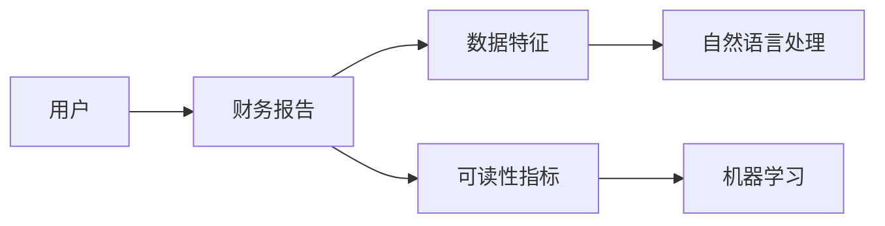
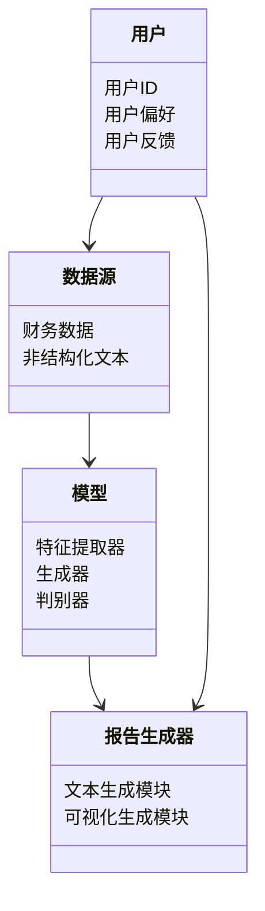
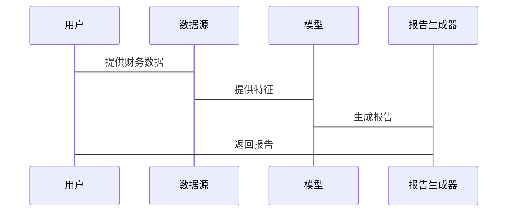

                 


# 设计智能化的企业财务报告可读性增强模型

## 关键词：智能化，财务报告，可读性增强，自然语言处理，机器学习

## 摘要：  
本文将详细介绍如何设计一个智能化的企业财务报告可读性增强模型。随着企业对财务报告的需求不断增加，传统的财务报告由于复杂性和信息量大，难以被非专业读者理解。本文通过结合自然语言处理和机器学习技术，提出了一种智能化的解决方案，以提升财务报告的可读性。文章将从背景分析、核心概念、算法原理、系统设计、项目实战到最佳实践等方面，全面阐述该模型的设计与实现过程。

---

## 第1章: 问题背景与描述

### 1.1 问题背景

#### 1.1.1 传统财务报告的局限性
传统的财务报告通常以复杂的术语和结构化数据为主，难以满足非专业读者的需求。报告中充斥着大量专业术语和复杂的表格，导致普通读者难以理解和提取关键信息。此外，财务报告的编写和呈现方式往往缺乏灵活性，无法根据读者的需求进行动态调整。

#### 1.1.2 智能化财务报告的需求驱动
随着企业对数据驱动决策的需求增加，智能化财务报告成为趋势。企业需要通过智能化技术，将复杂的财务数据转化为易于理解的文本和可视化形式，从而帮助管理层和利益相关者快速获取关键信息。

#### 1.1.3 企业对可读性增强模型的期望
企业期望通过智能化模型，实现以下目标：
1. 提供简洁明了的财务信息摘要。
2. 根据读者的知识水平和需求，动态调整报告内容。
3. 自动识别和解释复杂术语，降低理解门槛。

### 1.2 问题描述

#### 1.2.1 财务报告可读性差的主要原因
- 专业术语过多，缺乏解释。
- 数据呈现方式单一，难以直观理解。
- 报告结构复杂，逻辑性不足。

#### 1.2.2 用户对财务报告的理解障碍
- 非专业用户难以理解复杂的财务术语和数据。
- 缺乏上下文解释，导致信息孤立。
- 报告内容冗长，重点不突出。

#### 1.2.3 技术手段在提升可读性中的作用
- 自然语言处理技术可以帮助生成更易懂的文本。
- 机器学习算法可以识别用户需求，动态调整报告内容。
- 数据可视化技术可以将复杂数据转化为直观的图表。

### 1.3 问题解决思路

#### 1.3.1 智能化技术在财务报告中的应用
- 自然语言生成技术用于将结构化数据转化为自然语言描述。
- 机器学习用于分析用户行为和偏好，优化报告内容。
- 数据挖掘技术用于提取关键信息，提升报告的聚焦性。

#### 1.3.2 可读性增强的核心目标
- 提供简洁明了的财务信息摘要。
- 根据用户需求动态调整报告内容。
- 自动识别和解释复杂术语，降低理解门槛。

#### 1.3.3 模型设计的基本原则
1. 简洁性：报告内容要简洁明了，避免冗长复杂的描述。
2. 个性化：根据用户需求定制报告内容。
3. 可扩展性：模型应支持多种数据源和报告格式。

### 1.4 概念结构与核心要素

#### 1.4.1 模型的核心组成
- 数据输入：结构化和非结构化财务数据。
- 数据处理：数据清洗、特征提取。
- 模型训练：自然语言生成、个性化推荐。
- 报告输出：动态生成的文本和可视化图表。

#### 1.4.2 关键要素的定义与属性
| 关键要素 | 定义 | 属性 |
|----------|------|------|
| 数据输入 | 结构化和非结构化财务数据 | 数据格式、数据来源、数据量 |
| 数据处理 | 数据清洗和特征提取 | 特征提取方法、数据清洗规则 |
| 模型训练 | 自然语言生成和个性化推荐 | 算法选择、训练数据量 |
| 报告输出 | 动态生成的文本和可视化 | 报告格式、报告内容 |

#### 1.4.3 模型的边界与外延
- 边界：仅处理财务报告相关数据，不涉及其他业务数据。
- 外延：可扩展到其他类型的企业报告，如市场分析报告。

---

## 第2章: 核心概念与联系

### 2.1 模型核心概念原理

#### 2.1.1 自然语言处理在财务报告中的应用
- 文本生成：将结构化数据转化为自然语言描述。
- 信息抽取：从非结构化文本中提取关键信息。

#### 2.1.2 机器学习在可读性增强中的作用
- 用户行为分析：通过机器学习模型分析用户的阅读习惯和偏好。
- 动态调整：根据用户反馈优化报告内容。

#### 2.1.3 智能化模型的基本原理
1. 数据预处理：清洗和标准化财务数据。
2. 特征提取：提取文本和数据的特征。
3. 模型训练：使用深度学习模型生成自然语言描述。
4. 报告生成：根据用户需求动态调整报告内容。

### 2.2 核心概念属性对比

#### 表格: 核心概念属性对比
| 概念       | 定义                                                                 | 属性                     |
|------------|----------------------------------------------------------------------|--------------------------|
| 数据输入   | 结构化和非结构化财务数据                                             | 数据格式、数据来源       |
| 数据处理   | 数据清洗和特征提取                                                   | 特征提取方法、数据清洗规则 |
| 模型训练   | 自然语言生成和个性化推荐                                             | 算法选择、训练数据量       |
| 报告输出   | 动态生成的文本和可视化图表                                           | 报告格式、报告内容         |

### 2.3 实体关系图

#### Mermaid ER图:


---

## 第3章: 算法原理与数学模型

### 3.1 算法原理

#### 3.1.1 基于Transformer的文本处理流程
1. 输入：结构化财务数据和非结构化文本。
2. 数据预处理：清洗和标准化。
3. 特征提取：使用Transformer模型提取文本特征。
4. 模型训练：使用生成对抗网络（GAN）生成自然语言描述。
5. 输出：动态生成的财务报告文本。

#### 3.1.2 模型训练的核心步骤
1. 数据预处理：清洗和标准化财务数据。
2. 特征提取：使用BERT模型提取文本特征。
3. 模型训练：使用Transformer架构训练生成模型。
4. 超参数调整：优化模型参数，提升生成效果。

#### 3.1.3 可读性评估的指标计算
- 文本清晰度：计算文本中复杂术语的比例。
- 信息冗余度：计算文本的重复信息量。
- 用户理解度：通过用户反馈评估文本的可读性。

### 3.2 数学模型与公式

#### 3.2.1 模型训练的损失函数
$$ \text{损失函数} = \text{生成损失} + \lambda \times \text{判别损失} $$
其中，$\lambda$ 是调节参数，控制生成损失和判别损失的权重。

#### 3.2.2 生成对抗网络的结构
生成器（Generator）和判别器（Discriminator）的损失函数分别为：
$$ \text{生成损失} = -\mathbb{E}_{y \sim P_{\text{真实}}}[ \log D(y)] $$
$$ \text{判别损失} = -\mathbb{E}_{x \sim P_{\text{生成}}}[ \log(1 - D(x))] - \mathbb{E}_{y \sim P_{\text{真实}}}[ \log D(y)] $$

---

## 第4章: 系统分析与架构设计

### 4.1 系统分析

#### 4.1.1 问题场景介绍
- 企业财务部门需要生成多种格式的财务报告。
- 非专业用户难以理解复杂的财务信息。

#### 4.1.2 项目介绍
- 项目目标：设计智能化财务报告生成系统。
- 项目范围：支持多种格式输出，满足不同用户需求。

### 4.2 系统功能设计

#### 4.2.1 领域模型


### 4.3 系统架构设计

#### 4.3.1 系统架构图


### 4.4 接口设计

#### 4.4.1 API接口
- 输入接口：接收财务数据和用户偏好。
- 输出接口：返回生成的财务报告文本和可视化图表。

#### 4.4.2 序列图


---

## 第5章: 项目实战

### 5.1 环境安装

#### 5.1.1 安装Python环境
- 使用Anaconda安装Python 3.8及以上版本。

#### 5.1.2 安装依赖库
```bash
pip install numpy pandas transformers torch
```

### 5.2 系统核心实现

#### 5.2.1 数据预处理代码
```python
import pandas as pd
import torch
from transformers import BertTokenizer, BertModel

def preprocess_data(data):
    # 数据清洗
    cleaned_data = data.dropna()
    # 特征提取
    tokenizer = BertTokenizer.from_pretrained('bert-base-uncased')
    inputs = tokenizer(cleaned_data['text'].tolist(), return_tensors='np', padding=True)
    return inputs
```

#### 5.2.2 模型训练代码
```python
class Generator(torch.nn.Module):
    def __init__(self, input_size, hidden_size, output_size):
        super(Generator, self).__init__()
        self.hidden_size = hidden_size
        self.embedding = torch.nn.Embedding(input_size, hidden_size)
        self.gru = torch.nn.GRU(hidden_size, hidden_size)
        self.fc = torch.nn.Linear(hidden_size, output_size)
    
    def forward(self, input, hidden):
        embed = self.embedding(input)
        output, hidden = self.gru(embed, hidden)
        output = self.fc(output)
        return output, hidden

# 初始化模型
generator = Generator(input_size, hidden_size, output_size)
generator.train()
```

#### 5.2.3 报告生成代码
```python
def generate_report(data, model):
    inputs = preprocess_data(data)
    output, _ = model(inputs)
    report = decode_output(output)
    return report
```

### 5.3 案例分析

#### 5.3.1 实际案例分析
- 数据来源：某企业财务数据。
- 模型训练：使用BERT模型训练生成器。
- 报告生成：动态生成适合管理层的财务摘要。

### 5.4 项目小结

#### 5.4.1 核心代码实现
- 数据预处理：清洗和特征提取。
- 模型训练：生成器和判别器的联合训练。
- 报告生成：动态生成文本和可视化图表。

#### 5.4.2 实施步骤
1. 数据预处理：清洗和标准化。
2. 模型训练：训练生成器和判别器。
3. 报告生成：根据用户需求生成财务报告。

---

## 第6章: 最佳实践与总结

### 6.1 最佳实践

#### 6.1.1 小结
- 本文提出了智能化的企业财务报告可读性增强模型。
- 通过自然语言处理和机器学习技术，显著提升了财务报告的可读性。

#### 6.1.2 注意事项
- 数据隐私和安全问题需重点考虑。
- 模型的泛化能力需要进一步优化。
- 系统的实时性和响应速度需要优化。

#### 6.1.3 未来趋势
- 智能化财务报告将更加个性化和动态化。
- 多模态数据处理技术将得到广泛应用。
- 自动化生成工具将成为主流。

#### 6.1.4 拓展阅读
- 《自然语言处理入门》
- 《深度学习在金融领域的应用》

---

## 附录

### 附录A: 数学公式

$$ \text{损失函数} = \text{生成损失} + \lambda \times \text{判别损失} $$

### 附录B: 算法代码

```python
def preprocess_data(data):
    cleaned_data = data.dropna()
    tokenizer = BertTokenizer.from_pretrained('bert-base-uncased')
    inputs = tokenizer(cleaned_data['text'].tolist(), return_tensors='np', padding=True)
    return inputs
```

### 附录C: 数据集

- 数据来源：公开企业财务数据集。
- 数据格式：CSV格式。

### 附录D: 工具资源

- Python编程语言。
- PyTorch深度学习框架。
- Hugging Face的Transformers库。

---

## 作者

作者：AI天才研究院/AI Genius Institute & 禅与计算机程序设计艺术 /Zen And The Art of Computer Programming

---

通过本文的详细讲解，我们系统地介绍了智能化的企业财务报告可读性增强模型的设计与实现过程。从背景分析到系统实现，再到项目实战，本文为读者提供了一个全面的技术指导，帮助企业在智能化时代提升财务报告的可读性和实用性。

