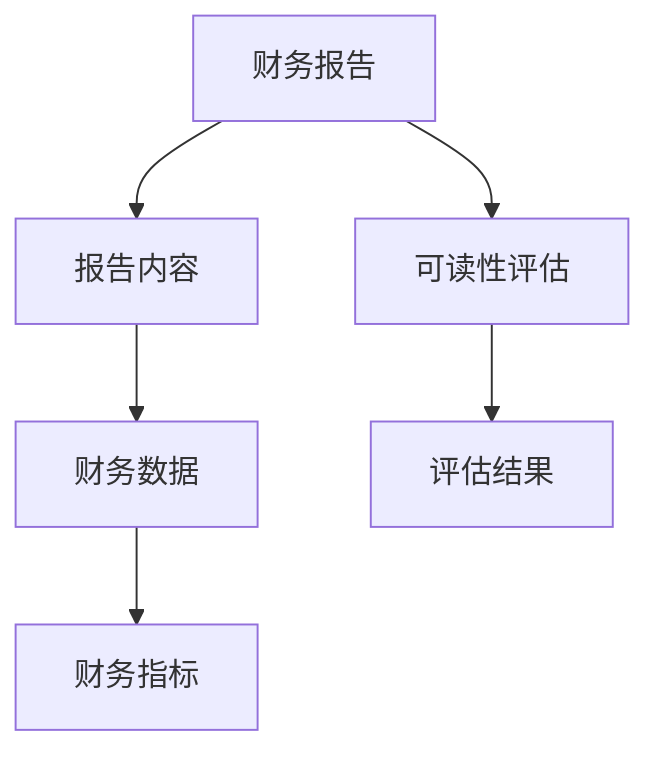
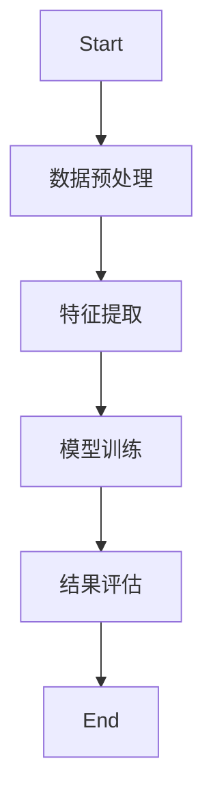
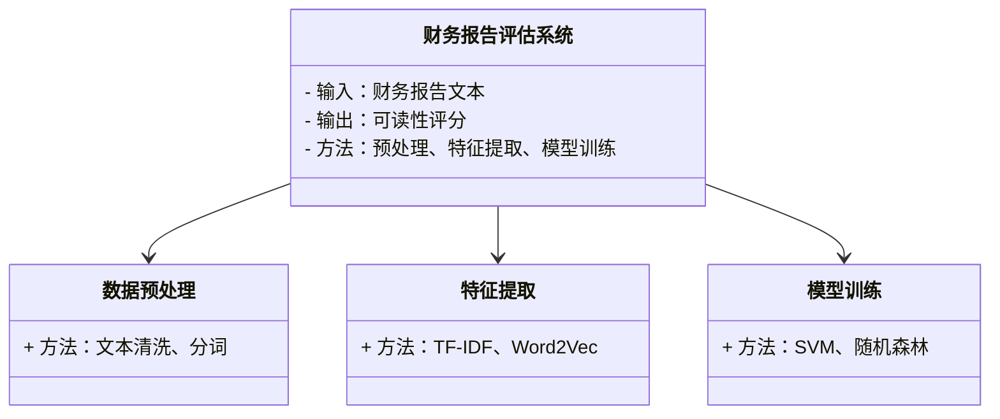
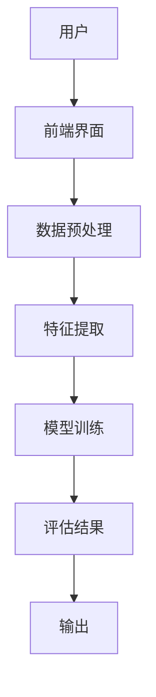
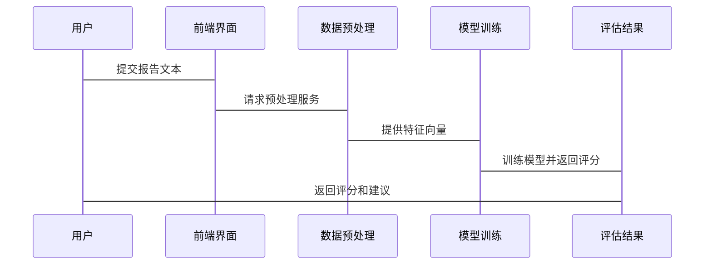

                 


# 设计智能化的企业财务报告可读性评估模型

> 关键词：智能化、财务报告、可读性评估、自然语言处理、机器学习、企业财务管理

> 摘要：本文探讨如何设计智能化的企业财务报告可读性评估模型，通过自然语言处理和机器学习技术，解决财务报告阅读难度大、信息提取效率低的问题。文章从问题背景、核心概念、算法原理、系统架构到项目实战，详细分析了模型的设计与实现过程。

---

## 第一部分: 背景介绍与核心概念

### 第1章: 问题背景与描述

#### 1.1 问题背景
- **1.1.1 企业财务报告的重要性**  
  财务报告是企业经营管理的核心依据，包含丰富的财务数据和业务信息，通常以文本形式呈现。然而，财务报告的专业性和复杂性导致其可读性较差，尤其对非专业人员来说，难以快速理解和提取关键信息。

- **1.1.2 财务报告可读性面临的挑战**  
  - **语言复杂性**：财务报告使用专业术语，句子结构复杂，导致阅读难度大。  
  - **信息量大**：报告内容繁多，信息分散，难以快速定位关键数据。  
  - **主观性**：不同读者的背景和需求不同，对可读性的感知也不同。  

- **1.1.3 提高财务报告可读性的必要性**  
  高可读性财务报告有助于企业内外部利益相关者快速理解财务状况，提升决策效率，优化企业财务管理。

#### 1.2 问题描述
- **1.2.1 财务报告可读性的定义**  
  财务报告的可读性是指读者能够快速、准确地理解报告内容并提取关键信息的能力。  

- **1.2.2 当前财务报告可读性评估的痛点**  
  - **人工评估成本高**：传统评估方式依赖人工阅读和评分，耗时且效率低。  
  - **评估标准不统一**：缺乏统一的可读性评估标准，导致结果难以量化。  
  - **技术手段有限**：现有技术难以同时处理文本复杂性和业务逻辑性。  

- **1.2.3 智能化评估的需求与目标**  
  - **需求**：开发智能化模型，自动评估财务报告的可读性。  
  - **目标**：通过自然语言处理和机器学习技术，量化报告的可读性，优化报告生成和阅读体验。

#### 1.3 问题解决与边界
- **1.3.1 智能化评估的核心目标**  
  - 自动化评估财务报告的可读性，提供可量化的评估结果。  
  - 基于评估结果，优化报告生成策略，提升可读性。  

- **1.3.2 边界与外延**  
  - **边界**：仅关注财务报告的可读性评估，不涉及报告内容的生成和修改。  
  - **外延**：可读性评估结果可用于辅助报告生成、读者推荐系统等场景。  

- **1.3.3 核心要素组成**  
  - **输入**：财务报告文本、上下文信息（如行业、企业规模）。  
  - **输出**：可读性评分、关键信息提取结果、改进建议。  

#### 1.4 本章小结  
  本章从背景、问题描述和解决方案三个方面，明确了财务报告可读性评估的核心目标和实现路径。

---

### 第2章: 核心概念与联系

#### 2.1 概念原理
- **2.1.1 智能化评估的基本原理**  
  智能化评估基于自然语言处理（NLP）和机器学习（ML）技术，通过分析财务报告文本的语言特征、内容结构和业务逻辑，评估其可读性。  

- **2.1.2 自然语言处理在可读性评估中的应用**  
  - **分词与句法分析**：识别文本中的关键词汇和语法结构，提取核心信息。  
  - **情感分析**：判断文本的情感倾向，辅助评估可读性。  

- **2.1.3 机器学习在财务报告分析中的作用**  
  - **特征提取**：将文本特征转化为数值特征，供模型训练使用。  
  - **模型训练**：通过监督学习训练模型，预测报告的可读性评分。  

#### 2.2 概念属性特征对比
| 概念 | 特征 | 描述 |
|------|------|------|
| 财务报告 | 文本复杂性 | 句子长度、关键词密度等。 |
| 可读性评估 | 语言清晰度 | 词汇复杂度、句法结构等。 |
| 智能化模型 | 学习能力 | 模型的泛化能力和适应性。 |

#### 2.3 ER实体关系图


#### 2.4 本章小结  
  本章通过概念原理和实体关系图，清晰地展示了智能化财务报告可读性评估模型的核心要素及其之间的联系。

---

## 第二部分: 算法原理与数学模型

### 第3章: 算法原理讲解

#### 3.1 算法流程


#### 3.2 核心算法代码实现
```python
# 示例代码
import numpy as np
from sklearn.feature_extraction.text import TfidfVectorizer
from sklearn.svm import SVC

# 数据预处理
def preprocess(text):
    return text.lower()

# 特征提取
vectorizer = TfidfVectorizer()
X = vectorizer.fit_transform(documents)

# 模型训练
model = SVC()
model.fit(X.toarray(), labels)

# 预测与评估
print(model.score(X_test.toarray(), y_test))
```

#### 3.3 数学模型与公式
- **3.3.1 TF-IDF计算公式**  
  $$ tfidf(t, d) = tf(t, d) \times idf(t) $$  
  其中，$tf(t, d)$ 是词 $t$ 在文档 $d$ 中的词频，$idf(t)$ 是逆向文件频率。  

- **3.3.2 机器学习模型评估公式**  
  $$ accuracy = \frac{true\_positive + true\_negative}{total\_examples} $$  

---

## 第三部分: 系统分析与架构设计

### 第4章: 系统分析与架构设计

#### 4.1 问题场景介绍
- **项目介绍**  
  本项目旨在开发一个智能化的企业财务报告可读性评估系统，通过NLP和ML技术，自动化评估报告的可读性。  

#### 4.2 系统功能设计


#### 4.3 系统架构设计


#### 4.4 系统接口设计
- **输入接口**：接收财务报告文本。  
- **输出接口**：返回可读性评分和改进建议。  

#### 4.5 系统交互设计


#### 4.6 本章小结  
  本章通过系统分析和架构设计，明确了财务报告可读性评估系统的实现路径和技术方案。

---

## 第四部分: 项目实战

### 第5章: 项目实战

#### 5.1 环境安装与配置
- **工具安装**  
  - Python 3.8+  
  - Jupyter Notebook  
  - Scikit-learn、NLTK、spaCy  

#### 5.2 核心代码实现
```python
# 示例代码
import numpy as np
from sklearn.feature_extraction.text import TfidfVectorizer
from sklearn.svm import SVC

# 数据预处理
def preprocess(text):
    return text.lower()

# 特征提取
vectorizer = TfidfVectorizer()
X = vectorizer.fit_transform(documents)

# 模型训练
model = SVC()
model.fit(X.toarray(), labels)

# 预测与评估
print(model.score(X_test.toarray(), y_test))
```

#### 5.3 实际案例分析
- **案例背景**  
  某企业提交了一份季度财务报告，报告内容复杂，包含多个财务指标和专业术语。  

- **评估过程**  
  - 数据预处理：清洗文本，提取关键词汇。  
  - 特征提取：计算TF-IDF值，生成特征向量。  
  - 模型训练：训练SVM模型，评估报告的可读性。  

- **结果解读**  
  模型给出报告的可读性评分为0.75，建议简化部分专业术语，优化报告结构。  

#### 5.4 本章小结  
  本章通过实际案例，展示了智能化财务报告可读性评估模型的实现过程和应用场景。

---

## 第五部分: 最佳实践与总结

### 第6章: 最佳实践与总结

#### 6.1 最佳实践 tips
- **数据质量**：确保数据清洗和预处理的质量，提升模型的准确性。  
- **模型调优**：通过网格搜索优化模型参数，提升评估效果。  
- **用户体验**：设计友好的用户界面，提升用户使用体验。  

#### 6.2 小结
本文详细探讨了智能化的企业财务报告可读性评估模型的设计与实现过程，通过理论分析和实践案例，展示了如何利用NLP和ML技术解决实际问题。

#### 6.3 注意事项
- **数据隐私**：注意保护企业数据隐私，避免信息泄露。  
- **模型泛化能力**：在不同场景下测试模型，确保其泛化能力。  

#### 6.4 拓展阅读
- **推荐阅读书籍**  
  - 《自然语言处理入门》  
  - 《机器学习实战》  

---

## 作者：AI天才研究院/AI Genius Institute & 禅与计算机程序设计艺术 /Zen And The Art of Computer Programming

