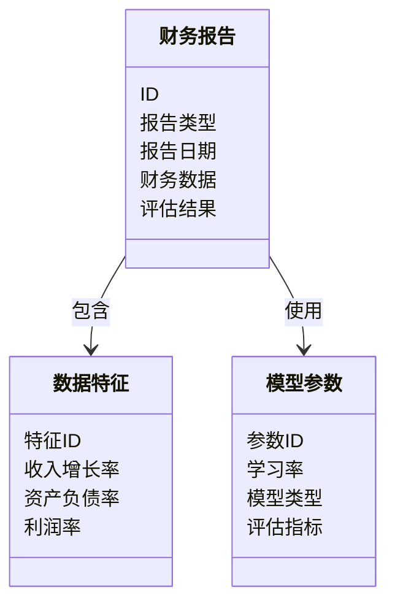
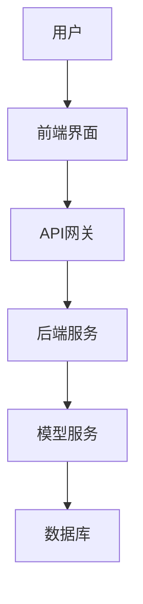
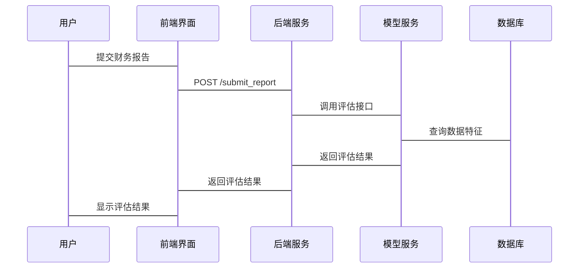

                 


# 设计智能化的企业财务报告质量评估模型

## 关键词：智能化，企业财务报告，质量评估，机器学习，大数据

## 摘要：  
随着企业对财务报告质量要求的不断提高，传统的财务报告评估方法逐渐暴露出效率低下、准确性不足的问题。本文通过结合人工智能和大数据技术，提出了一种智能化的企业财务报告质量评估模型，从数据特征提取、模型算法设计到系统架构实现，详细阐述了该模型的设计思路和实现方法。通过对实际案例的分析，展示了该模型在提高评估效率和准确性方面的显著优势，为企业的财务管理智能化转型提供了新的思路和实践参考。

---

## 第一部分: 背景介绍

## 第1章: 企业财务报告质量评估的背景与挑战

### 1.1 问题背景

#### 1.1.1 企业财务报告的重要性  
企业财务报告是反映企业财务状况、经营成果和现金流量的重要文件，是投资者、债权人、监管机构等利益相关方进行决策的重要依据。然而，财务报告的质量直接影响到这些决策的准确性和可靠性。

#### 1.1.2 财务报告质量评估的现状  
传统的财务报告质量评估方法主要依赖人工审核，这种方式效率低、成本高，且容易受到主观因素的影响。随着企业规模的扩大和数据量的增加，传统的评估方法已无法满足现代化企业的管理需求。

#### 1.1.3 当前评估方法的局限性  
- 人工审核效率低，难以处理海量数据。
- 评估标准不统一，缺乏客观性。
- 部分企业财务数据存在造假行为，人工审核难以发现隐蔽性问题。

### 1.2 问题描述

#### 1.2.1 财务报告质量评估的核心目标  
- 数据完整性：确保财务数据无缺失或错误。
- 逻辑一致性：财务数据之间的关系符合会计准则。
- 信息透明度：财务信息真实、准确、可比。

#### 1.2.2 评估过程中面临的主要问题  
- 数据量大，人工审核效率低。
- 数据复杂性高，难以快速识别异常。
- 缺乏统一的评估标准和方法。

#### 1.2.3 智能化评估的需求与趋势  
- 提高评估效率，降低人工成本。
- 利用先进技术手段发现潜在问题。
- 实现财务数据的智能化分析与决策支持。

### 1.3 问题解决

#### 1.3.1 智能化评估的核心思路  
- 利用机器学习和大数据技术，构建自动化评估模型。
- 通过数据特征提取和模型训练，实现对财务报告的智能化分析。
- 建立统一的评估标准，确保评估结果的客观性和一致性。

#### 1.3.2 数据驱动的解决方案  
- 采集和整理财务数据，构建数据特征库。
- 利用机器学习算法训练评估模型，实现对财务报告的自动评分。
- 提供可视化结果和改进建议，辅助企业管理决策。

#### 1.3.3 技术实现的关键点  
- 数据预处理与特征提取。
- 选择合适的机器学习算法。
- 模型训练与优化。
- 结果解释与反馈。

### 1.4 边界与外延

#### 1.4.1 模型的适用范围  
- 适用于企业财务报告的自动化评估。
- 支持多种财务报表类型，如资产负债表、利润表、现金流量表等。
- 可扩展至其他类型的企业数据质量评估。

#### 1.4.2 与其他财务系统的区别  
- 本模型专注于财务报告的质量评估，与其他财务管理系统功能分离。
- 可与企业现有的财务管理系统集成，提供数据支持。

#### 1.4.3 模型的可扩展性与灵活性  
- 支持多种数据源和格式。
- 可根据企业需求定制评估标准和模型参数。
- 支持在线更新和优化。

### 1.5 核心概念与组成

#### 1.5.1 财务报告质量评估的核心要素  
- 数据完整性：确保财务数据无缺失。
- 逻辑一致性：数据之间的关系符合会计准则。
- 信息透明度：财务信息真实、准确、可比。

#### 1.5.2 智能化模型的组成结构  
- 数据预处理模块：负责数据清洗和特征提取。
- 模型训练模块：利用机器学习算法训练评估模型。
- 结果解释模块：提供评估结果的可视化和改进建议。

#### 1.5.3 数据特征与评估指标的关系  
- 数据特征：如收入增长率、资产负债率等。
- 评估指标：如数据完整性评分、逻辑一致性评分。

---

## 第2章: 核心概念与联系

### 2.1 核心概念原理

#### 2.1.1 财务报告质量评估的基本原理  
- 通过数据特征提取和模型训练，实现对财务报告质量的量化评估。
- 利用机器学习算法，识别数据中的异常和潜在问题。

#### 2.1.2 智能化模型的算法基础  
- 监督学习：如支持向量机（SVM）、随机森林（Random Forest）。
- 无监督学习：如聚类分析（K-means）。
- 深度学习：如神经网络（NN）。

#### 2.1.3 数据特征提取的关键技术  
- 文本挖掘：从财务报告中提取关键词和句法信息。
- 统计分析：计算财务指标的分布和相关性。
- 数据清洗：处理缺失值、异常值和重复值。

### 2.2 概念属性特征对比表

| 概念 | 属性 | 特征 | 描述 |
|------|------|------|------|
| 数据完整性 | 数据无缺失 | 高 | 数据无缺失、准确 |
| 逻辑一致性 | 数据关系合理 | 高 | 数据之间的关系符合会计准则 |
| 信息透明度 | 数据可比性 | 中 | 数据透明度依赖具体行业标准 |

### 2.3 ER实体关系图

```mermaid
er
    entity 财务报告 {
        key: ID
        attribute: 报告类型,
        attribute: 报告日期,
        attribute: 财务数据,
        attribute: 评估结果
    }
    
    entity 数据特征 {
        key: 特征ID
        attribute: 收入增长率,
        attribute: 资产负债率,
        attribute: 净利润率
    }
    
    entity 模型参数 {
        key: 参数ID
        attribute: 学习率,
        attribute: 模型类型,
        attribute: 评估指标
    }
    
    财务报告 --> 数据特征: 包含
    财务报告 --> 模型参数: 使用
```

---

## 第三部分: 算法原理讲解

### 第3章: 算法原理与实现

#### 3.1 算法选择与原理

##### 3.1.1 支持向量机（SVM）
- 用于分类和回归问题。
- 适用于小规模数据集。

##### 3.1.2 随机森林（Random Forest）
- 适用于高维数据和大数据集。
- 具有良好的抗过拟合能力。

##### 3.1.3 神经网络（NN）
- 适用于复杂非线性关系。
- 需要大量数据支持。

#### 3.2 模型训练流程

##### 3.2.1 数据预处理
```python
import pandas as pd
from sklearn.preprocessing import StandardScaler

# 数据清洗
data = pd.read_csv('financial_reports.csv')
data = data.dropna()
data = data.replace(' ', 0)

# 特征提取
features = data[['收入增长率', '资产负债率', '利润率']]
labels = data['评估结果']

# 数据标准化
scaler = StandardScaler()
features_scaled = scaler.fit_transform(features)
```

##### 3.2.2 模型训练
```python
from sklearn.ensemble import RandomForestClassifier

model = RandomForestClassifier(n_estimators=100, max_depth=5, random_state=42)
model.fit(features_scaled, labels)
```

##### 3.2.3 模型评估
```python
from sklearn.metrics import accuracy_score

y_pred = model.predict(features_scaled)
print('模型准确率:', accuracy_score(labels, y_pred))
```

#### 3.3 数学模型与公式

##### 3.3.1 随机森林模型
随机森林通过集成多个决策树模型，提高预测准确性和稳定性。其预测结果是基于多数投票或平均值的组合。

##### 3.3.2 支持向量机模型
支持向量机通过寻找最优超平面，将数据分为两类。其目标函数如下：
$$
\text{minimize } \frac{1}{2}||w||^2 + C\sum_{i=1}^n \xi_i
$$
其中，$C$ 是惩罚系数，$\xi_i$ 是松弛变量。

---

## 第四部分: 系统分析与架构设计方案

### 第4章: 系统设计与实现

#### 4.1 问题场景介绍

##### 4.1.1 系统目标
- 提供智能化的财务报告质量评估服务。
- 实现对企业财务数据的自动化分析和评估。

##### 4.1.2 项目范围
- 数据采集与处理。
- 模型训练与部署。
- 结果展示与反馈。

#### 4.2 系统功能设计

##### 4.2.1 领域模型



##### 4.2.2 系统架构设计



#### 4.3 系统接口设计

##### 4.3.1 API接口

| 接口名称 | 接口描述 | 请求方法 | 请求路径 |
|----------|----------|----------|----------|
| 提交报告 | 上传财务报告数据 | POST | /submit_report |
| 获取结果 | 查询评估结果 | GET | /get_result?id= |

##### 4.3.2 数据接口

| 数据类型 | 数据表结构 | 关系 |
|----------|----------|------|
| 财务报告 | ID, 报告类型, 报告日期, 财务数据, 评估结果 | 无 |
| 数据特征 | 特征ID, 收入增长率, 资产负债率, 利润率 | 无 |

#### 4.4 系统交互设计



---

## 第五部分: 项目实战

### 第5章: 项目实战与案例分析

#### 5.1 环境安装

##### 5.1.1 安装Python环境
- 安装Python 3.8及以上版本。
- 安装必要的库：`scikit-learn`, `pandas`, `mermaid`, `matplotlib`。

##### 5.1.2 安装Jupyter Notebook
- 用于数据可视化和模型训练。

#### 5.2 核心代码实现

##### 5.2.1 数据预处理

```python
import pandas as pd
from sklearn.preprocessing import StandardScaler

data = pd.read_csv('financial_reports.csv')
data = data.dropna()
data = data.replace(' ', 0)
```

##### 5.2.2 特征提取与建模

```python
from sklearn.ensemble import RandomForestClassifier

features = data[['收入增长率', '资产负债率', '利润率']]
labels = data['评估结果']

scaler = StandardScaler()
features_scaled = scaler.fit_transform(features)

model = RandomForestClassifier(n_estimators=100, max_depth=5, random_state=42)
model.fit(features_scaled, labels)
```

##### 5.2.3 模型评估

```python
from sklearn.metrics import accuracy_score

y_pred = model.predict(features_scaled)
print('模型准确率:', accuracy_score(labels, y_pred))
```

#### 5.3 案例分析

##### 5.3.1 数据可视化

```python
import matplotlib.pyplot as plt

plt.scatter(features['收入增长率'], features['资产负债率'], c=labels)
plt.xlabel('收入增长率')
plt.ylabel('资产负债率')
plt.colorbar(label='评估结果')
plt.show()
```

##### 5.3.2 模型预测与解释

```python
sample_report = pd.DataFrame({
    '收入增长率': [0.15],
    '资产负债率': [0.6],
    '利润率': [0.1]
})

sample_scaled = scaler.transform(sample_report)
prediction = model.predict(sample_scaled)
print('预测结果:', prediction[0])
```

---

## 第六部分: 最佳实践与总结

### 第6章: 最佳实践与总结

#### 6.1 最佳实践

##### 6.1.1 数据质量管理
- 确保数据的完整性和准确性。
- 定期更新和维护数据特征库。

##### 6.1.2 模型优化
- 根据业务需求调整模型参数。
- 定期更新模型，保持评估结果的准确性。

#### 6.2 小结

智能化的企业财务报告质量评估模型通过结合机器学习和大数据技术，显著提高了财务报告评估的效率和准确性。该模型不仅可以帮助企业快速发现财务数据中的潜在问题，还能为企业管理决策提供有力支持。

#### 6.3 注意事项

- 数据隐私和安全问题需要特别注意。
- 模型的可解释性需要进一步优化。
- 系统的稳定性和可靠性需要通过充分的测试确保。

#### 6.4 拓展阅读

- 《机器学习实战》
- 《数据挖掘导论》
- 《企业财务管理智能化转型》

---

## 作者：AI天才研究院/AI Genius Institute & 禅与计算机程序设计艺术/Zen And The Art of Computer Programming

