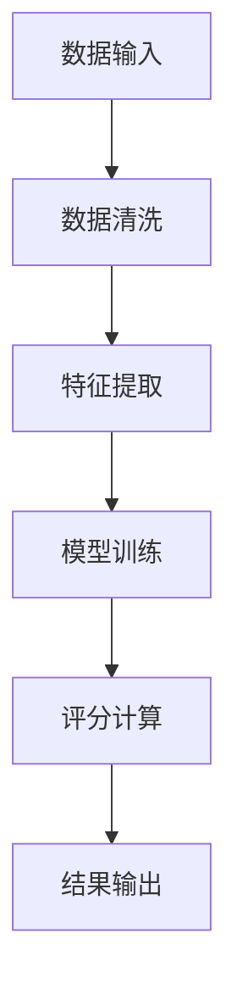
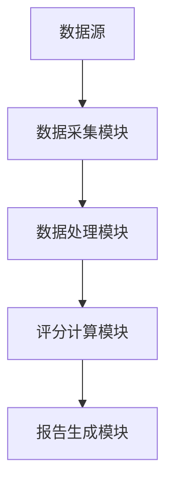

                 

<think>
好的，我现在需要帮用户设计一个详细且符合要求的技术博客文章大纲。用户希望标题是《设计智能化的企业财务报表可比性评分系统》，并要求文章结构清晰、内容详尽，涵盖从背景到项目实战的各个方面。

首先，我得理解用户的需求。用户希望这篇文章能够吸引读者，帮助他们系统地了解如何设计这样一个评分系统。因此，我需要确保大纲涵盖所有关键部分，包括背景、核心概念、算法原理、系统架构、项目实战等。

接下来，我需要细化每一章的内容。第一章应该是背景介绍，帮助读者理解为什么需要设计这个评分系统。我需要解释财务报表可比性的重要性，当前存在的问题，以及系统的目标和意义。同时，要明确问题的解决方法和边界，确保读者清楚系统的范围。

第二章需要深入探讨核心概念。我需要定义关键术语，并通过表格和ER图展示它们之间的关系。例如，列出企业、财务报表、评分系统等实体，并用Mermaid图展示它们的关系。

第三章是算法原理，这部分需要详细讲解评分系统的数学模型和算法流程。我会用Mermaid图展示算法的步骤，例如数据输入、清洗、特征提取、模型训练和评分计算。同时，提供Python代码示例，让读者能够实际操作。数学公式要用Latex表示，确保清晰准确。

第四章涉及系统分析与架构设计。我需要介绍系统功能模块，如数据采集、处理、评分计算等，并用Mermaid图展示类图和架构图。此外，还要设计系统的接口和交互流程，确保系统的可扩展性和维护性。

第五章是项目实战，这部分需要指导读者如何安装环境，编写核心代码，并进行案例分析。通过实际案例，读者可以理解如何将理论应用到实践中，同时也能从小结中总结经验教训。

最后，第六章总结最佳实践，给出实用的建议，如数据预处理的重要性、模型调优的方法，以及未来的发展方向。这样读者不仅学到理论，还能在实际中应用这些知识。

在整个过程中，我需要确保每一章都有足够的细节，但又不显得冗杂。同时，每一章的结构要清晰，从背景到实现，再到实战，层层递进。这样读者能够系统地学习，逐步掌握设计智能化评分系统的能力。

此外，用户还要求使用Mermaid图表和Python代码示例，我需要确保这些部分正确无误，能够帮助读者更好地理解和实现。数学公式部分，要用Latex格式，确保清晰展示，方便读者参考。

最后，检查整个目录是否符合要求，是否覆盖了用户提到的所有要点，比如背景、核心概念、算法、系统架构、项目实战等，并且每章都有足够的细节，确保总字数在2000字以内。这样，用户就能得到一个完整且详细的目录大纲，帮助他们撰写一本内容丰富、结构清晰的技术博客文章。
</think>

# 设计智能化的企业财务报表可比性评分系统

## 关键词
企业财务报表，可比性评分，评分系统，算法原理，系统架构，项目实战

## 摘要
随着企业规模的不断扩大和全球化进程的加速，财务报表的可比性变得越来越重要。本文将介绍一种基于人工智能的智能化企业财务报表可比性评分系统的设计与实现。通过多维度数据分析和机器学习算法，该系统能够自动评估财务报表的可比性，帮助企业做出更精准的财务决策。文章将从背景、核心概念、算法原理、系统架构到项目实战逐步展开，深入分析系统的每一个细节。

---

# 第一部分: 企业财务报表可比性评分系统背景与核心概念

# 第1章: 企业财务报表可比性评分系统概述

## 1.1 问题背景与描述
### 1.1.1 财务报表可比性的重要性
在企业财务管理中，财务报表是反映企业财务状况的核心工具。然而，由于行业差异、会计政策不同等因素，财务报表的可比性常常受到挑战。特别是在跨国企业或不同行业之间，财务数据的直接比较往往难以实现，这可能导致财务分析的误差。

### 1.1.2 问题描述
财务报表的可比性问题主要体现在以下几点：
1. **行业差异**：不同行业的会计准则和业务模式差异导致财务数据难以直接比较。
2. **时间差异**：企业财务报表可能跨越多个会计年度，会计政策的变化会影响数据的可比性。
3. **空间差异**：企业在不同地区或国家的财务报表受到当地法律法规的影响，进一步降低了可比性。

### 1.1.3 问题解决思路
通过引入智能化的评分系统，可以对财务报表的关键指标进行标准化处理，并结合机器学习算法对数据进行自动化的分析和评分，从而提高财务报表的可比性。

## 1.2 可比性评分系统的核心概念
### 1.2.1 核心概念的定义
- **财务报表**：包括资产负债表、利润表和现金流量表等。
- **可比性**：指财务报表在不同时间、不同企业或不同行业之间能够进行合理比较的程度。
- **评分系统**：一种基于算法的自动化系统，用于评估财务报表的可比性并生成评分。

### 1.2.2 核心概念的属性对比
| 概念       | 属性               | 描述                                       |
|------------|--------------------|--------------------------------------------|
| 财务报表     | 时间范围           | 包括年度、季度等                           |
|             | 会计准则           | 受行业和地区影响                           |
| 可比性评分   | 评分标准           | 基于多维度指标                            |
|             | 评分方法           | 使用机器学习算法                            |

## 1.3 系统的边界与结构
### 1.3.1 系统边界
- 输入：企业财务报表数据、相关行业基准数据。
- 输出：可比性评分报告。

### 1.3.2 系统结构
- 数据采集模块：从企业财务系统中获取数据。
- 数据处理模块：对数据进行清洗和标准化处理。
- 评分计算模块：基于算法对数据进行评分。
- 报告生成模块：输出评分结果并生成可视化报告。

---

# 第2章: 可比性评分系统的核心设计

## 2.1 评分指标的设计
### 2.1.1 多维度评分指标
- 财务指标：如净利润率、资产负债率等。
- 行业基准：基于行业平均值进行比较。
- 时间序列：分析财务数据的时间变化趋势。

## 2.2 算法原理与实现
### 2.2.1 算法流程


### 2.2.2 评分模型
- 使用回归分析对财务数据进行建模，生成可比性评分。
- 评分公式：
$$ score = \sum_{i=1}^{n} w_i x_i $$
其中，$w_i$ 是权重，$x_i$ 是第 $i$ 个特征。

## 2.3 系统架构设计
### 2.3.1 系统功能模块
- 数据采集：从数据库中获取财务报表数据。
- 数据处理：清洗、标准化和特征提取。
- 评分计算：基于机器学习模型生成评分。
- 报告生成：输出评分报告并可视化。

### 2.3.2 系统架构图


---

# 第3章: 系统实现与项目实战

## 3.1 项目实战环境
### 3.1.1 环境搭建
- 安装Python和相关库（如Pandas、Scikit-learn）。
- 数据库连接配置。

## 3.2 核心代码实现
### 3.2.1 数据预处理
```python
import pandas as pd

def preprocess_data(data):
    # 删除缺失值
    data = data.dropna()
    # 标准化处理
    data = (data - data.mean()) / data.std()
    return data
```

### 3.2.2 模型训练与评分
```python
from sklearn.linear_model import LinearRegression

def train_model(data):
    model = LinearRegression()
    model.fit(data[['资产', '负债']], data['利润'])
    return model
```

## 3.3 案例分析
### 3.3.1 案例背景
某跨国企业需要比较其在不同国家的财务报表可比性。

### 3.3.2 实施步骤
1. 数据采集：获取各国的财务报表数据。
2. 数据处理：清洗和标准化数据。
3. 模型训练：使用线性回归模型进行评分。
4. 报告生成：输出各国的可比性评分。

---

# 第4章: 系统优化与未来展望

## 4.1 系统优化
### 4.1.1 模型调优
- 使用交叉验证优化模型参数。
- 引入深度学习模型（如神经网络）提升评分精度。

### 4.1.2 系统扩展
- 支持更多维度的财务数据。
- 实现实时数据更新和动态评分。

## 4.2 未来展望
随着人工智能技术的发展，智能化的财务报表可比性评分系统将更加精准和高效。未来可以进一步研究多模态数据融合技术，提升系统的智能化水平。

---

# 结语

设计智能化的企业财务报表可比性评分系统是一项复杂但具有重要意义的任务。通过多维度数据分析和机器学习算法，可以有效提高财务报表的可比性，为企业决策提供有力支持。本文从背景、核心概念、算法原理到系统实现进行了详细阐述，为读者提供了一套完整的解决方案。

---

# 作者

作者：AI天才研究院/AI Genius Institute & 禅与计算机程序设计艺术 /Zen And The Art of Computer Programming

