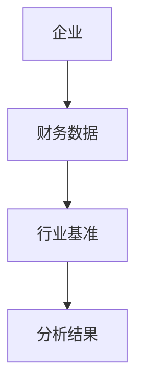
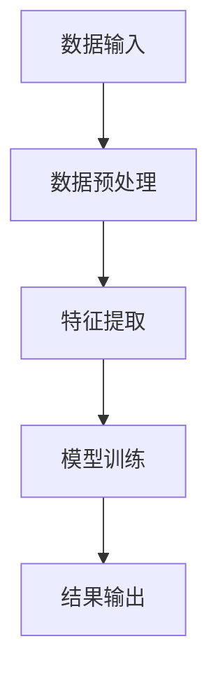
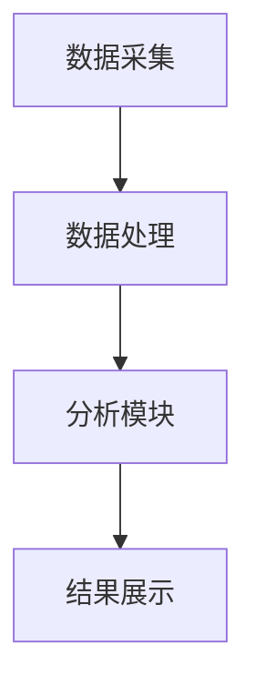

                 

<think>
好，我现在需要帮助用户设计一个详细的技术博客目录大纲，主题是《设计智能化的企业财务报表同行业对比分析系统》。用户已经给出了一个目录结构，并希望我逐步分析如何构建这篇文章。

首先，我得理解用户的需求。用户希望文章结构清晰，内容专业，涵盖从背景介绍到系统设计、项目实战等多个部分。每个章节都需要详细展开，包括核心概念、算法原理、系统架构等。同时，用户要求使用Mermaid图表和LaTeX公式，这意味着我需要确保这些元素在目录中都有体现。

接下来，我开始分析每个章节应该如何展开：

1. **背景介绍**：这部分需要说明为什么需要智能化的财务报表分析，传统方法的局限性，以及AI技术带来的优势。可能还需要定义系统的核心目标和边界。

2. **核心概念与联系**：这里要详细解释系统涉及的核心概念，比如数据采集、预处理、分析模型等，并通过对比表格和ER图来展示不同方法的优缺点和系统结构。

3. **算法原理**：需要介绍具体的算法，如聚类、分类等，并用Mermaid流程图展示算法步骤。同时，用LaTeX公式详细讲解数学模型，并举例说明。

4. **系统分析与架构设计**：这部分要描述系统的功能模块，如数据采集、处理、分析和展示，并用Mermaid图展示架构设计。同时，设计接口和交互流程，确保系统各部分协同工作。

5. **项目实战**：指导读者如何安装环境，编写代码，并分析实际案例。这部分需要详细代码示例和解读，帮助读者理解和应用。

6. **总结与展望**：总结全文，提出改进建议，并建议进一步学习的方向。

在构建目录时，我需要确保每个章节都有足够的细节，比如每个小节下有三级标题，包含具体的内容，如问题背景、解决方法、数学公式等。同时，要确保图表和代码示例的正确插入，以增强文章的可读性和专业性。

现在，我开始逐章细化内容：

- **第1章**：背景介绍，包括问题背景、解决方法、边界与外延。需要详细说明传统财务分析的不足，智能化分析的优势，以及系统的边界和核心要素。

- **第2章**：核心概念与联系，解释每个概念的定义、属性，并用表格和ER图对比传统与AI方法。这部分帮助读者理解系统的组成和工作原理。

- **第3章**：算法原理，详细讲解聚类和分类算法，用流程图展示步骤，并用LaTeX公式描述数学模型。例如，K-means聚类的公式和步骤说明。

- **第4章**：系统分析与架构设计，描述系统模块、架构图、接口设计和交互流程。这部分需要清晰展示系统的整体结构和各模块之间的关系。

- **第5章**：项目实战，指导读者如何安装环境，编写代码，并分析案例。代码示例需要详细注释，帮助读者理解和实现。

- **第6章**：总结与展望，回顾主要内容，提出改进建议，并建议进一步学习的领域，如时间序列分析和NLP技术。

在整个过程中，我需要确保每个部分都逻辑连贯，内容详实，同时使用专业但易懂的语言。这样，读者不仅能理解系统的设计，还能实际操作，提升他们的技术能力。

最后，检查整个目录是否覆盖了用户的所有要求，确保没有遗漏任何关键部分。这样，用户就能得到一篇结构清晰、内容丰富的技术博客文章。
</think>

# 设计智能化的企业财务报表同行业对比分析系统

> 关键词：智能化财务分析、AI驱动、企业报表、行业对比、机器学习

> 摘要：本文旨在探讨如何利用人工智能技术设计智能化的企业财务报表同行业对比分析系统。通过分析传统财务分析的局限性，提出基于机器学习和深度学习的智能化解决方案，详细介绍系统的核心概念、算法原理、系统架构设计以及项目实战，为读者提供从理论到实践的全面指导。

---

# 第1章：智能化企业财务报表分析的背景与意义

## 1.1 问题背景与描述
### 1.1.1 传统财务报表分析的局限性
传统的财务报表分析依赖人工操作，效率低、主观性强且容易出错。企业需要频繁进行同行业对比，但传统方法难以快速提取关键数据，难以满足现代企业的高效需求。

### 1.1.2 问题描述
企业财务数据繁多，人工分析耗时耗力，且难以发现隐藏的财务趋势和异常情况。此外，不同企业的财务数据格式和结构差异较大，手动处理难度大。

### 1.1.3 解决方法
引入人工智能技术，通过机器学习和自然语言处理（NLP）实现财务数据的自动采集、清洗和分析，提供智能化的同行业对比功能。

### 1.1.4 边界与外延
系统仅关注企业财务数据的同行业对比分析，不涉及企业的内部财务管理或税务申报等其他领域。

## 1.2 核心概念与原理
### 1.2.1 数据采集与预处理
通过API接口或文件导入方式采集企业的财务数据，并进行数据清洗和标准化处理。

### 1.2.2 机器学习模型
使用聚类算法（如K-means）对同行业企业进行分类，基于财务指标（如ROE、毛利率）进行对比分析。

### 1.2.3 系统架构
采用模块化设计，包括数据采集模块、数据处理模块、分析模块和结果展示模块。

## 1.3 本章小结
本章介绍了智能化企业财务报表分析的背景和意义，明确了系统的边界和核心概念，为后续章节奠定了基础。

---

# 第2章：智能化分析的核心概念与联系

## 2.1 核心概念原理
### 2.1.1 数据采集与预处理
使用NLP技术从企业财报文本中提取关键财务数据，如收入、利润、成本等。

### 2.1.2 自然语言处理
通过NLP技术解析非结构化的财务文本，提取结构化数据，提高数据采集效率。

### 2.1.3 机器学习模型
利用聚类算法对同行业企业进行分类，基于财务指标进行对比分析。

## 2.2 概念对比表格
| 技术 | 传统方法 | AI方法 | 优势 |
|------|----------|--------|------|
| 数据处理 | 手动筛选 | 自动提取 | 高效性 |
| 分析速度 | 低效 | 高效 | 快速反馈 |
| 准确性 | 易出错 | 高精度 | 准确性 |

## 2.3 ER实体关系图（Mermaid）



## 2.4 本章小结
本章详细介绍了智能化分析的核心概念，并通过对比表格和ER图展示了系统的结构和工作原理。

---

# 第3章：智能化分析的算法原理

## 3.1 算法原理概述
### 3.1.1 聚类分析
使用K-means算法将企业分为若干个行业类别，便于后续的对比分析。

### 3.1.2 分类算法
通过随机森林或支持向量机（SVM）对企业的行业归属进行分类。

### 3.1.3 深度学习模型
利用LSTM网络对时间序列的财务数据进行建模，预测企业的未来财务状况。

## 3.2 算法流程图（Mermaid）



## 3.3 数学模型与公式
### 3.3.1 K-means聚类算法
$$ \text{目标函数} = \sum_{i=1}^{k} \sum_{j=1}^{n_i} (x_j - c_i)^2 $$
其中，\( k \) 是聚类数，\( n_i \) 是第 \( i \) 个聚类的样本数，\( c_i \) 是第 \( i \) 个聚类的中心点。

### 3.3.2 随机森林分类
随机森林通过构建多个决策树，并对结果进行投票，提高分类准确率。

## 3.4 本章小结
本章详细介绍了智能化分析的核心算法，并通过公式和流程图展示了算法的实现过程。

---

# 第4章：智能化分析的系统架构设计

## 4.1 系统功能设计
### 4.1.1 数据采集模块
通过API接口或文件导入方式采集企业的财务数据。

### 4.1.2 数据处理模块
对采集到的财务数据进行清洗、标准化和特征提取。

### 4.1.3 分析模块
基于机器学习模型对数据进行分析，生成行业对比结果。

### 4.1.4 结果展示模块
以图表形式展示分析结果，便于用户直观理解。

## 4.2 系统架构图（Mermaid）



## 4.3 系统接口设计
### 4.3.1 数据接口
提供RESTful API接口，支持JSON格式的数据传输。

### 4.3.2 用户界面
设计友好的Web界面，方便用户上传数据和查看分析结果。

## 4.4 本章小结
本章详细介绍了系统的功能设计和架构设计，为后续的开发提供了指导。

---

# 第5章：智能化分析的项目实战

## 5.1 环境安装与配置
### 5.1.1 安装Python环境
使用Anaconda安装Python 3.8及以上版本。

### 5.1.2 安装依赖库
安装Pandas、NumPy、Scikit-learn、Keras等库。

## 5.2 核心实现代码
### 5.2.1 数据采集与预处理
```python
import pandas as pd
from sklearn.preprocessing import StandardScaler

# 数据采集
data = pd.read_csv('financial_data.csv')

# 数据预处理
scaler = StandardScaler()
scaled_data = scaler.fit_transform(data)
```

### 5.2.2 聚类分析
```python
from sklearn.cluster import KMeans

# 聚类分析
kmeans = KMeans(n_clusters=3)
clusters = kmeans.fit_predict(scaled_data)
```

## 5.3 代码解读与分析
### 5.3.1 数据采集模块
从CSV文件中读取财务数据，清洗数据并标准化处理。

### 5.3.2 聚类分析模块
使用K-means算法将企业分为3个类别，便于后续的行业对比分析。

## 5.4 实际案例分析
### 5.4.1 数据准备
以某行业的企业财务数据为例，展示数据采集和预处理过程。

### 5.4.2 分析结果
通过聚类分析，发现企业的行业归属，并生成对比报告。

## 5.5 本章小结
本章通过实际案例展示了系统的实现过程，帮助读者理解如何将理论应用于实践。

---

# 第6章：总结与展望

## 6.1 最佳实践 Tips
### 6.1.1 数据清洗的重要性
在数据预处理阶段，确保数据的完整性和准确性。

### 6.1.2 模型调优的技巧
通过网格搜索（Grid Search）优化模型参数，提高分类准确率。

## 6.2 小结
本文详细介绍了智能化企业财务报表同行业对比分析系统的设计与实现，涵盖了从理论到实践的全过程。

## 6.3 注意事项
在实际应用中，需注意数据隐私和安全问题，确保符合相关法律法规。

## 6.4 拓展阅读
推荐读者深入学习时间序列分析和自然语言处理（NLP）技术，进一步提升系统的智能化水平。

---

# 作者

作者：AI天才研究院/AI Genius Institute  
禅与计算机程序设计艺术 /Zen And The Art of Computer Programming

