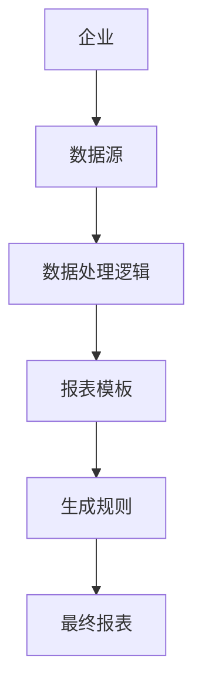
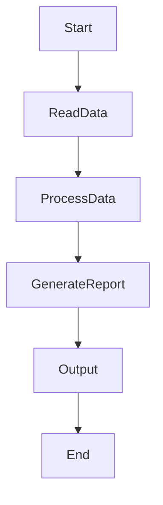
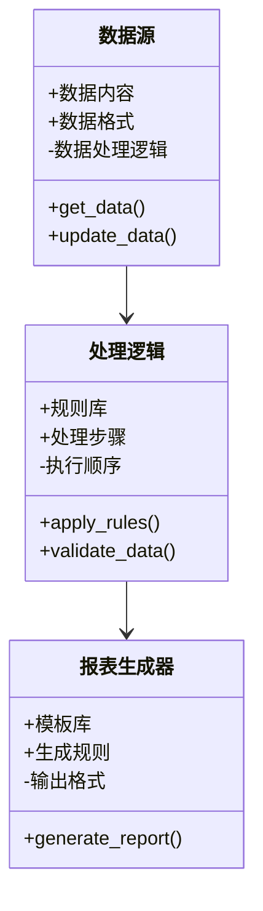
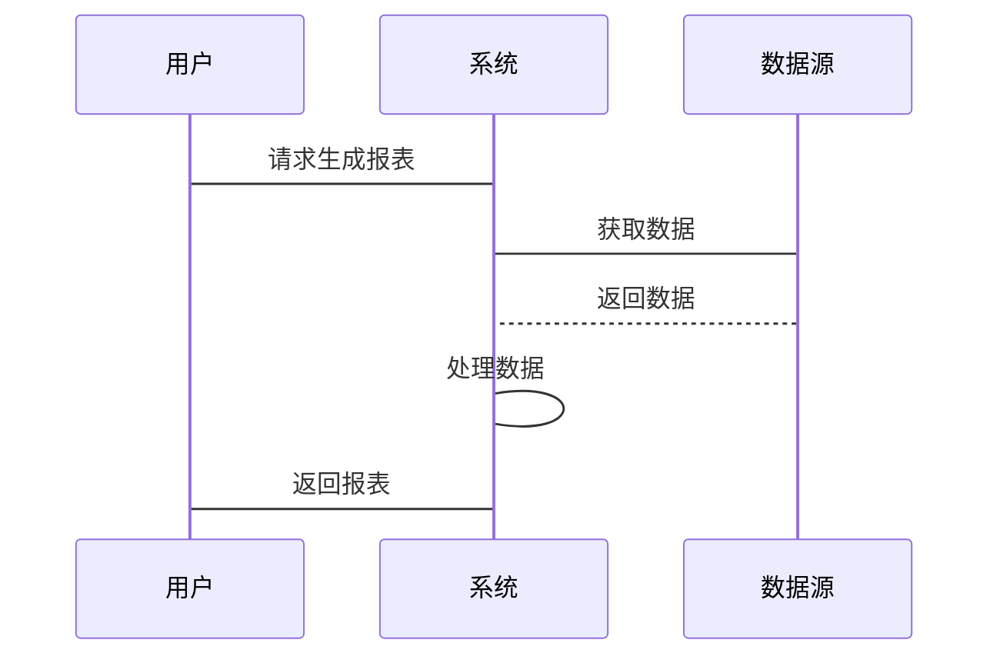

                 

<think>
嗯，用户让我设计一个关于《设计智能化的企业财务报表生成系统》的技术博客文章。首先，我需要理解用户的需求。用户希望文章结构清晰，逻辑严密，涵盖从背景到实现的各个方面，同时使用专业但易懂的语言。

用户给出了详细的大纲，包括摘要、关键词、各个章节的内容。我需要确保每个部分都细化到三级，并且内容详细。比如，第一章介绍问题背景，需要包括痛点、必要性、现状，以及核心概念和联系。

在思考过程中，我注意到用户特别强调了使用Mermaid图和数学公式，所以要确保这些元素正确嵌入。例如，在系统架构设计中，使用类图和流程图来展示模块和交互。

用户还提到要包含数学模型和算法原理，所以我需要找到合适的公式，并用LaTeX表示。同时，项目实战部分需要有代码示例和详细的解读，帮助读者理解和应用。

接下来，我需要考虑每个章节的结构是否合理，是否覆盖了所有必要的内容，比如数据流处理流程、算法选择与优化、系统功能模块等。此外，确保每个小节都有足够的细节，帮助读者一步步理解。

最后，检查整体结构是否符合用户的要求，确保每个章节都有小结，帮助读者梳理知识点。同时，确保文章符合字数要求，大约10000到12000字，内容详实且逻辑清晰。

总结一下，我需要按照用户的指导，逐步构建每个章节，确保内容全面、结构合理，并且符合专业技术博客的标准。这样，用户就能得到一篇高质量、有深度的技术博客文章。
</think>

# 设计智能化的企业财务报表生成系统

> 关键词：财务报表生成系统，智能化设计，数据处理，算法优化，系统架构

> 摘要：本文详细探讨了设计智能化企业财务报表生成系统的关键技术与实现方案。从问题背景到系统架构，从算法原理到项目实战，系统地分析了如何利用现代技术实现财务报表的智能化生成。本文还结合实际案例，深入解读了系统的设计思路与实现细节，为企业的财务数字化转型提供了参考。

---

# 第一部分: 智能化财务报表生成系统的背景与核心概念

## 第1章: 问题背景与需求分析

### 1.1 问题背景

#### 1.1.1 传统财务报表生成的痛点
在传统的财务报表生成过程中，企业面临以下痛点：
- **数据分散**：财务数据可能分布在多个系统中，难以统一整合。
- **人工干预过多**：从数据收集、处理到报表生成，需要大量人工操作，效率低下。
- **数据准确性问题**：人工操作容易出错，影响报表的准确性。
- **生成规则复杂**：不同业务场景下的报表生成规则多样，难以统一管理。

#### 1.1.2 智能化财务报表生成的必要性
随着企业数字化转型的推进，智能化财务报表生成系统的需求日益迫切：
- 提高财务数据处理的效率和准确性。
- 降低人工干预，减少人为错误。
- 支持复杂业务场景下的报表生成需求。
- 实现财务数据的深度分析与洞察。

#### 1.1.3 企业的财务数据管理现状
目前，企业的财务数据管理现状如下：
- 数据来源多样化：包括ERP系统、财务软件、手动录入等。
- 数据格式多样化：结构化数据、半结构化数据、非结构化数据并存。
- 数据处理流程复杂：需要经过清洗、转换、计算等多个步骤。

### 1.2 问题描述

#### 1.2.1 财务报表生成的复杂性
财务报表生成的复杂性体现在以下几个方面：
- 数据来源多样，需要进行清洗和整合。
- 报表格式多样，需要根据不同的业务场景生成不同的报表。
- 报表生成规则复杂，需要考虑多种业务逻辑。

#### 1.2.2 数据准确性与及时性的挑战
数据准确性与及时性是财务报表生成的核心要求：
- 数据准确性：需要确保数据的来源可靠、处理过程无误。
- 数据及时性：要求报表能够实时或准实时生成，以满足管理层的决策需求。

#### 1.2.3 人工干预的局限性
人工干预的局限性主要体现在：
- **效率低**：人工处理数据耗时长，难以满足企业的高效需求。
- **易出错**：人工操作容易出现疏漏，影响报表的准确性。
- **可扩展性差**：人工方式难以应对业务规模的快速扩张。

### 1.3 问题解决

#### 1.3.1 引入智能化技术的思路
智能化财务报表生成系统的思路如下：
- **数据自动化处理**：利用AI技术实现数据清洗、转换和计算的自动化。
- **规则引擎**：通过规则引擎实现报表生成规则的动态配置与管理。
- **自适应算法**：根据业务场景动态调整数据处理逻辑，提高生成效率。

#### 1.3.2 智能化财务报表生成的目标
智能化财务报表生成的目标包括：
- 提高报表生成效率，减少人工干预。
- 确保报表数据的准确性和及时性。
- 支持复杂业务场景下的报表生成需求。
- 实现财务数据的深度分析与可视化。

#### 1.3.3 系统边界与外延
系统的边界与外延如下：
- **边界**：系统仅负责财务报表的生成，不涉及数据的录入和外部系统的集成。
- **外延**：系统可以与其他企业系统（如ERP、CRM）进行集成，提供更全面的财务解决方案。

### 1.4 核心概念与联系

#### 1.4.1 核心概念原理
智能化财务报表生成系统的核心概念包括：
- **数据源**：系统从多个数据源获取财务数据。
- **数据处理逻辑**：系统根据预设的规则对数据进行清洗、转换和计算。
- **报表模板**：系统根据模板生成符合要求的财务报表。

#### 1.4.2 核心概念属性特征对比表
| 概念 | 属性 | 特征 |
|------|------|------|
| 数据源 | 类型 | 结构化数据、半结构化数据、非结构化数据 |
| 数据处理 | 方法 | 自动化处理、规则驱动处理 |
| 生成规则 | 基础 | 业务逻辑驱动、动态调整 |

#### 1.4.3 ER实体关系图


### 1.5 本章小结
本章从问题背景、问题描述、问题解决三个方面，详细分析了智能化财务报表生成系统的必要性与核心概念。通过对比传统方式与智能化方式的差异，明确了系统的设计目标与实现思路。

---

## 第2章: 智能化财务报表生成系统的核心原理

### 2.1 核心算法原理

#### 2.1.1 数据流处理流程
智能化财务报表生成系统的数据流处理流程如下：
1. 数据采集：从多个数据源采集财务数据。
2. 数据清洗：对数据进行去重、格式转换等处理。
3. 数据计算：根据业务逻辑对数据进行计算和汇总。
4. 报表生成：根据模板生成最终的财务报表。

#### 2.1.2 算法选择与优化

##### 算法原理
$$
\text{数据准确性} = f(\text{数据源质量}, \text{处理逻辑})
$$

##### 算法实现代码
```python
def generate_report(data_source, rules):
    processed_data = process_data(data_source)
    report = apply_rules(processed_data, rules)
    return report
```

##### 算法优化
- **数据预处理**：通过数据清洗和转换，提高数据质量。
- **规则优化**：通过动态调整规则，提高报表生成的效率。
- **并行计算**：利用多线程或分布式计算，提高数据处理速度。

#### 2.1.3 算法实现流程图


### 2.2 系统架构设计

#### 2.2.1 系统功能模块
智能化财务报表生成系统主要包括以下几个功能模块：
1. **数据采集模块**：从多个数据源采集财务数据。
2. **数据处理模块**：对数据进行清洗、转换和计算。
3. **报表生成模块**：根据模板生成最终的财务报表。
4. **规则引擎模块**：动态配置和调整报表生成规则。

#### 2.2.2 系统架构图


#### 2.2.3 系统接口设计
系统接口设计如下：
- **数据采集接口**：用于从外部系统获取数据。
- **数据处理接口**：用于对数据进行清洗和转换。
- **报表生成接口**：用于根据模板生成报表。

#### 2.2.4 系统交互流程图


### 2.3 本章小结
本章详细讲解了智能化财务报表生成系统的核心算法原理与系统架构设计。通过数据流处理流程、算法优化策略以及系统架构图的展示，明确了系统实现的关键技术与设计思路。

---

## 第3章: 智能化财务报表生成系统的实现

### 3.1 项目实战

#### 3.1.1 环境安装
- **Python环境**：安装Python 3.8以上版本。
- **依赖库安装**：安装Pandas、NumPy、XlsxWriter等库。

#### 3.1.2 核心实现代码
```python
import pandas as pd

def process_data(data_source):
    # 数据清洗
    df = pd.DataFrame(data_source)
    df.drop_duplicates(inplace=True)
    df['amount'] = df['amount'].apply(lambda x: round(x, 2))
    return df

def apply_rules(processed_data, rules):
    # 根据规则生成报表
    report = pd.DataFrame()
    for rule in rules:
        condition = rule['condition']
        formula = rule['formula']
        processed_data.eval(formula, inplace=True)
        report[condition] = processed_data[formula]
    return report

def generate_report(data_source, rules):
    processed_data = process_data(data_source)
    report = apply_rules(processed_data, rules)
    # 生成Excel文件
    writer = pd.ExcelWriter('financial_report.xlsx')
    report.to_excel(writer, 'Sheet1')
    processed_data.to_excel(writer, 'Sheet2')
    writer.close()
    return 'financial_report.xlsx'
```

#### 3.1.3 代码解读与分析
- **数据清洗**：通过Pandas库对数据进行去重和格式转换。
- **规则应用**：根据预设的规则对数据进行计算，并生成相应的报表。
- **报表生成**：将数据和报表分别写入Excel文件的不同sheet中。

#### 3.1.4 实际案例分析
以某企业的财务数据为例，展示系统如何生成月度损益表。

#### 3.1.5 项目小结
通过实际案例的实现，验证了系统设计的可行性和有效性。

### 3.2 本章小结
本章通过项目实战的方式，详细讲解了智能化财务报表生成系统的实现过程。从环境安装到代码实现，从规则应用到案例分析，全面展示了系统的实际应用价值。

---

## 第4章: 总结与展望

### 4.1 本章小结
本文详细探讨了智能化财务报表生成系统的设计与实现，从问题背景到系统架构，从算法原理到项目实战，系统地分析了如何利用现代技术实现财务报表的智能化生成。

### 4.2 未来展望
未来，智能化财务报表生成系统将在以下几个方面进一步发展：
- **智能分析**：通过AI技术实现财务数据的深度分析与预测。
- **实时生成**：实现报表的实时生成，满足企业对数据实时性的需求。
- **多维度报表**：支持更多样化的报表格式与内容，满足企业的多样化需求。

---

## 附录

### 附录A: 常见问题解答

### 附录B: 系统架构图


### 附录C: 算法流程图


---

## 作者

作者：AI天才研究院/AI Genius Institute & 禅与计算机程序设计艺术 /Zen And The Art of Computer Programming

