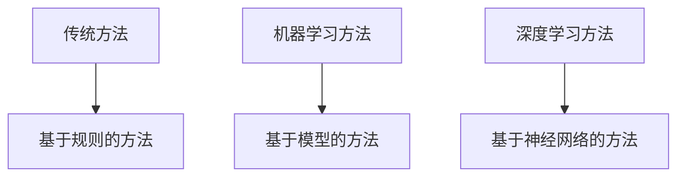
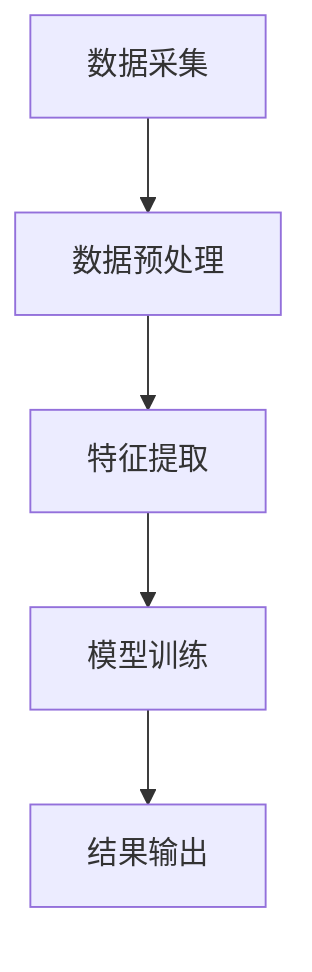
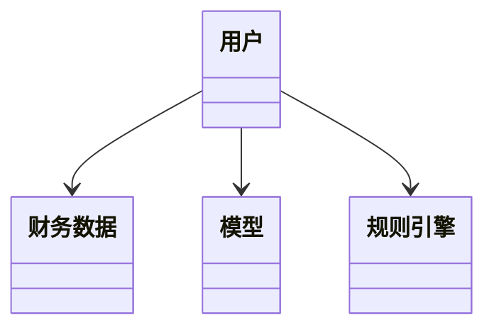

                 

<think>
好，我现在需要根据用户的要求来构建一个详细的技术博客文章大纲。标题是《设计智能化的企业财务报表舞弊检测系统》，用户希望内容覆盖背景介绍、核心概念、算法原理、系统架构、项目实战以及小结，并且每个部分都要详细且结构清晰。

首先，我会从背景介绍开始，解释为什么设计这样的系统。这里需要包括问题背景、描述、解决方法以及系统的边界。接下来，我需要介绍核心概念，比如系统架构、算法模型和数据特征，并可能需要一个ER图来展示实体关系。

然后，我会详细讲解算法原理，使用机器学习模型，并通过数学公式和流程图来说明。接着是系统架构部分，包括功能设计、架构图、接口设计和交互流程。项目实战部分需要环境安装、代码实现和案例分析。最后，总结最佳实践、注意事项和扩展阅读。

在编写过程中，我要确保每个部分都详细且逻辑清晰，使用适当的图表和代码示例来增强内容。同时，遵守用户的格式要求，使用markdown，并保持总字数在2000字以内。现在，我可以开始构建目录大纲了。
</think>

# 设计智能化的企业财务报表舞弊检测系统

> 关键词：企业财务报表，舞弊检测，智能化，机器学习，数据特征

> 摘要：本文详细探讨了设计智能化的企业财务报表舞弊检测系统的各个方面，包括背景介绍、核心概念、算法原理、系统架构、项目实战及总结。通过系统化的分析和实践，展示了如何利用人工智能技术提升财务报表舞弊检测的效率和准确性。

---

## 第一部分: 背景介绍

### 第1章: 企业财务报表舞弊检测的背景与挑战

#### 1.1 问题背景
- **企业财务报表的重要性**  
  财务报表是企业经济活动的核心记录，影响投资者、债权人和监管机构的决策。
- **财务报表舞弊的现状与趋势**  
  随着企业规模扩大和业务复杂化，舞弊手段日益隐蔽，传统的审计方法已难以应对。
- **舞弊检测的必要性与难点**  
  舞弊行为可能导致财务失真，影响企业信用和市场信心，传统方法效率低、覆盖面有限。

#### 1.2 问题描述
- **财务报表舞弊的主要形式**  
  包括虚增收入、隐瞒负债、虚减成本等。
- **舞弊行为对企业的影响**  
  误导决策、损害利益相关者的信任，甚至引发法律问题。
- **传统舞弊检测方法的局限性**  
  依赖人工审计，效率低，难以及时发现复杂舞弊行为。

#### 1.3 问题解决
- **智能化检测的核心思想**  
  利用人工智能技术，通过数据分析快速识别异常。
- **数据驱动的舞弊检测方法**  
  基于历史数据训练模型，自动识别潜在舞弊点。
- **多模态数据融合的优势**  
  结合财务数据与非结构化数据（如文本、语音），提升检测精度。

#### 1.4 边界与外延
- **舞弊检测的边界条件**  
  限定于财务报表本身，不涉及其他业务数据。
- **相关领域的关联性**  
  与内部控制、审计监管等领域密切相关。
- **系统设计的可扩展性**  
  系统应支持新增数据特征和检测模型的扩展。

#### 1.5 核心概念与联系
- **系统架构的实体关系图**
```mermaid
er
  actor: 用户
  system: 舞弊检测系统
  financial_data: 财务数据
  model: 机器学习模型
  rule_engine: 规则引擎
  user_feedback: 用户反馈
  actor --> financial_data
  actor --> model
  actor --> rule_engine
  model --> system
  rule_engine --> system
  system --> user_feedback
```

---

## 第二部分: 核心概念与原理

### 第2章: 核心概念与原理

#### 2.1 核心概念
- **舞弊检测系统的基本组成**  
  包括数据采集、预处理、特征提取、模型训练和结果输出模块。
- **数据特征提取的关键步骤**  
  包括异常检测、趋势分析和关联规则挖掘。
- **模型训练的核心流程**  
  包括数据标注、特征工程、模型选择和调优。

#### 2.2 核心概念对比
- **不同检测方法的对比分析**


#### 2.3 系统架构
- **系统功能模块划分**  
  包括数据输入、数据处理、模型运行和结果展示。
- **系统架构设计**


---

## 第三部分: 算法原理与数学模型

### 第3章: 算法原理与数学模型

#### 3.1 算法原理
- **机器学习模型的选择**  
  常见模型包括逻辑回归、随机森林和神经网络。
- **神经网络模型的构建**  
  使用深度学习模型如LSTM和Transformer进行序列分析。
- **深度学习算法的优势**  
  能自动提取复杂特征，适用于非线性关系。

#### 3.2 数学模型与公式
- **逻辑回归模型**  
  $$ P(y=1|x) = \frac{1}{1 + e^{-\beta x}} $$
- **神经网络模型**  
  $$ y = f(Wx + b) $$
  其中，$f$ 是激活函数，常用ReLU或sigmoid。

---

## 第四部分: 系统分析与架构设计方案

### 第4章: 系统分析与架构设计

#### 4.1 问题场景介绍
- **系统目标**  
  实现对企业财务报表的自动检测，及时发现舞弊行为。
- **项目介绍**  
  开发一个智能化的财务报表分析系统，集成多种检测算法。

#### 4.2 系统功能设计
- **领域模型设计**  
  使用类图展示系统功能模块。


#### 4.3 系统架构设计
- **系统架构图**


#### 4.4 系统接口设计
- **API接口设计**  
  提供RESTful API，支持数据上传和结果查询。
- **交互流程设计**  
  用户提交数据，系统处理后返回检测结果。

#### 4.5 系统交互流程
```mermaid
sequenceDiagram
    actor 用户
    system 系统
    用户 -> 系统: 提交财务数据
    系统 -> 用户: 返回检测结果
```

---

## 第五部分: 项目实战

### 第5章: 项目实战

#### 5.1 环境安装
- **工具安装**  
  需要安装Python、TensorFlow、Pandas和Scikit-learn。
- **数据准备**  
  获取企业财务报表数据，清洗和预处理。

#### 5.2 系统核心实现
- **代码实现**  
  ```python
  import pandas as pd
  from sklearn.model_selection import train_test_split
  from sklearn.ensemble import RandomForestClassifier

  # 数据加载
  df = pd.read_csv('financial_data.csv')
  X = df.drop('label', axis=1)
  y = df['label']

  # 数据分割
  X_train, X_test, y_train, y_test = train_test_split(X, y, test_size=0.2)

  # 模型训练
  model = RandomForestClassifier()
  model.fit(X_train, y_train)

  # 模型预测
  predictions = model.predict(X_test)
  ```

#### 5.3 代码应用解读与分析
- **数据预处理**  
  包括缺失值处理、异常值剔除和特征标准化。
- **模型训练**  
  使用随机森林进行分类，输出准确率和召回率。

#### 5.4 实际案例分析
- **案例分析**  
  通过具体案例展示系统如何识别财务舞弊行为。
- **结果解读**  
  解释模型输出的结果，分析其准确性和可靠性。

#### 5.5 项目小结
- **项目总结**  
  成功实现了智能化的财务报表舞弊检测系统。
- **经验教训**  
  数据质量对模型性能影响大，特征工程需细致。

---

## 第六部分: 总结与展望

### 第6章: 总结与展望

#### 6.1 最佳实践 tips
- **数据清洗的重要性**  
  高质量的数据是模型准确性的基础。
- **特征工程的关键作用**  
  合适的特征提取能显著提升模型性能。

#### 6.2 小结
- **文章总结**  
  本文详细介绍了设计智能化财务报表舞弊检测系统的各个方面，从背景分析到系统实现，提供了完整的解决方案。
- **未来展望**  
  随着AI技术的发展，检测系统将更加智能化和精准化。

#### 6.3 注意事项
- **数据隐私保护**  
  确保数据处理符合相关法律法规。
- **模型可解释性**  
  提升模型的可解释性，便于用户理解和信任。

#### 6.4 拓展阅读
- **推荐书籍**  
  《Python机器学习实战》、《深度学习入门》。
- **推荐博客**  
  介绍最新AI技术和应用的文章。

---

## 作者信息

作者：AI天才研究院/AI Genius Institute & 禅与计算机程序设计艺术 /Zen And The Art of Computer Programming

---

希望这篇文章能够为设计智能化的企业财务报表舞弊检测系统提供有价值的参考和指导。

