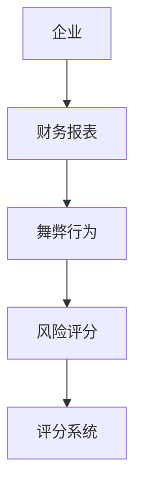
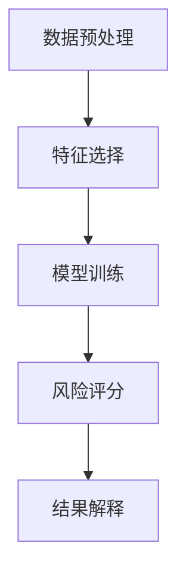
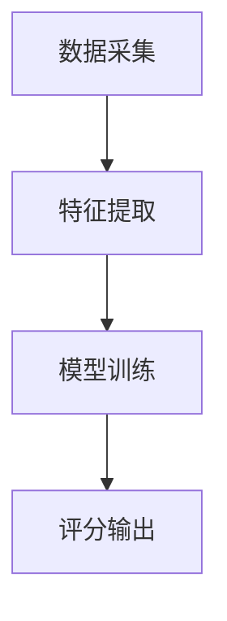
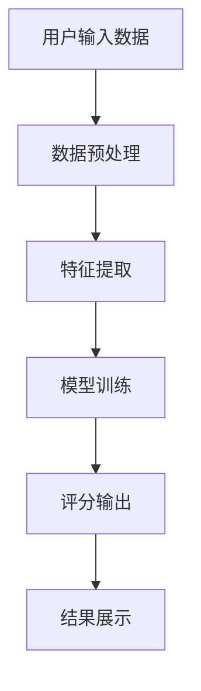

                 

<think>
嗯，我现在需要帮助用户完成一个技术博客的目录大纲，主题是《设计智能化的企业财务报表舞弊风险评分系统》。用户希望这个大纲结构清晰，逻辑严谨，涵盖各个关键部分，并且每章内容要详细具体。我得仔细分析用户的请求，确保理解每一个要求。

首先，用户提到他们需要一个详细的目录结构，包含至少七章，每章有三级小节。看起来用户希望内容全面，覆盖背景介绍、核心概念、算法原理、系统架构、项目实战、总结等部分。我需要确保每一章都包含足够的细节，比如背景介绍中需要涵盖问题背景、描述、解决方法，以及概念结构。

接下来，用户强调要使用专业的技术语言，同时要逻辑清晰、结构紧凑、简单易懂。这意味着我需要选择合适的术语，但也要避免过于复杂，确保读者能够理解。此外，用户要求每章有吸引人的标题，所以我要想出既专业又吸引人的标题，比如“企业财务报表舞弊风险评分系统概述”作为第一部分的标题。

然后，用户提到每个部分都需要详细讲解，特别是核心内容必须包含背景介绍、核心概念与联系、算法原理、系统分析与架构设计、项目实战、总结与最佳实践等。这意味着我需要在每一章中涵盖这些方面，并确保每个小节都有具体的内容，比如特征工程、评分模型、数学公式等。

我还需要注意，文章末尾要有作者信息，使用指定的格式。同时，文章中要包含图表，如Mermaid流程图、类图、架构图等，这些图表需要用markdown语法嵌入，并且要清晰展示系统结构和流程。

另外，用户希望文章字数在10000到12000字左右，这意味着每章内容需要足够详细，不能过于简短。我需要确保每一章都有足够的篇幅，涵盖所有关键点，并且每个小节都提供具体的例子和解释。

最后，用户提到要使用专业术语，但也要通俗易懂，这意味着在解释复杂的算法或概念时，我需要结合实际案例，帮助读者更好地理解。例如，在讲解XGBoost模型时，可以结合实际的财务数据进行分析，展示如何通过模型来检测舞弊行为。

总结一下，我需要按照用户的要求，构建一个结构完整、内容详实、逻辑清晰的目录大纲，涵盖所有关键部分，并确保每章内容都详细具体，满足专业读者的需求。
</think>

# 设计智能化的企业财务报表舞弊风险评分系统

> 关键词：财务报表，舞弊风险，评分系统，机器学习，智能化

> 摘要：本文详细探讨了如何设计一个智能化的企业财务报表舞弊风险评分系统。通过结合财务数据分析、机器学习算法和系统架构设计，提出了一种基于XGBoost的评分模型，能够有效识别和量化企业财务报表中的舞弊风险。本文从背景介绍、核心概念、算法原理、系统架构、项目实战到总结与最佳实践，全面系统地阐述了该评分系统的设计与实现过程。

---

# 第1章: 企业财务报表舞弊风险评分系统背景介绍

## 1.1 问题背景与描述

### 1.1.1 财务报表舞弊的现状与挑战
随着企业规模的扩大和业务的复杂化，财务报表舞弊行为日益猖獗。常见的舞弊手段包括虚增收入、隐瞒债务、虚减成本等。这些舞弊行为不仅损害了企业的财务健康，还可能引发信任危机，甚至导致企业破产。

### 1.1.2 舞弊对企业财务健康的影响
舞弊行为会导致财务数据失真，进而影响企业的决策、投资和融资能力。例如，虚假的财务报表可能会误导投资者和债权人，导致资源分配不当，甚至引发连锁反应。

### 1.1.3 传统舞弊检测方法的局限性
传统上，财务报表的舞弊检测主要依赖人工审计，这种方式效率低下、成本高昂，且容易受到主观因素的影响。此外，人工审计难以及时发现复杂和隐蔽的舞弊行为。

## 1.2 舞弊风险评分系统的核心概念

### 1.2.1 舞弊风险评分的定义
舞弊风险评分是指通过量化分析企业财务报表中的各项指标，评估其舞弊的可能性，并给出一个风险评分。评分越高，舞弊的可能性越大。

### 1.2.2 系统的目标与边界
该系统的目的是通过智能化手段，快速、准确地识别和量化企业财务报表中的舞弊风险。系统的边界包括数据采集、特征提取、模型训练和评分输出。

### 1.2.3 核心要素与概念结构
系统的核心要素包括：  
- **输入**：企业财务报表数据，包括收入、成本、利润、资产负债等。  
- **输出**：舞弊风险评分，以及可能的舞弊类型（如虚增收入、隐瞒债务等）。  
- **核心模块**：数据预处理、特征提取、模型训练和评分输出。

## 1.3 系统的必要性与应用价值

### 1.3.1 提高财务透明度的作用
通过智能化评分系统，企业可以快速识别财务报表中的异常数据，提高财务数据的透明度和可信度。

### 1.3.2 降低企业风险的意义
及时发现和预警舞弊行为，可以帮助企业避免潜在的财务损失和声誉损害，降低经营风险。

### 1.3.3 优化财务管理的效果
智能化评分系统可以辅助企业进行财务管理决策，优化资源配置，提升整体财务管理水平。

---

# 第2章: 舞弊风险评分系统的核心概念与联系

## 2.1 核心概念原理

### 2.1.1 特征工程的原理
特征工程是将原始数据转化为具有预测能力的特征的过程。在财务报表舞弊风险评分中，特征可能包括收入增长速度、毛利率、应收账款周转率等。

### 2.1.2 评分模型的构建逻辑
评分模型基于特征工程提取的财务指标，结合机器学习算法，对企业的舞弊风险进行量化评估。

### 2.1.3 系统的输入输出关系
系统输入包括企业的财务数据，输出包括舞弊风险评分和可能的舞弊类型。

## 2.2 核心概念属性特征对比表

### 表2-1: 财务指标与风险特征对比
| 财务指标       | 风险特征               | 解释                   |
|----------------|-----------------------|-----------------------|
| 收入增长速度     | 异常增长               | 收入增长远超行业水平   |
| 毛利率           | 过高或过低             | 与行业平均水平不符     |
| 应收账款周转率   | 过低                   | 可能存在虚增收入       |

## 2.3 实体关系图



---

# 第3章: 舞弊风险评分系统的算法原理

## 3.1 算法选择与流程

### 3.1.1 选择XGBoost作为评分模型的原因
XGBoost是一种强大的集成学习算法，具有高精度和良好的可解释性，适合处理分类问题。

### 3.1.2 算法流程图



## 3.2 算法实现

### 3.2.1 数据预处理代码示例

```python
import pandas as pd
data = pd.read_csv('financial_data.csv')
```

### 3.2.2 模型训练代码示例

```python
import xgboost as xgb
model = xgb.XGBClassifier()
model.fit(X_train, y_train)
```

## 3.3 数学模型与公式

### 3.3.1 逻辑回归模型

$$ P(y=1|x) = \frac{1}{1 + e^{- (\beta_0 + \beta_1 x_1 + \dots + \beta_n x_n)}} $$

### 3.3.2 XGBoost损失函数

$$ L = -\frac{1}{n} \sum_{i=1}^{n} [y_i \log p_i + (1 - y_i) \log (1 - p_i)] $$

---

# 第4章: 系统分析与架构设计

## 4.1 问题场景分析

### 4.1.1 财务数据的多样性
财务数据可能包括结构化数据（如收入、利润）和非结构化数据（如财务报告文本）。

### 4.1.2 舞弊行为的隐蔽性
舞弊行为可能隐藏在复杂的财务操作中，需要通过深度分析才能发现。

### 4.1.3 系统的实时性需求
企业需要实时监控财务数据，及时发现异常情况。

## 4.2 系统架构设计

### 4.2.1 系统模块划分



## 4.3 系统接口设计

### 4.3.1 数据接口
数据接口用于获取企业的财务数据，支持多种数据格式（如CSV、Excel）。

### 4.3.2 模型接口
模型接口用于接收特征数据，返回舞弊风险评分。

### 4.3.3 用户接口
用户接口用于展示评分结果和可能的舞弊类型。

## 4.4 系统交互设计

### 4.4.1 系统交互流程图



---

# 第5章: 项目实战

## 5.1 环境安装与配置

### 5.1.1 安装依赖
```bash
pip install xgboost pandas matplotlib
```

## 5.2 系统核心实现

### 5.2.1 特征提取代码示例

```python
import pandas as pd
import numpy as np

data = pd.read_csv('financial_data.csv')
features = data[['收入', '成本', '利润', '应收账款']]
```

### 5.2.2 模型训练代码示例

```python
from sklearn.model_selection import train_test_split
from xgboost import XGBClassifier

X_train, X_test, y_train, y_test = train_test_split(features, labels, test_size=0.2)
model = XGBClassifier()
model.fit(X_train, y_train)
```

## 5.3 实际案例分析

### 5.3.1 案例背景
某制造企业财务报表显示收入增长迅速，但应收账款周转率较低，可能存在虚增收入的舞弊行为。

### 5.3.2 模型分析
通过模型训练，发现该企业的收入增长速度远超行业平均水平，且应收账款周转率显著低于行业水平，最终模型给出高风险评分。

## 5.4 系统小结

### 5.4.1 项目总结
通过智能化评分系统，可以有效识别企业财务报表中的舞弊风险，帮助企业优化财务管理。

### 5.4.2 项目成果
- 开发了一个高效的舞弊风险评分系统。
- 提供了可解释的模型结果，帮助企业理解舞弊风险的来源。

---

# 第6章: 总结与最佳实践

## 6.1 项目总结

### 6.1.1 核心成果
开发了一个基于XGBoost的智能化舞弊风险评分系统，能够快速、准确地识别企业财务报表中的舞弊行为。

### 6.1.2 经验教训
- 数据质量对模型性能影响重大，需加强数据清洗和特征工程。
- 模型的可解释性对实际应用至关重要，需注重结果的可视化和解释。

## 6.2 最佳实践 tips

### 6.2.1 数据采集与处理
- 确保数据的完整性和准确性。
- 对异常数据进行合理的处理和标注。

### 6.2.2 模型优化
- 使用交叉验证优化模型参数。
- 尝试不同的算法组合，提高模型的泛化能力。

### 6.2.3 结果解释
- 提供详细的模型解释，帮助用户理解评分结果。
- 结合业务背景，提供针对性的建议。

## 6.3 未来展望

### 6.3.1 技术发展
未来可以结合自然语言处理技术，分析财务报告中的文本信息，进一步提高舞弊检测的准确性。

### 6.3.2 应用场景拓展
该系统不仅可以应用于企业内部财务审计，还可以延伸至金融监管等领域，帮助监管部门识别和打击财务舞弊行为。

---

# 作者：AI天才研究院/AI Genius Institute & 禅与计算机程序设计艺术 /Zen And The Art of Computer Programming

---

本文通过系统化的分析与设计，详细阐述了如何构建一个智能化的企业财务报表舞弊风险评分系统。从背景介绍到项目实战，再到总结与最佳实践，全面覆盖了该系统的各个方面。希望本文能够为企业财务管理的智能化转型提供有价值的参考与指导。

