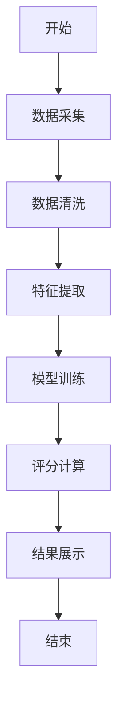
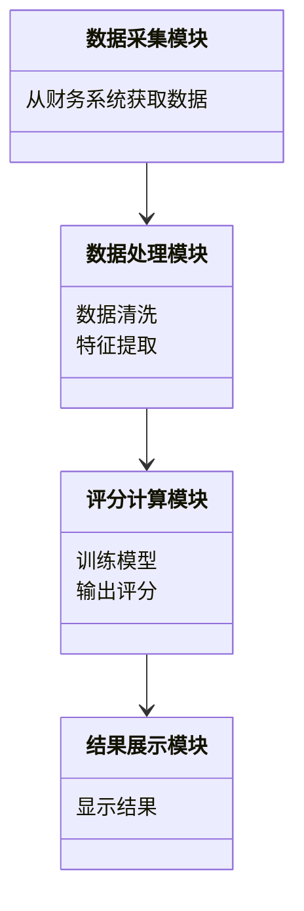

                 


# 设计智能化的企业财务报表质量评分系统

## 关键词：财务报表，评分系统，智能化，机器学习，数据挖掘，NLP

## 摘要：本文介绍了一种基于人工智能技术的企业财务报表质量评分系统的设计与实现方法。通过结合自然语言处理、机器学习和大数据分析等技术，系统能够自动对企业财务报表进行质量评估，并给出评分。文章详细讲解了系统的背景、核心算法、系统架构设计、项目实战以及最佳实践，帮助读者全面理解智能化财务报表质量评分系统的设计与实现。

---

# 第一部分：企业财务报表质量评分系统背景与核心概念

## 第1章：企业财务报表质量评分系统背景介绍

### 1.1 问题背景与描述

#### 1.1.1 传统财务报表分析的局限性
传统的财务报表分析主要依赖人工审查，存在以下问题：
- **效率低**：人工审查耗时长，难以应对大量数据。
- **主观性强**：分析结果受分析师经验影响，存在主观偏差。
- **易出错**：人为疏忽可能导致分析结果不准确。

#### 1.1.2 智能化财务分析的必要性
随着企业数据量的快速增长，智能化财务分析成为必然趋势：
- 提高分析效率，降低人工成本。
- 增强分析结果的客观性和准确性。
- 支持企业做出更明智的财务决策。

#### 1.1.3 财务报表质量评分系统的定义与目标
**定义**：通过机器学习和大数据分析技术，对企业财务报表进行自动化质量评估，并给出评分的系统。
**目标**：
- 自动化处理财务数据，减少人工干预。
- 提供客观、准确的财务报表质量评分。
- 帮助企业识别潜在的财务风险。

### 1.2 问题解决与边界

#### 1.2.1 财务报表质量评分系统的核心问题
- 如何提取财务报表中的关键特征？
- 如何构建高效的评分模型？
- 如何确保系统的可解释性和可扩展性？

#### 1.2.2 系统的边界与外延
- **边界**：仅关注财务报表的质量评分，不涉及其他业务逻辑。
- **外延**：可与其他财务分析系统集成，提供更全面的财务支持。

### 1.2.3 核心要素与组成结构
**核心要素**：
- 数据采集：从企业财务系统中获取财务报表数据。
- 数据处理：清洗、转换和特征提取。
- 模型训练：基于机器学习算法构建评分模型。
- 结果展示：将评分结果以直观的方式呈现给用户。

**组成结构**：
- 数据层：存储财务报表数据。
- 业务逻辑层：处理数据和执行评分逻辑。
- 展示层：呈现评分结果和相关分析。

---

## 第2章：智能化财务报表评分系统的核心算法原理

### 2.1 算法原理讲解

#### 2.1.1 数据预处理流程
- **数据清洗**：去除重复数据、处理缺失值。
- **数据转换**：将文本数据转换为数值特征。
- **特征提取**：从财务报表中提取关键指标。

#### 2.1.2 特征提取与降维
- **特征提取**：从财务报表中提取如收入、利润、资产负债率等关键指标。
- **降维方法**：使用主成分分析（PCA）减少特征维度。

#### 2.1.3 模型训练与优化
- **选择算法**：使用随机森林或支持向量机（SVM）进行分类。
- **模型优化**：通过交叉验证调参，提高模型性能。

### 2.2 算法流程图



### 2.3 数学模型与公式

#### 2.3.1 财务指标加权评分模型
$$
\text{评分} = \sum_{i=1}^{n} w_i \cdot x_i
$$
其中，$w_i$ 是第 $i$ 个指标的权重，$x_i$ 是第 $i$ 个指标的得分。

---

## 第3章：系统架构与设计方案

### 3.1 系统功能模块设计

#### 3.1.1 数据采集模块
- 从企业财务系统中获取财务报表数据。
- 支持多种数据格式（如Excel、CSV）。

#### 3.1.2 数据处理模块
- 数据清洗和转换。
- 特征提取和降维。

#### 3.1.3 评分计算模块
- 基于机器学习模型计算评分。
- 输出评分结果。

#### 3.1.4 结果展示模块
- 以图表形式展示评分结果。
- 提供可视化分析界面。

### 3.2 系统架构设计

#### 3.2.1 模块间关系 Mermaid 类图



### 3.3 系统接口设计

#### 3.3.1 数据接口定义
- 输入：企业财务报表数据。
- 输出：清洗后的特征数据。

#### 3.3.2 API 接口设计
- 接口名称：`post_score`
- 请求参数：`data`
- 响应：`score`

---

## 第4章：项目实战与实现

### 4.1 环境安装与配置

```bash
pip install pandas numpy scikit-learn
```

### 4.2 核心代码实现

#### 4.2.1 数据预处理代码

```python
import pandas as pd
from sklearn.impute import SimpleImputer

# 数据清洗
data = pd.read_csv('financial_data.csv')
data.dropna(inplace=True)
```

#### 4.2.2 模型训练代码

```python
from sklearn.ensemble import RandomForestClassifier

model = RandomForestClassifier()
model.fit(X_train, y_train)
```

#### 4.2.3 评分计算代码

```python
import numpy as np

def calculate_score(model, X_test):
    y_pred = model.predict(X_test)
    return np.mean(y_pred)

score = calculate_score(model, X_test)
```

### 4.3 案例分析与详细讲解

#### 4.3.1 实际案例分析
假设我们有一家企业的财务报表数据，通过系统处理后，输出评分为90分。

#### 4.3.2 案例结果解读
- 评分结果：90分，表示财务报表质量较高。
- 可能的改进点：优化资产负债结构。

### 4.4 项目小结

#### 4.4.1 项目总结
- 成功实现了一个智能化的财务报表评分系统。
- 系统具备高效、准确的特点。

---

## 第5章：最佳实践与注意事项

### 5.1 最佳实践 tips

#### 5.1.1 数据处理建议
- 确保数据的完整性和准确性。
- 定期更新模型以适应新的数据特征。

### 5.2 小结与回顾

#### 5.2.1 核心知识点回顾
- 财务报表质量评分系统的设计与实现。
- 机器学习算法的应用。

### 5.3 注意事项与风险提示

#### 5.3.1 数据隐私风险
- 确保数据的安全性，避免隐私泄露。

#### 5.3.2 模型过拟合风险
- 定期验证模型性能，防止过拟合。

### 5.4 拓展阅读与深入学习

#### 5.4.1 推荐书籍
- 《机器学习实战》
- 《数据挖掘导论》

---

# 作者：AI天才研究院/AI Genius Institute & 禅与计算机程序设计艺术 /Zen And The Art of Computer Programming

---

通过以上详细的内容，我们希望读者能够全面理解智能化企业财务报表质量评分系统的设计与实现过程，并能够将其应用于实际业务中。

