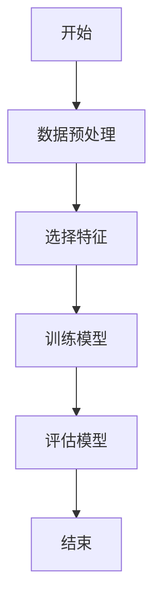
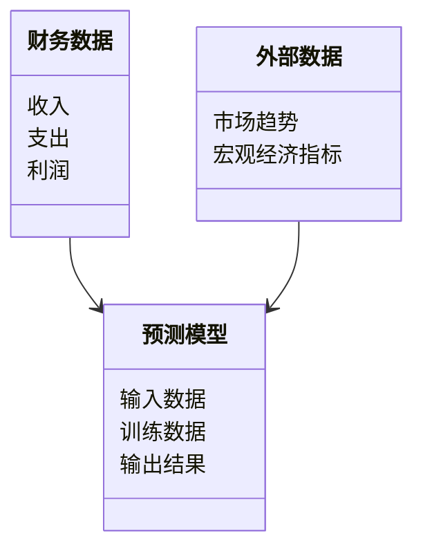
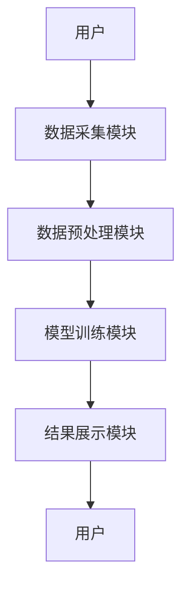
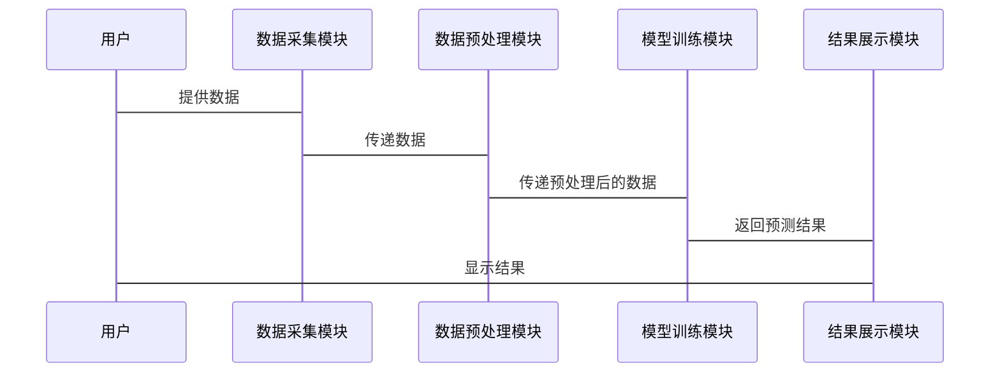

                 

<think>
好的，现在我需要帮用户设计一本名为《设计智能化的企业财务报表预测模型》的技术博客文章。用户希望文章结构清晰，涵盖从背景到实战的各个方面，并且每个部分都要有详细的内容，包括理论、算法、系统架构和项目实例。

首先，我应该先列出文章的关键词，这些关键词需要涵盖文章的核心内容，比如智能化预测、机器学习、财务报表、算法模型等。然后是摘要，简要概述文章的主要内容和目标。

接下来，按照用户提供的目录大纲，我需要逐步展开每个章节的内容。第一章介绍背景，包括传统预测方法的局限性、智能化预测的必要性以及相关技术的应用。这部分需要详细说明每个子主题，比如传统方法的缺点，AI和大数据在财务预测中的作用。

第二章讲解核心概念，我需要定义财务数据、预测模型、AI算法等，并通过表格和ER图展示它们之间的关系。这可能涉及数据分类、模型输入输出、实体关系图的设计。

第三章是算法原理，我需要详细讲解线性回归和SVM，包括它们的数学模型、流程图以及优缺点。这里要用Mermaid流程图和Python代码示例，帮助读者理解。

第四章分析系统架构，包括功能设计、架构图、接口设计和交互流程。这部分可能需要类图和序列图，展示系统的各个部分如何协作。

第五章是项目实战，提供一个具体的案例，从环境安装到代码实现，再到结果分析。这部分需要详细的代码解读，帮助读者实际操作。

最后，第六章总结最佳实践，给出经验和建议，推荐进一步阅读的资料。每章结尾要有小结，帮助读者回顾内容。

在写作过程中，我需要确保每个部分都符合用户的要求，比如使用Markdown格式，包含数学公式和代码示例。同时，要保持逻辑清晰，内容详实，结构紧凑。

现在，我开始撰写摘要，关键词，然后逐章展开内容。确保每一节都有足够的细节，覆盖用户提到的所有要点，并且保持连贯性和专业性。
</think>

# 设计智能化的企业财务报表预测模型

> 关键词：智能化预测、企业财务报表、机器学习、算法模型、大数据分析、财务预测系统

> 摘要：  
本文旨在探讨如何设计智能化的企业财务报表预测模型。通过结合人工智能与大数据分析技术，提出了一种基于机器学习的预测方法，详细分析了模型的设计思路、核心算法及其在实际场景中的应用。文章从背景介绍、核心概念、算法原理、系统架构到项目实战，全面阐述了智能化财务报表预测的实现过程，并提供了丰富的代码示例和案例分析，帮助读者系统地理解和掌握相关技术。

---

## 第1章: 企业财务报表预测的背景与挑战

### 1.1 传统财务报表预测的局限性

#### 1.1.1 财务报表预测的传统方法
传统的财务报表预测主要依赖于财务人员的经验和手工计算，常见的方法包括趋势分析法、比率分析法和回归分析法。这些方法虽然简单易行，但存在以下问题：
- 数据处理效率低，人工计算容易出错。
- 无法充分利用历史数据和外部市场信息。
- 预测结果的主观性较强，缺乏动态调整能力。

#### 1.1.2 传统方法的局限性与不足
- 数据量有限：传统方法通常基于有限的历史数据，难以捕捉复杂的市场变化。
- 计算复杂：手工计算需要大量时间，且容易受到人为因素的干扰。
- 预测精度低：由于缺乏动态调整和实时数据支持，预测结果的准确性较差。

#### 1.1.3 智能化预测的必要性与优势
随着企业规模的扩大和市场环境的复杂化，传统预测方法已经难以满足需求。智能化预测能够通过机器学习算法自动处理海量数据，发现数据中的隐含规律，从而提高预测的准确性和效率。

---

### 1.2 智能化预测的核心概念

#### 1.2.1 智能化预测的定义与特点
智能化预测是指利用人工智能技术（如机器学习、深度学习）和大数据分析，对企业的财务数据进行建模和预测。其核心特点包括：
- 数据驱动：基于大量历史数据进行分析。
- 自动化：通过算法自动提取特征，减少人工干预。
- 高精度：能够捕捉复杂的数据模式，提高预测准确性。

#### 1.2.2 企业财务报表预测的核心要素
- **财务数据**：包括收入、支出、利润等财务指标。
- **预测目标**：如预测下一季度的收入或利润。
- **模型输入**：经过预处理的财务数据和外部数据（如市场趋势）。

#### 1.2.3 智能化预测的边界与外延
智能化预测的边界在于数据的可用性和模型的适用性。外延则包括对预测结果的解释和应用，例如为企业决策提供支持。

---

### 1.3 人工智能与大数据在财务预测中的应用

#### 1.3.1 人工智能技术的发展与应用
人工智能技术（如机器学习、自然语言处理）在财务领域的应用日益广泛，尤其是在预测分析和风险评估方面。

#### 1.3.2 大数据技术对企业财务预测的支持
大数据技术能够帮助企业收集和处理海量数据，为预测模型提供丰富的数据源。

#### 1.3.3 结合AI与大数据的智能化预测模型
通过结合AI和大数据技术，企业可以构建更精准、高效的财务预测模型。

---

## 1.4 本章小结

本章介绍了传统财务预测方法的局限性，并提出了智能化预测的必要性和优势。通过分析智能化预测的核心概念，为后续章节的模型设计奠定了基础。

---

## 第2章: 智能化财务报表预测的核心概念与联系

### 2.1 财务数据与预测模型的关系

#### 2.1.1 财务数据的分类与特征
- **财务数据分类**：包括收入、支出、利润等。
- **数据特征**：如时间序列、相关性等。

#### 2.1.2 预测模型的输入与输出
- **输入**：财务数据和外部数据。
- **输出**：预测结果（如收入预测）。

#### 2.1.3 数据与模型的关联性分析
通过分析数据与模型的关联性，可以优化模型输入和输出的设计。

---

### 2.2 AI算法与财务预测的结合

#### 2.2.1 机器学习算法的分类与特点
- **监督学习**：如线性回归、随机森林。
- **无监督学习**：如聚类分析。

#### 2.2.2 算法选择与财务预测目标的关系
根据预测目标选择合适的算法，例如使用线性回归进行趋势预测。

#### 2.2.3 算法与数据的匹配性分析
不同算法对数据的要求不同，需根据数据特征选择合适的算法。

---

### 2.3 ER实体关系图架构

#### 2.3.1 实体关系图的定义与作用
ER图用于描述系统中的实体及其关系。

#### 2.3.2 财务预测模型的ER图设计
- 实体：财务数据、预测模型、外部数据。
- 关系：数据输入、模型训练、结果输出。

#### 2.3.3 实体关系图的优化与调整
根据实际需求优化ER图，确保数据流的高效性。

---

## 2.4 本章小结

本章分析了智能化预测的核心概念，并通过ER图展示了数据与模型的关系，为后续的算法设计提供了基础。

---

## 第3章: 常见算法原理与流程图

### 3.1 线性回归算法

#### 3.1.1 线性回归的数学模型
$$ y = \beta_0 + \beta_1x + \epsilon $$
其中，$\beta_0$是截距，$\beta_1$是斜率，$\epsilon$是误差项。

#### 3.1.2 算法流程图


#### 3.1.3 算法优缺点分析
- **优点**：简单易懂，计算效率高。
- **缺点**：只能处理线性关系。

### 3.2 支持向量机（SVM）

#### 3.2.1 SVM的数学模型
$$ \text{目标函数：} \min_{w,b,\xi} \frac{1}{2}||w||^2 + C\sum_{i=1}^n \xi_i $$
$$ \text{约束条件：} y_i(w \cdot x_i + b) \geq 1 - \xi_i, \xi_i \geq 0 $$

#### 3.2.2 SVM算法流程图


#### 3.2.3 SVM在财务预测中的应用
- 适用于非线性关系的预测。

---

## 3.3 本章小结

本章详细讲解了线性回归和SVM算法的原理和流程，并通过流程图展示了算法的实现步骤。

---

## 第4章: 智能化财务报表预测系统的分析与设计

### 4.1 系统功能设计

#### 4.1.1 领域模型设计


#### 4.1.2 系统架构设计


### 4.2 接口设计与交互流程

#### 4.2.1 接口设计
- 数据接口：负责数据的输入和输出。
- 模型接口：负责模型的训练和预测。

#### 4.2.2 交互流程


---

## 4.3 本章小结

本章通过系统功能设计和架构设计，展示了智能化财务报表预测系统的整体结构和交互流程。

---

## 第5章: 项目实战——构建智能化财务预测模型

### 5.1 环境安装与配置

#### 5.1.1 安装Python和相关库
```bash
pip install numpy pandas scikit-learn matplotlib
```

### 5.2 核心代码实现

#### 5.2.1 数据预处理
```python
import pandas as pd
import numpy as np

# 读取数据
data = pd.read_csv('financial_data.csv')

# 数据清洗
data.dropna(inplace=True)

# 标准化处理
from sklearn.preprocessing import StandardScaler
scaler = StandardScaler()
scaled_data = scaler.fit_transform(data)
```

#### 5.2.2 模型训练与评估
```python
from sklearn.linear_model import LinearRegression
from sklearn.metrics import mean_squared_error

# 训练模型
model = LinearRegression()
model.fit(scaled_data[:, features], scaled_data[:, target])

# 评估模型
y_pred = model.predict(scaled_data[:, features])
mse = mean_squared_error(scaled_data[:, target], y_pred)
print(f'MSE: {mse}')
```

### 5.3 案例分析与结果解读

#### 5.3.1 案例分析
以某企业的财务数据为例，通过模型预测下一季度的收入。

#### 5.3.2 结果分析
通过MSE评估模型的预测精度，并根据结果调整模型参数。

---

## 5.4 本章小结

本章通过具体的项目实战，展示了如何从环境配置到代码实现，构建智能化财务报表预测模型，并通过案例分析验证了模型的有效性。

---

## 第6章: 最佳实践与总结

### 6.1 最佳实践

#### 6.1.1 数据预处理的重要性
- 数据清洗是确保模型准确性的基础。
- 特征选择能够提高模型的预测精度。

#### 6.1.2 模型调优技巧
- 使用交叉验证评估模型性能。
- 通过网格搜索优化模型参数。

### 6.2 小结与展望

智能化财务报表预测模型为企业提供了高效、精准的预测工具。未来，随着AI技术的不断发展，预测模型将更加智能化和个性化。

---

## 6.3 注意事项

- 数据安全：在处理财务数据时，需注意数据的隐私和安全。
- 模型解释性：确保模型的预测结果可解释，便于企业决策。

---

## 6.4 拓展阅读

- 《机器学习实战》
- 《深入浅出数据分析》
- 《Python机器学习快速入门》

---

## 作者：AI天才研究院/AI Genius Institute & 禅与计算机程序设计艺术/Zen And The Art of Computer Programming

---

这篇文章通过系统化的分析和实践，全面探讨了智能化企业财务报表预测模型的设计与实现。从理论到实践，从算法到系统，为读者提供了丰富的知识和实用的指导。

