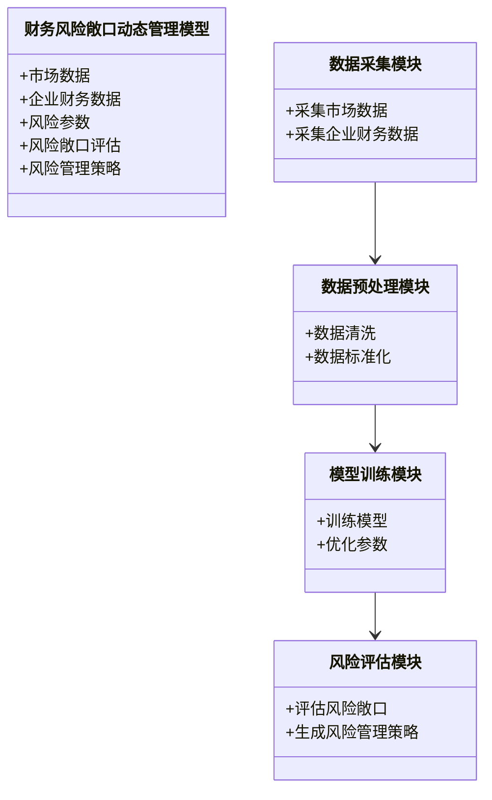
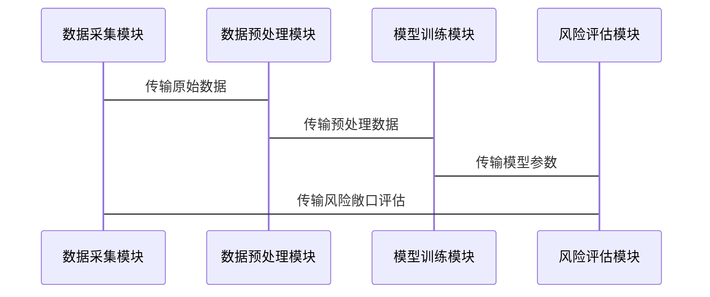

                 


# 设计智能化的企业财务风险敞口动态管理模型

> 关键词：企业财务风险管理，动态管理模型，风险敞口，算法原理，系统架构，项目实战

> 摘要：本文旨在设计一个智能化的企业财务风险敞口动态管理模型，通过详细分析财务风险敞口的定义、特点及其与动态管理模型的关系，结合先进的算法和系统架构设计，构建一个能够实时监控和调整企业财务风险的智能化管理系统。本文从背景介绍、核心概念、算法原理、系统架构到项目实战，层层深入，为企业财务风险管理提供理论依据和实践指导。

---

# 第一部分: 背景介绍与核心概念

## 第1章: 财务风险敞口动态管理模型的背景与意义

### 1.1 财务风险敞口的定义与特点

#### 1.1.1 财务风险敞口的定义
财务风险敞口是指企业在经营过程中由于内外部因素的变化，可能面临的财务损失或收益波动的潜在风险。它反映了企业在特定市场条件下的财务脆弱性。

#### 1.1.2 财务风险敞口的核心特点
- **动态性**：受市场波动、政策变化等因素影响，实时变化。
- **复杂性**：涉及多种财务指标和业务场景，相互关联。
- **可量化性**：通过财务指标和模型进行量化分析。

#### 1.1.3 财务风险敞口与企业经营的关系
财务风险敞口直接影响企业的财务健康和经营稳定性，是企业风险管理的核心内容。

### 1.2 动态管理模型的定义与特点

#### 1.2.1 动态管理模型的定义
动态管理模型是一种能够根据实时数据和市场变化，动态调整企业财务风险管理策略的系统。

#### 1.2.2 动态管理模型的核心特点
- **实时性**：能够实时采集和处理财务数据。
- **自适应性**：根据市场变化自动调整风险管理策略。
- **智能化**：结合人工智能技术，实现智能预测和决策。

### 1.3 企业财务风险敞口动态管理模型的背景与意义

#### 1.3.1 当前企业财务管理面临的挑战
- 市场波动频繁，企业面临的风险日益复杂。
- 传统静态模型难以应对动态变化的市场环境。
- 数据量大，人工分析效率低下。

#### 1.3.2 动态管理模型的提出背景
随着企业全球化和数字化的发展，传统静态的财务风险管理模型已无法满足需求，动态管理模型应运而生。

#### 1.3.3 动态管理模型对企业财务管理的意义
- 提高企业风险管理的实时性和准确性。
- 降低企业的财务风险敞口，保障财务健康。
- 为企业决策提供数据支持，提升竞争力。

### 1.4 本章小结
本章从财务风险敞口的定义、特点出发，结合动态管理模型的定义和特点，阐述了动态管理模型的背景和意义。

---

## 第2章: 企业财务风险敞口动态管理模型的核心概念

### 2.1 财务风险敞口的核心要素

#### 2.1.1 财务风险敞口的主要构成
- **资产风险**：企业资产的价值波动带来的风险。
- **负债风险**：企业债务的偿还风险。
- **现金流风险**：企业现金流的波动带来的风险。

#### 2.1.2 财务风险敞口的分类与特征
- **短期风险**：短期资产和负债的流动性风险。
- **长期风险**：长期资产和负债的期限风险。
- **信用风险**：交易对手违约带来的风险。

#### 2.1.3 财务风险敞口的量化方法
- **VaR（在险价值）**：衡量潜在损失的指标。
- **压力测试**：评估极端市场条件下的风险敞口。
- **敏感性分析**：分析关键财务指标对风险敞口的影响。

### 2.2 动态管理模型的关键属性

#### 2.2.1 模型的输入变量
- 市场数据（如股价、汇率、利率）。
- 企业财务数据（如资产负债表、利润表）。
- 风险参数（如波动率、相关性）。

#### 2.2.2 模型的输出变量
- 风险敞口的实时评估。
- 风险管理建议（如调整资产配置、优化负债结构）。
- 风险预警信号。

#### 2.2.3 模型的动态调整机制
- 根据市场变化自动调整模型参数。
- 定期更新数据和模型。
- 实时反馈和优化。

### 2.3 财务风险敞口与动态管理模型的关系

#### 2.3.1 财务风险敞口对模型的影响
- 风险敞口的变化直接影响模型的输入变量。
- 模型根据风险敞口的变化调整风险管理策略。

#### 2.3.2 模型对财务风险敞口的反馈作用
- 模型输出的风险管理建议帮助企业降低风险敞口。
- 模型的反馈机制优化风险敞口的动态管理。

#### 2.3.3 两者关系的数学表达式
$$ \text{风险敞口} = f(\text{市场数据}, \text{企业财务数据}) $$
$$ \text{风险管理策略} = g(\text{风险敞口}, \text{风险参数}) $$

### 2.4 本章小结
本章详细分析了财务风险敞口的核心要素和动态管理模型的关键属性，并探讨了两者之间的关系。

---

## 第3章: 企业财务风险敞口动态管理模型的算法原理

### 3.1 算法概述

#### 3.1.1 算法的基本原理
动态管理模型基于机器学习算法，实时分析财务数据和市场数据，预测风险敞口并生成风险管理策略。

#### 3.1.2 算法的输入与输出
- **输入**：市场数据、企业财务数据。
- **输出**：风险敞口评估、风险管理建议。

#### 3.1.3 算法的实现步骤
1. 数据采集与预处理。
2. 模型训练与优化。
3. 风险评估与策略生成。

### 3.2 算法的数学模型

#### 3.2.1 模型的数学表达式
$$ \text{风险敞口} = \alpha \times \text{市场风险} + \beta \times \text{信用风险} + \gamma \times \text{流动性风险} $$
其中，$\alpha + \beta + \gamma = 1$。

#### 3.2.2 模型的变量定义
- $\alpha$：市场风险的权重。
- $\beta$：信用风险的权重。
- $\gamma$：流动性风险的权重。

#### 3.2.3 模型的优化方法
- 使用梯度下降法优化权重系数。
- 通过历史数据验证模型的有效性。

### 3.3 算法的实现流程

#### 3.3.1 数据预处理
- 数据清洗：处理缺失值、异常值。
- 数据标准化：归一化处理。

#### 3.3.2 模型训练
- 使用历史数据训练模型。
- 调整模型参数以优化预测精度。

#### 3.3.3 模型评估
- 使用测试数据评估模型的准确性和稳定性。

### 3.4 算法的代码实现

#### 3.4.1 环境安装
- Python 3.8及以上版本。
- 安装必要的库：numpy、pandas、scikit-learn。

#### 3.4.2 核心代码
```python
import numpy as np
import pandas as pd
from sklearn.linear_model import LinearRegression

# 数据预处理
data = pd.read_csv('financial_data.csv')
X = data[['market_risk', 'credit_risk', 'liquidity_risk']]
y = data['exposure']

# 模型训练
model = LinearRegression()
model.fit(X, y)

# 风险评估与策略生成
def calculate_exposure(market_risk, credit_risk, liquidity_risk):
    prediction = model.predict([[market_risk, credit_risk, liquidity_risk]])
    return prediction[0]

# 示例
market_risk = 0.8
credit_risk = 0.2
liquidity_risk = 0.5
exposure = calculate_exposure(market_risk, credit_risk, liquidity_risk)
print(f'预测的风险敞口为: {exposure}')
```

#### 3.4.3 代码解读与分析
- 使用线性回归模型预测风险敞口。
- 根据预测结果生成风险管理策略。

### 3.5 本章小结
本章详细介绍了动态管理模型的算法原理，包括数学模型、实现流程和代码实现。

---

## 第4章: 企业财务风险敞口动态管理模型的系统架构

### 4.1 系统功能设计

#### 4.1.1 领域模型（Mermaid 类图）


### 4.2 系统架构设计（Mermaid 架构图）
```mermaid
archiecture
    财务风险敞口动态管理模型
    数据采集模块 ↔ 数据预处理模块 ↔ 模型训练模块 ↔ 风险评估模块
```

### 4.3 系统接口设计

#### 4.3.1 数据接口
- 数据输入接口：接收市场数据和企业财务数据。
- 数据输出接口：输出风险敞口评估和风险管理策略。

#### 4.3.2 模型接口
- 模型调用接口：调用机器学习模型进行预测。
- 模型优化接口：优化模型参数。

### 4.4 系统交互设计（Mermaid 序列图）


### 4.5 本章小结
本章从系统架构的角度，详细设计了财务风险敞口动态管理模型的功能模块、架构和交互流程。

---

## 第5章: 企业财务风险敞口动态管理模型的项目实战

### 5.1 环境安装

#### 5.1.1 安装 Python 环境
- 安装 Python 3.8。
- 安装必要的库：numpy、pandas、scikit-learn。

### 5.2 核心代码实现

#### 5.2.1 数据采集与预处理
```python
import pandas as pd

# 数据采集
data = pd.read_csv('financial_data.csv')

# 数据预处理
data_clean = data.dropna()
data_normalized = (data_clean - data_clean.mean()) / data_clean.std()
```

#### 5.2.2 模型训练与优化
```python
from sklearn.linear_model import LinearRegression
from sklearn.metrics import mean_squared_error

# 模型训练
model = LinearRegression()
model.fit(X_train, y_train)

# 模型优化
mse = mean_squared_error(y_test, model.predict(X_test))
print(f'MSE: {mse}')
```

#### 5.2.3 风险评估与策略生成
```python
def generate_risk_management_strategy(exposure):
    if exposure > 0.9:
        return '调整资产配置，降低风险敞口'
    elif exposure > 0.7:
        return '优化负债结构，分散风险'
    else:
        return '维持现状，定期监控'

exposure = calculate_exposure(...)
strategy = generate_risk_management_strategy(exposure)
print(f'生成的风险管理策略: {strategy}')
```

### 5.3 案例分析与详细解读

#### 5.3.1 案例背景
某企业面临外汇汇率波动带来的风险，需要通过动态管理模型进行实时监控和管理。

#### 5.3.2 数据分析与建模
- 数据采集：获取企业的财务数据和市场数据。
- 数据预处理：清洗和标准化数据。
- 模型训练：训练线性回归模型，预测风险敞口。
- 风险评估：根据预测结果生成风险管理策略。

#### 5.3.3 模型优化与验证
- 使用历史数据验证模型的准确性。
- 根据实际市场变化优化模型参数。

### 5.4 项目小结
本章通过一个实际案例，详细展示了动态管理模型的项目实战过程，包括环境安装、代码实现、案例分析和模型优化。

---

## 第6章: 最佳实践与注意事项

### 6.1 最佳实践 tips

#### 6.1.1 数据质量的重要性
- 数据的准确性和完整性直接影响模型的预测结果。
- 定期更新数据，确保模型的有效性。

#### 6.1.2 模型的可解释性
- 选择可解释性强的模型，便于企业理解和调整策略。
- 结合业务知识，优化模型的可解释性。

### 6.2 小结
动态管理模型的应用需要结合企业的实际情况，选择合适的算法和模型参数，确保模型的准确性和可操作性。

### 6.3 注意事项

#### 6.3.1 数据隐私与安全
- 确保数据的安全性，防止数据泄露。
- 遵守相关法律法规，保护数据隐私。

#### 6.3.2 模型的实时性
- 确保模型能够实时处理数据，及时反馈风险信息。
- 定期更新模型，适应市场变化。

#### 6.3.3 模型的可扩展性
- 设计可扩展的系统架构，方便后续功能的扩展。
- 确保系统的可维护性，便于后续优化和调整。

### 6.4 拓展阅读
- 《风险管理与金融创新》
- 《机器学习在金融领域的应用》

### 6.5 本章小结
本章总结了动态管理模型应用中的最佳实践和注意事项，为企业在实际应用中提供了指导和建议。

---

## 作者：AI天才研究院/AI Genius Institute & 禅与计算机程序设计艺术 /Zen And The Art of Computer Programming

